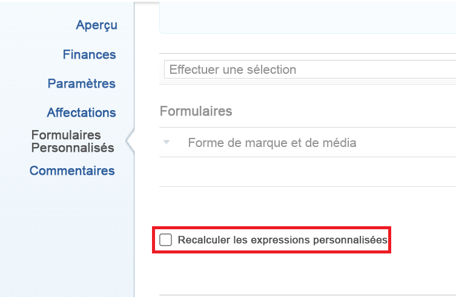

# Regrouper un rapport par un champ personnalisé à sélection multiple

Vous pouvez regrouper les valeurs par un champ personnalisé à sélection multiple dans un rapport Adobe Workfront. Voici quelques exemples de champs personnalisés à sélection multiple :

* Cases à cocher
* Menus déroulants à sélection multiple

Vous ne pouvez regrouper en fonction de ce type de champ qu’à l’aide du mode texte. Pour plus d’informations sur l’utilisation du mode texte, voir l’article [Présentation du mode texte](../../../reports-and-dashboards/reports/text-mode/understand-text-mode.md).

>[!NOTE]
>
>Il n’est pas possible de tracer un rapport selon un champ personnalisé à sélection multiple. Vous devez créer un champ calculé supplémentaire qui fait référence au champ personnalisé à sélection multiple pour également associer le rapport à la valeur du champ personnalisé à sélection multiple. Pour plus d’informations, voir [Graphique un rapport selon un champ personnalisé à sélection multiple](../../../reports-and-dashboards/reports/custom-view-filter-grouping-samples/chart-report-by-multi-select-custom-field.md).

## Exigences d’accès

Vous devez disposer des accès suivants pour effectuer les étapes de cet article :

<table style="table-layout:auto"> 
 <col> 
 <col> 
 <tbody> 
  <tr> 
   <td role="rowheader">Formule Adobe Workfront*</td> 
   <td> 
Tous
 </td> 
  </tr> 
  <tr> 
   <td role="rowheader">Licence Adobe Workfront*</td> 
   <td> 
Plan 
 </td> 
  </tr> 
  <tr> 
   <td role="rowheader">Paramétrages du niveau d'accès*</td> 
   <td> 
Modification de l’accès aux rapports, tableaux de bord et calendriers
 
Modifier l’accès aux filtres, vues et groupes
 
Remarque : Si vous n’avez toujours pas accès à , demandez à votre administrateur Workfront s’il définit des restrictions supplémentaires à votre niveau d’accès. Pour plus d’informations sur la façon dont un administrateur Workfront peut modifier votre niveau d’accès, voir <a href="../../../administration-and-setup/add-users/configure-and-grant-access/create-modify-access-levels.md" class="MCXref xref">Création ou modification de niveaux d’accès personnalisés</a>.
 </td> 
  </tr> 
  <tr> 
   <td role="rowheader">Autorisations d’objet</td> 
   <td> 
Gestion des autorisations d’un rapport
 
Pour plus d’informations sur la demande d’accès supplémentaire, voir <a href="../../../workfront-basics/grant-and-request-access-to-objects/request-access.md" class="MCXref xref">Demande d’accès aux objets </a>.
 </td> 
  </tr> 
 </tbody> 
</table>

&#42;Pour connaître le plan, le type de licence ou l’accès dont vous disposez, contactez votre administrateur Workfront.

## Regrouper un rapport par des champs personnalisés à sélection multiple

Pour pouvoir effectuer un groupement selon un champ personnalisé à sélection multiple, les prérequis suivants doivent être remplis :

* Créez le champ personnalisé à sélection multiple dans un formulaire personnalisé.\
   Pour plus d’informations sur la création de formulaires personnalisés et l’ajout de champs personnalisés, reportez-vous à l’article [Création ou modification d’un formulaire personnalisé](../../../administration-and-setup/customize-workfront/create-manage-custom-forms/create-or-edit-a-custom-form.md).

* Associez le formulaire personnalisé aux objets.
* Renseignez le champ personnalisé à sélection multiple avec une valeur sur chaque objet. 

Pour regrouper un champ personnalisé à sélection multiple dans un rapport :

1. Créez un rapport ou modifiez un rapport existant dans lequel vous souhaitez ajouter un groupement pour un champ personnalisé à sélection multiple.\
   Pour plus d’informations sur la création de rapports, voir l’article [Création d’un rapport personnalisé](../../../reports-and-dashboards/reports/creating-and-managing-reports/create-custom-report.md).

1. Sélectionnez la **Groupements** .
1. Cliquez sur **Passer en mode Texte**.

1. Sélectionnez le texte dans le **Regrouper votre rapport** et remplacez-le par le code suivant :

   <pre>group.0.displayname=Nom du champ personnalisé à sélection multiple group.0.valueexpression={DE:Multi-select Custom Field Name} group.0.valueformat=HTML textmode=true</pre>

1. Remplacez &quot;Nom de champ personnalisé à sélection multiple&quot; par le nom réel de votre champ personnalisé à sélection multiple, tel qu’il apparaît dans Workfront.  
1. Cliquez sur **Enregistrer et fermer**.\
   Les objets du rapport sont regroupés selon les valeurs du champ personnalisé à sélection multiple.\
   Le nom des regroupements du rapport correspond au nom du champ personnalisé à sélection multiple, suivi des valeurs sélectionnées dans le champ. 

<!--

<h2>Chart a report by multi-select Custom Fields</h2>

(NOTE: this moved to its own article, linked in the Note above!)

You cannot build a chart in a report by referencing a multi-select custom field. Instead, you can create a calculated field that records the values of the multi-select custom field on a given object and group by the calculated field.&nbsp;

<ul>
<li><a href="#build-a-calculated-custom-field-that-references-a-multi-select-custom-field" class="MCXref xref">Build a calculated custom field that references a multi-select custom field</a> </li>
<li><a href="#build-a-chart-that-references-a-calculated-custom-field" class="MCXref xref">Build a chart that references a calculated custom field</a> </li>
</ul>

<strong>Build a calculated custom field that references a multi-select custom field</strong>

To be able to build a calculated field that references a multi-select custom field, you must have the following prerequisites:

<ul>
<li>Build the multi-select custom field in a custom form. For information about building custom forms and adding custom fields to them, see the article <a href="../../../administration-and-setup/customize-workfront/create-manage-custom-forms/create-or-edit-a-custom-form.md" class="MCXref xref">Create or edit a custom form</a>.</li>
<li>Attach the custom form to objects.</li>
<li>Populate the multi-select custom field with a value on each object.</li>
</ul>

To build the calculated custom field that references the multi-select custom field:

<ol>
<li value="1">Create a custom form, or edit an existing one. For information about creating custom forms, see the article <a href="../../../administration-and-setup/customize-workfront/create-manage-custom-forms/create-or-edit-a-custom-form.md" class="MCXref xref">Create or edit a custom form</a>.</li>
<li value="2">Click<strong>Add a Field</strong>, then <strong>Calculated</strong> to add the multi-select custom field to the form.</li>
<li value="3">In the <strong>Label</strong> box, name the new calculated field to indicate that it references the multi-select custom field. For example: "Calculated Multi-select Field."</li>
<li value="4"> 
In the <strong>Calculation</strong> box, enter the following code:
<pre>{DE:Multi-select Custom Field}</pre> 
    
 </li>
<li value="5">Replace "Multi-select Custom Field" with the actual name of your multi-select custom field, as it appears in Workfront.</li>
<li value="6"> 
(Optional) If the multi-select custom field is already on this form and if this form is already attached to objects, enable the <strong>Update previous calculations</strong>&nbsp;option.
 
This ensures that the new field is automatically populated with the value from the multi-select custom field as it is added to the forms attached to the objects already.
 </li>
<li value="7">Click <strong>Done</strong>.</li>
<li value="8">Click <strong>Save +Close</strong>.</li>
</ol>

<strong>Build a chart that references a calculated custom field</strong>

<ol>
<li value="1"> Go to the report where you want to add the chart for the calculated field that references the multi-select custom field. </li>
<li value="2"> (Optional) To ensure that all the calculated fields that you want to chart by are populated with values, select all the objects in your report, then click <strong>Edit</strong>. </li>
<li value="3"> 
 (Optional and conditional) Enable the <strong>Recalculate Custom Expressions</strong> field, then click <strong>Save Changes</strong>.
 
    
 </li>
<li value="4"> Click <strong>Report Actions</strong>, then <strong>Edit</strong>. </li>
<li value="5">Select the <strong>Groupings</strong> tab, then click <strong>Add Grouping</strong>. </li>
<li value="6">Add the<strong>Calculated Multi-select Field</strong> you created as your grouping. </li>
<li value="7"> 
Select the <strong>Chart</strong> tab, and add a chart to your report.
 
For information about adding a chart to a report, see the section <a href="../../../reports-and-dashboards/reports/creating-and-managing-reports/create-custom-report.md#add-a-chart" class="MCXref xref">Add a chart to a report</a> in the article <a href="../../../reports-and-dashboards/reports/creating-and-managing-reports/create-custom-report.md" class="MCXref xref">Create a custom report</a>. 
 </li>
<li value="8">Select the <strong>Calculated Multi-select Field</strong> as one of the fields to display in the chart. </li>
<li value="9"> 
Click <strong>Save + Close</strong>.
 
The report displays the results grouped by the Calculated Multi-select Field in a chart. 
 </li>
</ol>

-->
