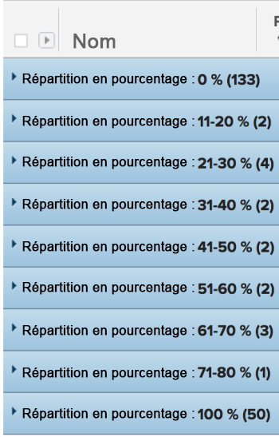

# Regroupement : répartition du pourcentage de tâche 2

Dans ce groupement de tâches personnalisé, vous pouvez afficher les tâches regroupées selon une plage de valeurs de pourcentage de réalisation. Les ventilations présentent une valeur de 10 % d’incréments de point en pourcentage : 1 à 10 %, 11 à 20 %, etc.

Le regroupement suivant classe les projets par pourcentage de valeur complète dans l’un de ces regroupements :

* 0%
* 1 - 10%
* 11-20%
* 21-30%
* 31-40%
* 41-50%
* 51-60%
* 61-70%
* 71-80%
* 81-90%
* 91-99%
* 100%

## Exigences d’accès

Vous devez disposer des accès suivants pour effectuer les étapes de cet article :

<table style="table-layout:auto"> 
 <col> 
 <col> 
 <tbody> 
  <tr> 
   <td role="rowheader">Formule Adobe Workfront*</td> 
   <td> 
Tous
 </td> 
  </tr> 
  <tr> 
   <td role="rowheader">Licence Adobe Workfront*</td> 
   <td> 
Plan 
 </td> 
  </tr> 
  <tr> 
   <td role="rowheader">Paramétrages du niveau d'accès*</td> 
   <td> 
Modification de l’accès aux rapports, tableaux de bord et calendriers
 
Modifier l’accès aux filtres, vues et groupes
 
Remarque : Si vous n’avez toujours pas accès à , demandez à votre administrateur Workfront s’il définit des restrictions supplémentaires à votre niveau d’accès. Pour plus d’informations sur la façon dont un administrateur Workfront peut modifier votre niveau d’accès, voir <a href="../../../administration-and-setup/add-users/configure-and-grant-access/create-modify-access-levels.md" class="MCXref xref">Création ou modification de niveaux d’accès personnalisés</a>.
 </td> 
  </tr> 
  <tr> 
   <td role="rowheader">Autorisations d’objet</td> 
   <td> 
Gestion des autorisations d’un rapport
 
Pour plus d’informations sur la demande d’accès supplémentaire, voir <a href="../../../workfront-basics/grant-and-request-access-to-objects/request-access.md" class="MCXref xref">Demande d’accès aux objets </a>.
 </td> 
  </tr> 
 </tbody> 
</table>

&#42;Pour connaître le plan, le type de licence ou l’accès dont vous disposez, contactez votre administrateur Workfront.

## Regroupement par pourcentage de tâche

Pour appliquer ce groupement :

1. Accédez à une liste de tâches.
1. Dans la **Regroupement** menu déroulant, sélectionnez **Nouveau groupement**.

1. Cliquez sur **Passer en mode Texte**.
1. Supprimez le texte de la section **Regrouper votre rapport** zone.
1. Remplacez le texte par le code suivant :

   <pre>group.0.linkedname=direct group.0.name=Répartition en pourcentage group.0.notime=false group.0.valueexpression=IF({percentComplete}=0,"0 %", IF({percentComplete}&lt;=11,"1-10 %", IF({percentComplete}&lt;=21,"11-20 %", IF({percentComplete}&lt;=31,"21-30 %",IF({percent1}) &lt;41,"31-40 %",IF({percentComplete}&lt;51,"41-50 %",IF({percentComplete}&lt;61,"51-60 %",IF({percentComplete}&lt;71,"61-70 %",IF({percentComplete}&lt;81,"7 1-80 %",IF({percentComplete}&lt;91,"81-90 %",IF({percentComplete}&lt;100,"91-99 %","100 %")))))))))) textmode=true</pre>

1. Cliquez sur **Enregistrer le groupement**.
