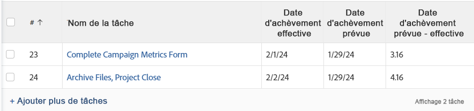

# Vue : calculer les différences d’heure et de date

<!-- Audited: 11/2024 -->

>[!IMPORTANT]
>
>Vous ne pouvez pas calculer les différences d’heure et de date dans Adobe Workfront entre deux objets différents du même type. Par exemple, vous ne pouvez pas calculer la différence entre l’heure et la date de deux dates sur deux projets, tâches ou problèmes différents.

Vous pouvez calculer la différence entre les éléments suivants :

* Différence entre l’heure et la date entre deux champs de date sur le même objet
* Différence d’heure et de date entre un champ d’un objet et un autre champ de l’objet parent

>[!TIP]
>
>Ces calculs affichent le nombre de jours entre deux dates. Le résultat s’affiche en jours. La date et l’heure du champ de date sont également prises en compte et le nombre de jours peut être suivi de décimales si la date et l’heure ne correspondent pas. Si la tâche a été terminée en retard, le nombre de jours s’affiche sous la forme d’une valeur négative.

## Conditions d’accès

+++ Développez pour afficher les exigences d’accès aux fonctionnalités de cet article.

Vous devez disposer des accès suivants pour effectuer les étapes décrites dans cet article :

<table style="table-layout:auto"> 
 <col> 
 <col> 
 <tbody> 
  <tr> 
   <td role="rowheader">Formule Adobe Workfront</td> 
   <td> <p>Tous</p> </td> 
  </tr> 
  <tr> 
   <td role="rowheader">Licence Adobe Workfront</td> 
   <td> <p>Nouveau : </p><ul><li><p>Contributeur à la modification d’une vue </p></li><li>
   <p>Standard pour modifier un rapport</p></li></ul><p>Ou</p><p>Actuel :</p><ul><li><p>Demander la modification d’un affichage </p></li><li>
   <p>Prévoir de modifier un rapport</p> </li><ul></td> 
  </tr> 
  <tr> 
   <td role="rowheader">Configurations des niveaux d’accès</td> 
   <td> <p>Modifier l’accès aux rapports, tableaux de bord et calendriers pour modifier un rapport</p> <p>Modifier l’accès aux filtres, affichages et groupes pour modifier un affichage</p> </td> 
  </tr>  
  <tr> 
   <td role="rowheader">Autorisations d’objet</td> 
   <td> <p>Gérer les autorisations d’un rapport</p>  </td> 
  </tr> 
 </tbody> 
</table>

Pour plus de détails sur les informations contenues dans ce tableau, consultez l’article [Conditions d’accès dans la documentation Workfront](/help/quicksilver/administration-and-setup/add-users/access-levels-and-object-permissions/access-level-requirements-in-documentation.md).

+++

## Calculer la différence entre l’heure et la date de deux champs de date sur le même objet

Vous pouvez, par exemple, calculer la différence entre la date d’achèvement prévue et la date d’achèvement réelle d’une tâche.



1. Accédez à une liste de tâches.
1. Dans le menu déroulant **Vue**, cliquez sur **Nouvelle vue**.

1. Cliquez sur **Ajouter une colonne** et commencez à saisir la « Date d’achèvement prévue » dans le champ **Afficher dans cette colonne**, puis sélectionnez-la lorsqu’elle s’affiche dans la liste.

1. Cliquez sur **Ajouter une colonne** et commencez à saisir la « Date d’achèvement réelle » dans le champ **Afficher dans cette colonne**, puis sélectionnez-la lorsqu’elle s’affiche dans la liste.

1. Cliquez sur **Ajouter une colonne**, puis cliquez sur **Passer en mode Texte**.

1. Pointez sur la zone de mode texte, puis cliquez sur **Cliquez pour modifier le texte**.
1. Supprimez le texte que vous trouvez dans la case **Mode texte** et remplacez-le par le code suivant :

   ```
    displayname=Planned-Actual Completion Date
    linkedname=direct
    querysort=plannedCompletionDate
    textmode=true
    valueexpression=ROUND(DATEDIFF({plannedCompletionDate},{actualCompletionDate}),2)
    valueformat=HTML
   ```

1. Cliquez sur **Enregistrer**, puis **Enregistrer la vue**.

## Calculer la différence entre l’heure et la date du champ sur un objet et d’un autre champ sur un objet parent

Pour obtenir la liste des objets et de leurs objets parent, reportez-vous à la section « Comprendre l’interdépendance et la hiérarchie des objets » dans la section [Comprendre les objets dans Adobe Workfront](../../../workfront-basics/navigate-workfront/workfront-navigation/understand-objects.md).\
Vous pouvez, par exemple, calculer la différence entre la date d’achèvement prévue d’une tâche et la date d’achèvement prévue de sa tâche parent, ou du projet sur lequel la tâche est effectuée.


1. Accédez à une liste de tâches.
1. Dans le menu déroulant **Vue**, cliquez sur **Nouvelle vue**.

1. Cliquez sur **Ajouter une colonne** et commencez à saisir la « Date d’achèvement prévue du projet » ou la « Date d’achèvement du parent » dans le champ **Afficher dans cette colonne**, puis sélectionnez-la lorsqu’elle s’affiche dans la liste.

1. Cliquez sur **Ajouter une colonne** et commencez à saisir la « Date d’achèvement prévue » dans le champ **Afficher dans cette colonne**, puis sélectionnez-la lorsqu’elle s’affiche dans la liste.

1. Cliquez sur **Ajouter une colonne**, puis sur **Passer en mode Texte** > **Modifier le mode Texte**.
1. Supprimez le texte que vous trouvez dans la zone **Edit Text Mode** et remplacez-le par l’un des codes suivants :

   * Pour afficher la différence entre la date d’achèvement prévue du projet et celle de la tâche :

     ```
      displayname=Project Planned Completion - Task Planned Completion (Days)
      textmode=true
      valueexpression=ROUND(DATEDIFF({project}.{plannedCompletionDate},{plannedCompletionDate}),2)
      valueformat=HTML
     ```

   * Pour afficher la différence entre la date d’achèvement prévue de la tâche parent et celle de la tâche :

     ```
      valueexpression=ROUND(DATEDIFF({parent}.{plannedCompletionDate},{plannedCompletionDate}),2)
      textmode=true<br>valueformat=HTML
      displayname=Parent Planned Completion - Planned Completion (Days)
     ```

1. Cliquez sur **Terminé**, puis sur **Enregistrer la vue**.
