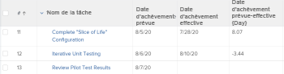

# Afficher : calculer les différences d’heure et de date

>[!IMPORTANT]
>
>Vous ne pouvez pas calculer la différence entre l’heure et la date dans Adobe Workfront entre deux objets différents du même type. Par exemple, vous ne pouvez pas calculer la différence entre l’heure et la date de deux dates sur deux projets, tâches ou problèmes différents.

Vous pouvez calculer la différence entre les éléments suivants :

* Différence entre l’heure et la date entre deux champs de date sur le même objet
* Différence d’heure et de date entre le champ d’un objet et un autre champ de l’objet parent

>[!TIP]
>
>Ces calculs affichent le nombre de jours entre deux dates. Le résultat s’affiche en jours. L’horodatage du champ de date est également pris en compte et le nombre de jours peut être suivi de décimales si les horodatages ne correspondent pas. Si la tâche a été effectuée en retard, le nombre de jours s’affiche sous la forme d’une valeur négative.

## Exigences d’accès

Vous devez disposer des accès suivants pour effectuer les étapes de cet article :

<table style="table-layout:auto"> 
 <col> 
 <col> 
 <tbody> 
  <tr> 
   <td role="rowheader">Formule Adobe Workfront*</td> 
   <td> <p>Tous</p> </td> 
  </tr> 
  <tr> 
   <td role="rowheader">Licence Adobe Workfront*</td> 
   <td> <p>Demande de modification d’une vue </p>
   <p>Prévoir de modifier un rapport</p> </td> 
  </tr> 
  <tr> 
   <td role="rowheader">Paramétrages du niveau d'accès*</td> 
   <td> <p>Modification de l’accès aux rapports, tableaux de bord et calendriers pour la modification d’un rapport</p> <p>Modifier l’accès aux filtres, vues et groupes pour modifier une vue</p> <p><b>NOTE</b>

Si vous n’avez toujours pas accès à , demandez à votre administrateur Workfront s’il définit des restrictions supplémentaires à votre niveau d’accès. Pour plus d’informations sur la façon dont un administrateur Workfront peut modifier votre niveau d’accès, voir <a href="../../../administration-and-setup/add-users/configure-and-grant-access/create-modify-access-levels.md" class="MCXref xref">Création ou modification de niveaux d’accès personnalisés</a>.</p> </td>
</tr>  
  <tr> 
   <td role="rowheader">Autorisations d’objet</td> 
   <td> <p>Gestion des autorisations d’un rapport</p> <p>Pour plus d’informations sur la demande d’accès supplémentaire, voir <a href="../../../workfront-basics/grant-and-request-access-to-objects/request-access.md" class="MCXref xref">Demande d’accès aux objets </a>.</p> </td> 
  </tr> 
 </tbody> 
</table>

&#42;Pour connaître le plan, le type de licence ou l’accès dont vous disposez, contactez votre administrateur Workfront.

## Calcul de la différence entre l’heure et la date de deux champs de date sur le même objet

Vous pouvez, par exemple, calculer la différence entre la date de fin planifiée et la date de fin réelle d’une tâche.



1. Accédez à une liste de tâches.
1. Dans la **Affichage** menu déroulant, cliquez sur **Nouvelle vue**.

1. Cliquez sur **Ajouter une colonne** et commencez à saisir &quot;Date d’achèvement prévue&quot; dans la variable **Afficher dans cette colonne** puis sélectionnez-la lorsqu’elle s’affiche dans la liste.

1. Cliquez sur **Ajouter une colonne** et commencez à saisir &quot;Date d’achèvement réelle&quot; dans le champ **Afficher dans cette colonne** puis sélectionnez-la lorsqu’elle s’affiche dans la liste.

1. Cliquez sur **Ajouter une colonne**, puis cliquez sur **Passer en mode Texte**.

1. Pointez sur la zone de mode de texte, puis cliquez sur **Cliquer pour modifier le texte**.
1. Supprimez le texte que vous trouvez dans la **Mode texte** et remplacez-le par le code suivant :

   ```
   displayname=Planned-Actual Completion Date<br>linkedname=direct<br>querysort=plannedCompletionDate<br>textmode=true<br>valueexpression=ROUND(DATEDIFF({plannedCompletionDate},{actualCompletionDate}),2)<br>valueformat=HTML
   ```

1. Cliquez sur **Enregistrer**, puis **Enregistrer la vue**.

## Calcul de la différence entre l’heure et la date du champ sur un objet et d’un autre champ sur un objet parent

Pour obtenir la liste des objets et de leurs parents, reportez-vous à la section &quot;Présentation de l’interdépendance et de la hiérarchie des objets&quot; dans la section [Présentation des objets dans Adobe Workfront](../../../workfront-basics/navigate-workfront/workfront-navigation/understand-objects.md).\
Vous pouvez, par exemple, calculer la différence entre la date d’achèvement planifié d’une tâche et la date d’achèvement planifié de sa tâche parent, ou du projet sur lequel la tâche est effectuée.


1. Accédez à une liste de tâches.
1. Dans la **Affichage** menu déroulant, cliquez sur **Nouvelle vue**.

1. Cliquez sur **Ajouter une colonne** et commencez à saisir &quot;Date d’achèvement prévue du projet&quot; ou &quot;Date d’achèvement parente&quot; dans le champ **Afficher dans cette colonne** puis sélectionnez-la lorsqu’elle s’affiche dans la liste.

1. Cliquez sur **Ajouter une colonne** et commencez à saisir &quot;Date d’achèvement prévue&quot; dans la variable **Afficher dans cette colonne** puis sélectionnez-la lorsqu’elle s’affiche dans la liste.

1. Cliquez sur **Ajouter une colonne**, puis cliquez sur **Passer en mode Texte**.

1. Pointez sur la zone de mode de texte, puis cliquez sur **Cliquer pour modifier le texte**.
1. Supprimez le texte que vous trouvez dans la **Mode texte** et remplacez-le par l’un des codes suivants :

   * Pour afficher la différence entre la date d’achèvement planifiée du projet et celle de la tâche :

     ```
     displayname=Project Planned Completion - Task Planned Completion (Days)<br>textmode=true<br>valueexpression=ROUND(DATEDIFF({project}.{plannedCompletionDate},{plannedCompletionDate}),2)<br>valueformat=HTML
     ```

   * Pour afficher la différence entre la date d’achèvement planifiée de la tâche parente et celle de la tâche :

     ```
     valueexpression=ROUND(DATEDIFF({parent}.{plannedCompletionDate},{plannedCompletionDate}),2)<br>textmode=true<br>valueformat=HTML<br>displayname=Parent Planned Completion - Planned Completion (Days)
     ```

1. Cliquez sur **Enregistrer**, puis **Enregistrer la vue**.
