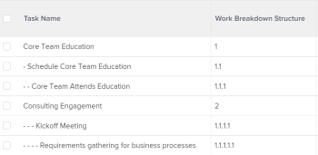

# Vue : afficher les mises en retrait de tâche dans une liste de tâches

<!--Audited: 11/2024-->

Dans cette vue de tâche, vous pouvez ajouter du code à la colonne Nom de la tâche pour afficher les tâches mises en retrait selon la structure de répartition du travail du projet.



## Conditions d’accès

+++ Développez pour afficher les exigences d’accès aux fonctionnalités de cet article.

Vous devez disposer des accès suivants pour effectuer les étapes décrites dans cet article :

<table style="table-layout:auto"> 
 <col> 
 <col> 
 <tbody> 
  <tr> 
   <td role="rowheader">Formule Adobe Workfront</td> 
   <td> <p>Tous</p> </td> 
  </tr> 
  <tr> 
   <td role="rowheader">Licence Adobe Workfront*</td> 
   <td> 
    <p>Nouveau :</p>
   <ul><li><p>Contributeur à la modification d’un filtre </p></li>
   <li><p>Standard pour modifier un rapport</p></li> </ul>

<p>Actuel :</p>
   <ul><li><p>Demande de modification d’un filtre </p></li>
   <li><p>Prévoir de modifier un rapport</p></li> </ul></td> 
  </tr> 
  <tr> 
   <td role="rowheader">Configurations des niveaux d’accès</td> 
   <td> <p>Modifier l’accès aux rapports, tableaux de bord et calendriers pour modifier un rapport</p> <p>Modifier l’accès aux filtres, aux vues et aux regroupements pour modifier un filtre</p> </td> 
  </tr> 
  <tr> 
   <td role="rowheader">Autorisations d’objet</td> 
   <td> <p>Gérer les autorisations d’un rapport</p>  </td> 
  </tr> 
 </tbody> 
</table>

*Pour plus d’informations, voir [Exigences d’accès dans la documentation Workfront](/help/quicksilver/administration-and-setup/add-users/access-levels-and-object-permissions/access-level-requirements-in-documentation.md).

+++

## Afficher les mises en retraits de tâche dans une colonne de liste de tâches

1. Accédez à une liste de tâches.
1. Dans le menu déroulant **Vue**, cliquez sur **Nouvelle vue**.

1. Cliquez sur **Ajouter la colonne** et commencez à saisir &quot;Nom de la tâche&quot; dans le champ **Afficher dans cette colonne** , puis sélectionnez-le lorsqu’il s’affiche dans la liste.

1. Dans la nouvelle colonne, cliquez sur **Passer en mode Texte** > **Modifier le mode Texte**.
1. Supprimez le texte que vous trouvez dans la ligne `valuefield=` et remplacez-le par le code suivant :

   ```
   displayname=Task hierarchy
   valueexpression=IF({indent}<1,{name},IF({indent}<2,CONCAT(' - ',{name}),IF({indent}<3,CONCAT(' - - ',{name}),IF({indent}<4,CONCAT(' - - - ',{name}),CONCAT(' - - - - ',{name})))))
   ```

1. Cliquez sur **Terminé**, puis sur **Enregistrer la vue**.
1. (Facultatif) Mettez à jour le nom de la vue, puis cliquez sur **Enregistrer la vue**.
