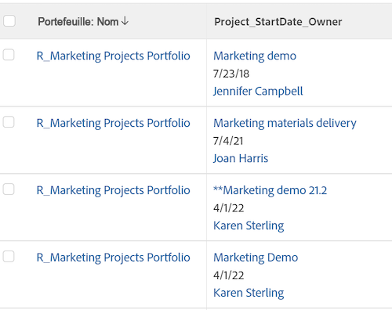

# Vue : fusionner les informations de plusieurs colonnes dans une colonne partagée

<!-- Audited: 11/2024 -->

Vous pouvez fusionner les informations qui s’affichent dans différentes colonnes et les afficher dans une colonne partagée.

## Conditions d’accès

+++ Développez pour afficher les exigences d’accès aux fonctionnalités de cet article.

<table style="table-layout:auto"> 
 <col> 
 <col> 
 <tbody> 
  <tr> 
   <td role="rowheader">Package Adobe Workfront</td> 
   <td> <p>Tous</p> </td> 
  </tr> 
  <tr> 
   <td role="rowheader">Licence Adobe Workfront</td> 
   <td> 
   <p>Contributeur ou demande de modification d’une vue </p>
   <p>Standard ou Plan pour modifier un rapport</p>
  </tr> 
  <tr> 
   <td role="rowheader">Configurations des niveaux d’accès</td> 
   <td> <p>Modifier l’accès aux rapports, tableaux de bord et calendriers pour modifier un rapport</p> <p>Modifier l’accès aux filtres, affichages et groupes pour modifier un affichage</p> </td> 
  </tr> 
  <tr> 
   <td role="rowheader">Autorisations d’objet</td> 
   <td> <p>Gérer les autorisations d’un rapport</p>  </td> 
  </tr> 
 </tbody> 
</table>

Pour plus de détails sur les informations contenues dans ce tableau, consultez l’article [Conditions d’accès dans la documentation Workfront](/help/quicksilver/administration-and-setup/add-users/access-levels-and-object-permissions/access-level-requirements-in-documentation.md).


+++

## Remarques concernant le partage ou la fusion de colonnes

* Vous pouvez fusionner deux colonnes adjacentes et afficher les informations de chaque colonne séparées par un saut de ligne, ou vous pouvez fusionner les informations dans deux colonnes adjacentes sans séparateur entre les informations de chaque colonne.
* Vous pouvez fusionner les informations de plus de deux colonnes en appliquant la même syntaxe que celle décrite dans cet article à une colonne déjà partagée et à une colonne adjacente.
* La ligne `valueformat=HTML` est obligatoire dans une colonne partagée. Sinon, les colonnes ne contiendront aucune information (elles seront vides) lorsque le rapport sera exporté depuis Adobe Workfront.
* La mise en forme conditionnelle peut ne pas être prise en charge dans les colonnes fusionnées.

  Les exceptions suivantes s’appliquent :

   * Lors de l’affichage d’informations dans Workfront, la mise en forme de la première colonne est conservée et la mise en forme de toutes les autres colonnes est ignorée si les colonnes qui composent une colonne fusionnée ont des mises en forme différentes.
   * Lors de l’export de la vue vers un fichier PDF, la mise en forme conditionnelle s’applique à la première colonne d’une colonne fusionnée.
   * Lors de l’export de la vue vers un fichier Excel, les colonnes fusionnées s’affichent comme des colonnes distinctes. Chaque colonne affiche également ses propres règles de mise en forme conditionnelle.

* Les colonnes dotées de l’attribut **viewalias** peuvent limiter le nombre de colonnes que vous pouvez fusionner. Pour éviter ces limites, n’utilisez pas l’attribut **viewalias**. Si vous devez inclure l’attribut **viewalias** dans une colonne, assurez-vous qu’il s’agit du dernier élément de la colonne.

* Si vous exportez une liste avec des colonnes partagées vers un format Excel ou délimité par des tabulations, ces colonnes sont séparées dans le fichier exporté.

* Lorsque l’une ou les deux colonnes affichent un champ de type `tile`, un saut de ligne forcé est automatiquement introduit dans la colonne fusionnée. Par exemple, les champs de texte avec formatage sont des champs de type `tile`. Dans ce cas, il y a un code de ligne de `type=tile` lorsque les colonnes sont affichées en mode texte.

## Fusionner les données de deux colonnes sans saut de ligne

Vous pouvez fusionner les données de différentes colonnes pour les afficher dans une seule colonne, sans saut ni espace entre les valeurs de chaque colonne.

>[!TIP]
>
>Cette approche est recommandée lorsque vous fusionnez deux colonnes qui ne peuvent jamais afficher une valeur pour le même enregistrement au même moment. Par exemple, dans un rapport sur les éléments de travail, les colonnes Nom du problème et Nom de la tâche peuvent être fusionnées sans saut de ligne entre elles, car un élément de travail ne peut jamais avoir à la fois un nom de problème et un nom de tâche. Un élément de travail peut être un problème ou une tâche dans Workfront.

Pour fusionner les données de deux colonnes sans saut de ligne :

1. Accédez à une liste d’objets.
1. Dans la liste déroulante **Vue**, sélectionnez une vue, puis cliquez sur l’icône **Modifier**  pour modifier la vue.
1. Accédez à la première colonne à fusionner, puis cliquez sur **Passer en mode Texte** > **Modifier le mode Texte**.
1. Ajoutez le texte suivant à la première colonne que vous souhaitez fusionner :

   `sharecol=true`

   Lorsque vous fusionnez les deux premières colonnes d’une liste ou d’un rapport, Workfront fait précéder chaque ligne de texte contenant des informations sur l’objet de la première colonne par `column.0.` et les lignes de texte contenant des informations sur la deuxième colonne par `column.1.`.

   Vous devez placer le numéro de cette colonne avant celui de la première colonne. Le comptage des colonnes commence toujours par la colonne la plus à gauche de la liste ou du rapport intitulé `column.0.`.

   Si vous partagez plus d’une colonne, veillez à ajouter le numéro de la colonne dans les lignes de code qui contiennent les informations de partage de chaque colonne.


   **EXEMPLE :** code de mode texte d’une colonne fusionnée contenant trois colonnes distinctes, en commençant par la deuxième colonne de la liste. Les valeurs fusionnées sont Nom du projet, Date de début prévue et Nom du propriétaire du projet. Il n’y a pas de saut entre les trois valeurs :

   ```
   column.1.valuefield=name
   column.1.valueformat=HTML
   column.1.sharecol=true
   column.2.valuefield=plannedStartDate
   column.2.valueformat=atDate
   column.2.sharecol=true
   column.3.valuefield=owner:name
   column.3.valueformat=HTML
   ```

   


1. Cliquez sur **Terminé**, puis sur **Enregistrer la vue**.

## Fusionner les données de deux colonnes avec un saut de ligne

Procédez comme suit pour fusionner les données de plusieurs colonnes et les afficher dans une colonne commune avec un saut de ligne entre les valeurs de chaque colonne :

1. Accédez à une liste d’objets.
1. Dans la liste déroulante **Vue**, sélectionnez une vue, puis cliquez sur l’icône **Modifier**  pour modifier la vue.
1. Ajoutez une troisième colonne entre les deux colonnes que vous souhaitez fusionner.

   >[!TIP]
   >
   >* Les colonnes à fusionner doivent être adjacentes.
   >* Vous devez cliquer sur la première colonne que vous souhaitez fusionner.

1. Cliquez sur **Passer en mode texte** > **Modifier le mode texte**, puis ajoutez le code suivant dans la colonne centrale que vous avez ajoutée à l’étape 1 :

   ```
   value=<br>
   valueformat=HTML
   width=1
   sharecol=true
   ```

1. Cliquez sur la première colonne et cliquez sur **Passer en mode Texte** > **Modifier le mode Texte**, puis ajoutez le texte suivant à la colonne :

   `sharecol=true`

   Lorsque vous fusionnez les deux premières colonnes d’une liste ou d’un rapport, Workfront fait précéder chaque ligne de texte contenant des informations sur l’objet de la première colonne par `column.0.`, la colonne contenant les informations de partage par `column.1.`, et les lignes de texte contenant des informations sur la deuxième colonne par `column.2.`.

   Si la colonne combinée se trouve au milieu de la vue, les colonnes sont numérotées en fonction de leur place dans la vue. Le comptage des colonnes commence toujours par la colonne la plus à gauche de la liste ou du rapport intitulé `column.0.`.

   Si vous partagez plus d’une colonne, veillez à ajouter le numéro de la colonne dans les lignes de code qui contiennent les informations de partage.

   **EXEMPLE :** code de mode texte d’une colonne partagée qui contient le nom du projet, la date de début prévue et le nom du propriétaire du projet avec un saut de ligne. La colonne partagée est la deuxième colonne d’une vue de projet.

   ```
   column.1.displayname=Project_StartDate_Owner
   column.1.sharecol=true
   column.1.textmode=true
   column.1.valuefield=name
   column.1.valueformat=HTML
   column.2.value=<br>
   column.2.width=1
   column.2.valueformat=HTML
   column.2.sharecol=true
   column.3.valuefield=plannedStartDate
   column.3.valueformat=atDate
   column.3.sharecol=true
   column.4.value=<br>
   column.4.width=1
   column.4.valueformat=HTML
   column.4.sharecol=true
   column.5.textmode=true
   column.5.valuefield=owner:name
   column.5.valueformat=HTML 
   ```

   

1. Cliquez sur **Terminé**, puis sur **Enregistrer la vue**.
