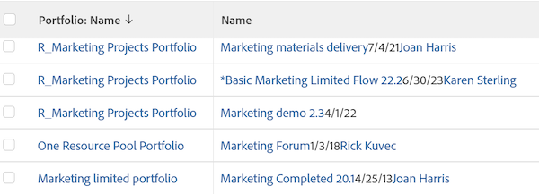

# Vue : fusionner les informations de plusieurs colonnes dans une colonne partagée

<!-- Audited: 1/2024 -->

Vous pouvez fusionner les informations qui s’affichent dans plusieurs colonnes distinctes et les afficher dans une seule colonne partagée.

## Conditions d’accès

+++ Développez pour afficher les exigences d’accès aux fonctionnalités de cet article.

Vous devez disposer des accès suivants pour effectuer les étapes de cet article :

<table style="table-layout:auto"> 
 <col> 
 <col> 
 <tbody> 
  <tr> 
   <td role="rowheader">Forfait Adobe Workfront</td> 
   <td> 
N’importe quelle
 </td> 
  </tr> 
  <tr> 
   <td role="rowheader">Licence Adobe Workfront</td> 
   <td> 
 Actuel : 
   <ul>
   <li>Demande de modification d’une vue</li> 
   <li>Prévoir de modifier un rapport</li>
   </ul>
     

     
 Nouveau : 
   <ul>
   <li>Contributeur à la modification d’une vue</li> 
   <li>Standard pour modifier un rapport</li>
   </ul>
     

    </td> 
  </tr> 
  <tr> 
   <td role="rowheader">Configurations des niveau d’accès*</td> 
   <td> 
Modification de l’accès aux rapports, tableaux de bord et calendriers pour la modification d’un rapport
 
Modifier l’accès aux filtres, vues et groupes pour modifier une vue
 </td> 
  </tr> 
  <tr> 
   <td role="rowheader">Autorisations d’objet</td> 
   <td> 
Gestion des autorisations d’un rapport
 </td> 
  </tr> 
 </tbody> 
</table>

Pour plus d’informations sur ce tableau, consultez [Conditions d’accès requises dans la documentation Workfront](/help/quicksilver/administration-and-setup/add-users/access-levels-and-object-permissions/access-level-requirements-in-documentation.md).

+++

## Remarques concernant le partage ou la fusion de colonnes

* Vous pouvez fusionner deux colonnes adjacentes et afficher les informations de chaque colonne séparées par un saut de ligne. Vous pouvez également fusionner les informations dans deux colonnes adjacentes sans séparateur entre les informations de chaque colonne.
* Vous pouvez fusionner les informations de plus de deux colonnes en appliquant la même syntaxe que celle décrite dans cet article à une colonne déjà partagée et une colonne adjacente.
* La variable `valueformat=HTML` est obligatoire dans une colonne partagée. Dans le cas contraire, les colonnes ne contiennent aucune information (elles seront vides) lorsque le rapport est exporté depuis Adobe Workfront.
* La mise en forme conditionnelle peut ne pas être prise en charge dans les colonnes fusionnées.

  Les exceptions suivantes existent :

   * Lors de l’affichage des informations dans Workfront, la mise en forme de la première colonne est conservée et la mise en forme de toutes les autres colonnes est ignorée si les colonnes qui constituent une colonne fusionnée ont une mise en forme différente les unes des autres.
   * Lors de l’export de la vue vers un fichier de PDF, la mise en forme conditionnelle s’applique à la première colonne d’une colonne fusionnée.
   * Lors de l’exportation de la vue dans un fichier Excel, les colonnes fusionnées s’affichent sous la forme de colonnes distinctes. Les différentes colonnes affichent également leurs règles de mise en forme conditionnelle respectives.

* Colonnes avec le **viewalias** peut limiter la quantité de colonnes que vous pouvez fusionner. Pour éviter ces limites, évitez d’utiliser la variable **viewalias** attribut. Si vous devez inclure la variable **viewalias** dans une colonne, assurez-vous qu’il s’agit du dernier élément répertorié dans la colonne .

* Si vous exportez une liste avec des colonnes partagées au format Excel ou Délimité par des onglets, ces colonnes sont séparées dans le fichier exporté.

* Lorsque l’une des colonnes ou les deux affichent une `tile` type , un saut de ligne forcé est automatiquement inséré dans la colonne fusionnée. Par exemple, les champs de texte avec mise en forme sont `tile` saisissez des champs. Dans ce cas, il existe un code ligne de `type=tile` lors de l’affichage des colonnes en mode Texte.

## Fusionner les données de deux colonnes sans saut de ligne

Vous pouvez fusionner les données de plusieurs colonnes distinctes afin de les afficher dans une colonne sans aucun saut ni espace entre les valeurs de chaque colonne.

>[!TIP]
>
>Cette approche est recommandée lorsque vous fusionnez deux colonnes qui ne peuvent jamais afficher une valeur pour le même enregistrement en même temps. Par exemple, dans un rapport d’élément de travail, les colonnes Nom du problème et Nom de la tâche peuvent être fusionnées sans saut de ligne, car un élément de travail ne peut jamais avoir un nom de problème et un nom de tâche en même temps. Un élément de travail peut être un problème ou une tâche dans Workfront.

Pour fusionner les données de deux colonnes sans saut de ligne :

1. En mode texte pour une vue, ajoutez le texte suivant à la première colonne que vous souhaitez fusionner :

   `sharecol=true`

   Lorsque vous fusionnez les deux premières colonnes d’une liste ou d’un rapport, Workfront précède chaque ligne de texte contenant des informations sur l’objet dans la première colonne avec `column.0.` et les lignes de texte contenant des informations sur la deuxième colonne avec `column.1.` .

   Vous devez précéder le numéro de la première colonne du numéro de cette colonne. Le décompte des colonnes commence toujours par la colonne la plus à gauche de la liste ou du rapport intitulée `column.0.`.

   Si vous partagez plusieurs colonnes, veillez à ajouter le numéro de colonne dans les lignes de code qui contiennent les informations de partage pour chaque colonne.

   **Exemple :** Voici le code du mode texte d’une colonne fusionnée qui contient trois colonnes distinctes, en commençant par la deuxième colonne de la liste. Les valeurs fusionnées sont Nom du projet, Date de début planifiée et Nom du propriétaire du projet et il n’y a pas de pause entre les trois valeurs :

   `column.1.valuefield=name`

   `column.1.valueformat=HTML`

   `column.1.sharecol=true`

   `column.2.valuefield=plannedStartDate`

   `column.2.valueformat=atDate`

   `column.2.sharecol=true`

   `column.3.valuefield=owner:name`

   `column.3.valueformat=HTML`

1. Cliquez sur **Enregistrer**, puis **Enregistrer la vue**.

## Fusion des données de deux colonnes avec saut de ligne

Procédez comme suit pour fusionner les données de plusieurs colonnes afin de les afficher dans une colonne commune avec un saut de ligne entre les valeurs de chaque colonne :

1. Ajoutez une troisième colonne entre les deux colonnes que vous souhaitez fusionner.

   >[!TIP]
   >
   >* Les colonnes que vous souhaitez fusionner doivent être adjacentes.
   >* Vous devez cliquer sur la première colonne à fusionner.

1. Cliquez sur **Passer en mode Texte** et ajoutez le code suivant dans la colonne du milieu que vous avez ajoutée à l’étape 1 :

   `value= `

   `valueformat=HTML`

   `width=1`

   `sharecol=true`

1. Cliquez sur la première colonne, puis sur **Passer en mode Texte**, puis ajoutez le texte suivant à la colonne :

   `sharecol=true`

   Lorsque vous fusionnez les deux premières colonnes d’une liste ou d’un rapport, Workfront précède chaque ligne de texte contenant des informations sur l’objet dans la première colonne avec `column.0.`, la colonne avec les informations de partage avec `column.1.`et les lignes de texte contenant des informations sur la deuxième colonne avec `column.2.`.

   Si la colonne combinée se trouve au milieu de la vue, les colonnes sont numérotées en fonction de leur place dans la vue. Le décompte des colonnes commence toujours par la colonne la plus à gauche de la liste ou du rapport intitulée `column.0.`.

   Si vous partagez plusieurs colonnes, veillez à ajouter le numéro de colonne dans les lignes de code qui contiennent les informations de partage.

   **Exemple :** Vous trouverez ci-dessous le code du mode texte d’une colonne partagée qui contient le nom du projet, la date de début planifiée et le nom du propriétaire du projet avec un saut de ligne. La colonne partagée est la deuxième colonne d’une vue de projet.

   `column.1.displayname=Project_StartDate_Owner`

   `column.1.sharecol=true`

   `column.1.textmode=true`

   `column.1.valuefield=name`

   `column.1.valueformat=HTML`

   `column.2.value= `

   `column.2.width=1`

   `column.2.valueformat=HTML`

   `column.2.sharecol=true`

   `column.3.valuefield=plannedStartDate`

   `column.3.valueformat=atDate`

   `column.3.sharecol=true`

   `column.4.value= `

   `column.4.width=1`

   `column.4.valueformat=HTML`

   `column.4.sharecol=true`

   `column.5.textmode=true`

   `column.5.valuefield=owner:name`

   `column.5.valueformat=HTML`

   

1. Cliquez sur **Enregistrer**, puis **Enregistrer la vue**.
