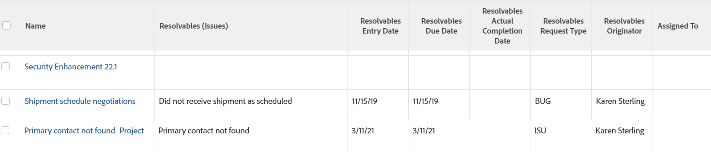

# Afficher : Détails du problème d’origine pour les tâches et les projets

Lorsqu’un problème est converti en tâche ou projet, une relation d’objet de résolution est établie entre la tâche ou le projet et le problème. Cette vue affiche les champs suivants du problème qui se termine automatiquement à la fin de la tâche ou du projet :

* Nom
* Date d’entrée
* Date d&#39;achèvement prévue
* Date d&#39;achèvement effective
* Type de demande
* Nom de l’auteur
* Affecté à un utilisateur

Pour plus d’informations, reportez-vous également à la section [Afficher : afficher les informations de problème d’origine dans les listes de tâches et de projets ;](../../../reports-and-dashboards/reports/custom-view-filter-grouping-samples/view-display-original-issue-info-task-project-list.md).

## Exigences d’accès

Vous devez disposer des accès suivants pour effectuer les étapes de cet article :

<table style="table-layout:auto"> 
 <col> 
 <col> 
 <tbody> 
  <tr> 
   <td role="rowheader">Formule Adobe Workfront*</td> 
   <td> 
Tous
 </td> 
  </tr> 
  <tr> 
   <td role="rowheader">Licence Adobe Workfront*</td> 
   <td> 
Demande de modification d’une vue 

   
Prévoir de modifier un rapport
 </td> 
  </tr> 
  <tr> 
   <td role="rowheader">Paramétrages du niveau d'accès*</td> 
   <td> 
Modification de l’accès aux rapports, tableaux de bord et calendriers pour la modification d’un rapport
 
Modifier l’accès aux filtres, vues et groupes pour modifier une vue
 
<b>NOTE</b>

Si vous n’avez toujours pas accès à , demandez à votre administrateur Workfront s’il définit des restrictions supplémentaires à votre niveau d’accès. Pour plus d’informations sur la façon dont un administrateur Workfront peut modifier votre niveau d’accès, voir <a href="../../../administration-and-setup/add-users/configure-and-grant-access/create-modify-access-levels.md" class="MCXref xref">Création ou modification de niveaux d’accès personnalisés</a>.
 </td>
</tr>  
  <tr> 
   <td role="rowheader">Autorisations d’objet</td> 
   <td> 
Gestion des autorisations d’un rapport
 
Pour plus d’informations sur la demande d’accès supplémentaire, voir <a href="../../../workfront-basics/grant-and-request-access-to-objects/request-access.md" class="MCXref xref">Demande d’accès aux objets </a>.
 </td> 
  </tr> 
 </tbody> 
</table>

&#42;Pour connaître le plan, le type de licence ou l’accès dont vous disposez, contactez votre administrateur Workfront.

## Affichage des détails des problèmes d’origine pour les tâches et les projets

1. Accédez à une liste de tâches ou de projets.
1. Dans la **Affichage** menu déroulant, sélectionnez **Nouvelle vue**.

1. Dans le **Aperçu des colonnes** , éliminez toutes les colonnes sauf une.
1. Cliquez sur l’en-tête de la colonne restante, puis sur **Passer en mode Texte**.
1. Placez le pointeur de la souris sur la zone de mode de texte, puis cliquez sur **Cliquer pour modifier le texte**.
1. Supprimez le texte que vous trouvez dans la **Mode texte** et remplacez-le par le code suivant :

   <!-- [Copy](javascript:void(0);) -->
   <pre></pre>

1. Cliquez sur **Enregistrer la vue**.
