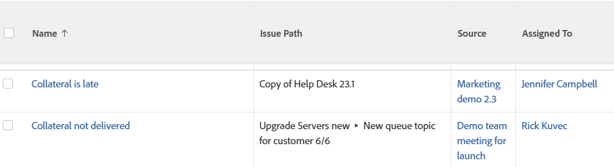

# Vue : chemin d’envoi pour les problèmes

<!--Audited: 11/2024-->

Vous pouvez afficher le chemin par lequel un problème a été soumis dans la vue d’un rapport de problème. Le chemin d’accès indique la file d’attente, le groupe de rubriques et la rubrique de file d’attente où le problème a été soumis à l’origine.



## Conditions d’accès

+++ Développez pour afficher les exigences d’accès aux fonctionnalités de cet article.

Vous devez disposer des accès suivants pour effectuer les étapes décrites dans cet article :

<table style="table-layout:auto"> 
 <col> 
 <col> 
 <tbody> 
  <tr> 
   <td role="rowheader">Formule Adobe Workfront</td> 
   <td> <p>Tous</p> </td> 
  </tr> 
  <tr> 
   <td role="rowheader">Licence Adobe Workfront</td> 
   <td> <p> Actuel : 
   <ul>
   <li>Demander la modification d’un affichage</li> 
   <li>Prévoir de modifier un rapport</li>
   </ul>
     </p>
     <p> Nouveau : 
   <ul>
   <li>Contributeur à la modification d’une vue</li> 
   <li>Standard pour modifier un rapport</li>
   </ul>
     </p>
    </td> 
  </tr> 
  <tr> 
   <td role="rowheader">Configurations du niveau d’accès*</td> 
   <td> <p>Modifier l’accès aux rapports, tableaux de bord et calendriers pour modifier un rapport</p> <p>Modifier l’accès aux filtres, affichages et groupes pour modifier un affichage</p> </td> 
  </tr> 
  <tr> 
   <td role="rowheader">Autorisations d’objet</td> 
   <td> <p>Gérer les autorisations d’un rapport</p> </td> 
  </tr> 
 </tbody> 
</table>

Pour plus de détails sur les informations contenues dans ce tableau, consultez l’article [Conditions d’accès dans la documentation Workfront](/help/quicksilver/administration-and-setup/add-users/access-levels-and-object-permissions/access-level-requirements-in-documentation.md).

+++

## Afficher le chemin de soumission pour les problèmes

1. Accédez à une liste des problèmes.
1. Dans le menu déroulant **Afficher**, sélectionnez **Nouvelle vue**.

1. Dans la zone **Aperçu des colonnes**, cliquez sur **Ajouter une colonne**.
1. Cliquez sur l’en-tête de la nouvelle colonne, puis sur **Passer en mode Texte** > **Modifier le mode Texte**.
1. Supprimez le texte que vous trouvez dans la zone **Edit Text Mode** et remplacez-le par le code suivant :

   ```
   displayname= Issue Path
   linkedname=direct
   namekey=displayQueueBreadcrumb
   valuefield=displayQueueBreadcrumb
   valueformat=HTML
   ```

1. Cliquez sur **Terminé** > **Enregistrer la vue**.
