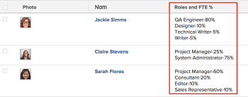

# Vue : pourcentage de disponibilité ETP de fonction d’utilisateur ou d’utilisatrice

<!--Audited: 11/2024-->

Vous pouvez ajouter une colonne à la vue d’une liste d’utilisateurs et d’utilisatrices pour afficher la liste des fonctions auxquelles la personne utilisatrice est associée, ainsi que le pourcentage de disponibilité ETP pour chaque fonction, tel que défini dans le profil utilisateur.

Pour plus d’informations sur la définition du pourcentage de disponibilité ETP pour les utilisateurs et utilisatrices, voir [Modifier le profil d’un utilisateur ou d’une utilisatrice](../../../administration-and-setup/add-users/create-and-manage-users/edit-a-users-profile.md).



## Conditions d’accès

+++ Développez pour afficher les exigences d’accès aux fonctionnalités de cet article.

<table style="table-layout:auto"> 
 <col> 
 <col> 
 <tbody> 
  <tr> 
   <td role="rowheader">Package Adobe Workfront</td> 
   <td> <p>Tous</p> </td> 
  </tr> 
  <tr> 
   <td role="rowheader">Licence Adobe Workfront</td> 
   <td> 
   <p>Contributeur ou demande de modification d’une vue </p>
   <p>Standard ou Plan pour modifier un rapport</p>
  </tr> 
  <tr> 
   <td role="rowheader">Configurations des niveaux d’accès</td> 
   <td> <p>Modifier l’accès aux rapports, tableaux de bord et calendriers pour modifier un rapport</p> <p>Modifier l’accès aux filtres, affichages et groupes pour modifier un affichage</p> </td> 
  </tr> 
  <tr> 
   <td role="rowheader">Autorisations d’objet</td> 
   <td> <p>Gérer les autorisations d’un rapport</p>  </td> 
  </tr> 
 </tbody> 
</table>

Pour plus de détails sur les informations contenues dans ce tableau, consultez l’article [Conditions d’accès dans la documentation Workfront](/help/quicksilver/administration-and-setup/add-users/access-levels-and-object-permissions/access-level-requirements-in-documentation.md).


+++

## Vue : pourcentage de disponibilité ETP de fonction d’utilisateur ou d’utilisatrice

1. Accédez à une liste d’utilisateurs et d’utilisatrices.
1. Dans le menu déroulant **Affichage**, sélectionnez **Nouvel affichage**.

1. Dans la zone **Aperçu de la colonne**, cliquez sur **Ajouter une colonne**.

1. Cliquez sur l’en-tête de la nouvelle colonne, puis sur **Passer en mode Texte** > **Modifier le mode Texte**.
1. Supprimez le texte de la zone **Modifier le mode texte** et remplacez-le par le code suivant :

   ```
   displayname=Roles Time Percentage
   listdelimiter=
   listmethod=nested(userRoles).lists
   textmode=true
   type=iterate
   valueexpression=CONCAT({role},'-',{timePercentage},'%')
   valueformat=HTML
   ```

1. Cliquez sur **Terminé**, puis sur **Enregistrer la vue**.

1. (Facultatif) Mettez à jour le nom de la vue, puis cliquez sur **Enregistrer la vue**.
