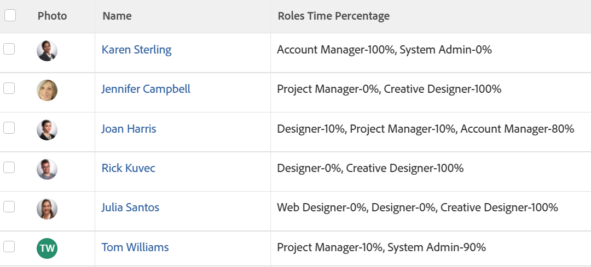

# Vue : pourcentage de disponibilité ETP de fonction d’utilisateur ou d’utilisatrice

Vous pouvez ajouter une colonne à l’affichage d’une liste d’utilisateurs pour afficher une liste des rôles auxquels l’utilisateur est associé ainsi que le pourcentage de disponibilité ETP pour chaque rôle, tel que défini dans le profil utilisateur.

Pour plus d’informations sur la définition du pourcentage de disponibilité des ETP pour les utilisateurs, voir [Modifier le profil d’un utilisateur](../../../administration-and-setup/add-users/create-and-manage-users/edit-a-users-profile.md).

## Conditions d’accès

Vous devez disposer des accès suivants pour effectuer les étapes de cet article :

<table style="table-layout:auto"> 
 <col> 
 <col> 
 <tbody> 
  <tr> 
   <td role="rowheader">Forfait Adobe Workfront*</td> 
   <td> 
N’importe quelle
 </td> 
  </tr> 
  <tr> 
   <td role="rowheader">Licence Adobe Workfront*</td> 
   <td> 
Demander la modification d’une vue 

   
Prévoir la modification d’un rapport
 </td> 
  </tr> 
  <tr> 
   <td role="rowheader">Configurations des niveau d’accès*</td> 
   <td> 
Modifier l’accès aux rapports, tableaux de bord et calendriers pour modifier un rapport
 
Modifier l’accès aux filtres, vues et groupes pour modifier une vue
 
<b>NOTE</b>

Si vous n’avez toujours pas accès, demandez à votre administrateur ou administratrice Workfront si des restrictions supplémentaires à votre niveau d’accès ont été appliquées. Pour plus d’informations sur la façon dont un administrateur ou une administratrice Workfront peut modifier votre niveau d’accès, voir <a href="../../../administration-and-setup/add-users/configure-and-grant-access/create-modify-access-levels.md" class="MCXref xref">Créer ou modifier les niveaux d’accès personnalisés</a>.
 </td>
</tr>   
  <tr> 
   <td role="rowheader">Autorisations d’objet</td> 
   <td> 
Gérer les autorisations d’un rapport
 
Pour plus d’informations sur la demande d’accès supplémentaire, voir <a href="../../../workfront-basics/grant-and-request-access-to-objects/request-access.md" class="MCXref xref">Demander l’accès aux objets</a>.
 </td> 
  </tr> 
 </tbody> 
</table>

&#42;Pour connaître le forfait, le type de licence ou l’accès dont vous disposez, contactez votre administrateur ou administratrice Workfront.

## Afficher le rôle de la tâche utilisateur Pourcentage de disponibilité d’ETP

1. Accédez à une liste d’utilisateurs.
1. Dans le **menu déroulant Vue**, sélectionnez **Nouvelle vue**.

1. Dans la zone d’aperçu de colonne **, cliquez sur** Ajouter une colonne **.**

1. Cliquez sur le titre de la nouvelle colonne, puis sur Basculer vers **le mode** texte.
1. Placez le pointeur de la souris sur la zone du mode texte, puis cliquez sur **Cliquez pour modifier le texte**.
1. Supprimez le texte qui se trouve dans la **zone Mode** texte et remplacez-le par le code suivant :
   <pre>displayname=Roles Pourcentage de temps listdelimiter=
 listmethod=nested(userRoles).lists textmode=true type=iterate valueexpression=CONCAT({role},'-',{timePercentage}'%') valueformat=HTML</pre>

1. Cliquez sur **Enregistrer**, puis sur **Enregistrer la vue**.

1. (Facultatif) Indiquez un nom pour votre vue, puis cliquez sur **Enregistrer la vue**.
