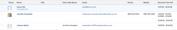

# Afficher : temps libre de l’utilisateur

<!--

(NOTE: consider hiding this article because this is not a custom view anymore.)

-->

Vous pouvez créer un rapport Heure de désactivation pour capturer les informations de désactivation des utilisateurs.

## Exigences d’accès

Vous devez disposer des accès suivants pour effectuer les étapes de cet article :

<table style="table-layout:auto"> 
 <col> 
 <col> 
 <tbody> 
  <tr> 
   <td role="rowheader">Formule Adobe Workfront*</td> 
   <td> 
Tous
 </td> 
  </tr> 
  <tr> 
   <td role="rowheader">Licence Adobe Workfront*</td> 
   <td> 
Demande de modification d’une vue 

   
Prévoir de modifier un rapport
 </td> 
  </tr> 
  <tr> 
   <td role="rowheader">Paramétrages du niveau d'accès*</td> 
   <td> 
Modification de l’accès aux rapports, tableaux de bord et calendriers pour la modification d’un rapport
 
Modifier l’accès aux filtres, vues et groupes pour modifier une vue
 
<b>NOTE</b>

Si vous n’avez toujours pas accès à , demandez à votre administrateur Workfront s’il définit des restrictions supplémentaires à votre niveau d’accès. Pour plus d’informations sur la façon dont un administrateur Workfront peut modifier votre niveau d’accès, voir <a href="../../../administration-and-setup/add-users/configure-and-grant-access/create-modify-access-levels.md" class="MCXref xref">Création ou modification de niveaux d’accès personnalisés</a>.
 </td>
</tr>  
  <tr> 
   <td role="rowheader">Autorisations d’objet</td> 
   <td> 
Gestion des autorisations d’un rapport
 
Pour plus d’informations sur la demande d’accès supplémentaire, voir <a href="../../../workfront-basics/grant-and-request-access-to-objects/request-access.md" class="MCXref xref">Demande d’accès aux objets </a>.
 </td> 
  </tr> 
 </tbody> 
</table>

&#42;Pour connaître le plan, le type de licence ou l’accès dont vous disposez, contactez votre administrateur Workfront.

## Affichage du temps d’arrêt personnel de l’utilisateur

1. Cliquez sur le bouton **Menu Principal** icon  dans le coin supérieur droit, puis cliquez sur **Rapports > Nouveau rapport**.

1. Dans le menu déroulant, sélectionnez **Time Off**.
1. Cliquez sur **Enregistrer + Fermer**.

   Le rapport affiche par défaut les champs suivants dans la vue :

   | Utilisateur ou utilisatrice | Nom de l’utilisateur qui a indiqué le délai de pause dans son profil. |
   |---|---|
   | Date de début | Date de début de la période de temps que l’utilisateur a indiquée. |
   | Date de fin | Date de fin de la période de temps que l’utilisateur a indiquée. |

   {style="table-layout:auto"}

1. (Facultatif) Terminez la création du rapport en modifiant l’un des onglets suivants :

   * Colonnes (Affichage)
   * Regroupements
   * Filtres
   * Graphique

   Pour plus d’informations sur la création de rapports, voir l’article [Création d’un rapport personnalisé](../../../reports-and-dashboards/reports/creating-and-managing-reports/create-custom-report.md).

   >[!TIP]
   >
   >Il est recommandé d&#39;ajouter un groupement pour l&#39;objet Utilisateur afin de faciliter la lisibilité du rapport.

<!--
<h2 data-mc-conditions="QuicksilverOrClassic.Draft mode">Add Time Off information to a user report</h2>
-->

<!--

(NOTE: old way of doing this, not working anymore)

-->

<!--

To add a column to a user view or report to display a list of future days which have been marked for time off by users:

-->

<!--

  

-->

<!--
   <li value="1" data-mc-conditions="QuicksilverOrClassic.Draft mode">  Click the <strong>Main Menu</strong> icon  in the upper-right corner, then click&nbsp;<strong>Reports > New Report.</strong> </li>
   -->

<!--
   <li value="2" data-mc-conditions="QuicksilverOrClassic.Draft mode">From the&nbsp;<strong>New Report</strong> drop-down menu, select&nbsp;<strong>User Report</strong>.</li>
   -->

<!--
   <li value="3" data-mc-conditions="QuicksilverOrClassic.Draft mode">Click <strong>Add Column</strong>.</li>
   -->

<!--
   <li value="4" data-mc-conditions="QuicksilverOrClassic.Draft mode">From the <strong>View</strong> drop-down menu, select <strong>New View</strong>.</li>
   -->

<!--
   <li value="5" data-mc-conditions="QuicksilverOrClassic.Draft mode">Click the header of the new column, then click<strong>Switch to Text Mode</strong>.</li>
   -->

<!--
   <li value="6" data-mc-conditions="QuicksilverOrClassic.Draft mode">Mouse over the text mode area, and click <strong>Click to edit text</strong>.</li>
   -->

<!--
   <li value="7" data-mc-conditions="QuicksilverOrClassic.Draft mode">Remove the text you find in the <strong>Text Mode</strong> box, and replace it with the following code: <!--
   <pre data-mc-conditions="QuicksilverOrClassic.Draft mode">displayname=Personal Time Off listdelimiter= listmethod=nested(reservedTimes).lists name=Upcoming Time Off stretch=0 textmode=true type=iterate valueexpression=IF({startDate}>$$TODAY,CONCAT({startDate}," - ",{endDate}),'') valueformat=HTML width=150</pre>
   </li>
   -->

<!--
   <li value="8" data-mc-conditions="QuicksilverOrClassic.Draft mode"> Click <strong>Save</strong>+<strong>Close</strong>.</li>
   -->
