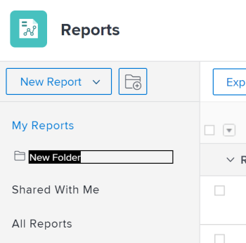

# Accès et organisation des rapports

Vous pouvez utiliser des rapports dans Adobe Workfront pour consulter ou modifier des informations sur les objets du système. Vous pouvez créer vos propres rapports, organiser les rapports que vous créez et afficher les rapports qui ont été partagés avec vous ou partagés publiquement.

## Exigences d’accès

Vous devez disposer des accès suivants pour effectuer les étapes de cet article :

<table style="table-layout:auto"> 
 <col> 
 <col> 
 <tbody> 
  <tr> 
   <td role="rowheader">Formule Adobe Workfront*</td> 
   <td> 
Tous
 </td> 
  </tr> 
  <tr> 
   <td role="rowheader">Licence Adobe Workfront*</td> 
   <td> 
Plan 
 </td> 
  </tr> 
  <tr> 
   <td role="rowheader">Paramétrages du niveau d'accès*</td> 
   <td> 
Modification de l’accès aux rapports, tableaux de bord et calendriers
 
Modifier l’accès aux filtres, vues et groupes
 
Remarque : Si vous n’avez toujours pas accès à , demandez à votre administrateur Workfront s’il définit des restrictions supplémentaires à votre niveau d’accès. Pour plus d’informations sur la façon dont un administrateur Workfront peut modifier votre niveau d’accès, voir <a href="../../../administration-and-setup/add-users/configure-and-grant-access/create-modify-access-levels.md" class="MCXref xref">Création ou modification de niveaux d’accès personnalisés</a>.
 </td> 
  </tr> 
  <tr> 
   <td role="rowheader">Autorisations d’objet</td> 
   <td> 
Gestion des autorisations d’un rapport
 
Pour plus d’informations sur la demande d’accès supplémentaire, voir <a href="../../../workfront-basics/grant-and-request-access-to-objects/request-access.md" class="MCXref xref">Demande d’accès aux objets </a>.
 </td> 
  </tr> 
 </tbody> 
</table>

&#42;Pour connaître le plan, le type de licence ou l’accès dont vous disposez, contactez votre administrateur Workfront.

## Affichage des rapports

Pour accéder aux rapports que vous avez créés ou qui ont été partagés avec vous ou partagés publiquement :

1. Dans la **Menu Principal** , cliquez sur **Rapports**.

1. Cliquez sur l’une des options suivantes, en fonction du rapport à afficher :

   * Cliquez sur **Mes rapports** pour afficher les rapports que vous avez créés.
   * Cliquez sur **Partagé avec moi** pour afficher des rapports que d’autres ont partagés avec vous.
   * Cliquez sur **Tous les rapports** pour afficher les rapports que vous avez créés et ceux qui ont été partagés avec vous ou partagés publiquement.

## Organisation des rapports que vous créez

Vous pouvez utiliser des dossiers pour organiser les rapports que vous créez. Vous ne pouvez pas organiser les rapports qui ont été partagés avec vous, partagés publiquement ou les rapports système.

* [Création d’un dossier pour les rapports](#create-a-new-folder-for-reports)
* [Ajout de rapports à un dossier](#add-reports-to-a-folder)

### Création d’un dossier pour les rapports {#create-a-new-folder-for-reports}

1. Dans la **Menu Principal** , cliquez sur **Rapports**.

1. Cliquez sur le bouton **Nouveau dossier** icône .\
   

1. Indiquez un nom pour le nouveau dossier, puis appuyez sur Entrée.
1. Dans la **Mes rapports** , ajoutez des rapports au nouveau dossier.\
   Pour plus d’informations sur l’ajout d’un rapport à un nouveau dossier, voir [Ajout de rapports à un dossier](#add-reports-to-a-folder) dans cet article.

   >[!NOTE]
   >
   >Vous pouvez uniquement ajouter de nouveaux dossiers au **Mes rapports** dossier. Vous ne pouvez pas ajouter de nouveaux dossiers ou rapports au **Partagé avec moi** ou **Tous les rapports** dossiers.

### Ajout de rapports à un dossier {#add-reports-to-a-folder}

1. Dans la **Menu Principal** , cliquez sur **Rapports**.

1. Cliquez sur **Mes rapports**.\
   Ou\
   Cliquez sur n’importe quel dossier imbriqué sous **Mes rapports** dossier.

1. Faites glisser un rapport de la liste des rapports vers le dossier où vous souhaitez qu’il réside, puis déposez-le lorsque vous atteignez le dossier.

   >[!NOTE]
   >
   >Vous pouvez uniquement déplacer les rapports depuis l’objet **Mes rapports** dossier vers d’autres dossiers imbriqués sous **Mes rapports**. Vous ne pouvez pas déplacer les rapports depuis ou vers le **Partagé avec moi** ou **Tous les rapports** vers ou à partir d’autres dossiers.

   
