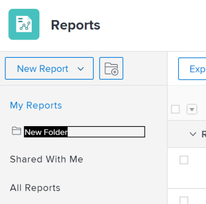
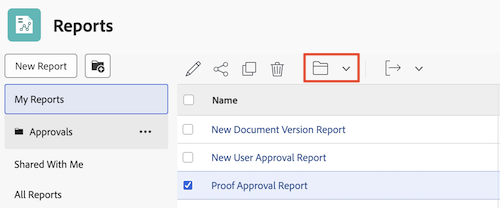

# Accéder aux rapports et organiser les rapports

Vous pouvez utiliser des rapports dans Adobe Workfront pour consulter ou modifier des informations sur les objets du système. Vous pouvez créer vos propres rapports, les organiser et afficher ceux qui ont été partagés avec vous ou partagés publiquement.

## Conditions d’accès

+++ Développez pour afficher les exigences d’accès aux fonctionnalités de cet article. 

<table style="table-layout:auto"> 
 <col> 
 <col> 
 <tbody> 
  <tr> 
   <td role="rowheader">Package Adobe Workfront</td> 
   <td> 
Tous
 </td> 
  </tr> 
  <tr> 
   <td role="rowheader">Licence Adobe Workfront</td> 
   <td> 
   
Standard

   
Plan 
 </td> 
  </tr> 
  <tr> 
   <td role="rowheader">Configurations des niveaux d’accès</td> 
   <td> 
Accès en modification aux rapports, tableaux de bord et calendriers
 
Modifier l’accès aux filtres, vues et groupes
</td> 
  </tr> 
  <tr> 
   <td role="rowheader">Autorisations d’objet</td> 
   <td> 
Gérer les autorisations d’un rapport
</td> 
  </tr> 
 </tbody> 
</table>

Pour plus de détails sur les informations contenues dans ce tableau, consultez l’article [Conditions d’accès dans la documentation Workfront](/help/quicksilver/administration-and-setup/add-users/access-levels-and-object-permissions/access-level-requirements-in-documentation.md).

+++

## Afficher les rapports

Pour accéder aux rapports que vous avez créés ou qui ont été partagés avec vous ou publiquement :

1. Dans le **Menu principal** , cliquez sur **Rapports**.

1. Cliquez sur l’une des options suivantes, en fonction du rapport que vous souhaitez afficher :

   * Cliquez sur **Mes rapports** pour afficher les rapports que vous avez créés.
   * Cliquez sur **Partagé(s) avec moi** pour afficher des rapports que d’autres ont partagés avec vous.
   * Cliquez sur **Tous les rapports** pour afficher les rapports que vous avez créés et ceux qui ont été partagés avec vous ou partagés publiquement.

## Organiser les rapports que vous créez

Vous pouvez utiliser des dossiers pour organiser les rapports que vous créez. Vous ne pouvez pas organiser les rapports qui ont été partagés avec vous, partagés publiquement ou les rapports du système.

* [Créer un nouveau dossier de rapports](#create-a-new-folder-for-reports)
* [Ajouter des rapports à un dossier](#add-reports-to-a-folder)

### Créer un nouveau dossier de rapports {#create-a-new-folder-for-reports}

1. Dans le **Menu principal** , cliquez sur **Rapports**.

1. Cliquez sur l’icône **Nouveau dossier**.\
   

1. Indiquez un nom pour le nouveau dossier, puis appuyez sur « Entrée ».
1. Depuis le dossier **Mes rapports**, ajoutez des rapports au nouveau dossier.\
   Pour plus d’informations sur l’ajout d’un rapport à un nouveau dossier, consultez dans cet article la section [Ajouter des rapports à un dossier](#add-reports-to-a-folder).

   >[!NOTE]
   >
   >Vous ne pouvez ajouter de nouveaux dossiers qu’au dossier **Mes rapports**. Il est impossible d’ajouter de nouveaux dossiers ou rapports aux dossiers **Partagé(s) avec moi** ou **Tous les rapports**.

### Ajouter des rapports à un dossier {#add-reports-to-a-folder}

1. Dans le **Menu principal** , cliquez sur **Rapports**.

1. Cliquez sur **Mes rapports**.\
   Ou\
   Cliquez sur n’importe quel dossier imbriqué dans le dossier **Mes rapports**.

1. Sélectionnez le rapport, puis cliquez sur l’icône de dossier  en haut de la liste.

1. Choisissez le dossier auquel vous souhaitez ajouter le rapport.

   

   >[!NOTE]
   >
   >Vous ne pouvez déplacer les rapports que depuis le dossier **Mes rapports** vers d’autres dossiers imbriqués sous **Mes rapports**. Vous ne pouvez pas déplacer de rapports depuis ou vers le dossier **Partagé(s) avec moi** ou **Tous les rapports** depuis ou vers d’autres dossiers.

