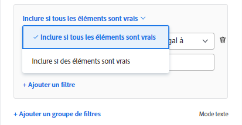
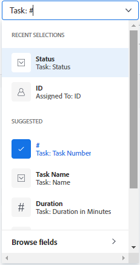

# Créer ou modifier des filtres dans Adobe Workfront

<!-- Audited: 11/2024 -->

Vous pouvez avec un filtre, limiter la quantité d’informations affichées à l’écran dans une liste d’éléments. Vous pouvez définir certains critères en fonction d’informations spécifiques sur un objet et afficher uniquement les objets qui répondent à ces critères.

Vous pouvez appliquer les types de filtres suivants dans Adobe Workfront :

* Filtres rapides dans une liste d’objets pour rechercher un élément à l’aide d’un mot-clé. Il s’agit de filtres temporaires que vous ne pouvez pas enregistrer pour une utilisation ultérieure.

  Pour plus d’informations sur les filtres rapides, consultez la section [Appliquer un filtre rapide à une liste](../../../workfront-basics/navigate-workfront/use-lists/apply-quick-filter-list.md).

* Filtres permanents que vous pouvez enregistrer et utiliser de nombreuses fois sur plusieurs listes et rapports. Cet article décrit comment créer un filtre permanent ou modifier un filtre existant dans une liste ou un rapport.

* Filtres dans d’autres zones de Workfront, en dehors des listes et des rapports.

  Pour obtenir la liste de tous les filtres dans Workfront et les zones dans lesquelles vous pouvez les appliquer, consultez la section [Vue d’ensemble des filtres](../../../reports-and-dashboards/reports/reporting-elements/filters-overview.md).

## Conditions d’accès

+++ Développez pour afficher les exigences d’accès aux fonctionnalités de cet article.

Vous devez disposer des accès suivants pour effectuer les étapes décrites dans cet article :

<table style="table-layout:auto"> 
 <col> 
 <col> 
 <tbody> 
  <tr> 
   <td role="rowheader"><strong>Formule Adobe Workfront*</strong></td> 
   <td> 
Tous
 </td> 
  </tr> 
  <tr> 
   <td role="rowheader"><strong>Licence Adobe Workfront*</strong></td> 
   <td> 
      
Nouveau :

         <ul>
         <li>
Contributeur à la modification d’un filtre
</li>
         <li>
Standard pour modifier un filtre dans un rapport
</li>
         </ul>
      
Actuel :

         <ul>
         <li>
Demande de modification d’un filtre
</li>
         <li>
Prévoir de modifier un filtre dans un rapport
</li>
         </ul>
   </td>
  </tr> 
  <tr> 
   <td role="rowheader"><strong>Configurations du niveau d’accès*</strong></td> 
   <td> <ul><li>
Modifier l’accès aux filtres, aux vues et aux regroupements
</li></ul>

Pour modifier un filtre dans un rapport, vous devez disposer de la configuration de niveau d’accès suivante, en plus de l’accès en modification des filtres, vues et regroupements :

<ul><li>
Accès en modification aux rapports, aux tableaux de bord et aux calendriers
</li></ul>   
   </td> 
  </tr> 
  <tr> 
   <td role="rowheader"><strong>Autorisations d’objet*</strong></td> 
   <td> 
Gérer les autorisations d’un filtre
</td> 
  </tr> 
 </tbody> 
</table>

*Pour plus d’informations, voir [Exigences d’accès dans la documentation Workfront](/help/quicksilver/administration-and-setup/add-users/access-levels-and-object-permissions/access-level-requirements-in-documentation.md).

+++

## Types d’interfaces de création de filtres

Vous pouvez créer des filtres à l’aide des types de créateurs de filtres décrits dans le tableau ci-dessous :

<table style="table-layout:auto">
<col>
<col>
<col>
<tbody>
<tr>
<td><strong>Type de créateur</strong></td>
<td><strong>Objet de filtre</strong></td>
<td><strong>Si disponible</strong></td>
</tr>
<tr>
<td>Créateur standard</td>
<td>
<ul>
<li> 
Projets
 </li>
<li> 
Tâches 
 </li>
<li> 
Problèmes
 </li>
<li> 
Portefeuilles
 </li>
<li> 
Programmes
 </li>
<li> 
Utilisateurs
 </li>
<li> 
Modèles
 </li>
<li> 
Groupes
 </li>
</ul>
</td>
<td>
<ul>
<li> 
Listes 
 </li>
</ul>
<ul>
<li> 
Liste des projets dans le planificateur de scénarios
 
Le planificateur de scénarios nécessite une licence supplémentaire. Pour plus d’informations sur le planificateur de scénarios Workfront, consultez la section <a href="../../../scenario-planner/scenario-planner-overview.md">Vue d’ensemble du planificateur de scénarios</a>. 
 </li>
</ul>

<b>NOTE :</b>
 
Les options standard de création pour les filtres ne sont pas disponibles dans les rapports.
</td>
</tr>
<tr>
<td>Options de création héritées</td>
<td>Tous les objets </td>
<td>Listes et rapports</td>
</tr>
</tbody>
</table>

Pour plus d’informations sur les objets Workfront, consultez la section [Comprendre les objets dans Adobe Workfront](/help/quicksilver/workfront-basics/navigate-workfront/workfront-navigation/understand-objects.md).

Tenez compte des points suivants lors de la création de filtres à l’aide des différentes interfaces :

* Le créateur standard se trouve aux mêmes endroits que l’interface de filtrage héritée pour les zones répertoriées dans le tableau ci-dessus.
* Le créateur standard est l’expérience par défaut pour toutes les zones où il est disponible. Pour basculer sur le créateur de filtres hérité, cliquez sur le menu **Plus** en regard de [!UICONTROL **Filtres**] et sélectionnez [!UICONTROL **Revenir aux filtres hérités**].

  

* Les filtres enregistrés sont disponibles dans les deux créateurs, quelle que soit l’expérience utilisée lors de leur création. Par exemple, si vous avez créé un filtre à l’aide du créateur hérité, vous pouvez également le trouver et le modifier dans l’interface de création standard.

  >[!TIP]
  >
  >Un filtre « Tous » n’est pas inclus dans le créateur standard, du fait que tous les éléments de liste s’affichent lorsqu’aucun filtre n’est appliqué. Cliquez sur [!UICONTROL **Effacer tout**] en haut à droite du créateur pour effacer les filtres actifs et afficher tous les éléments. Si [!UICONTROL **Effacer tout**] est grisé, aucun filtre n’est appliqué.

* Les créateurs standard et hérités ont une syntaxe légèrement différente lors de la création de filtres à plusieurs instructions qui combinent les opérateurs ET et OU. Par conséquent, ces filtres peuvent s’afficher différemment lorsque vous passez d’un créateur à un autre.

  >[!INFO]
  >
  >Il est possible que vous rencontriez le scénario suivant :
  >
  >1. Utilisez le créateur standard pour créer un filtre avec la syntaxe suivante :
  >
  >      `(A OR B) AND C`
  >
  >1. Basculez sur le créateur hérité et modifiez le filtre à l’aide de sa syntaxe, comme décrit dans la section [Créer ou modifier un filtre dans le créateur hérité](#create-filter-in-legacy-builder) de cet article. La syntaxe du créateur hérité affiche les instructions de filtrage comme suit :
  >
  >      `A AND C`
  >      `OR`
  >      `B AND C`
  >
  >1. Apportez des modifications au filtre via l’interface héritée.
  >1. Revenez au créateur standard. L’instruction de filtrage s’affiche selon la logique prise en charge par le créateur hérité, comme décrit ci-dessus.
  >
  >      Le filtre s’affiche dans l’interface du créateur standard comme suit :
  >  
  >      `A AND C`
  >      `OR`
  >      `B AND C`
  > 
  >      Cela est dû au fait que le filtre a été modifié dans l’interface héritée.

## Créer ou modifier un filtre dans le créateur standard

Vous pouvez créer des filtres à l’aide de l’interface du créateur standard en procédant comme suit :

* À partir de zéro
* Modifier un filtre existant
* Dupliquer un filtre existant
* Dupliquez un filtre existant, modifiez-le, puis enregistrez-le en tant que nouveau filtre.

Créez un filtre à l’aide de l’interface du créateur standard :

1. Accédez à une liste dans laquelle vous souhaitez créer un filtre ou contenant le filtre à personnaliser.
1. Cliquez sur l’icône **Filtrer**  pour ouvrir l’interface du créateur.

   

1. Consultez les listes de filtres suivantes :

   <table style="table-layout:auto">
   <col>
   <col>
   <tbody>
   <tr>
   <td role="rowheader"><strong>Favori</strong></td>
   <td>Filtres marqués comme favoris. Lorsque vous mettez un filtre en favori, son emplacement d’origine est indiqué sous son nom et il est masqué de la liste d’origine, sauf si vous le supprimez de vos favoris.</td>
   </tr>
   <tr>
   <td role="rowheader"><strong>Enregistré</strong></td>
   <td>Filtres que vous avez personnellement créés et enregistrés. Par défaut, cette liste affiche les filtres enregistrés dans l’ordre du dernier enregistrement, mais vous pouvez réorganiser manuellement la liste en faisant glisser les noms des filtres.</td>
   </tr>
   <tr>
   <td role="rowheader"><strong>Paramètres par défaut du système</strong></td>
   <td>Filtres par défaut du système Workfront et filtres que l’administration de Workfront a ajoutés à votre liste de filtres, que ce soit à l’échelle du système ou dans votre modèle de mise en page.</td>
   </tr>
   <tr>
   <td role="rowheader"><strong>Partagé avec moi</strong></td>
   <td>Filtres que d’autres personnes ont créés et partagés avec vous ou qui sont partagés à l’échelle du système.</td>
   </tr>
   </tbody>
   </table>

1. Utilisez l’une des méthodes suivantes :

   * Cliquez sur **Nouveau filtre** pour créer un filtre à partir de zéro.
   * Pointez sur un filtre existant que vous avez le droit de gérer, puis cliquez sur l’icône **Modifier**  pour apporter des modifications.

     Ou

     Pointez sur un filtre existant que vous avez le droit de consulter, cliquez sur le menu **Plus** , puis cliquez sur **Dupliquer** pour copier le filtre existant et modifier une copie.

   

1. (Le cas échéant) Selon que vous souhaitez trouver des objets qui correspondent à l’ensemble ou une partie des instructions d’un groupe de filtres, sélectionnez l’une des options suivantes :

   <table style="table-layout:auto">
   <col>
   <col>
   <tbody>
   <tr>
   <td role="rowheader"><strong>Inclure si tous les éléments sont vrais</strong></td>
   <td>Les objets trouvés grâce au filtre doivent correspondre à tous les critères de filtre d’un groupe de filtres. Dans ce cas, les instructions de filtrage sont connectées par l’opérateur AND. Il s’agit de la sélection par défaut.</td>
   </tr>
   <tr>
   <td role="rowheader"><strong>Inclure si des éléments sont vrais</strong></td>
   <td>Les objets trouvés grâce au filtre doivent correspondre à tous les critères de filtre d’un groupe de filtres. Dans ce cas, les instructions de filtre sont connectées par l’opérateur OR.</td>
   </tr>
   </tbody>
   </table>

   

   Pour plus d’informations sur les opérateurs de filtrage, consultez la section [Vue d’ensemble des filtres](/help/quicksilver/reports-and-dashboards/reports/reporting-elements/filters-overview.md).

1. Cliquez sur le menu déroulant des champs pour afficher la liste des champs récemment utilisés et les champs proposés pour les filtrer. Les champs proposés sont actuellement affichés dans la liste que vous filtrez.

   Vous pouvez également sélectionner **Parcourir les champs** pour afficher la liste de tous les champs par lesquels vous pouvez filtrer. Les champs de la recherche avancée sont regroupés par catégorie d’objet.

   

1. Cliquez sur le menu déroulant des modificateurs pour sélectionner un modificateur. Le modificateur par défaut est « Est égal à ».

   Pour plus d’informations, consultez la section [Modificateurs de filtre et de condition](/help/quicksilver/reports-and-dashboards/reports/reporting-elements/filter-condition-modifiers.md).

   >[!TIP]
   >
   >Lorsque vous créez le filtre, les résultats apparaissent immédiatement dans la liste. Si le panneau de filtres couvre la liste, vous pouvez le fermer pour voir l’affichage. Les informations que vous avez saisies restent dans le créateur lorsque vous ouvrez à nouveau le panneau.

1. Commencez à saisir la valeur d’un champ en fonction duquel vous souhaitez filtrer les données. Par exemple, commencez à saisir le nom d’un problème si vous souhaitez filtrer par `Issue:Name`. Sélectionnez la valeur qui apparaît dans la liste.

   >[!TIP]
   >
   >Selon le modificateur que vous avez sélectionné, vous pouvez sélectionner plusieurs valeurs.

1. Cliquez sur **Ajouter un filtre** pour sélectionner un autre champ et ajouter un critère de filtrage à l’instruction de filtre.
1. (Facultatif) Cliquez sur l’icône **Supprimer**  pour supprimer les instructions de filtre existantes.

   Ou

   Cliquez sur **Effacer tout** pour effacer tous les critères de filtrage.

1. (Facultatif) Cliquez sur **Ajouter un groupe de filtres** pour ajouter un autre ensemble de critères de filtrage. L’opérateur par défaut entre les ensembles est **AND**. Cliquez sur l’opérateur pour le modifier en **OR**.

   >[!TIP]
   >
   >Vous pouvez utiliser un autre groupe de filtres lorsque vous souhaitez que les groupes soient connectés par un opérateur différent de celui de l’opérateur dans l’instruction de filtrage.

   >[!INFO]
   >
   >Lorsque vous filtrez des projets dont le nom contient « marketing », qui ne sont pas terminés et qui ne sont pas en attente, vous pouvez utiliser les groupes de filtres multiples suivants :
   >`(Project: Name Contains Marketing AND Project: Percent Complete Does not equal 100)`
   >`OR`
   >`(Project: Name Contains Marketing AND Project: Status Does not equal On Hold)`
   >Dans ce cas, chaque instruction de filtre est connectée par un AND et les groupes de filtres sont connectés par un OR.

1. (Facultatif) Cliquez sur **Mode texte** pour continuer à créer le filtre en mode texte.

   

   L’interface du mode texte s’ouvre.

   

   >[!TIP]
   >
   >Nous vous recommandons de créer autant de filtres que possible à l’aide de l’interface de création standard et uniquement en mode texte lorsque vous devez modifier les filtres pris en charge uniquement en mode texte.

   Pour plus d’informations sur la création d’un filtre à l’aide de l’interface du mode texte, consultez la section [Modifier un filtre à l’aide du mode texte](/help/quicksilver/reports-and-dashboards/reports/text-mode/edit-text-mode-in-filter.md).

1. Cliquez sur **Quitter le mode texte** pour revenir à l’interface de création standard.

   >[!WARNING]
   >
   >Certaines instructions du mode texte ne sont pas prises en charge dans l’interface de création standard ou héritée. Quitter le mode texte lorsque vous avez créé ces types d’instructions peut générer un message d’avertissement.

1. (Facultatif) Cliquez sur **Appliquer** pour appliquer le filtre à la liste et voir les résultats.

   Si le filtre ne produit aucun résultat, la liste est vide.

1. Cliquez sur **Enregistrer en tant que nouveau** pour enregistrer le filtre en vue d’une utilisation ultérieure.

   

1. Sélectionnez **Filtre sans titre** et saisissez à la place le nom du nouveau filtre.

   >[!TIP]
   >
   >Prenez soin de nommer le filtre pour pouvoir le retrouver ultérieurement. Si vous ne nommez pas le filtre, il s’appellera Filtre sans titre dans le système.

1. Sélectionnez une icône pour le nouveau filtre dans le menu déroulant des **icônes**.

   .

1. (Facultatif) Ajoutez une description pour le filtre afin d’indiquer ce qui le rend unique. La description s’affiche sous le nom du filtre dans la liste des filtres.

   >[!TIP]
   >
   >Cliquer sur **Annuler** à tout moment vous ramène à la zone de création de filtre.

1. Cliquez sur **Enregistrer**. Le filtre est enregistré dans la liste des filtres enregistrés et appliqué à la liste des éléments.
1. (Facultatif) Pour déplacer un filtre vers la liste des favoris, pointez sur n’importe quel filtre du tiroir de filtres et cliquez sur l’icône **Favori** .

   Ou

   Pointez sur un filtre du tiroir de filtres, puis cliquez sur le menu « Plus »  et sur **Favori**.

1. (Facultatif) Cliquez sur le bouton **Empiler les filtres** pour activer les filtres empilés. Cette option vous permet d’appliquer plusieurs filtres enregistrés. Les règles de filtrage sont appliquées dans l’ordre dans lequel vous les sélectionnez.

   >[!TIP]
   >
   >Le nombre de filtres que vous pouvez sélectionner n’est pas limité.
   >
   >Lorsque vous sélectionnez plusieurs filtres, toutes leurs conditions doivent être remplies simultanément pour afficher les résultats correspondants.

   

   Le nombre de filtres sélectionnés s’affiche à côté de l’icône de filtre en haut de la liste des éléments.

   

1. (Facultatif) Effectuez l’une des opérations suivantes :

   * Partagez le filtre avec d’autres utilisateurs ou utilisatrices ou rendez-le disponible à l’échelle du système. Pour plus d’informations, consultez la section [Partager un filtre, une vue ou un regroupement](/help/quicksilver/reports-and-dashboards/reports/reporting-elements/share-filter-view-grouping.md).

   * Supprimez le filtre s’il n’est plus valide ou si c’est un doublon.Vous ne pouvez supprimer que vos propres filtres. Vous pouvez supprimer les filtres qui ont été partagés avec vous. Pour plus d’informations, consultez la section [Supprimer des filtres, des vues et des regroupements](/help/quicksilver/reports-and-dashboards/reports/reporting-elements/remove-filters-views-groupings.md).

## Créer ou modifier un filtre dans le créateur hérité {#create-filter-in-legacy-builder}

Vous pouvez créer des filtres hérités dans des listes et des rapports de la façon suivante :

* À partir de zéro
* Modifier un filtre existant et l’enregistrer comme nouveau filtre

Quelle que soit la méthode utilisée pour créer des filtres, la création d’un filtre à partir de zéro ou d’un filtre existant est similaire.

1. Accédez à une liste ou à un rapport contenant le filtre que vous souhaitez personnaliser.
1. Cliquez sur l’icône **Filtrer** , puis sur l’icône **Plus**  et cliquez sur **Revenir aux filtres hérités**.

   >[!TIP]
   >
   >La personne qui a créé le rapport doit autoriser la modification des filtres pour que la liste déroulante des filtres puisse être affichée dans un rapport. Le filtre « Rapport par défaut » est appliqué par défaut à un rapport. Le filtre « Rapport par défaut » ne peut être personnalisé que lorsque vous modifiez le rapport.

1. Cliquez sur **+ Nouveau filtre** en haut de la liste des filtres.

   Ou

   Pointez sur le filtre à modifier, puis cliquez sur l’icône **Modifier** .

   Le constructeur de personnalisation des filtres se lance.

1. Effectuez l’une des opérations suivantes :

   * Modifiez les règles de filtrage existantes en cliquant sur la règle existante et en sélectionnant une nouvelle option.
   * Ajoutez une règle de filtrage en cliquant sur **Ajouter une autre règle de filtrage**, commencez à saisir le nom de l’option pour laquelle vous souhaitez ajouter une règle dans la zone **Saisissez le nom du champ** puis cliquez dessus lorsqu’il apparaît dans la liste déroulante.

     Les champs associés à l’objet de votre filtre sont répertoriés dans la zone **Saisissez le nom du champ**.

   * Cliquez sur **AND** ou **OR** lors de l’ajout d’une règle de filtrage.\
     Lors de l’ajout de règles de filtrage, utilisez les modificateurs de filtre pour définir la condition de votre filtre. Pour plus d’informations sur les modificateurs de filtre, consultez la section [Modificateurs de filtre et de condition](../../../reports-and-dashboards/reports/reporting-elements/filter-condition-modifiers.md).

     >[!NOTE]
     >
     >Lorsque vous connectez un groupe d’instructions AND par plusieurs instructions OR, vous devez répéter les champs qui ne changent pas entre les instructions OR pour chaque groupe d’instructions.
     >
     >
     >
     >Lorsque vous créez un filtre pour les tâches qui contiennent le mot « marketing » et qui se trouvent dans des projets dont le statut est « Actuel » ou « Planification », vous devez avoir les règles de filtrage suivantes :
     >
     >`Task: Name Contains Marketing`
     >`AND`
     >`Project: Status Equals Current`
     >`OR`
     >`Task: Name Contains Marketing`
     >`AND`
     >`Project: Status Equals Planning`
     >
     >Bien que l’instruction de tâche qui stipule que le nom contient « marketing » ne change pas entre les deux groupes de filtres AND, elle doit être répétée dans le deuxième groupe.

   * Supprimez une règle de filtre existante en cliquant sur l’icône « X ».

1. (Facultatif) Cliquez sur **Basculer en mode texte** pour ajouter un filtre à l’aide de l’interface du mode texte.

   Pour plus d’informations sur la création d’un filtre à l’aide de l’interface du mode texte, consultez la section [Modifier un filtre à l’aide du mode texte](../../../reports-and-dashboards/reports/text-mode/edit-text-mode-in-filter.md).

1. Cliquez sur **Enregistrer le filtre** pour créer un filtre ou modifier celui sélectionné.

   Ou

   Cliquez sur **Enregistrer comme nouveau filtre** pour créer un nouveau filtre à partir de celui sélectionné.

   Le nouveau filtre s’affiche dans la liste des filtres et est automatiquement appliqué à la liste ou au rapport que vous avez sélectionné.

1. (Facultatif) Effectuez l’une des opérations suivantes :

   * Partagez les filtres que vous créez avec d’autres utilisateurs et utilisatrices ou mettez-les à disposition à l’échelle du système. Pour plus d’informations, voir [Partager un filtre, une vue ou un regroupement](/help/quicksilver/reports-and-dashboards/reports/reporting-elements/share-filter-view-grouping.md).
   * Supprimez les filtres que vous ne souhaitez plus afficher dans la liste. Pour plus d’informations, voir [Supprimer des filtres, des vues et des regroupements](/help/quicksilver/reports-and-dashboards/reports/reporting-elements/remove-filters-views-groupings.md).

