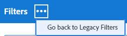

# Création ou modification de filtres dans Adobe Workfront

Vous pouvez limiter la quantité d’informations affichées à l’écran dans une liste d’éléments avec un filtre. Vous pouvez définir certains critères en fonction d’informations spécifiques sur un objet et afficher uniquement les objets qui répondent à ces critères.

Vous pouvez appliquer les types de filtres suivants dans Adobe Workfront :

* Filtres rapides dans une liste d’objets pour rechercher un élément à l’aide d’un mot-clé. Il s’agit de filtres temporaires que vous ne pouvez pas enregistrer pour une utilisation ultérieure.

   Pour plus d’informations sur les filtres rapides, voir [Appliquer le filtre rapide à une liste](../../../workfront-basics/navigate-workfront/use-lists/apply-quick-filter-list.md).

* Filtres permanents que vous pouvez enregistrer et utiliser plusieurs fois sur plusieurs listes et rapports. Cet article décrit comment créer un filtre permanent ou modifier un filtre existant dans une liste ou un rapport.

* Filtres dans d’autres zones de Workfront, en dehors des listes et des rapports.

   Pour obtenir la liste de tous les filtres dans Workfront et les zones dans lesquelles vous pouvez les appliquer, voir [Présentation des filtres dans Adobe Workfront](../../../reports-and-dashboards/reports/reporting-elements/filters-overview.md).

## Exigences d’accès

Vous devez disposer des accès suivants pour effectuer les étapes de cet article :

<table style="table-layout:auto"> 
 <col> 
 <col> 
 <tbody> 
  <tr> 
   <td role="rowheader"><strong>Formule Adobe Workfront*</strong></td> 
   <td> 
Tous
 </td> 
  </tr> 
  <tr> 
   <td role="rowheader"><strong>Licence Adobe Workfront*</strong></td> 
   <td> 
Requête ou supérieure
 </td> 
  </tr> 
  <tr> 
   <td role="rowheader"><strong>Paramétrages du niveau d'accès*</strong></td> 
   <td> 
Modifier l’accès aux filtres, vues et groupes
 
Remarque : Si vous n’avez toujours pas accès à , demandez à votre administrateur Workfront s’il définit des restrictions supplémentaires à votre niveau d’accès. Pour plus d’informations sur la façon dont un administrateur Workfront peut modifier votre niveau d’accès, voir <a href="../../../administration-and-setup/add-users/configure-and-grant-access/create-modify-access-levels.md" class="MCXref xref">Création ou modification de niveaux d’accès personnalisés</a>.
 </td> 
  </tr> 
  <tr> 
   <td role="rowheader"><strong>Autorisations d’objet</strong></td> 
   <td> 
Gestion des autorisations pour un filtre
 
Pour plus d’informations sur la demande d’accès supplémentaire, voir <a href="../../../workfront-basics/grant-and-request-access-to-objects/request-access.md" class="MCXref xref">Demande d’accès aux objets </a>.
 </td> 
  </tr> 
 </tbody> 
</table>

&#42;Pour connaître le plan, le type de licence ou l’accès dont vous disposez, contactez votre administrateur Workfront.

## Types d&#39;interfaces de création de filtres

Vous pouvez créer des filtres à l’aide des types de créateurs de filtres décrits dans le tableau ci-dessous :

<table style="table-layout:auto">
<col>
<col>
<col>
<tbody>
<tr>
<td><strong>Type de créateur</strong></td>
<td><strong>Objet de filtre</strong></td>
<td><strong>Où disponible</strong></td>
</tr>
<tr>
<td>Générateur standard</td>
<td>
<ul>
<li> 
Projets
 </li>
<li> 
Tâches 
 </li>
<li> 
Événements
 </li>
<li> 
Portefeuilles
 </li>
<li> 
Programmes
 </li>
<li> 
Utilisateurs
 </li>
<li> 
Modèles
 </li>
<li> 
Groupes
 </li>
</ul>
</td>
<td>
<ul>
<li> 
Listes 
 </li>
</ul>
<ul>
<li> 
La liste Projets dans le planificateur de scénarios
 
Le planificateur de scénario nécessite une licence supplémentaire. Pour plus d’informations sur le planificateur de scénario Workfront, voir <a href="../../../scenario-planner/scenario-planner-overview.md">Présentation du planificateur de scénarios</a>. 
 </li>
</ul>

REMARQUE : Les créateurs standard pour les filtres ne sont pas disponibles dans les rapports.
</td>
</tr>
<tr>
<td>Créateur hérité</td>
<td>Tous les objets </td>
<td>Listes et rapports</td>
</tr>
</tbody>
</table>

Pour plus d’informations sur les objets Workfront, voir [Présentation des objets dans Adobe Workfront](/help/quicksilver/workfront-basics/navigate-workfront/workfront-navigation/understand-objects.md).

Tenez compte des points suivants lors de la création de filtres à l’aide des différentes interfaces :

* Le créateur standard se trouve aux mêmes endroits que l’interface de filtrage héritée pour les zones répertoriées dans le tableau ci-dessus.
* Le créateur standard est l’expérience par défaut pour toutes les zones où il est disponible. Pour passer au créateur de filtres hérité, cliquez sur le **Plus** en regard de [!UICONTROL **Filtres**] et sélectionnez [!UICONTROL **Revenir aux filtres hérités**].

   

* Les filtres enregistrés sont disponibles dans les deux créateurs, quelle que soit l’expérience que vous avez utilisée pour les créer initialement. Par exemple, si vous avez créé un filtre à l’aide du créateur hérité, vous pouvez également le trouver et le modifier dans l’interface du créateur standard.

   >[!TIP]
   >
   >Un filtre &quot;Tous&quot; n’est pas inclus dans le créateur standard, car tous les éléments de liste s’affichent lorsqu’aucun filtre n’est appliqué. Cliquez sur [!UICONTROL **Effacer tout**] en haut à droite du générateur pour effacer les principaux filtres et afficher tous les éléments. If [!UICONTROL **Effacer tout**] est grisée, puis aucun filtre n’est appliqué.

* Les créateurs standard et hérités ont une syntaxe légèrement différente lors de la création de filtres à plusieurs instructions qui combinent les opérateurs ET et OU. Par conséquent, ces filtres peuvent s’afficher différemment lorsque vous passez d’un créateur à un autre.

   >[!INFO]
   >
   >Le scénario suivant existe :
   >
   >1. Utilisez le créateur standard pour créer un filtre avec la syntaxe suivante :
   >
   >   `(A OR B) AND C`
   >
   >1. Basculez vers le créateur hérité et modifiez le filtre à l’aide de la syntaxe du créateur hérité, comme décrit dans la section [Création ou modification d’un filtre dans le créateur hérité](#create-filter-in-legacy-builder) dans cet article. La syntaxe du créateur hérité affiche les instructions de filtre comme suit :
   >
   >   `A AND C`
   >   `OR`
   >   `B AND C`
   >
   >1. Apportez une modification au filtre dans l’interface héritée.
   >1. Revenez au créateur standard. L’instruction de filtre s’affiche selon la logique prise en charge dans le créateur hérité, comme décrit ci-dessus.

   >
   >   Le filtre s’affiche dans l’interface du créateur standard comme suit :
   >  
   >   `A AND C`
   >   `OR`
   >   `B AND C`
   > 
   >   Cela se produit car le filtre a été modifié dans l’interface héritée.

## Création ou modification d’un filtre dans le créateur standard

Vous pouvez créer des filtres à l’aide de l’interface du créateur standard en procédant comme suit :

* A partir de zéro
* Modifier un filtre existant
* Dupliquer un filtre existant
* Dupliquez un filtre existant, modifiez-le, puis enregistrez-le comme un nouveau filtre.

Créez un filtre à l’aide de l’interface du créateur standard :

1. Accédez à une liste dans laquelle vous souhaitez créer un filtre ou qui contient le filtre que vous souhaitez personnaliser.
1. Cliquez sur le bouton **Filtrer** icon  pour ouvrir l’interface du créateur.

   

1. Consultez les listes de filtres suivantes :

   <table style="table-layout:auto">
   <col>
   <col>
   <tbody>
   <tr>
   <td role="rowheader"><strong>Favori</strong></td>
   <td>Filtres que vous avez marqués comme favoris. Lorsque vous préférez un filtre, son emplacement d’origine est affiché sous le nom du filtre et il est masqué de la liste d’origine, sauf si vous le supprimez comme favori.</td>
   </tr>
   <tr>
   <td role="rowheader"><strong>Enregistré</strong></td>
   <td>Filtres que vous avez créés et vous-même sauvés.</td>
   </tr>
   <tr>
   <td role="rowheader"><strong>Paramètres par défaut du système</strong></td>
   <td>Les filtres par défaut du système Workfront, ainsi que les filtres que l’administrateur Workfront a ajoutés à votre liste de filtres, au niveau du système ou dans votre modèle de mise en page.</td>
   </tr>
   <tr>
   <td role="rowheader"><strong>Partagé avec moi</strong></td>
   <td>Filtres que d’autres ont créés et partagés avec vous ou qui sont partagés à l’échelle du système.</td>
   </tr>
   </tbody>
   </table>

1. Utilisez l’une des méthodes suivantes :

   * Cliquez sur **Nouveau filtre** pour créer un filtre à partir de zéro.
   * Passez la souris sur un filtre existant que vous êtes autorisé à gérer, puis cliquez sur l’icône **Modifier** icon  pour la modifier.

      Ou

      Passez la souris sur un filtre existant que vous êtes autorisé à afficher, puis cliquez sur l’icône **Plus** menu , puis cliquez sur **Dupliquer** pour copier le filtre existant et modifier une copie.
   

1. (Conditionnel) Selon que vous souhaitez trouver des objets qui correspondent à l’ensemble ou à l’une des instructions d’un groupe de filtres, sélectionnez l’une des options suivantes :

   <table style="table-layout:auto">
   <col>
   <col>
   <tbody>
   <tr>
   <td role="rowheader"><strong>Inclure si tous les éléments sont vrais</strong></td>
   <td>Les objets trouvés par le filtre doivent correspondre à tous les critères d’un groupe de filtres. Dans ce cas, les instructions de filtre sont connectées par l’opérateur AND. Il s’agit de la sélection par défaut.</td>
   </tr>
   <tr>
   <td role="rowheader"><strong>Inclure si des éléments sont vrais</strong></td>
   <td>Les objets trouvés par le filtre doivent correspondre à tous les critères de filtre d’un groupe de filtres. Dans ce cas, les instructions de filtre sont connectées par l’opérateur OU.</td>
   </tr>
   </tbody>
   </table>

   

   Pour plus d’informations sur les opérateurs de filtrage, voir [Présentation des filtres dans Adobe Workfront](/help/quicksilver/reports-and-dashboards/reports/reporting-elements/filters-overview.md).

1. Cliquez sur le menu déroulant des champs pour afficher la liste des champs récemment utilisés et les champs proposés pour les filtrer. Les champs proposés sont actuellement affichés dans la liste que vous filtrez.

   Vous pouvez également sélectionner **Parcourir les champs** pour afficher la liste de tous les champs par lesquels vous pouvez filtrer. Les champs de la recherche avancée sont regroupés par catégorie d’objet.

   

1. Cliquez sur le menu déroulant des modificateurs pour sélectionner un modificateur. Le modificateur par défaut est &quot;Est égal à&quot;.

   Pour plus d’informations, voir [Modificateurs de filtre et de condition](/help/quicksilver/reports-and-dashboards/reports/reporting-elements/filter-condition-modifiers.md).

   >[!TIP]
   >
   >Lorsque vous créez le filtre, les résultats apparaissent immédiatement dans la liste. Si le panneau de filtrage couvre la liste, vous pouvez la fermer pour afficher l’affichage. Les informations que vous avez saisies restent dans le créateur lorsque vous ouvrez à nouveau le panneau.

1. Commencez à saisir la valeur d’un champ sur lequel vous souhaitez filtrer les données. Par exemple, commencez à saisir le nom d’un problème si vous souhaitez filtrer par `Issue:Name`. Sélectionnez la valeur lorsqu’elle s’affiche dans la liste.

   >[!TIP]
   >
   >Selon le modificateur que vous avez sélectionné, vous pouvez sélectionner plusieurs valeurs.

1. Cliquez sur **Ajouter un filtre** pour sélectionner un autre champ et ajouter un nouveau critère de filtrage à l’instruction de filtre.
1. (Facultatif) Cliquez sur le **Supprimer** icon  pour supprimer les instructions de filtre existantes.

   Ou

   Cliquez sur **Effacer tout** pour effacer tous les critères de filtrage.

1. (Facultatif) Cliquez sur **Ajouter un groupe de filtres** pour ajouter un autre ensemble de critères de filtrage. L’opérateur par défaut entre les ensembles est AND. Cliquez sur l’opérateur pour le remplacer par OU.

   >[!TIP]
   >
   >Vous pouvez utiliser un autre groupe de filtres lorsque vous souhaitez que les groupes soient connectés par un opérateur différent de celui de l’opérateur dans une instruction de filtre.

   >[!INFO]
   >
   >Lorsque vous filtrez les projets dont le nom contient &quot;marketing&quot;, qui ne sont pas terminés et qui ne sont pas bloqués, vous pouvez utiliser les groupes de filtres multiples suivants :
   >`(Project: Name Contains Marketing AND Project: Percent Complete Does not equal 100)`
   >`OR`
   >`(Project: Name Contains Marketing AND Project: Status Does not equal On Hold)`
   >Dans ce cas, chaque instruction de filtre est connectée par un ET et les groupes de filtres sont connectés par un OR.

1. (Facultatif) Cliquez sur **Mode texte** pour continuer à créer le filtre en mode texte.

   

   L’interface du mode texte s’ouvre.

   

   >[!TIP]
   >
   >Nous vous recommandons de créer autant de filtres que possible à l’aide de l’interface du créateur standard et uniquement en mode texte lorsque vous devez apporter des modifications au filtre qui ne sont prises en charge que dans le mode texte.

   Pour plus d’informations sur la création d’un filtre à l’aide de l’interface du mode texte, voir [Modification d’un filtre à l’aide du mode texte](/help/quicksilver/reports-and-dashboards/reports/text-mode/edit-text-mode-in-filter.md).

1. Cliquez sur **Quitter le mode texte** pour revenir à l’interface du créateur standard.

   >[!WARNING]
   >
   >Certaines instructions de mode texte ne sont pas prises en charge dans le créateur standard ou l’interface héritée. La sortie du mode texte lorsque vous avez créé ces types d’instructions peut générer un message d’avertissement.

1. (Facultatif) Cliquez sur **Appliquer** pour appliquer le filtre à la liste et voir les résultats.

   Si le filtre ne produit aucun résultat, la liste est vide.

1. Cliquez sur **Enregistrer comme nouveau** pour enregistrer le filtre en vue d’une utilisation ultérieure.

   

1. Sélectionner **Filtre sans titre** et saisissez plutôt le nom du nouveau filtre.

   >[!TIP]
   >
   >Veillez à nommer le filtre pour pouvoir le retrouver ultérieurement. Si vous ne nommez pas le filtre, il sera appelé Filtre sans titre dans le système.

1. Sélectionnez une icône pour le nouveau filtre dans la **Icône** menu déroulant.

   

1. (Facultatif) Ajoutez une description pour le filtre afin d’indiquer ce qui est unique à son sujet. La description s’affiche sous le nom du filtre dans la liste des filtres.

   >[!TIP]
   >
   >Cliquer **Annuler** à tout moment vous ramène à la zone de création de filtre.

1. Cliquez sur **Enregistrer**. Le filtre est enregistré dans la liste Enregistré et appliqué à la liste des éléments.
1. (Facultatif) Pour déplacer un filtre vers la liste Favori, passez la souris sur un filtre du tiroir de filtre et cliquez sur l’icône Favori . .

   Ou

   Pointez sur un filtre du tiroir de filtre, puis cliquez sur le menu Plus . , puis cliquez sur **Favori**.

1. (Facultatif) Cliquez sur le **Empiler des filtres** pour activer les filtres empilés. Cette option vous permet d’appliquer plusieurs filtres enregistrés. Les règles de filtrage sont appliquées dans l’ordre dans lequel vous les sélectionnez.

   >[!TIP]
   >
   >Le nombre de filtres que vous pouvez sélectionner est illimité.
   >
   >Lorsque vous sélectionnez plusieurs filtres, toutes leurs conditions doivent être remplies simultanément pour afficher les résultats correspondants.

   

   Le nombre de filtres que vous avez sélectionnés s’affiche en regard de l’icône de filtre en haut de la liste des éléments.

   

1. (Facultatif) Effectuez l’une des opérations suivantes :

   * Partagez le filtre avec d’autres utilisateurs ou rendez-le disponible à l’échelle du système. Pour plus d’informations, voir [Partage d’un filtre, d’une vue ou d’un regroupement](/help/quicksilver/reports-and-dashboards/reports/reporting-elements/share-filter-view-grouping.md).

   * Supprimez le filtre s&#39;il n&#39;est plus valide ou n&#39;est plus un doublon. Vous ne pouvez supprimer que les filtres que vous possédez. Vous pouvez supprimer les filtres qui ont été partagés avec vous. Pour plus d’informations, voir [Suppression des filtres, des vues et des regroupements](/help/quicksilver/reports-and-dashboards/reports/reporting-elements/remove-filters-views-groupings.md).

## Création ou modification d’un filtre dans le créateur hérité {#create-filter-in-legacy-builder}

Vous pouvez créer des filtres hérités dans les listes et les rapports comme suit :

* A partir de zéro
* Modifier un filtre existant et l’enregistrer comme nouveau filtre

Quelle que soit la méthode utilisée pour créer des filtres, la création d’un filtre à partir de zéro ou d’un filtre existant est similaire.

1. Accédez à une liste ou à un rapport contenant le filtre que vous souhaitez personnaliser.
1. Cliquez sur le bouton **Filtrer** icon .

   >[!TIP]
   >
   >Le créateur du rapport doit autoriser l&#39;édition des filtres afin d&#39;afficher la liste déroulante Filtre sur un rapport. Le filtre Rapport par défaut est appliqué par défaut à un rapport. Le filtre Rapport par défaut ne peut être personnalisé que lorsque vous modifiez le rapport.

   

1. Cliquez sur **Nouveau filtre** en haut de la liste des filtres.

   Ou

   Pointez sur le filtre à modifier, puis cliquez sur le bouton **Modifier** icon .

   Créateur permettant de personnaliser les lancements du filtre.

1. Effectuez l’une des opérations suivantes :

   * Modifiez les règles de filtrage existantes en cliquant sur la règle existante et en sélectionnant une nouvelle option.
   * Ajoutez une règle de filtrage en cliquant sur **Ajouter une autre règle de filtre**, commencez à saisir le nom de l’option pour laquelle vous souhaitez ajouter une règle dans la variable **Commencer à saisir le nom du champ** puis cliquez dessus lorsqu’il apparaît dans la liste déroulante.

      Les champs associés à l’objet de votre filtre sont répertoriés dans la section **Commencer à saisir le nom du champ** de la boîte.

   * Cliquez sur **ET** ou **OU** lors de l’ajout d’une nouvelle règle de filtrage.\
      Lors de l’ajout de règles de filtrage, utilisez les modificateurs de filtre pour établir la condition de votre filtre. Pour plus d’informations sur les modificateurs de filtre, voir [Modificateurs de filtre et de condition](../../../reports-and-dashboards/reports/reporting-elements/filter-condition-modifiers.md).

      >[!NOTE]
      >
      >Lorsque vous connectez un groupe d’instructions ET par plusieurs instructions OR, vous devez répéter les champs qui ne changent pas entre les instructions OR pour chaque groupe d’instructions.
      >
      >
      >
      >Lorsque vous créez un filtre pour les tâches qui contiennent le mot &quot;marketing&quot; et qui se trouvent dans des projets dont l’état est Actuel ou Planification, vous devez avoir les règles de filtrage suivantes :
      >
      >`Task: Name Contains Marketing`
      >`AND`
      >`Project: Status Equals Current`
      >`OR`
      >`Task: Name Contains Marketing`
      >`AND`
      >`Project: Status Equals Planning`
      >
      >Bien que la tâche : Nom Contient &quot;marketing&quot; ne change pas entre les deux groupes de filtres ET, il doit être répété dans le deuxième groupe.

   * Supprimez une règle de filtre existante en cliquant sur l’icône &quot;X&quot;.

1. (Facultatif) Cliquez sur **Passer en mode Texte** pour ajouter un filtre à l’aide de l’interface Mode texte .

   Pour plus d’informations sur la création d’un filtre à l’aide de l’interface du mode texte, voir [Modification d’un filtre à l’aide du mode texte](../../../reports-and-dashboards/reports/text-mode/edit-text-mode-in-filter.md).

1. Cliquez sur **Enregistrer le filtre** pour créer un nouveau filtre ou remplacer celui sélectionné par vos modifications.

   Ou

   Cliquez sur **Enregistrer comme nouveau filtre** pour créer un nouveau filtre à partir du filtre sélectionné.

   Le nouveau filtre s&#39;affiche dans la liste des filtres et est automatiquement appliqué à la liste ou au rapport que vous avez sélectionné.

1. (Facultatif) Effectuez l’une des opérations suivantes :

   * Partagez les filtres que vous créez avec d’autres utilisateurs ou rendez-les disponibles à l’échelle du système. Pour plus d’informations, voir [Partage d’un filtre, d’une vue ou d’un regroupement](/help/quicksilver/reports-and-dashboards/reports/reporting-elements/share-filter-view-grouping.md).
   * Supprimez les filtres que vous ne souhaitez plus afficher dans la liste. Pour plus d’informations, voir [Suppression des filtres, des vues et des regroupements](/help/quicksilver/reports-and-dashboards/reports/reporting-elements/remove-filters-views-groupings.md).

