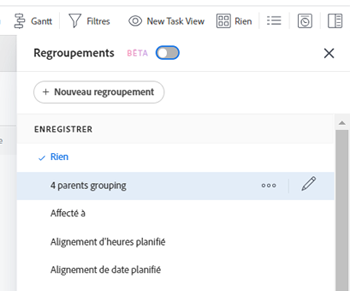

# Modifier des regroupements existants

<!--

(NOTE: This is the third part of a former artcle split in 3: two how-tos and one refernece article about creating and customizing groupings)

-->

Vous pouvez personnaliser un regroupement que vous avez créé à l’origine ou qui a été partagé avec vous. Vous pouvez ensuite l’enregistrer en tant que nouveau groupe.

## Conditions d’accès

Vous devez disposer des accès suivants pour effectuer les étapes de cet article :

<table style="table-layout:auto"> 
 <col> 
 <col> 
 <tbody> 
  <tr> 
   <td role="rowheader"><strong>Forfait Adobe Workfront*</strong></td> 
   <td> 
N’importe quelle
 </td> 
  </tr> 
  <tr> 
   <td role="rowheader"><strong>Licence Adobe Workfront*</strong></td> 
   <td> 
Requête ou supérieure 
 </td> 
  </tr> 
  <tr> 
   <td role="rowheader"><strong>Configurations des niveau d’accès*</strong></td> 
   <td> 
Modifier l’accès aux filtres, vues et groupes
 
Editer l'accès aux Rapports, Tableaux de bord, Calendriers pour modifier un groupement dans un rapport
 
Remarque : si vous n’avez toujours pas d’accès, demandez à votre équipe d’administration Workfront s’il existe des restrictions supplémentaires à votre niveau d’accès. Pour plus d’informations sur la façon dont un administrateur ou une administratrice Workfront peut modifier votre niveau d’accès, voir <a href="../../../administration-and-setup/add-users/configure-and-grant-access/create-modify-access-levels.md" class="MCXref xref">Créer ou modifier les niveaux d’accès personnalisés</a>.
 </td> 
  </tr> 
  <tr> 
   <td role="rowheader"><strong>Autorisations d’objet</strong></td> 
   <td> 
Gérer les autorisations d’un rapport pour modifier un groupement dans un rapport
 
Gestion des autorisations d’un groupement 
 
Pour plus d’informations sur la demande d’accès supplémentaire, voir <a href="../../../workfront-basics/grant-and-request-access-to-objects/request-access.md" class="MCXref xref">Demander l’accès aux objets</a>.
 </td> 
  </tr> 
 </tbody> 
</table>

&#42;Pour connaître le forfait, le type de licence ou l’accès dont vous disposez, contactez votre administrateur ou administratrice Workfront.

## Conditions préalables

Vous devez créer un groupement avant de pouvoir le modifier.

Pour plus d’informations sur la création d’un groupement, voir [Création de groupements dans Adobe Workfront](../../../reports-and-dashboards/reports/reporting-elements/create-groupings.md).

## Étapes pratiques

1. Accédez à une liste d’objets contenant le regroupement que vous souhaitez personnaliser.
1. Cliquez sur l’icône **Groupement** .
1. Sélectionnez le groupement que vous souhaitez personnaliser, puis cliquez sur l&#39;icône **Modifier** .

   

   Le créateur d’interface pour la personnalisation du regroupement s’ouvre.

1. Dans la section **Aperçu du groupement** , cliquez sur **Ajouter un groupement** pour définir la manière dont vous souhaitez que les informations du rapport soient organisées. Vous trouverez ci-dessous un aperçu du regroupement dans le rapport.

1. Commencez à saisir le nom du champ qui représente la manière dont vous souhaitez organiser les informations dans le rapport, puis cliquez dessus lorsqu’il apparaît dans la liste déroulante.
1. (Facultatif et conditionnel) Lors de l’affichage d’une liste mise à jour, sélectionnez **Réduire ce regroupement par défaut** si vous souhaitez que les résultats du regroupement s’affichent réduits plutôt que développés. Ce paramètre est désactivé par défaut et les résultats du groupement s’affichent toujours dans la liste étendue.

   Pour plus d’informations sur les listes mises à jour et héritées, voir la section &quot;La différence entre les listes mises à jour et héritées&quot; dans l’article [Prise en main des listes dans Adobe Workfront](../../../workfront-basics/navigate-workfront/use-lists/view-items-in-a-list.md).

   <!--
   
(NOTE: the tips repeat in the Create grouping article and Common uses of text mode)

   -->

   >[!TIP]
   >
   >* Lorsque vous ajustez manuellement les groupements lors de l&#39;affichage d&#39;une liste, Workfront mémorise vos préférences manuelles jusqu&#39;à ce que vous vous déconnectiez. Lorsque vous vous reconnectez, la liste s’affiche en fonction de ce paramètre.
   >* Les résultats d’un regroupement s’affichent toujours plus après leur accès à partir d’un élément de graphique ou d’une liste héritée. Dans ce cas, ce paramètre est ignoré.

1. Répétez les étapes 4, 5 et 6 pour définir des regroupements supplémentaires.\
   Vous pouvez définir jusqu’à trois groupes pour organiser les informations. Vous pouvez organiser davantage vos informations avec jusqu’à quatre regroupements en créant un rapport de matrice. Pour plus d’informations sur les rapports de matrice, voir [Création d’un rapport de matrice](../../../reports-and-dashboards/reports/creating-and-managing-reports/create-matrix-report.md).

1. Cliquez sur **Enregistrer comme nouveau groupement** pour remplacer le groupement actuel par vos modifications.
