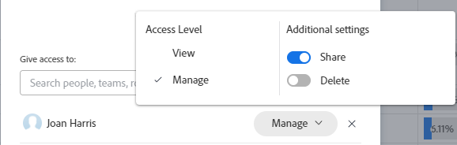

# Partage d’un filtre, d’une vue ou d’un regroupement

<!--

(NOTE: CONSIDER SPLITTING THIS in three articles for each reporting element?)

(NOTE: This is linked from the TOC article in WF Basics > permissions section)&nbsp;

-->

Votre administrateur Adobe Workfront permet aux utilisateurs d’afficher ou de modifier des objets lorsqu’ils attribuent des niveaux d’accès. Pour plus d’informations sur l’octroi de l’accès aux objets, voir [Création ou modification de niveaux d’accès personnalisés](../../../administration-and-setup/add-users/configure-and-grant-access/create-modify-access-levels.md).

Outre le niveau d’accès qui est accordé aux utilisateurs, vous pouvez leur accorder des autorisations pour afficher ou modifier des objets spécifiques que vous avez créés ou que vous avez accès au partage. Pour plus d’informations sur les niveaux d’accès et les autorisations, voir [Fonctionnement des niveaux d’accès et des autorisations](../../../administration-and-setup/add-users/access-levels-and-object-permissions/how-access-levels-permissions-work-together.md).

Vous pouvez partager avec d’autres utilisateurs des filtres, des vues et des regroupements auxquels vous avez accès.

Lorsqu’un filtre, une vue ou un regroupement est partagé avec vous, vous pouvez appliquer ce filtre, cette vue ou ce regroupement à vos listes. Selon l’accès qui vous est accordé, vous pouvez le modifier et le partager avec d’autres utilisateurs.

Pour plus d’informations sur la création d’un filtre, d’une vue ou d’un regroupement, reportez-vous aux articles suivants :

* [Présentation des filtres dans Adobe Workfront](../../../reports-and-dashboards/reports/reporting-elements/filters-overview.md)
* [Présentation des vues dans Adobe Workfront](../../../reports-and-dashboards/reports/reporting-elements/views-overview.md)
* [Présentation des regroupements dans Adobe Workfront](../../../reports-and-dashboards/reports/reporting-elements/groupings-overview.md)

## Exigences d’accès

Vous devez disposer des éléments suivants :

<table style="table-layout:auto"> 
 <col> 
 <col> 
 <tbody> 
  <tr> 
   <td role="rowheader"><strong>Formule Adobe Workfront*</strong></td> 
   <td> 
Tous 
 </td> 
  </tr> 
  <tr> 
   <td role="rowheader"><strong>Licence Adobe Workfront*</strong></td> 
   <td> 
Requête ou supérieure
 </td> 
  </tr> 
  <tr> 
   <td role="rowheader"><strong>Paramétrages du niveau d'accès*</strong></td> 
   <td> 
Affichage ou accès supérieur à Filtres, Vues, Groupes
 
Remarque : Si vous n’avez toujours pas accès à , demandez à votre administrateur Workfront s’il définit des restrictions supplémentaires à votre niveau d’accès. Pour plus d’informations sur la façon dont un administrateur Workfront peut modifier votre niveau d’accès, voir <a href="../../../administration-and-setup/add-users/configure-and-grant-access/create-modify-access-levels.md" class="MCXref xref">Création ou modification de niveaux d’accès personnalisés</a>.
 </td> 
  </tr> 
  <tr> 
   <td role="rowheader"><strong>Autorisations d’objet</strong></td> 
   <td> 
Affichage ou autorisations supérieures avec accès au partage vers une vue, un filtre ou un regroupement
 
Pour plus d’informations sur la demande d’accès supplémentaire, voir <a href="../../../workfront-basics/grant-and-request-access-to-objects/request-access.md" class="MCXref xref">Demande d’accès aux objets </a>.
 </td> 
  </tr> 
 </tbody> 
</table>

&#42;Pour connaître le plan, le type de licence ou l’accès dont vous disposez, contactez votre administrateur Workfront.

## Partage d’un filtre, d’une vue ou d’un regroupement

<!--

(NOTE: when the beta filters/ groupings come out either consider splitting this in different kinds of FVGs or splitting this article in FVGs for showing sharing on each one of them??)

-->

Vous pouvez partager des filtres dans des listes sélectionnées à l’aide des interfaces suivantes :

* Interface standard
* Interface du créateur bêta

Le partage de filtres dans des listes sélectionnées est différent selon l’interface à partir de laquelle vous partagez le filtre. Pour plus d’informations sur les types d’interfaces de création de filtres, voir [Création ou modification de filtres dans Adobe Workfront](/help/quicksilver/reports-and-dashboards/reports/reporting-elements/create-filters.md).

Vous pouvez partager des vues et des groupements uniquement dans l’interface standard.

* [Partage de filtres, vues et groupes à l’aide de l’interface standard](#share-with-standard-interface)
* [Partage de filtres à l’aide de l’interface du créateur de versions bêta](#share-with-beta-builder-interface)

### Partage de filtres, vues et groupes à l’aide de l’interface standard {#share-with-standard-interface}

Le partage des filtres, vues et regroupements dans l’interface standard est identique.

1. Accédez à une liste d’objets ou à un rapport.
1. (Conditionnel) Dans une liste, cliquez sur le bouton **Filtrer**, **Affichage** ou **Regroupement** puis survolez le filtre, l’affichage ou le groupe que vous souhaitez partager avec la souris et cliquez sur l’icône **Plus** icon , puis **Partager**.

   Dans un rapport, cliquez sur le bouton **Filtrer**, **Affichage** ou **Regroupement** menu déroulant, puis sélectionnez le filtre, l’affichage ou le regroupement que vous souhaitez partager.

1. (Conditionnel) Si vous partagez à partir d’un rapport, cliquez sur l’icône **Filtrer**, **Affichage** ou **Regroupement** menu déroulant, puis cliquez de nouveau sur **Partager le filtre**, **Partager la vue** ou **Partager le groupement**.\
   Le **Accès aux filtres**, **Afficher l’accès** ou **Accès de groupement** s’affiche.

   

1. Procédez de l’une des manières suivantes, selon avec qui vous souhaitez partager :

   **Pour partager avec des utilisateurs, des équipes, des rôles, des groupes ou des entreprises individuels :** Dans le champ fourni, commencez à saisir le nom de l’utilisateur, de l’équipe, du rôle, du groupe ou de la société avec lequel vous souhaitez partager le contenu, puis cliquez sur le nom lorsqu’il apparaît dans la liste déroulante.\
   Répétez ce processus pour partager l’accès avec plusieurs utilisateurs, équipes, rôles, groupes ou entreprises.

   >[!TIP]
   >
   >Le partage avec les groupes permet de filtrer, d&#39;afficher ou de regrouper les membres du groupe et de tous les sous-groupes.

   **Pour le partager avec tous les utilisateurs du système :** Cliquez sur le bouton **Paramètres** puis cliquez sur **rendre visible à l’échelle du système ;**.\
   Pour que cette option soit disponible, votre administrateur doit sélectionner l’option Partager à l’échelle du système . Pour plus d’informations, voir les articles [Création ou modification de niveaux d’accès personnalisés](../../../administration-and-setup/add-users/configure-and-grant-access/create-modify-access-levels.md) et [Partage de rapports, de tableaux de bord et de calendriers](../../../workfront-basics/grant-and-request-access-to-objects/permissions-reports-dashboards-calendars.md).

1. (Conditionnel) Si vous partagez avec des utilisateurs, équipes, rôles, groupes ou entreprises individuels, cliquez sur le menu déroulant pour définir le niveau d’accès que vous souhaitez accorder.

   Vous pouvez sélectionner l’une des options suivantes :

   <table style="table-layout:auto"> 
    <col> 
    <col> 
    <tbody> 
     <tr> 
      <td role="rowheader"><strong>L'afficher</strong></td> 
      <td> 
Sélectionnez cette option pour autoriser les destinataires du partage à utiliser uniquement le filtre, l’affichage ou le regroupement partagé. Lorsque cette option est sélectionnée, les destinataires ne peuvent pas apporter de modifications à l’élément partagé.
 </td> 
     </tr> 
     <tr> 
      <td role="rowheader"><strong>Le gérer</strong></td> 
      <td> 
Sélectionnez cette option pour permettre aux destinataires du partage d’utiliser et de modifier le filtre, l’affichage ou le regroupement partagé.
 </td> 
     </tr> 
     <tr> 
      <td role="rowheader"><strong>Partager</strong></td> 
      <td> 
Cliquez sur <strong>Paramètres avancés</strong>, puis sélectionnez ou désélectionnez l’option <strong>Partager</strong> selon que vous souhaitez que les destinataires puissent partager avec d'autres personnes ou non.
 </td> 
     </tr> 
    </tbody> 
   </table>

1. Cliquer sur **Enregistrer**.

   Les utilisateurs avec lesquels vous avez partagé le filtre, la vue ou le regroupement peuvent y accéder en cliquant sur le bouton **Filtrer**, **Affichage** ou **Regroupement** menu déroulant ou icône, puis faites défiler l’écran jusqu’au **Partagé avec moi** .

### Partage de filtres à l’aide de l’interface du créateur de versions bêta {#share-with-beta-builder-interface}

Lorsque vous partagez des filtres à partir de listes de projets, de tâches ou de problèmes, vous pouvez les partager à l’aide de l’interface bêta du créateur plutôt que de l’interface standard.

L’interface du générateur bêta n’est disponible pour aucun autre objet dans Workfront.

Vous ne pouvez pas créer de filtres dans l’interface du créateur de versions bêta lors de la création de rapports.

Partagez un filtre à l’aide de l’interface du créateur de versions bêta :

1. Accédez à une liste de projets, de tâches ou de problèmes.
1. Cliquez sur le bouton **Filtrer** icon , puis activez la variable **Paramètre bêta**  pour accéder au générateur de version bêta. Elle est désactivée par défaut.

   Ensuite, acceptez le contrat bêta si nécessaire.

   Cela ouvre l’interface du créateur de filtres bêta.

   >[!TIP]
   >
   >L’en-tête de l’interface du créateur devient bleu lorsque vous activez le créateur bêta. Après avoir activé l’interface du générateur bêta, Workfront la garde activée pour toutes les zones où elle est disponible.

   

1. Consultez les listes de filtres suivantes :

   <table style="table-layout:auto">
   <col>
   <col>
   <tbody>
   <tr>
   <td role="rowheader"><strong>Favori</strong></td>
   <td>Filtres que vous avez marqués comme favoris. Lorsque vous préférez un filtre, son emplacement d’origine est affiché sous le nom du filtre et il est masqué de la liste d’origine, sauf si vous le supprimez comme favori.</td>
   </tr>
   <tr>
   <td role="rowheader"><strong>Enregistré</strong></td>
   <td>Filtres que vous avez créés et vous-même sauvés.</td>
   </tr>
   <tr>
   <td role="rowheader"><strong>Paramètres par défaut du système</strong></td>
   <td>Les filtres par défaut du système Workfront, ainsi que les filtres que l’administrateur Workfront a ajoutés à votre liste de filtres, au niveau du système ou dans votre modèle de mise en page.</td>
   </tr>
   <tr>
   <td role="rowheader"><strong>Partagé avec moi</strong></td>
   <td>Filtres que d’autres ont créés et partagés avec vous ou qui sont partagés à l’échelle du système.</td>
   </tr>
   </tbody>
   </table>

1. Passez la souris sur un filtre que vous avez accès à au moins afficher et partager, puis cliquez sur le bouton **Plus** menu , puis cliquez sur **Partager**.

   

   La boîte Partage des filtres s’affiche.

1. Activez le paramètre Afficher à l’échelle du système. Cela permet à quiconque dans Workfront d’afficher le filtre.

   >[!IMPORTANT]
   >
   >Utilisez ce paramètre avec précaution. L’ajout de nombreux filtres pour tous les utilisateurs encombrera l’expérience de filtrage et rendra les filtres plus difficiles à trouver.

   Ou commencez à saisir les noms des utilisateurs, des équipes, des rôles, des groupes ou des entreprises avec lesquels vous souhaitez partager du contenu dans la variable **Accéder à** champ .

   

1. (Facultatif) Cliquez sur la flèche pointant vers la droite située en regard du nom d’une entité pour modifier ses autorisations sur le filtre, puis activez l’option **Affichage** ou **Gérer** . **Affichage** est la valeur par défaut.

   

1. (Facultatif) Activez ou désactivez les autorisations supplémentaires pour une entité en effectuant l’une des opérations suivantes :

   1. Cliquez sur **Affichage** et désactivez la variable **Partager** . Elle est activée par défaut.
   1. Cliquez sur **Gérer** et désactivez l’option **Partager** ou le **Supprimer** . Ils sont activés par défaut.

      >[!NOTE]
      >
      >Si vous activez l’option Gérer l’accès avec l’option Supprimer , ces utilisateurs pourront supprimer le filtre de tous les utilisateurs, même s’ils ne sont pas propriétaires du filtre.
   >[!TIP]
   >
   >Les utilisateurs ne peuvent pas recevoir une autorisation supérieure à leur niveau d’accès. S’ils n’ont pas accès aux filtres d’édition dans leur niveau d’accès, ils ne peuvent pas recevoir d’autorisations pour gérer un filtre. Workfront désactive l’option Gérer pour ces utilisateurs et l’option est grisée.

1. Cliquez sur **Partager**. Le filtre est partagé avec les entités que vous avez spécifiées.

   >[!TIP]
   >
   >Le partage avec les groupes donne des permissions sur le filtre aux membres du groupe et de tous les sous-groupes.

   Les filtres que vous avez partagés s’affichent dans la variable **Partagé avec moi** du panneau de filtrage pour ces entités.

   

