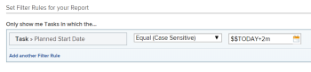

# Utilisation de caractères génériques basés sur des dates pour généraliser des rapports

Vous pouvez généraliser un rapport en utilisant des caractères génériques au lieu d’informations spécifiques lors de la création de certains éléments de rapport.

Par exemple, si vous souhaitez créer un rapport qui affiche les tâches dont la date de début planifiée est spécifique, vous pouvez utiliser le sélecteur de date du calendrier dans un filtre pour sélectionner une date spécifique. Cependant, si vous souhaitez créer un rapport qui affiche les tâches dont la date de début planifiée correspond à une certaine période à partir de la date d’accès au rapport, vous pouvez utiliser un caractère générique indiquant que lorsqu’une personne consulte le rapport, elle affiche les informations relatives au moment où elle consulte le rapport.

Par exemple, la semaine dernière, l’année passée, les deux prochaines semaines, etc. Ainsi, vous générez le rapport une seule fois, mais comme vous utilisez un caractère générique dans le filtre, il produit des résultats différents chaque fois qu’une personne le lit, car il s’adapte au jour où elle exécute le rapport.

Vous pouvez utiliser des caractères génériques basés sur des dates lors de la création des éléments de rapport suivants :

* Filtres
* Etapes personnalisées
* Affichages lors de l’ajout de règles pour les colonnes

## Exigences d’accès

Vous devez disposer des accès suivants pour effectuer les étapes de cet article :

<table style="table-layout:auto"> 
 <col> 
 <col> 
 <tbody> 
  <tr> 
   <td role="rowheader"><strong>Formule Adobe Workfront*</strong></td> 
   <td> 
Tous
 </td> 
  </tr> 
  <tr> 
   <td role="rowheader"><strong>Licence Adobe Workfront*</strong></td> 
   <td> 
Plan 
 </td> 
  </tr> 
  <tr> 
   <td role="rowheader"><strong>Paramétrages du niveau d'accès*</strong></td> 
   <td> 
Modifier l’accès aux filtres, vues et groupes
 
Modification de l’accès aux rapports, tableaux de bord et calendriers pour la modification des éléments de rapport dans un rapport
 
Remarque : Si vous n’avez toujours pas accès à , demandez à votre administrateur Workfront s’il définit des restrictions supplémentaires à votre niveau d’accès. Pour plus d’informations sur la façon dont un administrateur Workfront peut modifier votre niveau d’accès, voir <a href="../../../administration-and-setup/add-users/configure-and-grant-access/create-modify-access-levels.md" class="MCXref xref">Création ou modification de niveaux d’accès personnalisés</a>.
 </td> 
  </tr> 
  <tr> 
   <td role="rowheader"><strong>Autorisations d’objet</strong></td> 
   <td> 
Gérer les autorisations d’un rapport pour modifier les éléments de rapport dans un rapport
 
Gérer les autorisations d’un affichage ou d’un filtre pour les modifier
 
Pour plus d’informations sur la demande d’accès supplémentaire, voir <a href="../../../workfront-basics/grant-and-request-access-to-objects/request-access.md" class="MCXref xref">Demande d’accès aux objets </a>.
 </td> 
  </tr> 
 </tbody> 
</table>

&#42;Pour connaître le plan, le type de licence ou l’accès dont vous disposez, contactez votre administrateur Workfront.

## Conditions préalables

Vous devez créer un rapport avant d’y ajouter des variables de caractères génériques.

Pour plus d’informations sur la création d’un rapport, voir [Créer un rapport](../../../reports-and-dashboards/reports/creating-and-managing-reports/create-report.md).

## Étapes pratiques

Pour insérer un caractère générique basé sur des dates dans un rapport :

1. Accédez à un rapport pour lequel vous souhaitez insérer un caractère générique (date).
1. Cliquez sur **Actions de rapport**, puis **Modifier**.

1. Cliquez sur le bouton **Filtres** .
1. Cliquez sur **Ajouter une règle de filtre**.
1. Commencez à saisir le nom du champ en fonction duquel vous souhaitez filtrer les données.\
   Vous devez saisir des champs qui référencent une date.
1. Sélectionner **Égal** dans le menu déroulant de la variable de filtre.

   >[!TIP]
   >
   >Vous devez toujours sélectionner la variable **Égal** filtre lors de l’utilisation de caractères génériques dans Adobe Workfront.

1. Dans le **Commencez à saisir le nom ...** box, saisissez : `$$TODAY` si vous souhaitez afficher des informations sur un événement qui se produit le même jour que l’exécution du rapport.

   Ou

   Type `$$NOW` si vous souhaitez afficher des informations sur un événement qui se produit à la même date et à la même heure que l’exécution du rapport.

   Cette date est toujours différente, car elle change avec la date à laquelle le rapport est réellement consulté par un utilisateur. les informations du rapport sont donc différentes au quotidien.

1. (Facultatif) Si vous souhaitez afficher des informations qui se produisent au cours d’une période suivant la date d’exécution du rapport, saisissez `$$TODAY+1w` pour afficher les informations de la semaine suivante, ou `$$TODAY+2m` pour afficher les informations dans les deux prochains mois. Vous pouvez également indiquer les trimestres, heures, jours ou années.
1. (Facultatif) Si vous souhaitez afficher des informations sur un événement survenu au cours d’une période antérieure à la date d’exécution du rapport, saisissez `$$TODAY-1w` pour afficher les informations de la semaine précédente, ou `$$TODAY-2m` pour afficher les informations des deux mois précédents. Vous pouvez également indiquer les trimestres, heures, jours ou années.

   Pour obtenir la liste complète des attributs, qualificateurs et opérateurs que vous pouvez utiliser dans les caractères génériques basés sur la date, reportez-vous à l’article [Variables de filtre génériques](../../../reports-and-dashboards/reports/reporting-elements/understand-wildcard-filter-variables.md).

   

1. Cliquez sur **Enregistrer + Fermer**.

## Informations supplémentaires

Voir aussi :

<!--outdated: * [Basic Report Creation Program](https://one.workfront.com/s/basic-report-creation-program) -->
* [Variables de filtre génériques](../../../reports-and-dashboards/reports/reporting-elements/understand-wildcard-filter-variables.md)
* [Création ou modification de filtres dans Adobe Workfront](../../../reports-and-dashboards/reports/reporting-elements/create-filters.md)
* [Ajout d’une invite à un rapport](../../../reports-and-dashboards/reports/creating-and-managing-reports/add-prompt-report.md)
* [Utilisation d’une mise en forme conditionnelle dans les vues](../../../reports-and-dashboards/reports/reporting-elements/use-conditional-formatting-views.md)
