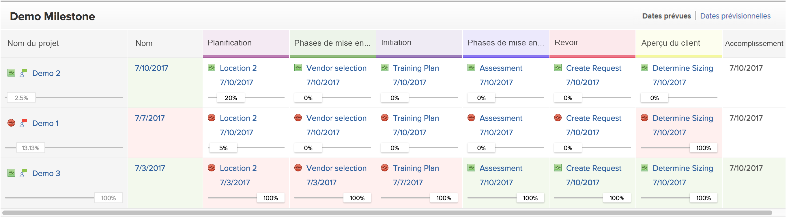

# Utilisation de la vue Milestone

Vous pouvez appliquer la vue Milestone à une liste de projets ou à un rapport.

Avant de pouvoir utiliser la vue du jalon, les jalons doivent être configurés, les chemins d’accès au jalon doivent être ajoutés aux projets et les jalons doivent être associés aux tâches, comme décrit dans les articles. [Création d’un chemin de jalon](../../../administration-and-setup/customize-workfront/configure-approval-milestone-processes/create-milestone-path.md) et [Associer des jalons à des tâches](../../../manage-work/tasks/manage-tasks/associate-milestones-with-tasks.md).

La vue Milestone est disponible lors de l’affichage d’une liste de projets ou d’un rapport de projet. Les sections suivantes décrivent comment afficher et utiliser la vue du jalon.

## Exigences d’accès

Vous devez disposer des accès suivants pour effectuer les étapes de cet article :

<table style="table-layout:auto"> 
 <col> 
 </col> 
 <col> 
 </col> 
 <tbody> 
  <tr> 
   <td role="rowheader"><strong>Formule Adobe Workfront*</strong></td> 
   <td> 
Tous
 </td> 
  </tr> 
  <tr> 
   <td role="rowheader"><strong>Licence Adobe Workfront*</strong></td> 
   <td> 
Travail ou plus élevé 
 </td> 
  </tr> 
  <tr> 
   <td role="rowheader"><strong>Paramétrages du niveau d'accès*</strong></td> 
   <td> 
Affichage ou accès supérieur à Reports, Dashboard, Calendriers
 
<b>NOTE</b>

Si vous n’avez toujours pas accès à , demandez à votre administrateur Workfront s’il définit des restrictions supplémentaires à votre niveau d’accès. Pour plus d’informations sur la façon dont un administrateur Workfront peut modifier votre niveau d’accès, voir <a href="../../../administration-and-setup/add-users/configure-and-grant-access/create-modify-access-levels.md" class="MCXref xref">Création ou modification de niveaux d’accès personnalisés</a>.
 </td>
</tr> 
  <tr> 
   <td role="rowheader"><strong>Autorisations d’objet</strong></td> 
   <td> 
Afficher les autorisations d’un rapport de projet pour appliquer la vue Milestone à un rapport
 
Pour plus d’informations sur la demande d’accès supplémentaire, voir <a href="../../../workfront-basics/grant-and-request-access-to-objects/request-access.md" class="MCXref xref">Demande d’accès aux objets </a>.
 </td> 
  </tr> 
 </tbody> 
</table>

&#42;Pour connaître le plan, le type de licence ou l’accès dont vous disposez, contactez votre administrateur Workfront.

## Basculer vers la vue Milestone {#switch-to-the-milestone-view}

1. Accédez à la liste des projets ou au rapport du projet qui contient les jalons que vous souhaitez afficher.
1. Cliquez sur le bouton **Affichage** menu déroulant, puis cliquez sur **Milestone**.

   La liste ou le rapport s’affiche dans une vue Milestone.

   Pour plus d’informations sur l’affichage du jalon, voir la section [Aperçu de la vue Milestone](#milestone-view-overview) dans cet article.

## Aperçu de la vue Milestone {#milestone-view-overview}

La vue Milestone est disponible dans les listes de projets et les rapports de projet. Cette vue vous permet d’afficher rapidement tous les jalons associés aux tâches dans les projets que vous visualisez.

>[!NOTE]
>
>La vue Milestone n’est pas disponible dans les zones suivantes :
>* Fiches horaires, dans la liste des projets lors de l’ajout d’un projet.

Pour plus d’informations sur la façon de passer à la vue Milestone, voir la section [Basculer vers la vue Milestone](#switch-to-the-milestone-view) dans cet article.

### Sections d’affichage Milestone

Lors de l’application de la vue Milestone à une liste de projets, les projets s’affichent dans les sections suivantes :

* Les projets associés à un chemin d’accès au jalon s’affichent en premier, répertoriés sous le nom de leurs chemins d’accès au jalon respectifs.

   Workfront trie les projets de la première section selon les critères suivants, dans cet ordre :

   1. ID de chemin jalonné. Vous pouvez afficher l’ID Chemin d’accès Milestone dans un rapport Chemin d’accès Milestone .

   2. Champ sélectionné comme premier champ de tri pour la liste des projets dans la vue précédemment appliquée à la liste des projets, avant de sélectionner la vue Jalon.

* Les projets qui ne sont pas associés à un chemin d’accès au programme d’évaluation s’affichent ensuite, dans la section Non affecté . Workfront trie les projets de la section Non affecté en fonction du champ sélectionné comme premier champ de tri pour la liste des projets dans la vue précédemment appliquée à la liste des projets, avant de sélectionner la vue Jalon.

### Informations sur le projet dans la vue Milestone

Lors de l’affichage d’une liste de projets ou d’un rapport de projet dans la vue Milestone, les informations suivantes sont disponibles :

* **Dates planifiées ou dates prévues :** Indiquez si vous souhaitez afficher les dates prévues ou les dates prévues dans la vue Jalon.\
   Les dates s’affichent pour le début et la fin, ainsi que pour chaque jalon dans le chemin du jalon.\
   Si vous affichez les dates planifiées et que vous avez également accès à l’option Gérer pour le projet, vous pouvez modifier les dates suivantes directement depuis la vue Jalon : (Si vous affichez les dates prévues, celles-ci ne peuvent pas être modifiées car les dates prévues sont calculées et ne peuvent pas être modifiées manuellement.)

   * **Dates de début du projet :** Si un projet est planifié à partir de la date de début, vous pouvez modifier manuellement la date de début du projet, puis la date de fin est calculée.
   * **Dates d’achèvement du projet :** Si un projet est planifié à partir de la date de fin, vous pouvez modifier manuellement la date de fin du projet, puis la date de début est calculée.
   * **Dates de fin de tâche :** Vous pouvez mettre à jour manuellement la fin des tâches directement à partir de la vue Milestone.

* **Pourcentage terminé :** Affiche le pourcentage d’achèvement de chaque tâche et projet.\
   Vous pouvez désactiver l’affichage du pourcentage d’achèvement, comme décrit dans la section . [Configuration des informations affichées dans la vue Milestone](#configure-what-information-displays-in-the-milestone-view) dans cet article.\
   Vous pouvez ajuster le pourcentage d’achèvement directement à partir de la vue Milestone, comme décrit dans la section . [Ajuster le pourcentage terminé pour les tâches dans la vue Milestone](#adjust-percent-complete-for-tasks-in-the-milestone-view) dans cet article.

* **Icônes d’état de la tâche :** Une icône d’état s’affiche en regard de chaque projet et tâche dans la vue Jalon.

   * À l’heure\
      

   * En retard\
      

   * En danger\
      

   * En retard\
      
   Vous pouvez désactiver l’affichage de ces icônes d’état, comme décrit dans la section . [Configuration des informations affichées dans la vue Milestone](#configure-what-information-displays-in-the-milestone-view) dans cet article.\
   Pour plus d’informations sur chaque type d’état, reportez-vous à l’article [Présentation de l’état de progression de la tâche](../../../manage-work/tasks/task-information/task-progress-status.md).

* **Ombrage de l’état de la tâche pour les tâches terminées**: Une fois qu’une tâche est marquée comme terminée, l’arrière-plan de la tâche est masqué dans la vue Milestone pour indiquer si la tâche a été terminée à temps ou en retard :

   * **Ombrage rouge pour la colonne de la tâche**: L’arrière-plan d’une tâche est rouge lorsque l’état de progression est **Tard**.

   * **Ombrage vert pour la colonne de la tâche**: L’arrière-plan d’une tâche est vert lorsque l’état de progression est **Heure d’activation**.

* **Ombrage de l’état du projet pour les colonnes Début et Fin du projet**:

   * **Colonne de début du projet**: L’arrière-plan de la colonne Début du projet est rouge ou vert uniquement lorsque la Date de début réelle est renseignée :

      * **Ombrage rouge de la colonne Début du projet**: L’arrière-plan de la colonne Début du projet est rouge lorsque l’état de progression du projet est **Tard**.

      * **Ombrage vert pour la colonne Début du projet**: L’arrière-plan de la colonne Début du projet est vert lorsque l’état de progression du projet est **Heure d’activation**.
   * **Colonne Fin du projet**: L’arrière-plan de la colonne Fin du projet est rouge ou vert uniquement lorsque la Date de fin réelle est renseignée :

      * **Ombrage rouge de la colonne Fin du projet**: L’arrière-plan de la colonne Fin du projet est rouge lorsque l’état de progression du projet est **Tard**.

      * **Ombrage vert de la colonne Fin du projet**: L’arrière-plan de la colonne Fin du projet est vert lorsque l’état de progression du projet est **Heure d’activation**.
   * Aucun ombrage colorimétrique n’est attribué aux colonnes Début et Fin lorsque l’état de progression des tâches est En danger ou Derrière.

   

* **Nom du projet**: Le nom du projet s’affiche avec un lien vers le projet.
* **Icône Condition de projet**: Une icône s’affiche en regard du nom du projet, indiquant la condition du projet.

## Configuration des informations affichées dans la vue Milestone {#configure-what-information-displays-in-the-milestone-view}

Vous pouvez configurer l’affichage des éléments suivants dans la vue Milestone :

* Icônes d’état de progression
* Pourcentage d’achèvement des projets et des tâches

Par défaut, les icônes d’état du projet et le pourcentage de réalisation des projets s’affichent.

Toute modification apportée à ces options ne s’applique qu’à vous ; les autres utilisateurs ne sont pas affectés. Les modifications que vous apportez sont conservées la prochaine fois que vous vous connectez à Adobe Workfront.

Pour configurer l’affichage des icônes d’état du projet et du pourcentage d’achèvement des projets :

1. Accédez à la liste des projets ou au rapport du projet qui contient les jalons que vous souhaitez afficher.
1. Cliquez sur le bouton **Affichage** menu déroulant, puis cliquez sur **Milestone**.\
   Si vous affichez une liste de projets dans un Portfolio ou un programme, sélectionnez la variable **Milestone** sous-onglet.

1. Cliquez sur **Options** dans le coin supérieur droit de la vue Milestone.\
   

1. Sélectionnez l’une des options suivantes :

   <table style="table-layout:auto"> 
    <col> 
    <col> 
    <tbody> 
     <tr> 
      <td role="rowheader">Statut de progression</td> 
      <td> 
Sélectionnez cette option pour afficher les icônes d’état de progression en regard de chaque projet et tâche.
 
Cette option est activée par défaut.
 </td> 
     </tr> 
     <tr> 
      <td role="rowheader">Pourcentage d'achèvement</td> 
      <td> 
Sélectionnez cette option pour afficher le pourcentage d’achèvement en regard de chaque projet et tâche.
 
Cette option est activée par défaut.
 </td> 
     </tr> 
    </tbody> 
   </table>

## Ajuster le pourcentage terminé pour les tâches dans la vue Milestone {#adjust-percent-complete-for-tasks-in-the-milestone-view}

Vous pouvez ajuster le pourcentage terminé pour les tâches dans la vue Jalon. Vous ne pouvez pas ajuster le pourcentage terminé pour une tâche parent (une tâche qui contient des sous-tâches).

Pour ajuster le pourcentage de réalisation d’une tâche dans la vue Jalon :

1. Accédez à la liste des projets ou au rapport du projet qui contient les jalons que vous souhaitez afficher.
1. Cliquez sur le bouton **Affichage** menu déroulant, puis cliquez sur **Milestone**.

1. (Conditionnel) Si les pourcentages d’achèvement ne s’affichent pas actuellement dans la vue Milestone, cliquez sur **Options** dans le coin supérieur droit de la vue Milestone, assurez-vous que **Pourcentage terminé** est activée.

1. Cliquez sur le pourcentage d’achèvement sous une tâche, indiquez un nouveau pourcentage, puis appuyez sur Entrée.
