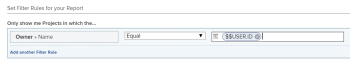

# Utilisation de caractères génériques basés sur l’utilisateur pour généraliser des rapports

Vous pouvez généraliser un rapport en utilisant des caractères génériques au lieu d’informations spécifiques lors de la création de certains éléments de rapport. Par exemple, si vous souhaitez créer un rapport qui affiche les tâches affectées à un utilisateur spécifique, vous pouvez utiliser son nom dans le champ Affecté à du filtre. Cependant, si vous souhaitez créer un rapport qui affiche les tâches assignées à l’utilisateur connecté, quel que soit l’utilisateur, vous pouvez utiliser un caractère générique qui indique que lorsqu’un utilisateur consulte le rapport, il affiche uniquement les informations le concernant. Ainsi, vous générez le rapport une seule fois, mais comme vous utilisez un caractère générique dans le filtre, il produit des résultats différents chaque fois qu’une autre personne le lit.

Vous pouvez utiliser des caractères génériques basés sur l’utilisateur lors de la création des éléments de création de rapports suivants :

* Filtres
* Etapes personnalisées
* Affichages lors de l’ajout de règles pour les colonnes

## Exigences d’accès

Vous devez disposer des accès suivants pour effectuer les étapes de cet article :

<table style="table-layout:auto"> 
 <col> 
 <col> 
 <tbody> 
  <tr> 
   <td role="rowheader"><strong>Formule Adobe Workfront*</strong></td> 
   <td> 
Tous
 </td> 
  </tr> 
  <tr> 
   <td role="rowheader"><strong>Licence Adobe Workfront*</strong></td> 
   <td> 
Plan 
 </td> 
  </tr> 
  <tr> 
   <td role="rowheader"><strong>Paramétrages du niveau d'accès*</strong></td> 
   <td> 
Modifier l’accès aux filtres, vues et groupes
 
Modification de l’accès aux rapports, tableaux de bord et calendriers pour la modification des éléments de rapport dans un rapport
 
Remarque : Si vous n’avez toujours pas accès à , demandez à votre administrateur Workfront s’il définit des restrictions supplémentaires à votre niveau d’accès. Pour plus d’informations sur la façon dont un administrateur Workfront peut modifier votre niveau d’accès, voir <a href="../../../administration-and-setup/add-users/configure-and-grant-access/create-modify-access-levels.md" class="MCXref xref">Création ou modification de niveaux d’accès personnalisés</a>.
 </td> 
  </tr> 
  <tr> 
   <td role="rowheader"><strong>Autorisations d’objet</strong></td> 
   <td> 
Gérer les autorisations d’un rapport pour modifier les éléments de rapport dans un rapport
 
Gérer les autorisations d’un affichage ou d’un filtre pour les modifier
 
Pour plus d’informations sur la demande d’accès supplémentaire, voir <a href="../../../workfront-basics/grant-and-request-access-to-objects/request-access.md" class="MCXref xref">Demande d’accès aux objets </a>.
 </td> 
  </tr> 
 </tbody> 
</table>

&#42;Pour connaître le plan, le type de licence ou l’accès dont vous disposez, contactez votre administrateur Workfront.

## Conditions préalables

Vous devez créer un rapport avant d’y ajouter une variable de caractère générique.

Pour plus d’informations sur la création de rapports, voir [Créer un rapport](../../../reports-and-dashboards/reports/creating-and-managing-reports/create-report.md).

## Étapes pratiques

Pour insérer un caractère générique (générique) basé sur l’utilisateur dans un rapport :

1. Accédez à un rapport pour lequel vous souhaitez insérer un caractère générique (générique) basé sur l’utilisateur.
1. Cliquez sur **Actions de rapport**, puis **Modifier**.

1. Cliquez sur le bouton **Filtres** .
1. Cliquez sur **Ajouter une règle de filtre**.
1. Commencez à saisir le nom du champ en fonction duquel vous souhaitez filtrer les données.\
   Vous devez saisir des champs qui font référence à l’objet utilisateur ou des informations sur les utilisateurs.
1. Sélectionner **Égal** dans le menu déroulant de la variable de filtre.

   >[!TIP]
   >
   >Vous devez toujours sélectionner la variable **Égal** filtre lors de l’utilisation de caractères génériques dans Adobe Workfront.

1. Dans le **Commencez à saisir le nom ...** box, saisissez : `$$USER.ID` ou `$$USER.name` si vous souhaitez que le rapport affiche des informations sur l’utilisateur qui se connecte, en fonction de son nom. Vous pouvez insérer d’autres caractères génériques qui font référence au groupe, à l’équipe, à la société ou à d’autres informations de l’utilisateur connecté.

   Pour obtenir la liste complète des caractères génériques basés sur l’utilisateur, voir [Variables de filtre génériques](../../../reports-and-dashboards/reports/reporting-elements/understand-wildcard-filter-variables.md).

   

1. Cliquez sur **Enregistrer + Fermer**.

## Informations supplémentaires

Voir aussi :

* [Programme de création de rapports de base](https://one.workfront.com/s/basic-report-creation-program)
* [Variables de filtre génériques](../../../reports-and-dashboards/reports/reporting-elements/understand-wildcard-filter-variables.md)
* [Création ou modification de filtres dans Adobe Workfront](../../../reports-and-dashboards/reports/reporting-elements/create-filters.md)
* [Présentation des filtres dans Adobe Workfront](../../../reports-and-dashboards/reports/reporting-elements/filters-overview.md)
* [Ajout d’une invite à un rapport](../../../reports-and-dashboards/reports/creating-and-managing-reports/add-prompt-report.md)
* [Utilisation d’une mise en forme conditionnelle dans les vues](../../../reports-and-dashboards/reports/reporting-elements/use-conditional-formatting-views.md)
