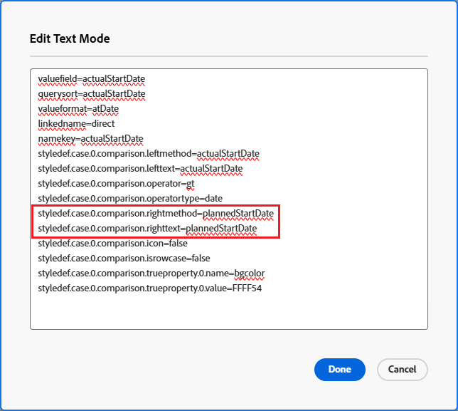

# Comparer des champs dans la mise en forme conditionnelle

<!-- Audited: 1/2025 -->

Vous pouvez utiliser la mise en forme conditionnelle pour comparer deux champs différents dans une vue et les mettre en évidence lorsque certains critères sont remplis entre les champs.

## Conditions d’accès

+++ Développez pour afficher les exigences d’accès aux fonctionnalités de cet article.

Vous devez disposer des éléments suivants :

<table style="table-layout:auto"> 
 <col> 
 <col> 
 <tbody> 
  <tr> 
   <td role="rowheader">Formule Adobe Workfront</td> 
   <td> <p>Tous</p> </td> 
  </tr> 
  <tr> 
   <td role="rowheader">Licence Adobe Workfront</td> 
   <td> 
      <p>Nouveau :</p>
         <ul>
         <li><p>Standard</p></li>
         </ul>
      <p>Actuel :</p>
         <ul>
         <li><p>Plan</p></li>
         </ul>
   </td> 
  </tr> 
  <tr> 
   <td role="rowheader">Configurations des niveaux d’accès</td> 
   <td> <p>Modifier l’accès aux filtres, vues et groupes</p> <p>Modifier l’accès aux rapports, tableaux de bord et calendriers pour modifier la vue d’un rapport.</p></td> 
  </tr> 
  <tr> 
   <td role="rowheader">Autorisations d’objet</td> 
   <td> <p>Autorisations Gérer pour un rapport pour en modifier la vue</p> <p>Gérer les autorisations pour une vue</p></td> 
  </tr> 
 </tbody> 
</table>

Pour plus d’informations, voir [Conditions d’accès requises dans la documentation Workfront](/help/quicksilver/administration-and-setup/add-users/access-levels-and-object-permissions/access-level-requirements-in-documentation.md).

+++

## Exemple : comparer la date de début effective et la date de début prévue

Par exemple, si la date de début effective d’une tâche est postérieure à la date de début prévue, vous pouvez mettre en évidence la colonne Date de début prévue à l’aide de la mise en forme conditionnelle.

Pour comparer la date de début prévue et la date de début effective d’une tâche à l’aide de la mise en forme conditionnelle, procédez comme suit :

1. Accédez à une vue de tâche ou à un rapport.
1. (Conditionnel) Si vous utilisez un rapport, dans l’onglet **Colonnes (Affichage)** de l’éditeur de rapports, cliquez sur l’en-tête de la colonne à mettre en forme de manière conditionnelle pour la sélectionner.\
   Par exemple, sélectionnez la colonne **Date de début effective** si vous souhaitez y ajouter la mise en forme conditionnelle en comparant les champs Date de début prévue et Date de début effective.

1. Cliquez sur **Options avancées**, puis sur **Ajouter une règle pour cette colonne**.

1. Saisissez les critères de comparaison en utilisant les valeurs existantes trouvées dans le créateur et spécifiez votre formatage conditionnel.\
   Par exemple, nous voulons mettre en évidence les tâches dont la date de début effective est postérieure (ou supérieure) à la date de début prévue. Sélectionnez le modificateur Supérieur à et sélectionnez une date effective dans le champ de la date.

   

1. (Facultatif) Sélectionnez **Appliquer à toute la ligne** si vous souhaitez appliquer la mise en forme à l’ensemble de la ligne.
1. Cliquer sur **Enregistrer**.

1. Sélectionnez la colonne **Date de début effective**, puis cliquez sur **Basculer en mode texte**.

1. Cliquez sur **Modifier le mode texte**, puis ajoutez la ligne de texte suivante :

   ```
   styledef.case.0.comparison.rightmethod= <field to compare>
   ```

   Dans notre exemple :

   ```
   styledef.case.0.comparison.rightmethod=plannedStartDate
   ```

   >[!NOTE]
   >
   >Si vous comparez un champ natif de Workfront, utilisez la syntaxe camel case pour le nom du champ. Si vous comparez un champ personnalisé, utilisez **DE:Actual Name of the Field** pour le champ de nom que vous comparez au premier champ.\
   >Par exemple, si vous comparez le champ **Date de début effective** avec un champ personnalisé intitulé **Date de diffusion**, ajoutez la déclaration suivante dans votre code en mode texte :
   >
   >`styledef.case.0.comparison.rightmethod=DE:Delivery Date`

1. Assurez-vous que la ligne de code `righttext` correspond à la déclaration de la ligne de code `rightmethod`.

   

1. Cliquer sur **Enregistrer**.
1. Cliquez sur **Enregistrer + Fermer**.

   La colonne met en évidence les champs qui répondent à vos critères.
