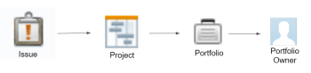
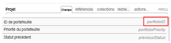

# Créer des filtres de mode Texte complexes à l’aide d’instructions EXISTS

<!-- Audited: 01/2025 -->

<!--
<p data-mc-conditions="QuicksilverOrClassic.Draft mode">(NOTE: do not EVER&nbsp;delete this article as long as Text Mode still exists in the system.&nbsp;Google ordered this article to be written and we wrote it with the help of consultants, so the use case is very complex and very hard to understand without this. It is also very much used by many customers)</p>
-->

<!--
<p data-mc-conditions="QuicksilverOrClassic.Draft mode">(NOTE:&nbsp;Alina: **~ Replace screen shot of icons when list/ reporting UI changes)</p>
-->

>[!IMPORTANT]
>
>Cet article nécessite une compréhension approfondie de l’API Adobe Workfront et de l’interface de création de rapports en mode Texte. Pour plus d’informations sur l’API Workfront, voir [Principes de base des API](../../../wf-api/general/api-basics.md).\
>Pour plus d’informations sur l’utilisation du mode texte, voir [Vue d’ensemble du mode texte](../../../reports-and-dashboards/reports/text-mode/understand-text-mode.md).

## Vue d’ensemble des relations d’objets dans Workfront

Tous les objets sont liés à d’autres objets de la base de données Workfront.

La compréhension de la hiérarchie et de l’interdépendance des objets permet de déterminer les objets qui peuvent être référencés dans les rapports.

Pour plus d’informations sur les objets de Workfront et sur leur hiérarchie et leur interdépendance, voir [Vue d’ensemble des objets Adobe Workfront](../../../workfront-basics/navigate-workfront/workfront-navigation/understand-objects.md).

Lors de la création de filtres, vous pouvez référencer d’autres objets connectés à l’objet du filtre dans un rapport allant jusqu’à 2 niveaux à l’aide de l’interface de création de rapports standard.

Par exemple, vous pouvez référencer l’identifiant de portfolio dans un filtre de problèmes pour afficher uniquement les problèmes sur les projets associés à un certain portfolio à l’aide de l’interface standard. Dans ce cas, le portfolio est à 2 niveaux des problèmes.

Cependant, vous ne pouvez pas référencer la personne propriétaire du portfolio dans un filtre de problèmes à l’aide de l’interface standard pour afficher uniquement les problèmes provenant de projets associés à des portfolios dont la personne propriétaire est un utilisateur ou un e utilisatrice spécifique. Vous devez utiliser le mode Texte pour accéder au champ Nom de la personne propriétaire du portfolio, qui se trouve à trois niveaux des problèmes.



Pour obtenir la liste complète des objets dans Workfront, voir l’[Explorateur d’API](../../../wf-api/general/api-explorer.md).

Pour plus d’informations sur la navigation dans l’explorateur d’API et la recherche d’objets, voir [Utiliser l’explorateur d’API](../../../wf-api/general/using-api-explorer.md).

Lors de la création de filtres, vous devez créer des instructions complexes dans l’interface du mode Texte pour référencer ces types d’objets.

Pour plus d’informations sur la création de filtres complexes, voir [Vue d’ensemble des filtres de mode Texte complexes qui utilisent des instructions EXISTS](#overview-of-complex-text-mode-filters-that-use-exists-statements) de cet article.

## Vue d’ensemble des filtres de mode Texte complexes qui utilisent des instructions EXISTS {#overview-of-complex-text-mode-filters-that-use-exists-statements}

Tenez compte des points suivants lors de la création de filtres qui s’étendent sur plusieurs niveaux dans la hiérarchie d’objets ou qui filtrent les objets manquants :

* Vous devez créer des filtres complexes lorsque vous souhaitez référencer des objets qui ne sont pas directement connectés à l’objet de filtre.
* Vous devez utiliser une instruction EXISTS pour effectuer les opérations suivantes :

   * Créer des filtres qui s’étendent sur plusieurs niveaux.
   * Créer des filtres qui recherchent les objets manquants.\
     Par exemple, lors de la création d’un rapport d’utilisateur ou d’utilisatrice, vous pouvez filtrer les personnes qui n’ont pas consigné de temps pendant une certaine période.

Tenez compte des règles suivantes lors de l’utilisation d’instructions EXISTS dans un filtre :

* Vous pouvez référencer trois objets dans un filtre EXISTS :

   * Objet du filtre (objet original).
   * Objet dont vous souhaitez référencer le champ (objet cible).
   * Objet qui connecte les objets originaux et cibles s’ils ne sont pas directement connectés les uns aux autres (objet de liaison).

* Les filtres qui utilisent EXISTS contiennent deux instructions distinctes liées par un signe égal :

   * L’instruction précédant le signe égal fait référence à l’objet auquel vous faites référence (la liaison ou l’objet cible).
   * L’instruction située après le signe égal fait référence à l’objet à partir duquel vous faites référence (l’objet d’origine).

* Vous devez utiliser le code d’objet de l’objet de liaison pour connecter vos instructions.\
  Vous trouverez le code d’objet de tous les objets dans l’explorateur d’API.\
  Pour plus d’informations sur l’explorateur d’API, voir [Explorateur d’API](../../../wf-api/general/api-explorer.md).

* Lorsqu’un objet de liaison est manquant car les objets d’origine et cibles sont directement connectés les uns aux autres, vous pouvez utiliser le code d’objet de l’objet cible au lieu de l’objet de liaison.
* Vous pouvez faire référence à plusieurs champs (champs cibles) sur le même objet (objet cible), auquel cas vous devez connecter les lignes faisant référence aux champs par AND.\
  Pour un exemple de filtrage de plusieurs champs appartenant à l’objet cible, reportez-vous à la section [Exemple 4 : filtrer par plusieurs champs : tâches par nom de propriétaire du portfolio et ID de la carte de performance d’alignement des portfolios](#example-4-filter-by-multiple-fields-tasks-by-portfolio-owner-name-and-portfolio-alignment-scorecard-id) dans cet article.

* Le seul modificateur pris en charge pour une instruction EXISTS est NOTEXISTS.

## Conditions d’accès

+++ Développez pour afficher les exigences d’accès aux fonctionnalités de cet article.

Vous devez disposer des éléments suivants :

<table style="table-layout:auto"> 
 <col> 
 <col> 
 <tbody> 
  <tr> 
   <td role="rowheader">Formule Adobe Workfront</td> 
   <td> <p>Tous</p> </td> 
  </tr> 
  <tr> 
   <td role="rowheader">Licence Adobe Workfront</td> 
   <td> 
      <p>Nouveau :</p>
         <ul>
         <li><p>Standard</p></li>
         </ul>
      <p>Actuel :</p>
         <ul>
         <li><p>Plan</p></li>
         </ul>
   </td> 
  </tr> 
  <tr> 
   <td role="rowheader">Configurations des niveaux d’accès</td> 
   <td> <p>Modifier l’accès aux filtres, vues et groupes</p> <p>Modifier l’accès aux rapports, tableaux de bord et calendriers pour modifier les filtres dans un rapport</p></td> 
  </tr> 
  <tr> 
   <td role="rowheader">Autorisations d’objet</td> 
   <td> <p>Gérer les autorisations d’un rapport pour modifier des filtres dans un rapport</p> <p>Gérer les autorisations d’un filtre pour le modifier</p></td> 
  </tr> 
 </tbody> 
</table>

Pour plus d’informations, voir [Conditions d’accès requises dans la documentation Workfront](/help/quicksilver/administration-and-setup/add-users/access-levels-and-object-permissions/access-level-requirements-in-documentation.md).

+++

## Créer des filtres en mode texte complexes qui couvrent plusieurs niveaux dans la hiérarchie d’objets

<!--
<p data-mc-conditions="QuicksilverOrClassic.Draft mode">(NOTE: Alina: ***[This information is somewhat duplicated from the section below: Create Text-Mode Filters for Missing Objects])</p>
-->

Vous pouvez créer un filtre qui référence des objets sur plusieurs niveaux de la hiérarchie d’objets dans laquelle l’objet de filtre existe. Par exemple, vous pouvez créer un filtre de problèmes pour les problèmes concernant des projets qui ne sont pas associés à un certain ou à une certaine propriétaire du portfolio.

Vous devez toujours utiliser une instruction EXISTS et l’interface du mode texte pour créer ce filtre.

Pour obtenir des exemples de filtres, voir la section [Exemple 1 : filtre des problèmes par nom de propriétaire du portfolio](#example-1-filter-for-issues-by-portfolio-owner-name) dans cet article.

Pour créer un filtre qui couvre plusieurs niveaux dans la hiérarchie d’objets :

1. Identifiez l’objet de votre filtre. Nous appelons cet objet, l’objet d’origine.\
   Par exemple, Problème.

1. Identifiez le champ en fonction duquel vous souhaitez filtrer les données. Nous appelons cet objet le champ cible qui appartient à un objet cible.\
   Par exemple, le champ ownerID (champ cible) qui appartient à Portfolio (objet cible).

1. (Le cas échéant) Si l’objet d’origine (Problème) et le champ cible (ownerID) ne sont pas directement connectés l’un à l’autre, vous devez trouver un troisième objet, un objet de liaison (Projet) qui les connecte. L’objet de liaison doit comporter au moins un champ qui est référencé à partir des onglets Champs ou Références de l’objet d’origine (champ de liaison affiché sur l’objet d’origine). Il doit également comporter un champ de liaison vers l’objet cible affiché dans les onglets Champs ou Références de l’objet de liaison. Le champ Liaison vers l’objet cible qui s’affiche sur l’objet de liaison (ou le champ de liaison affiché sur l’objet de liaison) doit correspondre au champ cible.

   Par exemple, l’ID (Projet) (champ de liaison affiché sur l’objet d’origine) est référencé à partir de Problèmes (objet d’origine). (Portfolio) ownerID (champ de liaison à l’objet cible) s’affiche dans l’onglet Champs du projet (objet de liaison). L’ownerID du portfolio est également un champ de l’objet cible (Portfolio). Le champ de liaison de l’objet de liaison correspond au champ cible.\
   

1. À l’aide de l’explorateur d’API, identifiez la variable **Code objet** de l’objet de liaison (Projet).\
   Par exemple, le code d’objet du projet est PROJ.\
   

1. Créez un filtre pour l’objet d’origine.\
   Par exemple, créez un filtre de problèmes.\
   Pour plus d’informations sur la création de filtres, voir [Présentation des filtres](../../../reports-and-dashboards/reports/reporting-elements/filters-overview.md).

1. Cliquez sur **Passer en mode texte** puis **Modifier le mode texte**.
1. Collez l’exemple de formule suivant dans l’interface du mode texte du nouveau filtre et remplacez le texte de l’exemple par les objets et les champs appropriés :

   ```
   EXISTS:A:$$OBJCODE=<Object code of the Linking Object>
   EXISTS:A:<Linking Field on the Linking Object>=FIELD:<Linking Field displayed on the Original Object>
   EXISTS:A:<Target Object>:<Target Field>=<Your value for the Target Field>
   ```

   Pour un exemple utilisant les champs que nous avons identifiés ci-dessus, voir la section [Exemple 1 : filtre des problèmes par nom de propriétaire du portfolio](#example-1-filter-for-issues-by-portfolio-owner-name) dans cet article.

1. Cliquez sur **Enregistrer le filtre**.

## Créer des filtres en mode texte complexes pour les objets manquants

<!--
<p data-mc-conditions="QuicksilverOrClassic.Draft mode">(NOTE: Alina: **^[This information is somewhat duplicated from the section above: Create Text-Mode Filters that Span Multiple Levels in the Object Hierarchy])</p>
-->

Vous pouvez créer un filtre qui référence les objets manquants. Par exemple, vous pouvez créer un filtre utilisateur qui affiche les personnes pour lesquelles aucune heure n’est consignée dans Workfront.

Vous devez toujours utiliser une instruction *EXISTS* et l’interface du mode texte pour créer ce filtre.

Pour obtenir des exemples de filtres pour les objets manquants, voir les sections suivantes de cet article :

* [Exemple 2 : filtrer les objets manquants : champs personnalisés qui n’apparaissent dans aucun formulaire personnalisé.](#example-2-filter-for-missing-objects-custom-fields-that-do-not-appear-in-any-custom-forms)
* [Exemple 3 : filtre pour les objets manquants : personnes qui n’ont pas consigné de temps pendant une certaine période](#example-3-filter-for-missing-objects-users-who-did-not-log-time-for-a-certain-period-of-time)

Pour créer un filtre qui référence les objets manquants :

1. Identifiez l’objet de votre filtre. Nous appelons cet objet, l’objet d’origine.\
   Par exemple, Champ personnalisé ou Champ de paramètres.

1. Identifiez le champ en fonction duquel vous souhaitez filtrer les données. Nous appelons cet objet le champ cible qui appartient à un objet cible.\
   Par exemple, le champ categoryID (champ cible), qui appartient à la Catégorie (objet cible).

1. Puisque l’objet d’origine (paramètre) et le champ cible (categoryID) ne sont pas directement connectés l’un à l’autre, vous devez trouver un troisième objet, un objet de liaison (un paramètre de catégorie), qui les connecte. L’objet de liaison doit comporter au moins un champ qui est référencé à partir des onglets Champs ou Références de l’objet d’origine (champ de liaison affiché sur l’objet d’origine). Il doit également comporter un champ de liaison vers l’objet cible affiché dans les onglets Champs ou Références de l’objet de liaison. Le champ Liaison vers l’objet cible qui s’affiche sur l’objet de liaison (ou le champ de liaison affiché sur l’objet de liaison) doit correspondre au champ cible.

   Par exemple, l’identifiant du paramètre de catégorie (champ de liaison affiché sur l’objet d’origine) est référencé à partir du paramètre (objet d’origine). parameterID (liaison de champ à l’objet cible) s’affiche dans l’onglet Champs du paramètre de catégorie (objet de liaison). Le champ Liaison à l’objet cible qui s’affiche sur l’objet de liaison correspond au champ cible.

1. À l’aide de l’explorateur d’API, identifiez le **Code objet** de l’objet de liaison (paramètre de catégorie).\
   Par exemple, le code d’objet pour le paramètre Catégorie est CTGYPA.\
   

1. Créez un filtre pour l’objet d’origine.\
   Par exemple, créez un filtre Paramètre.\
   Pour plus d’informations sur la création de filtres, voir [Vue d’ensemble des filtres](../../../reports-and-dashboards/reports/reporting-elements/filters-overview.md).

1. Cliquez sur **Passer en mode texte** puis **Modifier le mode texte**.
1. (Le cas échéant) Si vous filtrez les objets manquants, collez l’exemple de formule suivant dans l’interface du mode Texte du nouveau filtre et remplacez le texte d’exemple par les objets et les champs appropriés :

   ```
   EXISTS:A:$$OBJCODE=<Object code of the Linking Object>
   EXISTS:A:<Linking Field displayed on the Linking Object>=FIELD:<Linking Field displayed on the Original Object>
   EXISTS:A:$$EXISTSMOD=NOTEXISTS
   ```

   Pour un exemple de création de rapports sur les champs personnalisés qui ne sont pas associés aux formulaires personnalisés, reportez-vous à la section [Exemple 2 : filtrer les objets manquants : champs personnalisés qui n’apparaissent dans aucun formulaire personnalisé](#example-2-filter-for-missing-objects-custom-fields-that-do-not-appear-in-any-custom-forms) dans cet article.

1. Cliquez sur **Enregistrer le filtre**.

## Exemples de filtres de mode Texte s’étendant sur plusieurs niveaux dans la hiérarchie d’objets

Utilisez ces exemples pour créer des filtres de mode Texte avec des instructions EXISTS.

### Exemple 1 : filtre pour les problèmes par nom de propriétaire du portfolio {#example-1-filter-for-issues-by-portfolio-owner-name}

À l’aide de l’interface du mode Texte, vous pouvez créer un filtre pour une liste de problèmes afin d’afficher uniquement les problèmes qui concernent des projets associés à un portfolio dont la personne propriétaire est un utilisateur ou une utilisatrice spécifique.

Pour filtrer les problèmes selon le nom de la personne propriétaire du portfolio :

1. Créez un filtre de problème.\
   Pour plus d’informations sur la création de filtres, voir [Vue d’ensemble des filtres](../../../reports-and-dashboards/reports/reporting-elements/filters-overview.md).

1. Cliquez sur **Passer en mode texte** puis **Modifier le mode texte**.
1. Reportez-vous au code générique suivant :

   ```
   EXISTS:A:$$OBJCODE=<Object code of the Linking Object>
   EXISTS:A:<Linking Field on the Linking Object>=FIELD:<Linking Field displayed on the Original Object>
   EXISTS:A:<Target Object>:<Target Field>=<Your value for the Target Field>
   ```

1. Collez le code suivant dans la zone **Définir des règles de filtrage pour votre rapport** pour remplacer le code générique ci-dessus :

   ```
   EXISTS:A:$$OBJCODE=PROJ
   EXISTS:A:ID=FIELD:projectID
   EXISTS:A:portfolio:ownerID=4d94d7da001699b19edf50de15682221
   ```

   >[!NOTE]
   >
   >* L’objet d’origine est l’objet du rapport, Problème.
   >* L’objet cible est Portfolio.
   >* L’objet de liaison est Projet.
   >* Le champ cible et le champ de liaison à l’objet cible référencé à partir de l’objet de liaison sont ownerID.
   >* Le code objet de l’objet de liaison ici est PROJ.
   >* Le champ de liaison affiché sur l’objet d’origine est projectID et le champ de liaison est ID.

1. Remplacez la valeur du champ cible (ownerID) dans la dernière instruction par un identifiant utilisateur ou utilisatrice de votre environnement.
1. Cliquez sur **Enregistrer le filtre**.

### Exemple 2 : filtrer les objets manquants : champs personnalisés qui n’apparaissent dans aucun formulaire personnalisé {#example-2-filter-for-missing-objects-custom-fields-that-do-not-appear-in-any-custom-forms}

À l’aide de l’interface du mode texte, vous pouvez créer un filtre afin d’afficher les champs personnalisés (paramètres) qui ne sont pas associés aux formulaires personnalisés (catégories). Ce filtre lie les paramètres aux catégories, qui sont connectées via un autre objet, le paramètre de catégorie. Comme les deux champs ne sont pas directement connectés les uns aux autres et que vous filtrez les informations manquantes, vous devez utiliser une instruction EXISTS.

>[!IMPORTANT]
>
>Un paramètre est un champ tel qu’il existe dans la bibliothèque de champs référencée dans un formulaire personnalisé. Un paramètre de catégorie est la version d’un champ qui apparaît sur un formulaire spécifique. Par exemple, si le même champ apparaît sur 5 formulaires, il y aura 1 paramètre et 5 paramètres de catégorie dans la base de données Workfront.

Pour filtrer les champs personnalisés qui ne sont pas associés à un formulaire personnalisé :

1. Créez un filtre Paramètre ou Champ personnalisé.\
   Pour plus d’informations sur la création de filtres, voir [Vue d’ensemble des filtres](../../../reports-and-dashboards/reports/reporting-elements/filters-overview.md).

1. Cliquez sur **Passer en mode texte** puis **Modifier le mode texte**.
1. Reportez-vous au code générique suivant :

   ```
   EXISTS:A:$$OBJCODE=<Object code of the Linking Object>
   EXISTS:A:<Linking Field displayed on the Linking Object>=FIELD:<Linking Field displayed on the Original Object>
   EXISTS:A:$$EXISTSMOD=NOTEXISTS
   ```

1. Collez le code suivant dans la zone **Définir des règles de filtrage pour votre rapport** pour remplacer le code générique ci-dessus :

   ```
   EXISTS:A:$$OBJCODE=CTGYPA
   EXISTS:A:parameterID=FIELD:ID
   EXISTS:A:$$EXISTSMOD=NOTEXISTS
   ```

   >[!NOTE]
   >
   >* L’objet d’origine est l’objet du rapport, Paramètre.
   >* L’objet cible est Catégorie.
   >* L’objet de liaison est Paramètre de catégorie.
   >* Le code objet de l’objet de liaison est CTGYPA.
   >* Le champ Lier à l’objet cible est parameterID, car parameterID existe à la fois dans le tableau Objet de liaison et dans le tableau Objet cible.
   >* Le champ de liaison affiché sur l’objet d’origine est l’identifiant (du paramètre de catégorie).

1. Cliquez sur **Enregistrer le filtre**.

### Exemple 3 : filtre pour les objets manquants : personnes qui n’ont pas consigné de temps pendant une certaine période {#example-3-filter-for-missing-objects-users-who-did-not-log-time-for-a-certain-period-of-time}

À l’aide de l’interface du mode Texte, vous pouvez créer un filtre afin d’afficher les personnes qui n’ont pas consigné de temps pendant une certaine période. Ce filtre lie les personnes aux heures, qui sont directement connectées les unes aux autres. Cependant, vous devez utiliser une instruction EXISTS et l’interface du mode Texte pour pouvoir filtrer les informations manquantes.

Pour filtrer les personnes qui n’ont pas consigné de temps au cours de la semaine précédente :

1. Créee un filtre utilisateur ou utilisatrice.\
   Pour plus d’informations sur la création de filtres, voir [Vue d’ensemble des filtres](../../../reports-and-dashboards/reports/reporting-elements/filters-overview.md).

1. Cliquez sur **Passer en mode texte** puis **Modifier le mode texte**.
1. Reportez-vous au code générique suivant :

   ```
   EXISTS:A:$$OBJCODE=<Object code of the Linking Object>
   EXISTS:A:<Linking Field displayed on the Linking Object>=FIELD:<Linking Field displayed on the Original Object>
   EXISTS:A:$$EXISTSMOD=NOTEXISTS
   ```

1. Collez le code suivant dans la zone **Définir des règles de filtrage pour votre rapport** pour remplacer le code générique ci-dessus :

   ```
   EXISTS:A:$$OBJCODE=HOUR
   EXISTS:A:ownerID=FIELD:ID
   EXISTS:A:entryDate=$$TODAYb-1w
   EXISTS:A:entryDate_Range=$$TODAYe-1w
   EXISTS:A:entryDate_Mod=between
   EXISTS:A:$$EXISTSMOD=NOTEXISTS
   ```

   >[!NOTE]
   >
   >* L’objet d’origine est l’objet du rapport, Utilisateur ou utilisatrice.
   >* L’objet cible est Heure.
   >* Dans cet exemple, vous n’avez pas besoin d’objet de liaison, car les personnes et les heures sont directement connectées dans la base de données Workfront.
   >* Puisqu’il n’existe aucun objet de liaison, vous devez utiliser le code d’objet de l’objet cible : HEURE.
   >* Le champ de liaison à l’objet cible est ownerID (qui s’affiche sur l’objet d’origine ; l’objet de liaison est manquant).
   >* Le champ de liaison affiché sur l’objet d’origine est l’identifiant (de l’heure) (qui s’affiche sur l’objet cible ; l’objet de liaison est manquant).
   >* L’instruction EXISTS:A:entryDate fait référence aux champs qui définissent l’objet cible (heure) et qui utilisent la même syntaxe que dans une instruction de filtre ordinaire. Vous affichez ainsi uniquement les personnes qui n’ont pas consigné de temps pendant une période spécifique, dans ce cas la semaine précédente.
   >* Le modificateur NOTEXISTS indique que nous recherchons des éléments (heures) qui n’existent pas pour l’objet du rapport (personnes).

1. Cliquez sur **Enregistrer le filtre**.

### Exemple 4 : filtrer par plusieurs champs : tâches par nom de propriétaire du portfolio et ID de la carte de performance d’alignement des portfolios {#example-4-filter-by-multiple-fields-tasks-by-portfolio-owner-name-and-portfolio-alignment-scorecard-id}

À l’aide de l’interface du mode Texte, vous pouvez créer un filtre qui fait référence à plusieurs champs de l’objet cible. Dans ce cas, les instructions de filtre qui font référence aux champs cibles doivent être connectées par AND.

Par exemple, vous pouvez filtrer une liste de tâches afin de n’afficher que les tâches qui répondent aux critères suivants :

* Elles se trouvent sur un projet associé à un portfolio dont la personne propriétaire est un utilisateur ou une utilisatrice spécifique.
* Elles se trouvent sur un projet associé à un portfolio dont les projets ne sont pas associés à une carte de performance d’alignement spécifique.

Pour filtrer les tâches selon le nom de la personne propriétaire du portfolio et l’ID de la carte de performance de l’alignement des portfolios :

1. Créez un filtre de tâche.\
   Pour plus d’informations sur la création de filtres, voir [Vue d’ensemble des filtres](../../../reports-and-dashboards/reports/reporting-elements/filters-overview.md).

1. Cliquez sur **Passer en mode texte** puis **Modifier le mode texte**.
1. Collez le code suivant dans la zone **Définir des règles de filtrage pour votre rapport** :

   ```
   EXISTS:A:$$OBJCODE=PROJ
   EXISTS:A:ID=FIELD:projectID
   EXISTS:A:portfolio:ownerID=4d80ce5200000528787d57807732a33f
   AND:A:EXISTS:A:$$EXISTSMOD=NOTEXISTS
   AND:A:EXISTS:A:$$OBJCODE=PROJ
   AND:A:EXISTS:A:ID=FIELD:projectID
   AND:A:EXISTS:A:portfolio:alignmentScoreCardID=4da387b00001cbc732bb259355c33dad
   ```

   >[!NOTE]
   >
   >* L’objet d’origine est l’objet du filtre, Tâche.
   >* L’objet cible est Portfolio.
   >* Le premier champ cible est ownerID.
   >* Le deuxième champ cible est l’ID de la carte de performance d’alignement.
   >* L’objet de liaison est Projet.
   >* Le code objet de l’objet de liaison est PROJ.
   >* Le champ de liaison à l’objet cible est l’identifiant (du portfolio).
   >* Le champ de liaison affiché sur l’objet d’origine est projectID.
   >* Remplacez ownerID par un identifiant utilisateur ou utilisatrice issu de votre environnement.

1. Cliquez sur **Enregistrer le filtre**.
