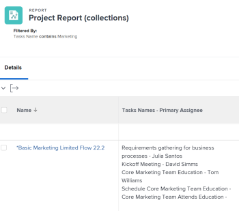

# Collections de référence dans un rapport

<!-- Audited: 1/2025 -->

La création d’un rapport dans Adobe Workfront permet d’afficher un ensemble d’objets, leurs champs respectifs ou les objets liés sous la forme d’une liste, d’une grille ou d’un graphique.

Pour plus d’informations sur la création d’un rapport dans Workfront, voir la section [Créer un rapport personnalisé](../../../reports-and-dashboards/reports/creating-and-managing-reports/create-custom-report.md).

## Conditions d’accès

+++ Développez pour afficher les exigences d’accès aux fonctionnalités de cet article.

Vous devez disposer des éléments suivants :

<table style="table-layout:auto"> 
 <col> 
 <col> 
 <tbody> 
  <tr> 
   <td role="rowheader">Formule Adobe Workfront</td> 
   <td> <p>Tous</p> </td> 
  </tr> 
  <tr> 
   <td role="rowheader">Licence Adobe Workfront</td> 
   <td> 
      <p>Nouveau :</p>
         <ul>
         <li><p>Standard</p></li>
         </ul>
      <p>Actuel :</p>
         <ul>
         <li><p>Plan</p></li>
         </ul>
   </td>
  </tr> 
  <tr> 
   <td role="rowheader">Configurations des niveaux d’accès</td> 
   <td> <p>Modifier l’accès aux filtres, vues et groupes</p> <p>Modifier l’accès aux rapports, tableaux de bord et calendriers</p> </td> 
  </tr> 
  <tr> 
   <td role="rowheader">Autorisations d’objet</td> 
   <td> <p>Gérer les autorisations d’un rapport</p> <p>Autorisations Gérer sur une vue, un filtre ou un regroupement </p> </td> 
  </tr> 
 </tbody> 
</table>

Pour plus d’informations, voir [Conditions d’accès requises dans la documentation Workfront](/help/quicksilver/administration-and-setup/add-users/access-levels-and-object-permissions/access-level-requirements-in-documentation.md).

+++

## Fonctionnement des collections

Une collection est une liste d’objets liés à un autre objet.

Les deux relations suivantes existent entre les objets dans Workfront :

* **Relation un-à-un** : un objet ne peut être lié qu’à un seul autre objet à la fois.\
  Par exemple, un projet ne peut être lié qu’à un portfolio à la fois.

* **Relation un-à-multiple** : un objet peut être lié à plusieurs autres objets à la fois.\
  Par exemple, un projet peut comporter plusieurs tâches. Dans ce cas, la liste des tâches forme une collection pour le projet.

>[!IMPORTANT]
>
>Vous pouvez créer un rapport montrant la relation un-à-un entre des objets à l’aide du Report Builder standard. Cependant, vous ne pouvez créer un rapport montrant la relation un-à-multiple entre des objets qu’en utilisant l’interface du mode texte du Report Builder.

Pour plus d’informations sur la création d’un rapport dans le Report Builder standard, voir la section [Créer un rapport personnalisé](../../../reports-and-dashboards/reports/creating-and-managing-reports/create-custom-report.md).

Pour plus d’informations sur la création d’un rapport à l’aide de l’interface du mode texte, voir ce qui suit :

* [Vue d’ensemble du mode texte](../../../reports-and-dashboards/reports/text-mode/understand-text-mode.md)
* [Vue d’ensemble des utilisations courantes du mode texte](../../../reports-and-dashboards/reports/text-mode/understand-common-uses-text-mode.md).
* [Vue d’ensemble de la syntaxe du mode texte](../../../reports-and-dashboards/reports/text-mode/text-mode-syntax-overview.md)

## Rechercher des objets de collection et leurs champs dans l’explorateur d’API {#find-collection-objects-and-their-fields-in-the-api-explorer}

Toutes les collections ne peuvent pas faire l’objet de rapports.

Pour connaître les objets qui peuvent être associés à une collection d’autres objets, vous devez utiliser l’explorateur d’API.\
Pour plus d’informations sur le tableau de l’explorateur d’API, voir la section [Explorateur d’API](../../../wf-api/general/api-explorer.md).

Pour établir les collections qui peuvent faire l’objet de rapports, procédez comme suit :

1. Accédez à l’[explorateur d’API](../../../wf-api/general/api-explorer.md).
1. Recherchez l’objet de votre rapport.
1. Sélectionnez l’onglet **collections**.

   >[!NOTE]
   >
   >Seuls les objets répertoriés dans cet onglet peuvent être représentés sous forme de collection dans un rapport pour l’objet que vous avez sélectionné.

1. Développez l’objet de votre collection en cliquant dessus.
1. Cliquez sur le lien affiché pour accéder à l’objet de votre collection.\
   Cela ouvre l’onglet **champs** pour l’objet de votre collection.

   >[!NOTE]
   >
   >Seuls peuvent être référencés dans le rapport de collection les champs répertoriés dans cet onglet ou ceux associés aux objets répertoriés dans cet onglet.

## Collections de référence dans les rapports

Vous pouvez référencer des objets d’une collection dans les éléments de rapport suivants :

* Vues
* Filtres
* Invites

Vous ne pouvez pas référencer d’objets d’une collection dans les éléments de rapport suivants :

* Regroupements
* Graphique

Par exemple, vous pouvez référencer les collections de tâches ou de problèmes à partir d’un rapport de projet pour afficher des informations sur la tâche ou le problème au niveau du projet.

* [Référencer une collection dans la vue d’un rapport](#reference-a-collection-in-the-view-of-a-report)
* [Référencer une collection dans le filtre d’un rapport](#reference-a-collection-in-the-filter-of-a-report)
* [Référencer une collection dans l’invite personnalisée d’un rapport](#reference-a-collection-in-the-custom-prompt-of-a-report)

### Référencer une collection dans la vue d’un rapport {#reference-a-collection-in-the-view-of-a-report}

Vous pouvez référencer une collection d’objets dans la vue d’un rapport pour afficher les attributs des objets associés à l’objet du rapport.

Vous pouvez, par exemple, afficher les informations sur une tâche ou un problème dans un rapport de projet en créant une colonne de collection pour les tâches ou les problèmes dans la vue du rapport.

Vous pouvez afficher des informations sur les tâches ou les problèmes, tels que les noms, les dates, les personnes cessionnaires principales, le pourcentage d’achèvement, etc., dans la vue Collection.

La vue affiche des informations sur les tâches ou les problèmes sous forme de liste, chaque ligne de la liste représentant des informations sur une tâche ou un problème. La liste des tâches ou des problèmes et de leurs champs s’affiche sur la même ligne que le projet auquel appartiennent les tâches ou les problèmes.

{width=400}

* [Ajouter une colonne de collection dans une vue de rapport](#add-a-collection-column-in-a-report-view)
* [Fonctionnement des lignes d’une vue de collection en mode texte](#understand-the-lines-of-a-collection-view-in-text-mode)
* [Limites de la vue de collection](#limitations-of-a-collection-view)

### Ajouter une colonne de collection dans une vue de rapport {#add-a-collection-column-in-a-report-view}

Pour ajouter une colonne de collection dans une vue de rapport, procédez comme suit :

1. Cliquez sur le menu **Principal** , puis sur **Rapports**.
1. Cliquez sur **Nouveau rapport**.
1. Sélectionnez l’objet de votre rapport.
1. Sortez du rapport et, à l’aide de l’[explorateur d’API](../../../wf-api/general/api-explorer.md), déterminez les collections disponibles pour l’objet sélectionné pour votre rapport.

   Pour plus d’informations sur la sélection de l’objet de votre collection, voir la section [Rechercher des objets de collection et leurs champs dans l’explorateur d’API](#find-collection-objects-and-their-fields-in-the-api-explorer) dans cet article.

   Notez le nom de l’objet de la collection.

1. En utilisant l’[explorateur d’API](../../../wf-api/general/api-explorer.md), accédez à la liste des champs de l’objet que vous souhaitez afficher dans la collection.

   Pour plus d’informations sur la recherche des champs de l’objet de votre collection, voir la section [Trouver des objets de collection et leurs champs dans l’explorateur d’API](#find-collection-objects-and-their-fields-in-the-api-explorer) dans cet article.

   Notez le nom du champ que vous souhaitez afficher dans la collection.

1. Revenez à votre rapport et, dans l’onglet **Colonnes (Affichage)**, cliquez sur **Ajouter une colonne**.
1. Cliquez sur **Basculer en mode texte**.
1. Cliquez sur **Modifier le mode texte**.
1. Sélectionnez tout le texte dans la boîte de dialogue **Mode texte** et supprimez-le, puis collez le code suivant si vous référencez un champ de l’objet de collection :

   ```
   valueformat=HTML
   textmode=true
   type=iterate
   listdelimiter=<p>
   displayname=Column Name
   listmethod=nested(collection object name).lists
   valuefield=collection object field
   ```

1. Remplacez **Nom de la colonne** par le nom de votre colonne dans la ligne `displayname`.
1. Remplacez le **nom de l’objet de collection** par le nom de votre objet de collection dans la ligne `listmethod`, tel qu’il apparaît dans l’[explorateur d’API](../../../wf-api/general/api-explorer.md).

1. Remplacez le **champ d’objet de collection** par le nom du champ de votre objet de collection dans la ligne `valuefield`, tel qu’il apparaît dans l’[explorateur d’API](../../../wf-api/general/api-explorer.md).

   Vous pouvez remplacer **valuefield** par **valueexpression**, si vous souhaitez créer une expression personnalisée dans votre vue.

   Pour plus d’informations sur les expressions personnalisées calculées, voir la section [Vue d’ensemble des expressions de données calculées](../../../reports-and-dashboards/reports/calc-cstm-data-reports/calculated-data-expressions.md).

   Par exemple, si vous souhaitez afficher une liste des tâches dans un rapport de projet. Cette collection utilise une ligne `valuefield` pour référencer les noms des tâches.

   Utilisez l’une des méthodes suivantes :

   * Utilisez le code suivant pour créer votre colonne :

     ```
     valueformat=HTML
     textmode=true
     type=iterate
     listdelimiter=<p>
     displayname=Project Tasks Names
     listmethod=nested(tasks).lists
     valuefield=name
     ```

   * Utilisez le code suivant pour afficher la liste des problèmes du rapport :

     ```
     displayname=Project Issues Names
     listdelimiter=<p>
     listmethod=nested(issues).lists
     textmode=true
     type=iterate
     valuefield=name
     valueformat=HTML
     ```

     Notez que, dans une collection, vous devez utiliser **issues** pour la ligne **listmethod**, au lieu de **opTasks** qui est le nom de la base de données pour les problèmes. Pour connaître le moment où il convient d’utiliser **issue** ou **opTask** lorsque vous faites référence à des problèmes, voir la section [Utiliser « opTask » et « issue » lors de la référence à des problèmes](../../../manage-work/issues/issue-information/use-optask-instead-of-issue.md).

   * Si vous souhaitez afficher une liste des tâches dans un rapport de projet avec la personne cessionnaire principale, vous pouvez utiliser une ligne **valueexpression** pour référencer les noms des tâches à côté des noms de leurs personnes cessionnaires principales, au lieu de **valuefield**.

     Utilisez le code suivant pour créer votre colonne :

     ```
     valueformat=HTML
     textmode=true
     type=iterate
     listdelimiter=<p>
     displayname=Tasks Names - Primary Assignee
     listmethod=nested(tasks).lists
     valueexpression=CONCAT({name},' - ',{assignedTo}.{name})
     ```

1. La colonne suivante s’affiche dans le rapport de projet, répertoriant toutes les tâches de chaque projet avec leurs principaux et principales cessionnaires :

   {width=400}

1. Cliquer sur **Enregistrer**.
1. (Facultatif) Poursuivez la modification du rapport.

   Ou

   Cliquez sur **Enregistrer + Fermer** pour enregistrer le rapport.

#### Présentation des lignes d’une vue de collection en mode Texte

Les lignes d’une collection en mode Texte sont décrites dans le tableau suivant :

<table style="table-layout:auto"> 
 <col> 
 <col> 
 <thead> 
  <tr> 
   <th><strong>Exemple de ligne</strong> </th> 
   <th><strong>Description</strong> </th> 
  </tr> 
 </thead> 
 <tbody> 
  <tr> 
   <td><code>valueformat=HTML</code> </td> 
   <td> <p>Vous pouvez utiliser différentes valeurs pour cette ligne, mais nous vous recommandons que le <code style="font-weight: normal;">valueformat</code> pour qu’une liste de collections soit <strong>HTML.</strong></p>
   </td> 
  </tr> 
  <tr> 
   <td><code>textmode=true</code> </td> 
   <td> <p>Cette ligne indique que la colonne a été paramétrée en mode Texte. Si vous supprimez cette ligne, Workfront la réajoute par défaut.</p> </td> 
  </tr> 
  <tr> 
   <td><code>type=iterate</code> </td> 
   <td> <p>Le <code>type</code> d’une liste est toujours <code>iterate</code>, lors de la création d’une vue.</p> </td> 
  </tr> 
  <tr> 
   <td><code>listdelimiter=&lt;p&gt;</code> </td> 
   <td> <p>Il s’agit du délimiteur utilisé pour séparer les valeurs de votre liste.<br>Nous vous recommandons d’utiliser <code>&lt;p&gt;</code> qui ajoute un saut de ligne entre les valeurs.</p> <p>Vous pouvez également utiliser les éléments suivants :</p> <p><code>&amp;zwj;</code> (jointure à largeur nulle).Les valeurs de la collection ne sont pas séparées entre elles.<br><strong>,</strong> =séparateur Virgule.Les valeurs de la collection sont séparées par une virgule suivie d’un espace vide.<br><strong>/</strong> = séparateur Barre oblique.Les valeurs de la collection sont séparées par une barre oblique.<br><strong>-</strong> = séparateur Tiret. Les valeurs de la collection sont séparées par un tiret.<br>Si vous laissez cette ligne vide, une virgule est ajoutée, suivie par défaut d’un espace entre les valeurs de la collection.</p> </td> 
  </tr> 
  <tr> 
   <td><code>displayname=</code><em>Nom de la.colonne</em> </td> 
   <td> <p>Remplacez le <strong>Nom de la colonne</strong> avec le nom réel de votre nouvelle colonne.</p> </td> 
  </tr> 
  <tr> 
   <td><code>listmethod=nested(collection object name).list</code> </td> 
   <td> <p> Cette ligne définit la collection à laquelle vous faites référence.</p> <p>Remplacez le <strong>nom de l’objet de collection</strong> avec le nom de l’objet que vous référencez dans votre collection, tel qu’il apparaît dans l’<a href="../../../wf-api/general/api-explorer.md" class="MCXref xref">Explorateur d’API</a>. Cette valeur correspond généralement à la forme plurielle du nom de l’objet de collection.</p> </td> 
  </tr> 
  <tr> 
   <td><code>valuefield=collection object field</code> </td> 
   <td> <p>Cette ligne définit le champ que vous référencez à partir de l’objet de collection.</p> <p>Remplacez le <strong>Champ d’objet de collection</strong> avec le nom du champ de l’objet que vous référencez dans votre collection, tel qu’il apparaît dans l’<a href="../../../wf-api/general/api-explorer.md" class="MCXref xref">Explorateur d’API</a>.</p> <p>Vous pouvez remplacer cette ligne par :</p> <p><strong>valueexpression</strong>=Champ/champs d’objet de collection calculé</p> <p>Grâce à <strong>valueexpression</strong>, vous pouvez afficher une expression personnalisée calculée dans la colonne.</p> <p>Pour plus d’informations sur le format des lignes <strong>valueexpression</strong>, voir <a href="../../../reports-and-dashboards/reports/text-mode/text-mode-syntax-overview.md" class="MCXref xref">Vue d’ensemble de la syntaxe du mode Texte</a>.</p> </td> 
  </tr> 
 </tbody> 
</table>

#### Limites de la vue de collection {#limitations-of-a-collection-view}

Tenez compte des limites suivantes lorsque vous créez une vue de collection :

* Vous ne pouvez pas contrôler l’ordre d’affichage des données de collection.
* Vous ne pouvez pas appliquer de mise en forme conditionnelle à une vue de collection.
* Vous ne pouvez pas transformer un objet d’une collection en un lien cliquable.
* Vous ne pouvez pas créer une vue de collection d’une autre collection.\
  Par exemple, vous ne pouvez pas afficher toutes et tous les cessionnaires pour chaque tâche dans un rapport de projet. Vous ne pouvez afficher que le cessionnaire principal ou la cessionnaire principale pour chaque tâche dans une vue de projet.

### Référencer une collection dans le filtre d’un rapport {#reference-a-collection-in-the-filter-of-a-report}

Vous pouvez référencer une collection d’objets dans le filtre d’un rapport afin de filtrer les attributs des objets associés à l’objet du rapport.

Vous pouvez, par exemple, filtrer les informations de tâche ou de problème dans un rapport de projet en utilisant une référence aux attributs des tâches ou des problèmes du projet dans l’instruction de filtre.

>[!NOTE]
>
>Lorsqu’il est appliqué à des champs contenant plusieurs valeurs (par exemple, un ensemble de notes dans un projet), le filtre détermine l’inclusion comme suit :
>
>* Si tous les éléments d&#39;une collection contiennent la valeur spécifiée, l&#39;enregistrement entier est exclu des résultats.
>* Si au moins un élément de la collection ne contient pas la valeur spécifiée, l’enregistrement reste dans les résultats.


Pour ajouter une référence à une collection dans un filtre de rapport :

1. Cliquez sur le menu **Principal** , puis sur **Rapports**.
1. Cliquez sur **Nouveau rapport**.
1. Sélectionnez l’objet de votre rapport.
1. Sortez du rapport et, à l’aide de l’[explorateur d’API](../../../wf-api/general/api-explorer.md), déterminez les collections disponibles pour l’objet sélectionné pour votre rapport.

   Pour plus d’informations sur la sélection de l’objet de votre collection, voir la section [Rechercher des objets de collection et leurs champs dans l’explorateur d’API](#find-collection-objects-and-their-fields-in-the-api-explorer) dans cet article.

   Notez le nom de l’objet de la collection.

1. En utilisant l’[explorateur d’API](../../../wf-api/general/api-explorer.md), accédez à la liste des champs de l’objet que vous souhaitez afficher dans la collection.

   Pour plus d’informations sur la recherche des champs de l’objet de votre collection, voir la section [Rechercher des objets de collection et de leurs champs dans l’explorateur d’API](#find-collection-objects-and-their-fields-in-the-api-explorer) dans cet article.

   Notez le champ que vous souhaitez afficher dans la collection.

1. Revenez à votre rapport et, dans l’onglet **Filtres**, cliquez sur **Passer en mode texte** puis **Modifier le mode texte**.

1. Dans la zone **Définir des règles de filtrage pour votre rapport**, collez le code suivant :

   ```
   collection object name:collection object field=collection object value
   collection object name:collection object field_Mod=value of the modifier
   ```

1. Remplacez le **nom de l’objet de collection** avec le nom de votre objet de collection tel qu’il apparaît dans l’[Explorateur d’API](../../../wf-api/general/api-explorer.md). Cette valeur correspond généralement à la forme plurielle du nom de l’objet de collection.

1. Remplacez le **Champ de l’objet de collection** avec le nom du champ de votre objet de collection tel qu’il apparaît dans l’[Explorateur d’API](../../../wf-api/general/api-explorer.md).

1. Remplacez la **valeur de l’objet de collection** avec la valeur de l’objet de collection tel qu’elle apparaît dans Workfront.
1. Remplacez la **valeur du modificateur** avec un modificateur valide.

   Pour obtenir la liste des modificateurs, voir [Modificateurs de filtre et de condition](../../../reports-and-dashboards/reports/reporting-elements/filter-condition-modifiers.md).\
   Par exemple, pour créer un rapport de projet qui affiche uniquement les projets dont le nom contient « Marketing », utilisez le code suivant :

   ```
   tasks:name=Marketing
   tasks:name_Mod=cicontains
   ```

   Ce rapport affiche uniquement les projets dont le nom contient au moins une tâche portant le mot « marketing ».

   {width=400}

1. Pour filtrer le nom d’un problème, utilisez le code suivant :

   ```
   issues:name=Marketing
   issues:name_Mod=cicontains
   ```

   >[!TIP]
   >
   >Notez que vous devez utiliser `issues` pour le nom de l’objet de collection, au lieu de `optask` qui permet d’afficher les problèmes dans l’explorateur d’API.

1. Cliquez sur **Terminé**.
1. (Facultatif) Poursuivez la modification du rapport.

   Ou

   Cliquez sur **Enregistrer + Fermer** pour enregistrer la vue.

### Référencer une collection dans l’invite personnalisée d’un rapport {#reference-a-collection-in-the-custom-prompt-of-a-report}

Vous pouvez référencer une collection d’objets dans l’invite personnalisée d’un rapport afin de filtrer les résultats du rapport pour les attributs des objets associés à l’objet du rapport.

Par exemple, vous pouvez demander des informations sur les tâches dans un rapport de projet en utilisant une référence aux attributs des tâches sur le projet dans l&#39;invite personnalisée du rapport.

>[!NOTE]
>
>Vous ne pouvez pas référencer des collections dans une invite standard.

Une invite personnalisée est un filtre personnalisé dans lequel les instructions sont jointes par des esperluettes et des symboles. Nous vous recommandons de créer votre déclaration dans un filtre, d’abord, puis de joindre les lignes des déclarations avec des esperluettes.

Pour plus d’informations sur la création d’une déclaration de filtre avec une référence de collection, voir la section [Référencer une collection dans le filtre d’un rapport](#reference-a-collection-in-the-filter-of-a-report) dans cet article.

Pour ajouter une référence à une collection dans l’invite personnalisée d’un rapport :

1. Cliquez sur le menu **Principal** , puis sur **Rapports**.
1. Cliquez sur **Nouveau rapport**.
1. Sélectionnez l’objet de votre rapport.
1. Créez un filtre avec une référence de collection comme décrit dans la section [Référencer une collection dans le filtre d’un rapport](#reference-a-collection-in-the-filter-of-a-report) dans cet article.
1. Cliquez sur **Paramètres des rapports**.
1. Cliquez sur **Invites de rapports**.
1. Cliquez sur **Ajouter une invite**.
1. Cliquez sur **Invite personnalisée**.
1. Indiquez le nom de l’invite dans le champ **Field****name**.

1. Indiquez un **Libellé de l’élément de liste déroulante**.
1. Indiquez les éléments suivants dans le champ **Condition** :

   ```
   collection object name:collection object field_Mod=value of the modifier
   ```

1. (Facultatif) Indiquez si ce choix est affiché par défaut dans l’invite.
1. Remplacez le **nom de l’objet de collection** avec le nom de votre objet de collection tel qu’il apparaît dans l’[Explorateur d’API](../../../wf-api/general/api-explorer.md). Cette valeur correspond généralement à la forme plurielle du nom de l’objet de collection.
1. Remplacez **champ d’objet de collection** par le nom du champ de votre objet de collection, tel qu’il apparaît dans l’[explorateur d’API](../../../wf-api/general/api-explorer.md).
1. Remplacez la **valeur de l’objet de collection** avec la valeur de l’objet de collection tel qu’elle apparaît dans Workfront.

   Par exemple, si vous filtrez des projets dans lesquels le nom de la tâche contient « Marketing », remplacez **valeur de l&#39;objet de collection** par **marketing**.

1. Remplacez la **valeur du modificateur** avec un modificateur valide.

   Pour obtenir la liste des modificateurs, voir [Modificateurs de filtre et de condition](../../../reports-and-dashboards/reports/reporting-elements/filter-condition-modifiers.md).

   **Exemple :** par exemple, pour créer un rapport de projet avec une invite personnalisée dans laquelle vous souhaitez afficher uniquement les projets pour lesquels au moins une tâche est affectée à une personne spécifique, utilisez le code ci-dessous :

   ```
   tasks:assignedToID=57cf1b7a000077c9f02f66cb09c8f86c&tasks:assignedToID_Mod=in
   ```

   Cette opération génère un rapport dans lequel au moins une tâche est affectée à l&#39;utilisateur dont le GUID est 57cf1b7a000077c9f02f66cb09c8f86c.

   >[!NOTE]
   >
   >Vous ne pouvez pas référencer le nom du cessionnaire principal ou de la cessionnaire principale (champ « Affectée à ») d’une tâche, selon l’[Explorateur d’API](../../../wf-api/general/api-explorer.md). Vous pouvez uniquement référencer l’identifiant de la personne désignée principale.

   Par exemple, pour filtrer les projets pour lesquels l’un des problèmes de projet est affecté à une personne spécifique, utilisez le code suivant pour votre invite personnalisée :

   ```
   issues:assignedToID=57cf1b7a000077c9f02f66cb09c8f86c&issues:assignedToID_Mod=in
   ```

   Cette opération génère un rapport dans lequel au moins un événement est affecté à tous les projets répertoriés pour l&#39;utilisateur dont le GUID est 57cf1b7a000077c9f02f66cb09c8f86c.

   >[!NOTE]
   >
   >Notez que vous devez utiliser **Problèmes** pour le nom de l’objet de collection. L’explorateur d’API ne propose pas de nom d’objet de collection pour les problèmes actuels.

1. Cliquez sur **Terminé**.
1. (Facultatif) Poursuivez la modification du rapport.

   Ou

   Cliquez sur **Enregistrer + Fermer** pour enregistrer le rapport.
