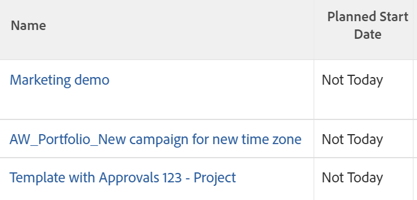

# Utilisation de la mise en forme conditionnelle en mode Texte

<!--
(NOTE: Alina: this article might need to be split in its sections. Tony asked that numbers and dates should be in separate articles (??))
-->

Le créateur d’interfaces standard offre une grande flexibilité lors de la création d’éléments de création de rapports pour répondre aux besoins de votre entreprise.

Vous pouvez appliquer une mise en forme conditionnelle dans une vue à l’aide de l’interface standard.\
Pour plus d’informations sur l’application d’une mise en forme conditionnelle à un affichage, voir [Utilisation d’une mise en forme conditionnelle dans les vues](../../../reports-and-dashboards/reports/reporting-elements/use-conditional-formatting-views.md).

## Exigences d’accès

Vous devez disposer des accès suivants pour effectuer les étapes de cet article :

<table style="table-layout:auto"> 
 <col> 
 <col> 
 <tbody> 
  <tr> 
   <td role="rowheader">Formule Adobe Workfront*</td> 
   <td> <p>Tous</p> </td> 
  </tr> 
  <tr> 
   <td role="rowheader">Licence Adobe Workfront*</td> 
   <td> <p>Plan </p> </td> 
  </tr> 
  <tr> 
   <td role="rowheader">Paramétrages du niveau d'accès*</td> 
   <td> <p>Modifier l’accès aux filtres, vues et groupes</p> <p>Modifier l’accès aux rapports, tableaux de bord et calendriers pour modifier les vues d’un rapport</p> <p>Remarque : Si vous n’avez toujours pas accès à , demandez à votre administrateur Workfront s’il définit des restrictions supplémentaires à votre niveau d’accès. Pour plus d’informations sur la façon dont un administrateur Workfront peut modifier votre niveau d’accès, voir <a href="../../../administration-and-setup/add-users/configure-and-grant-access/create-modify-access-levels.md" class="MCXref xref">Création ou modification de niveaux d’accès personnalisés</a>.</p> </td> 
  </tr> 
  <tr> 
   <td role="rowheader">Autorisations d’objet</td> 
   <td> <p>Gérer les autorisations d’un rapport pour modifier les vues d’un rapport</p> <p>Gérer les autorisations pour une vue afin de la modifier</p> <p>Pour plus d’informations sur la demande d’accès supplémentaire, voir <a href="../../../workfront-basics/grant-and-request-access-to-objects/request-access.md" class="MCXref xref">Demande d’accès aux objets </a>.</p> </td> 
  </tr> 
 </tbody> 
</table>

&#42;Pour connaître le plan, le type de licence ou l’accès dont vous disposez, contactez votre administrateur Workfront.

## Mise en forme conditionnelle en mode Texte

Le mode Texte permet de créer des vues, filtres, regroupements et invites plus complexes en vous permettant d’utiliser des champs non disponibles dans l’interface standard.

Pour obtenir la liste complète de tous nos champs à déclarer, reportez-vous à la section  [Explorateur d’API](../../../wf-api/general/api-explorer.md).

Pour plus d’informations sur l’utilisation de la syntaxe du mode texte, voir [Présentation de la syntaxe du mode texte](../../../reports-and-dashboards/reports/text-mode/text-mode-syntax-overview.md).

Vous pouvez également utiliser le mode texte pour formater les vues dans les rapports et les listes. La mise en forme conditionnelle vous permet de modifier les vues de vos rapports en modifiant le type de police et l’arrière-plan des résultats dans le rapport, ainsi que les icônes et les indicateurs. Nous vous recommandons de toujours créer vos vues à l’aide de l’interface standard en premier et de passer à l’interface du mode texte uniquement lorsque cela est absolument nécessaire.

>[!NOTE]
>
> L’utilisation du style CSS pour personnaliser la mise en forme conditionnelle n’est pas prise en charge. Vous devez plutôt utiliser les options de mise en forme prédéfinies disponibles dans Adobe Workfront.

## Ajout d’une mise en forme conditionnelle aux vues

Pour plus d’informations sur l’application d’une mise en forme conditionnelle à un affichage dans l’interface du créateur standard, voir [Utilisation d’une mise en forme conditionnelle dans les vues](../../../reports-and-dashboards/reports/reporting-elements/use-conditional-formatting-views.md).

Pour ajouter une mise en forme conditionnelle à une vue dans l’interface du mode texte :

1. Accédez à une liste d’objets.
1. Développez le menu déroulant d’une vue à laquelle vous souhaitez ajouter une mise en forme conditionnelle.
1. Cliquez sur **Vue Personnaliser**.
1. Cliquez sur la colonne de la vue à laquelle vous souhaitez appliquer une mise en forme conditionnelle.
1. Cliquez sur **Passer en mode Texte**.
1. Dans le **Afficher dans cette colonne :** zone, cliquez sur **Cliquer pour modifier le texte**.
1. Ajoutez les exemples de code fournis dans [Mise en forme des vues en mode Texte](#format-views-using-text-mode) au bas du texte de la colonne que vous avez sélectionnée.
1. Cliquez sur **Enregistrer**, puis cliquez sur **Enregistrer la vue**.

## Mise en forme des vues en mode Texte {#format-views-using-text-mode}

Vous pouvez ajouter les composants suivants à une colonne d’une vue pour la formater de manière conditionnelle en mode texte :

* [Paramètres des colonnes](#column-settings)
* [Règles de colonne](#column-rules)
* [Formatage conditionnel d’une expression de valeur](#conditionally-format-a-valueexpression)

### Paramètres des colonnes {#column-settings}

Vous devez maîtriser l’interface du mode texte avant de pouvoir ajouter une mise en forme conditionnelle à vos vues.

Vous pouvez personnaliser les éléments suivants d’une colonne lors de l’utilisation d’une mise en forme conditionnelle dans une vue :

* [En-têtes de colonne](#column-headers)
* [Formatage des dates](#format-dates)
* [Formatage des nombres](#format-numbers)

#### En-têtes de colonne {#column-headers}

Pour modifier l’en-tête de colonne affiché, ajoutez le code suivant à votre colonne : `displayname= [Name of column]`. Par exemple, pour nommer une colonne Propriétaire du projet, le code texte se présente comme suit :

```
displayname=Project Owner
```

#### Formatage des dates {#format-dates}

Les dates peuvent être configurées pour s’afficher dans divers formats.

Pour plus d’informations, voir [Mise en forme des dates dans les rapports en mode texte](../../../reports-and-dashboards/reports/text-mode/format-dates-in-text-mode-reports.md).

<!--
<div data-mc-conditions="QuicksilverOrClassic.Draft mode"> 
<p data-mc-conditions="QuicksilverOrClassic.Draft mode">(NOTE: this is drafted and replaced by the article linked above)</p>
<p>To establish a date format, you must modify the <code>valueformat</code> line of the text mode code in the column.</p>
<pre>valueformat= [new date format]</pre>
<p>For example, if you wanted the Projected Completion Date to be displayed as MM/DD/YY the code would look like:</p>
<pre>valueformat=atDate<br>valuefield=projectedCompletionDate </pre>
<p>If you wanted to show the Planned Completion Date as <em>Mth, DD, Year</em>, the code would look like:</p>
<pre>valueformat=mediumAtdate<br>valuefield=plannedCompletionDate</pre>
<p>You can format dates using the following <code>valueformat</code> text mode values:</p>
<table style="table-layout:auto">
<col>
<col>
<col>
<thead>
<tr>
<th scope="col"><strong>Format</strong> </th>
<th scope="col">Example </th>
<th scope="col"><em><strong>valueformat=</strong></em> </th>
</tr>
</thead>
<tbody>
<tr>
<td>MM/DD/YY</td>
<td>10/11/18</td>
<td><pre>atDate</pre> </td>
</tr>
<tr>
<td>MM/DD/YY Time</td>
<td>10/11/18 12:00pm</td>
<td><pre>longAtDate</pre> </td>
</tr>
<tr>
<td>MM/DD/YY</td>
<td>10/11/18</td>
<td><pre>shortAtDate</pre> </td>
</tr>
<tr>
<td>Mth, DD, YR</td>
<td>Oct, 11, 2018</td>
<td><pre>mediumAtDate</pre> </td>
</tr>
<tr>
<td>DW, Mth, Day, YR</td>
<td>Mon, Oct, 11, 2018</td>
<td><pre>partialAtDate</pre> </td>
</tr>
<tr>
<td>DW, Mth, Day, YR Time</td>
<td>Mon, Oct, 11, 2018 12:00 pm</td>
<td><pre>fullAtDate</pre> </td>
</tr>
</tbody>
</table>
</div>
-->

#### Formatage des nombres {#format-numbers}

Vous pouvez formater des valeurs numériques afin d’afficher les informations qui répondent le mieux à vos besoins de création de rapports.

Pour plus d’informations, voir [Formatage des valeurs, des devises et des pourcentages dans les rapports en mode texte](../../../reports-and-dashboards/reports/text-mode/format-numbers-in-text-mode-reports.md).

<!--
<div data-mc-conditions="QuicksilverOrClassic.Draft mode">
<p>To modify the format of a numeric value, you must edit the <strong>valueformat</strong> line of your column.</p> 
<p data-mc-conditions="QuicksilverOrClassic.Draft mode">(NOTE: this is drafted and replaced by the article linked above) </p>
<p>For example, if you wanted to display the Budget column as $1000, the value format line would look like:</p>
<pre>valueformat=currencyStringCurrencyRounded<br>valuefield=budget</pre>
<p>You can format numbers using the following values for the <code>valueformat</code> line of your column:</p>
<table border="2" cellspacing="15" cellpadding="1">
<col>
<col>
<thead>
<tr>
<th scope="col"><strong>Example</strong> </th>
<th scope="col"><em><code>valueformat=</code></em> </th>
</tr>
</thead>
<tbody>
<tr>
<td>1234</td>
<td><pre>doubleAsString</pre> or <pre>int</pre></td>
</tr>
<tr>
<td>1,234</td>
<td><pre>doubleAsInt</pre> </td>
</tr>
<tr>
<td>$1,234</td>
<td><pre>currencyStringCurrencyRounded</pre> </td>
</tr>
<tr>
<td>1234.56</td>
<td><pre>doubleAsDouble</pre> </td>
</tr>
<tr>
<td>$1,234.56</td>
<td><pre>currencyStringCurrency</pre> </td>
</tr>
<tr>
<td>12%</td>
<td><pre>doubleAsPercentRounded</pre> </td>
</tr>
<tr>
<td>12.34%</td>
<td><pre>doubleAsPercent</pre> </td>
</tr>
<tr>
<td>(1,234.56)</td>
<td><pre>doubleAsFinancial</pre> </td>
</tr>
<tr>
<td>(1,234)</td>
<td><pre>doubleAsFiancialRounded</pre> </td>
</tr>
</tbody>
</table>
</div>
-->

### Règles de colonne {#column-rules}

Les règles de colonne permettent d’ajouter des images, des couleurs, des mises en forme et des remplacements de texte dans une vue. Les règles de colonne peuvent être établies indépendamment ou peuvent contenir plusieurs conditions pour une colonne.

* [Mise en forme conditionnelle](#conditional-formatting)
* [Formats conditionnels multiples](#multiple-conditional-formats)
* [Appliquer le texte](#apply-text)
* [Application de formats de ligne](#apply-row-formats)
* [Application d’images](#apply-images)

#### Mise en forme conditionnelle {#conditional-formatting}

Une instruction de mode de texte spécifique doit être appliquée lors de l’incorporation de texte de mise en forme ou de couleur.

>[!NOTE]
>
>La mise en forme conditionnelle peut ne pas être prise en charge dans les colonnes fusionnées.\
>Pour plus d’informations sur la fusion de colonnes avec le mode Texte, voir [Afficher : fusionner les informations de plusieurs colonnes dans une seule colonne partagée](../../../reports-and-dashboards/reports/custom-view-filter-grouping-samples/view-merge-columns.md).

Insérez le code suivant dans une colonne où vous souhaitez ajouter une mise en forme conditionnelle à :

```
styledef.case.0.comparison.leftmethod= [field name]
styledef.case.0.comparison.lefttext= [field name]
styledef.case.0.comparison.righttext= [field value]
styledef.case.0.comparison.operator= [qualifier]
styledef.case.0.comparison.operatortype= [data type]
styledef.case.0.comparison.icon=false
styledef.case.0.comparison.truetext= 
styledef.case.0.comparison.trueproperty.0.name= [format option]
styledef.case.0.comparison.trueproperty.0.value= [format style]
```

>[!NOTE]
>
>Le *styledef.case.0.compare.icon* est toujours false, sauf si vous utilisez des icônes.
>
>Le *styledef.case.0.compare.truetext* La ligne reste toujours vide jusqu’à ce que le texte soit remplacé.
>
>Le *styledef.case.0.compare.righttext* est vide lorsque le qualificateur n’est pas vide.

Par exemple, si nous souhaitons afficher le nom de la société dans un rapport de projet en vert, vous pouvez utiliser le code suivant :

```
styledef.case.0.comparison.leftmethod=company:name
styledef.case.0.comparison.lefttext=company:name ;
styledef.case.0.comparison.righttext= 
styledef.case.0.comparison.operator=notblank
styledef.case.0.comparison.operatortype=string
styledef.case.0.comparison.icon=false
styledef.case.0.comparison.truetext=
styledef.case.0.comparison.trueproperty.0.name=textcolor
styledef.case.0.comparison.trueproperty.0.value=03a219
```

>[!NOTE]
>
>* Bien que cette instruction puisse être appliquée à une colonne Nom de société, elle peut également être appliquée à toute autre colonne du rapport. Le texte vert ne s’affiche que si une société est associée au projet. Mémoriser `[field name]`, `[value]`, et `[qualifier]` Déterminez si le conditionnement s’affiche finalement sur la colonne.
>* Lorsque vous utilisez des qualificateurs, nous vous recommandons d’utiliser `cicontains` plutôt que `equal`. Par défaut, `equal` recherche des numéros d’ID. En utilisant la variable `cicontains` qualificateur, vous pouvez accéder aux éléments par leur nom.


Que la couleur du texte, l’alignement, le style de police ou la couleur d’arrière-plan soient appliqués à un mode de texte, la même instruction (illustrée ci-dessus) est utilisée.

Les lignes suivantes doivent être modifiées pour refléter le formatage correspondant à la colonne :

```
styledef.case.0.comparison.trueproperty.0.name= [format option]
styledef.case.0.comparison.trueproperty.0.value= [format style]
```

Utilisez les tableaux suivants pour identifier les lignes à modifier et les valeurs à spécifier pour définir le style de format de votre colonne :

| **Couleur du texte** | **Ligne : textcolor=** |
|---|---|
| Noir | `000000` |
| Bleu foncé | `0c6aca` |
| Teal | `1b878c` |
| Vert | `03a219` |
| Violet | `6408c4` |
| Gris | `767676` |
| Rouge | `d30519` |
| Jaune | `e19503` |

{style="table-layout:auto"}

| **Alignement** | **Ligne : align=** |
|---|---|
| Alignement à gauche | `left` |
| Alignement droit | `right` |
| Alignement centré | `center` |

{style="table-layout:auto"}

| Police | Ligne : ***fontstyle=*** |
|---|---|
| Gras | `bold` |
| Italiques | `italic` |

{style="table-layout:auto"}

| **Couleur d&#39;arrière-plan** | **Ligne : bgcolor=** |
|---|---|
| Teal | `dcf6f7` |
| Vert | `def6e2` |
| Gris | `e8e8e8` |
| Bleu | `e8f1ff` |
| Violet | `e9def4` |
| Rouge | `eac6c9` |
| Jaune | `feecc8` |
| Blanc | `ffffff` |

{style="table-layout:auto"}

#### Formats conditionnels multiples {#multiple-conditional-formats}

Vous pouvez appliquer plusieurs styles de formatage à une instruction. L’instruction core reste inchangée et toute expression de formatage supplémentaire est ajoutée à l’instruction .

Par exemple, en utilisant l’instruction précédente pour inclure le nom de la société dans le texte en gras vert. L’instruction est écrite à l’aide du code suivant :

```
styledef.case.0.comparison.leftmethod=company:name
styledef.case.0.comparison.lefttext=company:name
styledef.case.0.comparison.righttext=
styledef.case.0.comparison.operator=notblank
styledef.case.0.comparison.operatortype=string
styledef.case.0.comparison.icon=false
styledef.case.0.comparison.truetext= 
styledef.case.0.comparison.trueproperty.0.name=textcolor
styledef.case.0.comparison.trueproperty.0.value=03a219
styledef.case.0.comparison.trueproperty.1.name=fontstyle
styledef.case.0.comparison.trueproperty.1.value=bold
```

>[!NOTE]
>
>Lorsque vous incluez plusieurs expressions de mise en forme conditionnelle, il est nécessaire d’identifier numériquement chaque expression dans l’instruction. Notez que les expressions 0 et 1 ont été identifiées.

#### Appliquer le texte {#apply-text}

Si vous souhaitez remplacer les valeurs par défaut renseignées dans une colonne par la valeur de votre choix, il est possible d’appliquer du texte à la colonne.

Par exemple, sur un rapport de projet, définissez la valeur de la colonne Date de début planifiée pour qu’elle n’affiche pas la date de début prévue du projet, mais plutôt le texte &quot;Pas aujourd’hui&quot;. Utilisez le code suivant pour la colonne Date de début planifiée :

```
case.0.comparison.leftmethod=plannedStartDate
case.0.comparison.lefttext=plannedStartDate
case.0.comparison.righttext=2013-04-10T10:45:00:000
case.0.comparison.operator=ne
case.0.comparison.operatortype=date
case.0.comparison.icon=false
case.0.comparison.truetext=not today
styledef.case.0.comparison.leftmethod=plannedStartDate
styledef.case.0.comparison.lefttext=plannedStartDate
styledef.case.0.comparison.righttext=2013-04-10T10:45:00:000 
styledef.case.0.comparison.operator=ne
styledef.case.0.comparison.operatortype=date&
styledef.case.0.comparison.icon=false
styledef.case.0.comparison.truetext=not today
```

>[!NOTE]
>
>Les lignes qui commencent par `case.0.` comparaisons de cas d’utilisation pour identifier l’utilisation du texte. Les lignes qui commencent par **styledef.case.0.** sont des instructions de mise en forme conditionnelle initiales dans lesquelles nous identifions l’utilisation de texte par le biais de la variable `truetext` expression. Veillez à définir `truetext` à une valeur, plutôt que de la laisser vide.




#### Application de formats de ligne {#apply-row-formats}

Si vous souhaitez appliquer une condition à la ligne entière, utilisez le code suivant avec votre code de colonne :

```
styledef.case.0.comparison.icon=false
```

```
styledef.case.0.comparison.isrowcase=true
```

```
styledef.case.0.comparison.leftmethod= [field name]
```

```
styledef.case.0.comparison.lefttext= [field name]
```

```
styledef.case.0.comparison.operator= [qualifier]
```

```
styledef.case.0.comparison.operatortype= [data type]
```

```
styledef.case.0.comparison.righttext= [field value]
```

```
styledef.case.0.comparison.trueproperty.0.name= [format option]
```

```
styledef.case.0.comparison.trueproperty.0.value= [format style]
```

```
styledef.case.0.comparison.truetext=
```

```
row.0.styledef.applyallcases=true
```

```
row.0.styledef.case.0.comparison.icon=false
```

```
row.0.styledef.case.0.comparison.isrowcase=true
```

```
row.0.styledef.case.0.comparison.leftmethod= [field name]
```

```
row.0.styledef.case.0.comparison.lefttext= [field name]
```

```
row.0.styledef.case.0.comparison.operator= [qualifier]
```

```
row.0.styledef.case.0.comparison.operatortype= [data type]
```

```
row.0.styledef.case.0.comparison.righttext= [field value]
```

```
row.0.styledef.case.0.comparison.trueproperty.0.name= [format option]
```

```
row.0.styledef.case.0.comparison.trueproperty.0.value= [format style]
```

```
row.0.styledef.case.0.comparison.truetext=
```


#### Application d’images {#apply-images}

De même que la mise en forme avec du texte, les images peuvent être utilisées pour afficher les informations dans les rapports. Workfront comporte plusieurs images intégrées pour véhiculer des informations visuelles dans un paramètre de rapport. Pour utiliser des images dans le paramètre de mise en forme conditionnelle, l’instruction suivante est nécessaire :

```
image.case.0.comparison.leftmethod= [field name]
image.case.0.comparison.lefttext= [field name]
image.case.0.comparison.righttext= [field value]
image.case.0.comparison.operator= [qualifier]
image.case.0.comparison.operatortype= [data type]
image.case.0.comparison.icon=true
image.case.0.comparison.truetext=
```

Par exemple, sur un rapport de projet, vous souhaitez créer une colonne dans laquelle vous afficherez une face de devant pour chaque date d’achèvement planifiée qui n’est pas égale à la date d’aujourd’hui. Utilisez le code de mode de texte suivant pour ajouter l’icône à votre colonne :

```
image.case.0.comparison.leftmethod=plannedCompletionDate
image.case.0.comparison.lefttext=plannedCompletionDate
image.case.0.comparison.righttext=2013-04-10T13:00:00:000 
image.case.0.comparison.operator=ne 
image.case.0.comparison.operatortype=date
image.case.0.comparison.icon=true
image.case.0.comparison.truetext=/interface/images/v4_redux/icons/casebuilder/emoticon_frown.gif
```

>[!NOTE]
>
>Notez que l’instruction utilise la variable `icon=true` expression. Cette instruction est également différente des autres instructions de mise en forme conditionnelle dans la mesure où elle n’utilise pas la variable `style.def` mais un format d’image unique.


Pour utiliser les images disponibles, appliquez le code et les valeurs suivants :

| **Icône** | **Ligne : image.case.0.compare.truetext=** |
|---|---|
| Le visage renversé  | =`/interface/images/v4_redux/icons/casebuilder/emoticon_frown.gif` |
| Joyeux visage  | =`/interface/images/v4_redux/icons/casebuilder/emoticon_smile.gif` |
| Indicateur bleu   | =`/interface/images/v4_redux/icons/casebuilder/flag_blue.gif` |
| Indicateur vert   | =`/interface/images/v4_redux/icons/casebuilder/flag_green.gif` |
| Indicateur rouge   | =`/interface/images/v4_redux/icons/casebuilder/flag_red.gif` |
| Indicateur jaune   | =`/interface/images/v4_redux/icons/casebuilder/flag_yellow.gif` |
| Cercle noir   | =`/interface/images/v4_redux/icons/casebuilder/light_black.gif` |
| Cercle bleu  | =`/interface/images/v4_redux/icons/casebuilder/light_blue.gif` |
| Cercle gris  | =`/interface/images/v4_redux/icons/casebuilder/light_grey.gif` |
| Cercle vert  | =`/interface/images/v4_redux/icons/casebuilder/light_green.gif` |
| Cercle orange  | =`/interface/images/v4_redux/icons/casebuilder/light_orange.gif` |
| Cercle rose  | =`/interface/images/v4_redux/icons/casebuilder/light_pink.gif` |
| Cercle violet  | =`/interface/images/v4_redux/icons/casebuilder/light_purple.gif` |
| Cercle rouge  | =`/interface/images/v4_redux/icons/casebuilder/light_red.gif` |
| Cercle blanc  | =`/interface/images/v4_redux/icons/casebuilder/light_white.gif` |
| Cercle jaune  | =`/interface/images/v4_redux/icons/casebuilder/light_yellow.gif` |

{style="table-layout:auto"}

### Formatage conditionnel d’une `valueexpression` {#conditionally-format-a-valueexpression}

Pour afficher une valeur calculée dans une colonne, vous pouvez remplacer la valeur `valuefield` ligne de code dans la colonne avec une `valueexpression`. Une valeur calculée permet d’afficher une nouvelle valeur pour un objet en fonction du calcul entre deux champs existants sur le même objet.

Pour plus d’informations sur la mise en forme de la variable `valueexpression line`, voir [Présentation de la syntaxe du mode texte](../../../reports-and-dashboards/reports/text-mode/text-mode-syntax-overview.md).

Vous ne pouvez pas formater de manière conditionnelle une colonne contenant un `valueexpression` ligne de code. Vous pouvez à la place ajouter un champ personnalisé calculé à un formulaire personnalisé et l’associer aux objets que vous affichez dans le rapport. Vous pouvez ensuite formater de manière conditionnelle les colonnes affichant ce champ.

Pour plus d’informations sur les champs personnalisés calculés, voir [Ajout de données calculées à un formulaire personnalisé](../../../administration-and-setup/customize-workfront/create-manage-custom-forms/add-calculated-data-to-custom-form.md).

## Ajout d’une valeur d’agrégation dans une colonne Mode texte

Nous vous recommandons de créer d’abord la colonne dans l’interface du créateur, d’y ajouter la valeur de l’agrégateur, puis de la modifier en mode texte.

Tenez compte des points suivants lors de l’ajout d’agrégateurs à une colonne en mode Texte :

* Les valeurs de la colonne doivent avoir un format qui peut être résumé. Par exemple, ils doivent avoir l’un des formats suivants :

   * Nombre
   * Date
   * Devise

* Vous pouvez ajouter un agrégateur à une colonne qui affiche un calcul. La valeur agrégée s’affiche dans le regroupement de la vue ou du rapport. Pour plus d’informations, voir [Regroupement : afficher le résultat de l&#39;agrégation de plusieurs valeurs calculées dans un groupement ;](../../../reports-and-dashboards/reports/custom-view-filter-grouping-samples/grouping-calculation-between-two-fields-aggregated-in-grouping.md).
* Les lignes de code pour la définition de la colonne doivent être identiques aux lignes de code qui introduisent l’agrégateur et précédées de &quot;l’agrégateur&quot;. Par exemple, si vous disposez d’une colonne où vous affichez les Heures planifiées sur un projet, le mode texte des lignes principales de la colonne est :

  ```
  valuefield=workRequired
  valueformat=compound
  ```

  Lorsque vous souhaitez agréger la valeur de toutes les lignes du groupement de la vue, nous pouvons ajouter le code suivant pour ajouter les valeurs de l&#39;agrégateur : `aggregator.valuefield=workRequired` (la variable `aggregator.valuefield` doit être identique à la ligne `valuefield` qui décrit la colonne) `aggregator.valueformat=compound` (la variable `aggregator.valueformat` La ligne doit avoir la même valeur que la ligne `valueformat` qui décrit la colonne) `aggregator.function=SUM` (il s’agit d’une ligne obligatoire qui indique comment vous souhaitez agréger la colonne. Dans ce cas, vous souhaitez ajouter tous les Heures planifiées individuelles dans un seul numéro de la ligne de groupement.) `aggregator.displayformat=minutesAsHoursString` (puisque les heures sont stockées dans Workfront en minutes, nous voulons indiquer la variable `displayformat` pendant les heures lorsqu’elles sont stockées en minutes)
