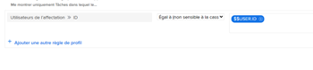
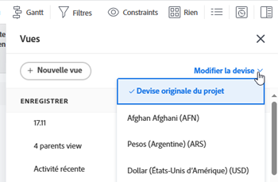

# FAQ sur les rapports

<!--

(NOTE: Alina: ***This is the ONE anchor article for all FAQs about Reporting. Add a new FAQ in the TOC at the top first, then add the answer as a section at the bottom.)

-->

Vous trouverez ci-dessous les questions fréquentes sur les rapports.

## Exigences d’accès

Vous devez disposer des accès suivants pour effectuer les étapes de cet article :

<table style="table-layout:auto"> 
 <col> 
 </col> 
 <col> 
 </col> 
 <tbody> 
  <tr> 
   <td role="rowheader">Formule Adobe Workfront*</td> 
   <td> 
Quelconque
 </td> 
  </tr> 
  <tr> 
   <td role="rowheader">Licence Adobe Workfront*</td> 
   <td> 
Planifier, travailler
 </td> 
  </tr> 
  <tr> 
   <td role="rowheader">Paramétrages du niveau d'accès*</td> 
   <td> 
Modification de l’accès aux rapports, tableaux de bord et calendriers
 
Remarque : Si vous n’avez toujours pas accès à , demandez à votre administrateur Workfront s’il définit des restrictions supplémentaires à votre niveau d’accès. Pour plus d’informations sur la façon dont un administrateur Workfront peut modifier votre niveau d’accès, voir <a href="../../../administration-and-setup/add-users/configure-and-grant-access/create-modify-access-levels.md" class="MCXref xref">Création ou modification de niveaux d’accès personnalisés</a>.
 </td> 
  </tr> 
  <tr> 
   <td role="rowheader">Autorisations d’objet</td> 
   <td> 
Gestion des autorisations d’un rapport
 
Pour plus d’informations sur la demande d’accès supplémentaire, voir <a href="../../../workfront-basics/grant-and-request-access-to-objects/request-access.md" class="MCXref xref">Demande d’accès aux objets </a>.
 </td> 
  </tr> 
 </tbody> 
</table>

&#42;Pour connaître le plan, le type de licence ou l’accès dont vous disposez, contactez votre administrateur Workfront.

## Pourquoi mon calcul personnalisé pour la différence d’une heure n’affiche-t-il pas le résultat correct dans une colonne ?

Sur un rapport de projet, j’ai un calcul qui soustrait les Heures réelles (2) des Heures planifiées (4). Le résultat que j&#39;obtiens est 120 quand il devrait être 2.\
Mon calcul est le suivant :
<pre>valueexpression=SUB(workRequired,realWorkRequired)</pre>

### Réponse

Les champs utilisant les heures dans Workfront sont stockés en minutes. Lorsque vous utilisez le champ dans un calcul, le résultat sera exprimé en minutes. Pour obtenir le résultat en heures, vous devez diviser le résultat du calcul par 60.

Le bon calcul est le suivant :

<pre>valueexpression=SUB(workRequired,realWorkRequired)/60</pre>

## Pourquoi la valeur de chacun de mes éléments de graphique dans un rapport ne s’affiche-t-elle pas sur le graphique ?

### Réponse

Si un graphique de rapport contient plus de 50 éléments de graphique, la valeur de chaque élément ne s’affiche pas dans le graphique.

Lorsque le graphique contient moins de 50 éléments, la valeur de chaque élément s’affiche dans le graphique. Envisagez d&#39;ajouter un filtre ou de modifier les groupements dans le rapport afin de limiter la quantité d&#39;éléments affichés dans chaque élément du graphique.

## Pourquoi mon rapport renvoie-t-il trop de résultats pour afficher le graphique ?

Lorsque je lance un rapport avec un graphique, le message d’erreur &quot;Ouah là-bas...&quot; s’affiche. Ce rapport renvoyait BEAUCOUP de données, ce qui rend le graphique illisible. Essayez de réduire vos résultats en ajoutant un filtre ou en modifiant les regroupements dans votre graphique.&quot;

### Réponse

Cette erreur signifie que votre graphique contient jusqu’à 618 résultats distincts, par exemple plus de 618 barres dans un graphique à barres. Pour résoudre le problème d’affichage, vous devez affiner les résultats en modifiant le filtre actuel et les sélections de regroupement.

Pour plus d’informations sur la modification des filtres et des regroupements, voir les articles [Présentation des filtres dans Adobe Workfront](../../../reports-and-dashboards/reports/reporting-elements/filters-overview.md) et [Présentation des regroupements dans Adobe Workfront](../../../reports-and-dashboards/reports/reporting-elements/groupings-overview.md).

## Pourquoi mes tâches (ou mes problèmes) apparaissent-elles lorsque j’accède au même rapport (ou calendrier) que mon collègue et qu’elles voient plutôt leurs tâches ?

### Réponse

Le rapport ou le calendrier peut comporter une variable de filtre générique qui pointe vers l’utilisateur connecté. Dans ce cas, le rapport affiche des informations en fonction de l’utilisateur connecté. Réglez le filtre pour supprimer le caractère générique qui pointe vers l’utilisateur connecté.\

Pour obtenir la liste complète des variables de filtre générique basées sur l’utilisateur, reportez-vous à la section [Présentation des variables de filtre de caractères génériques](../../../reports-and-dashboards/reports/reporting-elements/understand-wildcard-filter-variables.md).

## Pourquoi les données de mon rapport semblent-elles incomplètes ?

### Réponse

Cela peut se produire dans la plupart des cas si vous disposez d’un accès limité qui vous empêche de voir les éléments du système. De plus, les éléments que vous souhaitez voir ne sont pas partagés avec vous.

Le créateur du rapport peut le modifier pour l’exécuter avec les droits d’accès d’un administrateur système ou de tout utilisateur du forfait ayant accès aux données.

Pour plus d’informations, voir [Exécution et diffusion d’un rapport avec les droits d’accès d’un autre utilisateur](../../../reports-and-dashboards/reports/creating-and-managing-reports/run-deliver-report-access-rights-another-user.md).

## Comment puis-je créer un rapport sur les tâches (ou les problèmes) auxquelles je suis affecté, que je sois ou non le propriétaire de ces tâches ?

### Réponse

Pour afficher toutes les tâches ou tous les problèmes qui vous sont affectés, que vous soyez propriétaire (ou cessionnaire par Principal) ou non, utilisez le filtre suivant dans un rapport de tâche ou de problème :

1. Accédez à un rapport de tâche ou de problème.
1. Sur le **Filtres** , cliquez sur **Ajouter une règle de filtre**.

1. Dans le **Commencez à saisir le nom du champ...** champ, commencer à saisir **Nom d’utilisateur d’affectation**, puis sélectionnez-le lorsqu’il apparaît dans la liste.

   >[!NOTE]
   >
   >N’utilisez pas la variable **Nom attribué** , car ce filtre s’applique uniquement aux tâches et problèmes pour lesquels vous êtes le cessionnaire ou le propriétaire du Principal.

1. Sélectionnez la variable **Égal** modifier.
1. Commencez à taper *$$USER.ID* dans la zone de texte et sélectionnez-la dans la liste déroulante qui s’affiche.\
   Vous affichez ainsi toutes les tâches et tous les problèmes affectés à l’utilisateur connecté. Vous pouvez remplacer le caractère générique par un nom d’utilisateur spécifique.\
   

1. Cliquez sur **Enregistrer + Fermer**.

## Pourquoi les liens Ajouter des problèmes/Ajouter des tâches n’apparaissent-ils pas au bas de mes listes de problèmes et de tâches sur un projet ?

### Réponse

Tout d’abord, assurez-vous que vous disposez des droits d’accès et des autorisations appropriés pour ajouter des problèmes et des tâches à un projet. Dans ce cas, vous devriez voir le **Ajout de problèmes** et **Ajout de tâches** les liens au bas de la **Problèmes** et **Tâche** des listes.

Toutefois, certains éléments peuvent empêcher l’affichage de ces liens :

* Si le filtre rapide est appliqué à ces listes, les liens ne s’affichent pas. Supprimez le filtre rapide et les liens doivent s’afficher pour que vous puissiez ajouter des problèmes et des tâches à vos projets.\
  Pour plus d’informations sur le filtre rapide, voir [Prise en main des listes dans Adobe Workfront](../../../workfront-basics/navigate-workfront/use-lists/view-items-in-a-list.md).

* Si vous avez une **Regroupement** appliqués à ces listes, les liens ne s’affichent pas. Supprimez le **Regroupement** et les liens doivent s’afficher afin que vous puissiez ajouter des problèmes et des tâches à vos projets.\
  Pour plus d’informations sur la création de groupes, voir [Présentation des regroupements dans Adobe Workfront](../../../reports-and-dashboards/reports/reporting-elements/groupings-overview.md).

* Si vous avez une **Affichage** appliqués à ces listes dans lesquelles une devise est sélectionnée autre que la devise par défaut du projet, les liens ne s’affichent pas. Modifiez la variable **Affichage** to **Devise originale du projet** et les liens doivent s’afficher afin que vous puissiez ajouter des problèmes et des tâches à vos projets.\
  Pour plus d’informations sur la modification de la devise dans votre vue, voir [Créer des rapports de données financières avec des taux de change uniques](../../../reports-and-dashboards/reports/creating-and-managing-reports/create-financial-data-reports-unique-exchange-rates.md).

## Les informations de mon rapport ou de mon tableau de bord sont-elles actualisées automatiquement ?

### Réponse

Les informations contenues dans les rapports ou les tableaux de bord ne sont pas automatiquement actualisées.

Les informations peuvent être actualisées manuellement dans un rapport mis en cache.\
Pour plus d’informations sur l’actualisation d’un rapport mis en cache, voir [Exécution d’un rapport](../../../reports-and-dashboards/reports/creating-and-managing-reports/run-report.md).

Les informations peuvent être actualisées manuellement dans un tableau de bord mis en cache.\
Pour plus d’informations sur l’actualisation d’un tableau de bord mis en cache, voir la section [Afficher les tableaux de bord](../../../reports-and-dashboards/dashboards/understanding-dashboards/get-started-dashboards.md#running-dashboards) dans l’article [Prise en main des tableaux de bord](../../../reports-and-dashboards/dashboards/understanding-dashboards/get-started-dashboards.md).

## Puis-je modifier le propriétaire d’un rapport ?

### Réponse

Vous ne pouvez pas modifier le propriétaire d’un rapport. Cependant, l’utilisateur qui a créé le rapport peut permettre à d’autres utilisateurs de le modifier. La manière dont vous pouvez autoriser les utilisateurs à modifier un rapport dépend du type d’utilisateur que vous êtes.

* Les administrateurs système peuvent autoriser les utilisateurs disposant d’une licence Plan à modifier les rapports en configurant l’option Modifier de la ligne Rapports afin d’inclure l’accès à Créer un rapport.\
  Pour plus d’informations, voir [Accorder l’accès aux rapports, aux tableaux de bord et aux calendriers](../../../administration-and-setup/add-users/configure-and-grant-access/grant-access-reports-dashboards-calendars.md).

* Tout utilisateur final ayant accès à la création et au partage de rapports peut permettre à d’autres personnes de modifier des rapports individuels en les partageant et en leur accordant des autorisations Gérer les utilisateurs.\
  Pour plus d’informations, voir [Partage d’un rapport dans Adobe Workfront](../../../reports-and-dashboards/reports/creating-and-managing-reports/share-report.md).

Si vous disposez des autorisations nécessaires pour afficher ou gérer un rapport, vous pouvez également en faire une copie, dont vous serez alors le propriétaire par défaut. Pour en savoir plus sur la copie d’un rapport, voir [Créer une copie d’un rapport](../../../reports-and-dashboards/reports/creating-and-managing-reports/create-copy-report.md).

## Pourquoi ne puis-je pas accéder à un rapport détenu par un utilisateur désactivé ?

### Réponse

Parfois, le propriétaire du rapport est également l’utilisateur spécifié dans la variable **Exécutez ce rapport avec les droits d’accès de :** sur le rapport. Si la variable **Exécutez ce rapport avec les droits d’accès de :** est désactivé, le rapport ne s’affiche plus pour les utilisateurs pour lesquels le rapport est partagé avec eux. Dans ce cas, vous pouvez rendre le rapport accessible à nouveau en laissant le champ **Exécutez ce rapport avec les droits d’accès de :** vide ou saisie d’un utilisateur actif dans le champ .

Pour en savoir plus sur la variable **Exécutez ce rapport avec les droits d’accès de :** champ, voir [Exécution et diffusion d’un rapport avec les droits d’accès d’un autre utilisateur](../../../reports-and-dashboards/reports/creating-and-managing-reports/run-deliver-report-access-rights-another-user.md). Pour plus d’informations sur l’identification de tous les rapports détenus par des utilisateurs désactivés, voir [Créer un rapport sur les activités de reporting](../../../reports-and-dashboards/reports/report-usage/create-report-reporting-activities.md).

## Comment accéder à un tableau de bord contenant un rapport détenu par un utilisateur supprimé ?

### Réponse

Lorsque vous supprimez un utilisateur, vous pouvez toujours accéder aux rapports qu’il a créés. Toutefois, les tableaux de bord qui incluaient le rapport sont également supprimés. Cela signifie que vous ne pouvez plus accéder aux éléments suivants :

* Un tableau de bord contenant le rapport
* Section personnalisée contenant un tableau de bord du rapport

Pour en savoir plus sur les implications de la suppression d’un utilisateur, voir [Suppression d’utilisateurs](../../../administration-and-setup/add-users/create-and-manage-users/delete-a-user.md).

Si vous disposez de l’accès Affichage au rapport, vous pouvez effectuer les opérations suivantes :

1. Créez une copie du rapport.\
   Pour savoir comment créer une copie d’un rapport, voir [Créer une copie d’un rapport](../../../reports-and-dashboards/reports/creating-and-managing-reports/create-copy-report.md).

1. Mettez à jour le tableau de bord pour inclure le rapport copié.\
   Pour savoir comment modifier un tableau de bord, voir [Modification d’un tableau de bord](../../../reports-and-dashboards/dashboards/creating-and-managing-dashboards/edit-dashboard.md).
