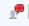
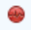

# Icônes de statut intégrées dans les vues

<!-- Audited: 11/2024 -->

<!--(NOTE: ALina: ***Link this from the Understanding Fields in Lists and Reports.)-->

Vous pouvez ajouter le champ Icônes de statut intégrées sous forme de colonne dans vos vues afin d’améliorer la visibilité sur les points clés de vos objets. À l’aide des icônes de statut, vous pouvez voir en un coup d’œil si les conditions suivantes existent :

* Un objet est associé à des documents
* Un objet est associé à un processus d’approbation
* Un objet est associé à des notes supplémentaires
* Une dépense est facturable ou remboursable
* Une tâche est sur un chemin critique
* Un utilisateur appartient à une entreprise, à une équipe ou se trouve personnellement dans un autre fuseau horaire.

Tenez compte des points suivants :

* La plupart des indicateurs du champ Icônes de statut sont des liens rapides vers l’objet ou la zone de l’objet qu’ils représentent.

* Si l’un des éléments représentés par les icônes est absent de l’objet, l’icône représentant l’élément manquant apparaît grisée dans la colonne Icônes de statut, à la place d’une image en couleur.

  

  Pour plus d’informations, voir la section [Vue d’ensemble des icônes et indicateurs de statut](#overview-of-status-icons-and-flags) dans cet article.

* Dans certains cas, le champ **Icônes de statut** est nommé **Indicateurs** ou **Icônes de vue**.\
  Vous ne pouvez pas personnaliser l’aspect des icônes incluses dans le champ Icônes de statut.

* Vous ne pouvez pas modifier le nombre d’icônes dans le champ Icônes de statut.

## Conditions d’accès

+++ Développez pour afficher les exigences d’accès aux fonctionnalités de cet article.

Vous devez disposer des accès suivants pour effectuer les étapes décrites dans cet article :

<table style="table-layout:auto"> 
 <col> 
 <col> 
 <tbody> 
  <tr> 
   <td role="rowheader">Formule Adobe Workfront*</td> 
   <td> 
Tous
 </td> 
  </tr> 
  <tr> 
   <td role="rowheader">Licence Adobe Workfront*</td> 
   <td> 
      
Nouveau :

         <ul>
         <li>
Contributeur ou version ultérieure
</li>
         </ul>
      
Actuel :

         <ul>
         <li>
Requête ou supérieure
</li>
         </ul>
   </td>
  </tr>
  <tr> 
   <td role="rowheader">Configurations du niveau d’accès*</td> 
   <td> 
Modifier l’accès aux filtres, vues et groupes
 
Modifier l’accès aux rapports, tableaux de bord et calendriers pour ajouter des colonnes à un rapport
</td> 
  </tr> 
  <tr> 
   <td role="rowheader">Autorisations d’objet</td> 
   <td> 
Autorisations de gestion pour une vue existante
 
Autorisations de gestion d’un rapport pour y ajouter des colonnes
</td> 
  </tr> 
 </tbody> 
</table>

*Pour plus d’informations, voir [Exigences d’accès dans la documentation Workfront](/help/quicksilver/administration-and-setup/add-users/access-levels-and-object-permissions/access-level-requirements-in-documentation.md).

+++

## Ajouter le champ Icônes de statut à une vue

Certains rapports et vues intégrés disposent déjà du champ Icônes de statut inclus.

Vous ne pouvez pas ajouter le champ Icônes de statut à toutes les vues.

Pour ajouter le champ Icônes de statut à une vue personnalisée créée entièrement :

1. Accédez à une liste de l’un des objets suivants :

   * Tâches
   * Problèmes
   * Projets
   * Tâches de modèles
   * Modèles
   * Frais
   * Documents
   * Utilisateurs\
     Seuls ces objets ont le champ **Icônes de statut** de disponible.\
     Pour plus d’informations sur les listes d’objets, voir [Prise en main des listes dans Adobe Workfront](../../../workfront-basics/navigate-workfront/use-lists/view-items-in-a-list.md).

1. Dans le menu déroulant **Vue**, sélectionnez **Nouvelle vue**.

1. Cliquez sur **Ajouter une colonne**.
1. Dans la zone **Afficher dans cette colonne**, commencez à saisir l’un des noms de champ suivants, puis sélectionnez-le lorsqu’il apparaît dans la liste :

   * *Icônes de statut*
   * *Indicateurs*
   * *Icônes de vue * (uniquement dans les vues Document).

   Les icônes intégrées sont répertoriées sous l’un de ces noms.\
   Une vue de modèle contient les champs **Icônes de statut** et **Indicateurs**. Dans ce cas, les deux colonnes contiennent des icônes identiques.\
   Les vues de document contiennent un champ **Icônes de vue**.

1. Cliquez sur **Enregistrer la vue**.
1. (Facultatif) Indiquez un nouveau nom à votre vue, puis cliquez sur **Enregistrer la vue**.\
   Cette action ajoute la colonne **Icônes de statut** à votre vue.
1. (Facultatif) Placez le pointeur de la souris sur une icône pour comprendre ce qu’elle représente.
1. (Facultatif) Cliquez sur une icône pour accéder à la zone de l’objet qu’elle représente.\
   Toutes les icônes ne sont pas des liens vers des objets.\
   Pour obtenir la liste complète des attributs de chaque icône, voir la section [Présentation des icônes de statut et des indicateurs](#overview-of-status-icons-and-flags).

## Présentation des icônes de statut et des indicateurs {#overview-of-status-icons-and-flags}

Le tableau suivant répertorie toutes les icônes de statut disponibles dans Workfront, le type d’objet qui peut être associé à ces icônes, ainsi que ce qui se passe lorsque vous cliquez dessus.

Vous devez disposer des autorisations à au moins Afficher les objets afin de pouvoir cliquer sur certaines des icônes suivantes et accéder à ces objets.

<table style="table-layout:auto"> 
 <col> 
 <col> 
 <col> 
 <col> 
 <col> 
 <thead> 
  <tr> 
   <th><strong>Icône de statut ou indicateur</strong> </th> 
   <th><strong>Description</strong> </th> 
   <th><strong>Objet</strong> </th> 
   <th>En cas de clic</th> 
   <th> </th> 
  </tr> 
 </thead> 
 <tbody> 
  <tr> 
   <td> ou   ou   ou </td> 
   <td>Indique que la condition du projet est Dans les temps (vert), En difficulté (rouge) ou À risque (jaune). Pour plus d’informations sur la condition du projet, voir <a href="../../../manage-work/projects/manage-projects/project-condition-and-condition-type.md" class="MCXref xref">Présentation de la condition et du type de condition du projet</a>.</td> 
   <td>Projets</td> 
   <td>Cliquez pour ouvrir la liste des tâches du projet. </td> 
   <td> </td> 
  </tr> 
  <tr> 
   <td>  </td> 
   <td>Indique que l’objet comporte des notes (mises à jour) dans l’onglet Mises à jour.</td> 
   <td> 
Projets Tâches Problèmes Modèles Modèles de tâches
 </td> 
   <td> 
Cliquez pour ouvrir l’onglet Mises à jour de l’objet. 
 </td> 
   <td> </td> 
  </tr> 
  <tr> 
   <td> ou </td> 
   <td>Indique que des documents sont joints à l’objet. </td> 
   <td> Projets Tâches Problèmes Modèles Modèles de tâches </td> 
   <td>Cliquez pour ouvrir l’onglet Documents de l’objet. </td> 
   <td> </td> 
  </tr> 
  <tr> 
   <td> ou </td> 
   <td>Indique que des problèmes sont en cours sur le projet ou la tâche.</td> 
   <td> Projets Tâches </td> 
   <td>Cliquez pour ouvrir l’objet. </td> 
   <td> </td> 
  </tr> 
  <tr> 
   <td>  ou </td> 
   <td>Indique qu’il y a une approbation sur l’objet.</td> 
   <td> Projets Tâches Problèmes Modèles Modèles de tâches </td> 
   <td>Cliquez pour ouvrir l’objet. </td> 
   <td> </td> 
  </tr> 
  <tr> 
   <td>  </td> 
   <td> 
Vous pouvez ajouter une colonne Icône des dépenses dans votre vue pour afficher cette icône. Cela indique que des dépenses sont associées au projet ou à la tâche.
 </td> 
   <td> 
Projets
 
Tâches
 </td> 
   <td>Cliquez pour ouvrir l’onglet Dépenses du projet ou de la tâche. </td> 
   <td> </td> 
  </tr> 
  <tr> 
   <td>           </td> 
   <td> 
Indique que le statut de la progression d’une tâche est l’un des suivants :
 
    <ul> 
     <li>Dans les temps (carré vert)</li> 
     <li>Urgent (cercle rouge)</li> 
     <li>À risque (diamant bleu)</li> 
     <li>En retard (triangle jaune)</li> 
    </ul> 
Pour plus d’informations sur le statut de la progression des tâches, consultez <a href="../../../manage-work/tasks/task-information/task-progress-status.md" class="MCXref xref">Vue d’ensemble du statut de progression de tâche</a>.
 </td> 
   <td>Tâches</td> 
   <td>Cliquez pour ouvrir la tâche. </td> 
   <td> </td> 
  </tr> 
  <tr> 
   <td>  ou </td> 
   <td>Indique que la tâche est actuellement sur le chemin Critique.  Pour plus d’informations sur les tâches sur un chemin critique du projet, consultez <a href="../../../manage-work/tasks/manage-tasks/critical-path.md" class="MCXref xref">Vue d’ensemble du chemin critique de projet</a>.</td> 
   <td>Tâches</td> 
   <td>Cliquez pour ouvrir la tâche.</td> 
   <td> </td> 
  </tr> 
  <tr> 
   <td>  </td> 
   <td>Indique que la tâche est associée à un jalon. Votre administrateur ou administratrice système peut personnaliser la couleur du losange dans votre environnement. Pour plus d’informations sur les jalons, consultez <a href="../../../administration-and-setup/customize-workfront/configure-approval-milestone-processes/create-milestone-path.md" class="MCXref xref">Créer un chemin jalonné</a>.</td> 
   <td>Tâches</td> 
   <td>Cliquez pour ouvrir la tâche. </td> 
   <td> </td> 
  </tr> 
  <tr> 
   <td>  </td> 
   <td>Liez à l’objet source d’un problème. L’objet source d’un problème est l’objet dans lequel le problème a été consigné. Une tâche ou un projet peut être un objet source pour les problèmes. </td> 
   <td>Problèmes</td> 
   <td>Cliquez pour ouvrir l’objet source (tâche ou projet) d’un problème. </td> 
   <td> </td> 
  </tr> 
  <tr> 
   <td>  </td> 
   <td>Indique qu’un objet de résolution résout finalement le problème. Dans ce cas, vous ne pouvez pas terminer le problème. Il est terminé lorsque l’objet de résolution est terminé.  Pour plus d’informations sur les objets de résolution, consultez <a href="../../../manage-work/issues/convert-issues/resolving-and-resolvable-objects.md" class="MCXref xref">Vue d’ensemble des objets de résolution et résolvables</a>.</td> 
   <td>Problèmes</td> 
   <td>Cliquez pour ouvrir l’objet de résolution du problème. </td> 
   <td> </td> 
  </tr> 
  <tr> 
   <td>  </td> 
   <td>Affichez un document.</td> 
   <td>Documents</td> 
   <td>Cliquez pour télécharger le document.</td> 
   <td> </td> 
  </tr> 
  <tr> 
   <td>  </td> 
   <td>Téléchargez un document.</td> 
   <td>Documents</td> 
   <td>Cliquez pour télécharger le document.</td> 
   <td> </td> 
  </tr> 
  <tr> 
   <td>  </td> 
   <td>Indique le type de document.</td> 
   <td>Documents</td> 
   <td>Cliquez pour télécharger le document.</td> 
   <td> </td> 
  </tr> 
  <tr> 
   <td>  </td> 
   <td>Indique que l’utilisateur ou l’utilisatrice est associé à une société. </td> 
   <td>Utilisateurs</td> 
   <td>Indisponible</td> 
   <td> </td> 
  </tr> 
  <tr> 
   <td>  </td> 
   <td>Indique que l’utilisateur ou l’utilisatrice est associé à une équipe.</td> 
   <td>Utilisateurs</td> 
   <td>Cliquez pour ouvrir le profil utilisateur ou utilisatrice.</td> 
   <td> </td> 
  </tr> 
  <tr> 
   <td>  </td> 
   <td>Raccourci vers l’onglet Affectation de l’utilisateur ou l’utilisatrice. </td> 
   <td>Utilisateurs</td> 
   <td>Cliquez pour ouvrir l’onglet Affectation de l’utilisateur ou l’utilisatrice et découvrez les éléments de travail qui lui sont affectés.</td> 
   <td> </td> 
  </tr> 
  <tr> 
   <td>  </td> 
   <td>Indique que l’utilisateur ou l’utilisatrice se trouve dans un fuseau horaire différent de celui du système.</td> 
   <td>Utilisateurs</td> 
   <td>Indisponible</td> 
   <td> </td> 
  </tr> 
  <tr> 
   <td>  </td> 
   <td>Indique qu’une dépense est facturable. Pour plus d’informations sur les dépenses, consultez <a href="../../../manage-work/projects/project-finances/manage-project-expenses.md" class="MCXref xref">Gérer les dépenses de projet</a>.</td> 
   <td>Frais</td> 
   <td>Indisponible</td> 
   <td> </td> 
  </tr> 
  <tr> 
   <td>  </td> 
   <td> Indique qu’une dépense est remboursable. Pour plus d’informations sur les dépenses, consultez <a href="../../../manage-work/projects/project-finances/manage-project-expenses.md" class="MCXref xref">Gérer les dépenses de projet</a>.</td> 
   <td>Frais</td> 
   <td>Indisponible</td> 
   <td> </td> 
  </tr> 
  <tr> 
   <td> </td> 
   <td> Indique qu’une dépense a été remboursée. Pour plus d’informations sur les dépenses, consultez <a href="../../../manage-work/projects/project-finances/manage-project-expenses.md" class="MCXref xref">Gérer les dépenses de projet</a>.</td> 
   <td>Frais</td> 
   <td>Indisponible</td> 
   <td> </td> 
  </tr> 
 </tbody> 
</table>
