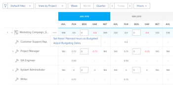

# Budgétiser des ressources dans le planificateur de ressources à l’aide des vues Projet et Rôle

<!--

(NOTE: broken off of another larger article (Planning in the RP); reformat, restructure, relink)

-->

La fonction principale du planificateur de ressources est de budgétiser vos ressources pour le travail qui doit être effectué sur les projets.

>[!IMPORTANT]
>
>Vous ne pouvez budgétiser vos ressources que si vous appliquez les vues **Par projet** ou **Par rôle** du planificateur de ressources.

Avant de commencer à budgétiser les informations dans le planificateur de ressources, consultez les articles suivants :

* [Vue d’ensemble du planificateur de ressources](../../resource-mgmt/resource-planning/get-started-resource-planner.md)
* [Accès nécessaire pour budgétiser des ressources dans Adobe Workfront](../../resource-mgmt/resource-planning/access-needed-to-budget-resources.md)
* [Vue d’ensemble des heures, des équivalents temps complet et des informations sur les coûts dans les vues Projet et Rôle du planificateur de ressources](../../resource-mgmt/resource-planning/overview-of-planner-hour-fte-cost-information-in-role-project-views.md)

## Conditions d’accès

+++ Développez pour afficher les exigences d’accès aux fonctionnalités de cet article.

Vous devez disposer des accès suivants pour effectuer les étapes décrites dans cet article :

<table style="table-layout:auto"> 
 <col> 
 <col> 
 <tbody> 
  <tr> 
   <td role="rowheader">Formule Adobe Workfront</td> 
    <td>
Nouveau : Tous

       
ou

       
Actuel : Pro ou supérieur
 </td> 
  </tr> 
  <tr> 
   <td role="rowheader">Licence Adobe Workfront</td> 
   <td>
Nouveau : Standard

       
ou

       
Actuel : formule
</td> 
  </tr> 
  <tr> 
   <td role="rowheader">Configurations des niveaux d’accès</td> 
   <td> 
Accès en modification à la gestion des ressources qui inclut l’accès en modification des priorités et des heures du budget dans le planificateur de ressources.
 
Modifier l'accès aux données financières pour budgéter les ressources par coût
 
Accès Modifier aux projets et aux utilisateurs et utilisatrices
</td> 
  </tr> 
  <tr> 
   <td role="rowheader">Autorisations d’objet</td> 
   <td> 
Autorisations Gérer pour les projets dont vous souhaitez budgétiser les informations.
</td> 
  </tr> 
 </tbody> 
</table>

Pour plus de détails sur les informations contenues dans ce tableau, consultez [Conditions d’accès préalables dans la documentation Workfront](/help/quicksilver/administration-and-setup/add-users/access-levels-and-object-permissions/access-level-requirements-in-documentation.md).

+++

## Budgéter des ressources dans le planificateur de ressources

* [Budgéter des ressources dans le planificateur de ressources](#budget-resources-in-the-project-view)
* [Budgéter des ressources dans la vue Rôle](#budget-resources-in-the-role-view)
* [Budgéter des ressources en masse](#budget-resources-in-bulk)

### Budgéter des ressources dans la vue Projet {#budget-resources-in-the-project-view}

<!--

(NOTE: this section is linked to the Budgeting Project Resources in the Business Case article)

-->

{{step1-to-resourcing}}

1. Le **planificateur** s’affiche par défaut.
1. (Le cas échéant) Sélectionnez la vue **Par projet**.
1. Développez les projets et les fonctions pour gérer l’affectation pour le projet, les fonctions ou les utilisateurs et utilisatrices.
1. Pour répartir l’affectation entre les utilisateurs et utilisatrices, effectuez l’une des opérations suivantes :

   * Dans la colonne **BDG**, indiquez manuellement un nombre d’heures, d’équivalent temps complet ou de coûts budgétés pour les utilisateurs et utilisatrices.

   * Cliquez sur le menu **Plus** de la fonction de l’utilisateur ou de l’utilisatrice, puis sur **Définir le nombre d’heures prévues des utilisateurs et utilisatrices comme budgétées**.\
     Les heures budgétées de chaque utilisateur et utilisatrice sont calculées à l’aide de la formule suivante :

     `User Budgeted Hours = User Planned Hours`

1. Pour budgéter l’affectation pour les fonctions, effectuez l’une des opérations suivantes :

   * Dans la colonne **BDG**, indiquez manuellement un nombre d’heures, d’équivalent temps complet ou de coûts budgétés pour la fonction.

     >[!NOTE]
     >
     >Les heures budgétées du rôle sont ajoutées aux heures budgétées du projet.

   * (Le cas échéant) Si vous avez budgété des heures pour les utilisateurs et utilisatrices, cliquez sur le menu **Plus** de la fonction, puis sur **Heures budgétées totales des utilisateurs et utilisatrices pour le rôle**.\
     Les heures budgétées de chaque rôle sont calculées à l’aide de la formule suivante :

     `Role Budgeted Hours = SUM(User Budgeted Hours)`

   * Cliquez sur le menu **Plus** du projet, puis sur **Définir les heures prévues des rôles comme budgété**.\
     Les heures budgétées de chaque rôle sont calculées à l’aide de la formule suivante :\
     &#x200B;*

     `Role Budgeted Hours = Role Planned Hours`

     >[!NOTE]
     >   
     >* Les heures budgétées du rôle sont ajoutées aux heures budgétées du projet.
     >* Les personnes peuvent être incluses dans le budget pour les rôles Principal et Autre (ou secondaire).
     >* Le **Pourcentage de disponibilité équvalent temps plein** pour les rôles de la personne doit être un nombre différent de 0 % pour que les Heures disponibles affichent une valeur dans le planificateur de ressources pour une fonction. Si une personne est associée à un rôle avec un **Pourcentage de disponibilité équivalent temps complet** de 0 %, la valeur des Heures disponibles est zéro pour cette fonction. Dans ce cas, le rôle peut afficher une **Valeur nette** négative.\
     >Pour plus d’informations sur le **Pourcentage de disponibilité équivalent temps complet** pour les fonctions, voir l’article [Modifier le profil d’une personne](../../administration-and-setup/add-users/create-and-manage-users/edit-a-users-profile.md).

   * Dans la colonne **BDG**, indiquez manuellement un nombre d’heures, l’équivalent temps complet ou les coûts prévus au budget pour le projet. Cette opération répartit le nombre d’heures budgétées du projet sur chaque rôle du projet. Les scénarios suivants sont possibles :

      * Si le nombre d’heures budgétées du projet que vous indiquez est égal au nombre d’heures prévues du projet, le nombre d’heures prévues du projet correspond au nombre d’heures prévues du rôle.
      * Si le nombre d’heures budgétées du projet que vous spécifiez n’est pas égal au nombre d’heures prévues du projet, le nombre d’heures prévues du projet est réparti en fonction du pourcentage de nombre d’heures prévues nécessaires pour chaque rôle.\
        Par exemple, si le nombre d’heures prévues d’un projet est de 20 et que ces heures sont réparties entre deux fonctions (12 heures prévuees pour le consultant ou la consultante et 8 heures prévuees pour l’ingénieur ou l’ingénieure) et que vous budgétez 30 heures pour le projet, les heures sont réparties comme suit : le rôle de consultant ou conusltante reçoit 18 heures budgétées et le rôle d’ingénieur ou ingénieure reçoit 12 heures budgétées.

1. Pour budgéter l’affectation du projet, effectuez l’une des opérations suivantes :

   * Établissez le budget des rôles du projet, comme décrit à l’étape 7.\
     Les heures budgétées du projet sont calculées selon la formule suivante :

     `Project Budgeted Hours = SUM(Role Budgeted Hours)`

   * Dans la colonne **BDG**, indiquez manuellement un nombre d’heures, d’équivalent temps complet ou de coûts prévus au budget pour le projet.\
     Cela met à jour les heures budgétées du rôle, comme décrit à l’étape 7.\
     

1. Cliquer sur **Enregistrer**.\
   Une fois que vous avez budgété vos ressources dans le planificateur de ressources, les heures budgétées de vos ressources et les coûts associés sont répertoriés dans le business case de chaque projet.\
   Pour plus d’informations sur la compréhension de la zone Établissement du budget des ressources du business case, reportez-vous à la section « Établissement du budget des ressources » de l’article [Vue d’ensemble des zones du business case](../../manage-work/projects/define-a-business-case/areas-of-business-case.md).

1. (Facultatif) Sélectionnez la vue Utilisateur ou utilisatrice pour voir s’il y a des suraffectations ou une sous-utilisation pour chaque personne entre les heures disponibles et le nombre d’heures prévues. Les heures budgétées ne sont pas visibles dans la vue Utilisateur ou utilisatrice.

   Pour plus d’informations sur la façon dont Workfront calcule la disponibilité d’une personne, voir [Configurer des préférences de gestion des ressources](../../administration-and-setup/set-up-workfront/configure-system-defaults/configure-resource-mgmt-preferences.md).

### Budgéter les ressources dans la vue Rôle {#budget-resources-in-the-role-view}

<!--

(NOTE: THIS IS WRONG - I LOGGED A BUG TO FIX THIS LINK - IT SHOULD GO TO"ACCESS NEEDED TO BUDGET IN THE RP":

Planning in the resource planner has links to the UI - ensure Flare notes are there for this: https://workfront.zendesk.com/hc/en-us/articles/115006356928 - the "Budgeting resources in the role view" is linked to this tooltip: ***This is linked to the product in the RP when the user does not have Manage rights on one of the projects under the role. This tool tip is linked here: "You don't have Manage permissions for all projects. Budget hours by individual project instead. Learn more...")

-->

Vous devez disposer de l’accès Modifier à la gestion des ressources et aux données financières et des autorisations Gérer les finances sur les projets afin d’établir le budget des ressources dans le planificateur de ressources. Si vous ne disposez que d’un accès en affichage à au moins un projet répertorié sous une fonction, vous ne pouvez pas budgéter les affectations pour le rôle dans la vue Rôle. Vous pouvez toujours budgéter une affectation pour les projets pour lesquels vous disposez des autorisations de gestion.

Pour plus d’informations sur l’accès nécessaire à l’établissement d’un budget pour des ressources, voir l’article [Accès nécessaire pour budgéter les ressources dans Adobe Workfront](../../resource-mgmt/resource-planning/access-needed-to-budget-resources.md).

Pour budgéter les affectations dans le planificateur de ressources dans la&#x200B;**&#x200B;** vue Rôle, procédez comme suit :

1. Cliquez sur l’icône **Menu principal**  dans le coin supérieur droit d’Adobe Workfront.

1. Cliquez sur **Ressources**.
1. Le **planificateur** s’affiche par défaut.
1. (Le cas échéant) Sélectionnez la vue **Afficher par rôle**.
1. Développez les fonctions et les projets pour gérer l’affectation pour le projet, les fonctions ou les personnes.
1. Pour budgéter l’affectation pour les personnes, effectuez l’une des opérations suivantes :

   * Dans la colonne **BDG**, indiquez manuellement un nombre d’heures, d’équivalent temps complet ou de coûts budgétés pour les personnes.
   * Cliquez sur le menu **Plus** pour le projet, puis cliquez sur **Définir les heures prévues des utilisateurs et utilisatrices comme budgétées**.\
     Les heures budgétées de chaque utilisateur et utilisatrice sont calculées à l’aide de la formule suivante :

     `User Budgeted Hours = User Planned Hours`

1. Pour budgéter l’affectation pour les fonctions, effectuez l’une des opérations suivantes :

   * Dans la colonne **BDG**, spécifiez manuellement un nombre d’heures, d’équivalent temps complet ou de coûts budgétés pour les fonctions.\
     Cette option répartit les heures budgétées du rôle sur les heures budgétées du projet pour les projets pour lesquels vous avez accès en gestion.

   * Cliquez sur le menu **Plus** pour la fonction, puis cliquez sur **Définir les heures prévuees des projets comme budgétées.** Les heures budgétées du rôle sont calculées à l’aide de la formule suivante :\
     &#x200B;*

     `Role Budgeted Hours = SUM(Project Budgeted Hours)`

     * Les Heures budgétées du projet sont calculées à l’aide de la formule suivante :

     `Project Budgeted Hours = Project Planned Hours`

   * Dans la colonne **BDG**, spécifiez manuellement un nombre d’heures, d’équivalent temps complet ou de coûts budgétés pour les projets répertoriés sous la fonction.\
     Cela ajoute le nombre d’heures budgétées du projet au rôle.

   >[!NOTE]
   >
   >Les personnes peuvent être incluses dans le budget pour les rôles Principal et Autre (ou secondaire). Le **Pourcentage de disponibilité équivalent temps complet** pour les rôles de la personne doit être un nombre différent de 0 % pour que les Heures disponibles affichent une valeur dans le planificateur de ressources pour une fonction. Si une personne est associée à un rôle avec un **Pourcentage de disponibilité équivalent temps complet** de 0 %, la valeur des Heures disponibles est zéro pour cette fonction. Dans ce cas, le rôle peut afficher une **Valeur nette** négative.\
   >Pour plus d’informations sur le **Pourcentage de disponibilité équivalent temps complet** pour les fonctions, voir l’article [Modifier le profil d’un utilisateur ou d’une utilisatrice](../../administration-and-setup/add-users/create-and-manage-users/edit-a-users-profile.md).

1. Pour budgéter l’affectation du projet, effectuez l’une des opérations suivantes :

   * Dans la colonne **BDG**, indiquez manuellement un nombre d’heures, d’équivalent temps complet ou de coûts budgétés pour les projets.\
     Cela met également à jour les heures budgétées pour les rôles sous lesquels le projet est répertorié.

   * Cliquez sur le menu **Plus** pour la fonction, puis cliquez sur **Définir les heures prévues des projets comme budgétées**.\
     Les heures budgétées du projet sont calculées selon la formule suivante :

     `Project Budgeted Hours = Project Planned Hours`

     Les heures budgétées du projet sont ajoutées aux heures budgétées du rôle.

   * (Le cas échéant) Si vous avez budgété des heures pour les utilisateurs et utilisatrices, cliquez sur le menu **Plus** pour le projet, puis cliquez sur **Heures budgétées totales des utilisateurs et utilisatrices pour le projet**.\
     Le calcul des heures budgétées du projet est effectué à l’aide de la formule suivante :

     `Project Budgeted Hours = SUM(User Budgeted Hours)`

     

1. Cliquer sur **Enregistrer**.\
   Une fois que vous avez budgété vos ressources dans le Planificateur de ressources, les heures budgétées pour vos ressources et tout coût associé à celles-ci sont répertoriés dans l&#39;Analyse de rentabilité de chaque projet.
Pour plus d’informations sur la compréhension de la zone Établissement du budget de ressources du business case, voir l’article [Budgéter les ressources dans le business case](../../manage-work/projects/define-a-business-case/budget-resources-in-business-case.md).

1. (Facultatif) Sélectionnez la vue **Afficher par utilisateur ou utilisatrice** pour remarquer toute suraffectation ou sous-utilisation des utilisateurs et utilisatrices entre les heures disponibles et prévues pour chaque personne. Les heures budgétées ne sont pas visibles dans la vue Afficher par utilisateur ou utilisatrice.

### Budgéter des ressources en masse {#budget-resources-in-bulk}

Vous pouvez budgéter les affectations de vos ressources en masse lorsque vous utilisez des liens rapides. Les liens rapides sont disponibles uniquement pour les vues Projet et Rôle.

>[!NOTE]
>
>Lorsque vous utilisez les liens rapides pour budgéter les affectations pour les ressources, la budgétisation n’est automatiquement appliquée qu’aux périodes affichées à l’écran. Si la chronologie d’un projet s’étend sur une période plus longue que celle affichée à l’écran, vous devez faire défiler de gauche à droite, puis utiliser les liens rapides pour budgéter automatiquement vos ressources.

Pour budgéter vos ressources en masse, procédez comme suit :

1. Accédez au .\
   Pour plus d’informations sur l’accès au planificateur de ressources, voir la section « Accéder au planificateur de ressources » dans l’article [Vue d’ensemble du planificateur de ressources](../../resource-mgmt/resource-planning/get-started-resource-planner.md).\
   Une liste des projets que vous pouvez gérer s’affiche dans la liste.

1. (Facultatif) Développez chaque projet pour afficher une liste des fonctions qui lui sont associées.\
   Ou
1. (Facultatif) Sélectionnez **Afficher par rôle**, puis développez chaque rôle pour afficher la liste des projets qui lui sont associés.
1. Pointez sur le nom d’un projet ou d’une fonction.
1. Cliquez sur l’icône **Plus**  qui s’affiche à l’extrémité droite du nom du projet ou du rôle.

1. Cliquez sur l’une des options disponibles pour spécifier automatiquement le nombre d’heures budgétées (BDG) pour d’autres objets.

   Les options de budgétisation en masse diffèrent selon que vous avez cliqué sur l’icône Plus d’un projet ou d’un rôle. Le tableau ci-dessous illustre les options disponibles pour les projets et les rôles :

   <table style="table-layout:auto"> 
    <col> 
    <col> 
    <col> 
    <tbody> 
     <tr> 
      <td> </td> 
      <td><strong>Vue Projet</strong> </td> 
      <td><strong>Vue Rôle</strong> </td> 
     </tr> 
     <tr> 
      <td>Options du projet</td> 
      <td> 
       <ul> 
        <li><strong>Définir les heures prévues des rôles comme budgété</strong> : sélectionnez cette option pour que les heures budgétées du rôle soient identiques à ses heures prévues. Les heures budgétées totales pour les rôles s’afficheront pour les heures budgétées du projet. </li> 
        <li><strong>Ajuster les dates de budget</strong> : sélectionnez cette option pour déplacer les heures budgétées vers une autre période. Pour plus d’informations sur l’ajustement des dates de budget, voir <a href="../../resource-mgmt/resource-planning/adjust-budgeting-dates.md" class="MCXref xref">Ajuster des dates de budget dans le planificateur de ressources</a>.</li> 
       </ul> </td> 
      <td> 
       <ul> 
        <li><strong>Définir les heures prévues des utilisateurs et utilisatrices comme budgétées</strong> : sélectionnez cette option pour que les heures budgétées de l’utilisateur ou de l’utilisatrice soient identiques à ses heures prévues. </li> 
        <li><strong>Heures budgétées totales des utilisateurs et utilisatrices pour le projet</strong> : sélectionnez cette option pour ajouter toutes les heures budgétées de l’utilisateur ou de l’utilisatrice et afficher le total en tant qu’heures budgétées pour le projet et pour le rôle. Nous vous recommandons d’utiliser cette option après avoir budgété manuellement vos utilisateurs et utilisatrices ou après avoir utilisé l’option précédente en premier. </li> 
       </ul> </td> 
     </tr> 
     <tr> 
      <td>Options de rôle</td> 
      <td> 
       <ul> 
        <li><strong>Définir les heures prévues des utilisateurs et utilisatrices comme budgétées</strong> : sélectionnez cette option pour que les heures budgétées de l’utilisateur ou de l’utilisatrice soient identiques à ses heures prévues. </li> 
        <li><strong>Heures budgétées totales des utilisateurs et utilisatrices pour le rôle</strong> : sélectionnez cette option pour ajouter toutes les heures budgétées de l’utilisateur ou de l’utilisatrice et afficher le total en tant qu’heures budgétées pour le rôle et le projet. Nous vous recommandons d’utiliser cette option après avoir budgété manuellement vos utilisateurs et utilisatrices ou après avoir utilisé l’option précédente en premier. </li> 
       </ul> </td> 
      <td> 
       <ul> 
        <li><strong>Définir les heures prévues des projets comme budgétées</strong> : sélectionnez cette option pour que les heures budgétées du projet soient identiques à ses heures prévues. </li> 
       </ul> </td> 
     </tr> 
    </tbody> 
   </table>

   >[!NOTE]
   >
   >Il se peut que certaines des options ne s’affichent pas si certaines des conditions préalables à l’utilisation du planificateur de ressources sont manquantes.
   >
   >
   >Pour plus d’informations sur les conditions préalables requises pour un budget précis dans le planificateur de ressources, voir la section « Conditions préalables requises pour travailler dans le planificateur de ressources » dans l’article [Vue d’ensemble du planificateur de ressources](../../resource-mgmt/resource-planning/get-started-resource-planner.md).\
   >Par exemple, certaines des options peuvent ne pas s’afficher dans les scénarios suivants :
   >
   >   
   >   
   >   * Lorsque les projets ne sont pas associés à un groupe de ressources.
   >   * Lorsque les groupes de ressources associés aux projets ne contiennent pas d’utilisateurs ni d’utilisatrices.
   >   * Lorsque les groupes de ressources associés aux projets contiennent des utilisateurs et utilisatrices n’ayant aucune fonction attribuée.
   >   
   >
