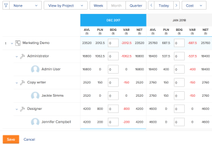

# Calculer des coûts dans le planificateur de ressources

<!--

(Alina: ***Linked to the Planning in the Resource Planner article, Understanding areas of the Resource Planner. - do not move/ change/ delete.)

-->

<!--'(Alina: ***Linked to the Planning in the Resource Planner article, Understanding areas of the Resource Planner. - do not move/ change/ delete.)'-->

Vous pouvez budgétiser vos ressources dans le planificateur de ressources Adobe Workfront en utilisant des valeurs de coût au lieu de valeurs d’heures ou d’équivalents temps complet. Les valeurs de coût ne sont pas disponibles pour la vue **Afficher par utilisateur et utilisatrice** dans le planificateur de ressources.

>[!IMPORTANT]
>
>Vous devez associer les utilisateurs et utilisatrices et les fonctions aux coûts par heure afin d’afficher les informations sur les coûts dans le planificateur de ressources.\
>Pour plus d’informations sur l’association des taux de coût horaire aux fonctions, voir [Créer et gérer des fonctions](../../administration-and-setup/set-up-workfront/organizational-setup/create-manage-job-roles.md).\
>Pour plus d’informations sur l’association des taux de coût horaire aux personnes, voir [Modifier le profil d’une personne](../../administration-and-setup/add-users/create-and-manage-users/edit-a-users-profile.md).

Avant de budgétiser vos ressources, assurez-vous de bien comprendre le travail à effectuer (heures prévues, équivalents temps complet ou coût) et les heures pendant lesquelles vos utilisateurs et utilisatrices peuvent travailler (heures disponibles, équivalents temps complet ou coût).\
Pour plus d’informations sur la compréhension des informations contenues dans le planificateur de ressources lors de la budgétisation par heures ou par équivalents temps complet, voir [Vue d’ensemble des informations sur les heures, les équivalents temps complet et les coûts dans les vues de Projet et de Rôle du planificateur de ressources](../../resource-mgmt/resource-planning/overview-of-planner-hour-fte-cost-information-in-role-project-views.md).

## Conditions d’accès

Vous devez disposer des éléments suivants :

<table style="table-layout:auto"> 
 <col> 
 <col> 
 <tbody> 
  <tr> 
   <td role="rowheader">Formule Adobe Workfront*</td> 
   <td> 
Pro et supérieur
 </td> 
  </tr> 
  <tr> 
   <td role="rowheader">Licence Adobe Workfront*</td> 
   <td> 
Plan 
 </td> 
  </tr> 
  <tr> 
   <td role="rowheader">Configurations du niveau d’accès*</td> 
   <td> 
Accès en modification à la gestion des ressources qui inclut l’accès en modification des priorités et des heures du budget dans le planificateur de ressources.
 
Accès en modification aux données financières, aux projets et aux utilisateurs et utilisatrices
 
<b>NOTE</b>

Si vous n’avez toujours pas accès, demandez à votre administrateur ou administratrice Workfront si votre niveau d’accès est soumis à des restrictions supplémentaires. Pour plus d’informations sur la façon dont l’administration Workfront peut modifier votre niveau d’accès, consultez la section <a href="../../administration-and-setup/add-users/configure-and-grant-access/create-modify-access-levels.md" class="MCXref xref">Créer ou modifier des niveaux d’accès personnalisés</a>.
 </td>
</tr> 
  <tr> 
   <td role="rowheader">Autorisations d’objet</td> 
   <td> 
Autorisations de gestion des projets pour lesquels vous souhaitez budgéter les informations avec la possibilité de gérer les finances.
 
Pour plus d’informations sur les demandes d’accès supplémentaire, voir <a href="../../workfront-basics/grant-and-request-access-to-objects/request-access.md" class="MCXref xref">Demander l’accès à des objets </a>.
 </td> 
  </tr> 
 </tbody> 
</table>

&#42;Pour connaître le plan, le type de licence ou l’accès dont vous disposez, contactez votre équipe d’administration Workfront.

## Afficher les informations dans le planificateur de ressources par coût

Par défaut, les informations relatives à la disponibilité et à l’affectation sont affichées en heures dans le planificateur de ressources.

Pour afficher les informations disponibles, prévues et budgétées par coût dans le planificateur de ressources :

1. Cliquez sur l’icône **Menu principal**  dans le coin supérieur droit d’Adobe Workfront.

1. Cliquez sur **Ressources**.
1. Accédez au planificateur de ressources.
1. (Le cas échéant) Sélectionnez **Afficher par projet** ou **Afficher par rôle**.\
   Par défaut, **Afficher par projet** est sélectionné.\
   Les informations relatives à l’allocation et à la disponibilité s’affichent en heures.

1. Dans le menu déroulant **Heures**, sélectionnez **Coût**.

   Si vous n’avez pas accès aux données financières dans votre niveau d’accès, cette option n’est pas disponible.\
   Si les projets ont une devise différente de la devise du système, le coût de ces projets s’affiche dans le planificateur de ressources converti dans la devise du système. Votre administrateur ou administratrice système définit la devise du système.\
   Pour plus d’informations sur la configuration de la devise du système dans Workfront et sur les taux de conversion, voir [Configurer les taux de change](../../administration-and-setup/manage-workfront/exchange-rates/set-up-exchange-rates.md).\
   

## Calculer le coût disponible dans le planificateur de ressources

Pour afficher les valeurs des coûts disponibles dans le planificateur de ressources, vous devez disposer des éléments suivants :

* Coût par taux horaires pour les personnes et les rôles.
* Informations sur la disponibilité des personnes.

  L’obtention d’informations sur la disponibilité des personnes dépend de la manière dont votre administrateur ou administratrice Workfront configure les préférences de gestion des ressources.\
  Pour plus d’informations sur le calcul de la disponibilité des personnes et la définition des préférences de gestion des ressources, voir [Configurer les préférences de gestion des ressources](../../administration-and-setup/set-up-workfront/configure-system-defaults/configure-resource-mgmt-preferences.md).

Le tableau suivant illustre la manière dont le coût disponible est calculé dans le planificateur de ressources :

<table style="table-layout:auto"> 
 <col> 
 <col> 
 <thead> 
  <tr> 
   <th><strong>Coût disponible</strong> </th> 
   <th><strong>Calcul</strong> </th> 
  </tr> 
 </thead> 
 <tbody> 
  <tr> 
   <td>Coût disponible par personne</td> 
   <td> 
Le coût disponible par personne est calculé à l’aide de la formule suivante :
 
<code>Available User Cost = User Available Hours * User Cost per Hour Rate</code> 
 
<b>NOTE</b>

Si la personne n’a pas de taux de coût horaire dans son profil, le taux de coût horaire de la fonction sous laquelle elle est répertoriée est utilisé dans le calcul. Si aucun rôle n’est associé à la personne, le coût par personne disponible est de 0 $. 
 </td>
</tr> 
  <tr> 
   <td>Coût disponible par rôle</td> 
   <td> 
Le coût disponible par rôle est calculé à l’aide de la formule suivante :
 
<code>Available Role Cost = Role Available Hours * Role Cost per Hour Rate</code> 
 
<b>NOTE</b>

Si le rôle n’a pas de taux de coût horaire, le coût du rôle disponible est de 0 $.
 </td>
</tr> 
  <tr> 
   <td>Coût disponible par projet</td> 
   <td> 
Le coût disponible par projet est calculé à l’aide de la formule suivante :
 
<code>Available Project Cost = SUM(User Available Hours * User Cost per Hour Rate)</code> 
 </td> 
  </tr> 
 </tbody> 
</table>

## Calcul du coût prévu dans le planificateur de ressources

Bien que vous ne puissiez pas afficher les informations sur les tâches dans le planificateur de ressources, les coûts prévus pour les personnes, les rôles et les projets sont calculés en prenant en compte les informations suivantes sur les tâches :

* Le type d’affectation de la tâche.\
  Vous pouvez laisser une tâche sans affectation ou affecter les entités suivantes à une tâche :

   * Une personne (avec ou sans fonction)
   * Un rôle
   * Une équipe\
     Une tâche affectée à une équipe est considérée comme non affectée, du point de vue du planificateur de ressources.

* Le **Type de coût** des tâches du projet.\
  Pour plus d’informations sur le type de coût d’une tâche, voir [Suivre les coûts](../../manage-work/projects/project-finances/track-costs.md).

* Les dates d’entrée en vigueur des taux de coût pour les fonctions et les personnes.

  Par exemple, si le rôle ou la personne a un nombre d’heures prévues de 10 heures en février et de 10 heures en mars, mais que le taux de coût est passé de 12 $ à 20 $ en mars, la valeur du coût prévu en février est de 120 $ et celle de mars de 200 $.

>[!NOTE]
>
>Les coûts prévus par personne n’influencent pas les coûts prévus du projet. Seuls les coûts prévus par rôle affectent les coûts prévus par projet, dans le planificateur de ressources.

Vous pouvez rencontrer les scénarios suivants lors du calcul du coût prévu pour les personnes, les rôles et le projet :

* Lorsque le **Type de coût** est **Horaire par personne ** et qu’il n’y a **pas d’affectation** sur la tâche :

   * **Coût prévu par rôle et personne** :

     Les coûts prévus par rôle et personne sont de 0,00 $.

   * **Coût prévu du projet** :

     Le coût prévu du projet est de 0,00 $.

* Lorsque le **Type de coût** est **Horaire par personne** et qu’il y a une **affectation de personne** sur la tâche :

   * **Coût prévu par rôle et personne** :

     Le coût prévu par personne est calculé à l’aide de la formule suivante :

     `User Planned Cost Rate = User Planned Hours * User Cost per Hour Rate`

     Si une personne a un taux de coût dans son profil, c’est ce taux qui est utilisé pour calculer le coût prévu. Dans le cas contraire, c’est le taux de coût horaire au niveau du système de son rôle principal qui est utilisé.

     >[!NOTE]
     >
     >La personne peut être affectée à la tâche avec l’une de ses fonctions secondaires, mais c’est le taux de la fonction principale qui est utilisé ici.

     Le coût prévu du rôle est calculé à l’aide de la formule suivante :

     `Role Planned Cost = SUM(User Planned Cost)`

   * **Coût prévu du projet** :

     Le coût prévu du projet est de 0,00 $.

* Lorsque le **Type de coût** est **Horaire par personne** et qu’il y a une **affectation de fonction** sur la tâche :

   * **Coût prévu par rôle et personne** :

     Le coût prévu de l’utilisateur ou utilisatrice est de 0,00 $.

     Le coût prévu du rôle est calculé à l’aide de la formule suivante :

     `Role Planned Cost = Role Planned Hours * Role Cost per Hours`

     Le taux de coût horaire au niveau du système de la fonction affectée à la tâche est utilisé pour calculer le coût prévu.

   * **Coût prévu du projet** :

     Le coût prévu du projet est de 0,00 $.

* Lorsque le **Type de coût** est **Horaire par rôle** et qu’il n’y a **pas d’affectation** sur la tâche :

   * **Coût prévu par rôle et personne** :

     Les coûts prévus par rôle et personne sont de 0,00 $.

   * **Coût prévu du projet** :

     Le coût prévu du projet est de 0,00 $.

* Lorsque le **Type de coût** est **Horaire par rôle** et qu’il y a une **affectation d’utilisateurs et utilisatrices** sur la tâche :

   * **Coût prévu du rôle et de l’utilisateur ou utilisatrice** :

     Le coût prévu de l’utilisateur ou utilisatrice est de 0,00 $.

     Le coût prévu du rôle est calculé à l’aide de la formule suivante :

     `Role Planned Cost = Role Planned Hours * Role Cost per Hours`

     Workfront examine la fonction que l’utilisateur ou l’utilisatrice remplit dans la tâche pour calculer le coût prévu du rôle.

     Si aucun rôle n’est associé à l’utilisateur ou l’utilisatrice dans la tâche, le coût prévu est de 0,00 $.

   * **Coût prévu du projet** :

     Le coût prévu du projet est calculé à l’aide de la formule suivante :

     `Project Planned Cost = SUM(Role Planned Costs)`

* Lorsque le **Type de coût** est **Rôle par heure** et qu’il y a une **affectation de fonction** sur la tâche :

   * **Coût prévu du rôle et de l’utilisateur ou de l’utilisatrice** :

     Le coût prévu de l’utilisateur ou utilisatrice est de 0,00 $.

     Le coût prévu du rôle est calculé à l’aide de la formule suivante :

     `Role Planned Cost = Role Planned Hours * Role Cost per Hours`

     Workfront examine la fonction que l’utilisateur ou l’utilisatrice remplit dans la tâche pour calculer le coût prévu du rôle.

   * **Coût prévu du projet** :

     Le coût prévu du projet est calculé à l’aide de la formule suivante :

     `Project Planned Cost = SUM(Role Planned Costs)`

<!--

(table below ideal but drafted because it does not display correctly in Markdown)

-->

<!--
<table style="table-layout:auto">
<col>
<col>
<col>
<col>
<col>
<col>
<col>
<tbody>
<tr>
<td rowspan="2">&nbsp;</td>
<td colspan="3"> 
<strong>Cost Type = User Hourly</strong> 
<strong>User Planned Cost</strong> </td>
<td colspan="3"> 
<strong>Cost Type = Role Hourly</strong> 
<strong>Role Planned Cost</strong> </td>
</tr>
<tr>
<td> 
<strong>No Assignment</strong> 
 </td>
<td> 
<strong>User Assignment</strong> 
 </td>
<td> 
<strong>Job Role Assignment</strong> 
 </td>
<td> 
<strong>No Assignment</strong> 
 </td>
<td> 
<strong>User Assignment</strong> 
 </td>
<td> 
<strong>Job Role Assignment</strong> 
 </td>
</tr>
<tr>
<td> 
<strong>User and Role Planned Cost</strong> 
 
 
 </td>
<td> 
The Role and User Planned Costs are $0.00.
 </td>
<td> 
 The User Planned Cost is calculated using the following formula: 
 
<code> User Planned Cost Rate = User Planned Hours * User Cost per Hour Rate </code> 
 
 If a user has a cost rate in their profile, then that rate is used to calculate Planned Cost. Otherwise, the system-level Cost per Hour rate of their Primary Role is used.  <note type="note">
The user can be assigned to the task with one of their secondary job roles, but the rate of the primary job role is used here instead.
</note>
 
 The Role Planned Cost is calculated using the following formula: 
 
<code>Role Planned Cost = SUM(User Planned Cost)</code> 
 </td>
<td> 
 The User Planned Cost is $0.00. 
 
 The Role Planned Cost is calculated using the following formula: 
 
<code> Role Planned Cost = Role Planned Hours * Role Cost per Hours </code> 
 
 The system-level Cost per Hour rate of the job role assigned to the task is used to calculate Planned Cost. 
 </td>
<td> 
The Role and User Planned Costs are $0.00.
 </td>
<td> 
 The User Planned Cost is $0.00. 
 
 The Role Planned Cost is calculated by the following formula: 
 
<code>Role Planned Cost = Role Planned Hours * Role Cost per Hours</code> 
 
Workfront looks at the job role that the user fulfills on the task to calculate the Planned Cost for the role. 
 
 If the user is not associated with any role on the task, the Planned Cost is $0.00. 
 </td>
<td> 
 The User Planned Cost is $0.00. 
 
 The Role Planned Cost is calculated by the following formula: 
 
<code>Role Planned Cost = Role Planned Hours * Role Cost per Hours</code> 
 
Workfront looks at the job role that the user fulfills on the task to calculate the Planned Cost for the role. 
 
 
 
 
 </td>
</tr>
<tr>
<td rowspan="2"> 
<strong>Project Planned Cost</strong> 
 
 
 </td>
<td> 
The Project Planned Cost is $0.00.
 </td>
<td> 
The Project Planned Cost is $0.00.
 </td>
<td> 
The Project Planned Cost is $0.00.
 </td>
<td> 
The Project Planned Cost is $0.00.
 </td>
<td colspan="2"> 
 The Project Planned Cost is calculated using the following formula: 
 
<code> Project Planned Cost = SUM(Role Planned Costs) </code> 
 
 
 </td>
</tr>
<tr>
<td colspan="6"> <note type="note">
User Planned Costs do not influence the Project Planned Cost. Only the Role Planned costs affect the Project Planned Costs, in the Resource Planner.
</note> </td>
</tr>
</tbody>
</table>
-->

## Calculer les coûts budgétés dans le planificateur de ressources

Pour afficher les valeurs des coûts budgétés dans le planificateur de ressources, vous devez disposer des éléments suivants :

* Heures budgétées pour les rôles, les utilisateurs et utilisatrices et les projets.
* Taux de coût par heure pour les utilisateurs et utilisatrices et les rôles.

>[!NOTE]
>
>Les heures budgétées pour les projets sont calculées sur la base des heures budgétées pour les rôles, et non celles des utilisateurs et utilisatrices.

Le tableau suivant illustre le mode de calcul du coût budgété dans le planificateur de ressources :

<table style="table-layout:auto"> 
 <col> 
 <col> 
 <thead> 
  <tr> 
   <th><strong>Coût budgété</strong> </th> 
   <th><strong>Calcul</strong> </th> 
  </tr> 
 </thead> 
 <tbody> 
  <tr> 
   <td>Coût budgété de l’utilisateur ou de l’utilisatrice</td> 
   <td> 
Le coût budgété de l’utilisateur ou de l’utilisatrice est calculé à l’aide de la formule suivante :
 
<code>Budgeted User Cost = User Budgeted Hours * User Cost per Hour Rate</code> 
 
 
<b>NOTE</b>

Si l’utilisateur ou l’utilisatrice n’a pas de taux de coût par heure dans son profil, le coût de l’utilisateur ou de l’utilisatrice budgété est de 0,00 $.
 
 </td>
</tr> 
  <tr> 
   <td>Coût budgété du rôle</td> 
   <td> 
Le coût budgété du rôle est calculé à l’aide de la formule suivante :
 
<code>Role Budgeted Cost = Role Budgeted Hours * Role Cost per Hour Rate</code> 
 
 
<b>NOTE</b>

Si le rôle n’a pas de taux de coût par heure, le coût budgété du rôle est de 0,00 $.
 
 </td>
</tr> 
  <tr> 
   <td>Coût budgété du projet</td> 
   <td> 
Le coût budgété par projet est calculé à l’aide de la formule suivante :
 
<code>Project Budgeted Cost = SUM(Role Budgeted Cost). </code> 
 </td> 
  </tr> 
 </tbody> 
</table>
