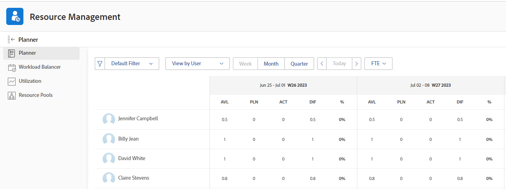

# Présentation du calcul des heures et de l’éditeur de texte enrichi pour les utilisateurs et les rôles dans le planificateur de ressources

<!--

(NOTE: Alina:KEEP THIS:***Linked to: Configuring My Settings, Editing User Accounts, Planning in the Resource Planner -- *** Some of this documentation is also duplicated in this article (Scheduling): https://support.workfront.com/hc/en-us/articles/360000557174)

-->

Vous pouvez afficher l’allocation et la disponibilité de vos ressources dans le planificateur de ressources par heure, ETR ou Coût.\
Pour plus d’informations sur le calcul des coûts dans le planificateur de ressources, voir [Calcul des coûts dans le planificateur de ressources](../../resource-mgmt/resource-planning/calculate-costs-resource-planner.md).

&quot;FTE&quot; signifie &quot;équivalent temps plein&quot;. Il s’agit d’une mesure du temps qui représente le nombre d’heures consacrées au travail réel au cours d’une journée ou d’une semaine pour un utilisateur ou un rôle de tâche.

Les ensembles d’informations sur les ressources suivants sont calculés différemment dans le planificateur de ressources :

* Les valeurs des heures disponibles ou de l’éditeur de texte enrichi sont calculées selon la manière dont votre administrateur système configure les préférences de gestion des ressources dans votre système.\
  Pour plus d’informations sur le calcul des valeurs d’heures disponibles et d’éditeur de texte enrichi, voir [Calcul des heures disponibles ou de l’éditeur de texte enrichi pour les utilisateurs et les rôles de tâche dans le planificateur de ressources](#calculate-available-hours-or-fte-for-users-and-job-roles-in-the-resource-planner).\
  Pour plus d’informations sur la définition des préférences de gestion des ressources pour le système Adobe Workfront, voir [Configuration des préférences de gestion des ressources](../../administration-and-setup/set-up-workfront/configure-system-defaults/configure-resource-mgmt-preferences.md).

* Toutes les autres valeurs de l’éditeur de texte enrichi sont calculées selon la planification par défaut du système.\
  Pour plus d’informations sur l’affichage de toutes les autres valeurs dans le planificateur de ressources lors de l’utilisation de l’éditeur de texte enrichi, voir la section [Calcul de toutes les autres valeurs d’heure et d’éditeur de texte enrichi pour les utilisateurs et les rôles de tâche dans le planificateur de ressources](#calculate-all-other-hour-and-fte-values-for-users-and-job-roles-in-the-resource-planner) dans cet article.

Il est important de comprendre ce qu’est l’éditeur de texte enrichi pour chacun de vos utilisateurs et leurs rôles professionnels afin de gérer précisément vos ressources au fur et à mesure que vous les affectez pour qu’elles fonctionnent.

## Calcul des heures disponibles ou de l’éditeur de texte enrichi pour les utilisateurs et les rôles de tâche dans le planificateur de ressources {#calculate-available-hours-or-fte-for-users-and-job-roles-in-the-resource-planner}

* [Calcul des heures disponibles et de l’éditeur de texte enrichi pour un utilisateur dans le planificateur de ressources](#calculate-the-available-hours-and-fte-for-a-user-in-the-resource-planner)
* [Calcul des heures disponibles et de l’éditeur de texte enrichi pour un rôle de tâche dans le planificateur de ressources](#calculate-the-available-hours-and-fte-for-a-job-role-in-the-resource-planner)
* [Calcul des heures disponibles et de l’éditeur de texte enrichi pour un utilisateur dans le planificateur de ressources (exemple)](#calculate-the-available-hours-and-fte-for-a-user-in-the-resource-planner-example)

### Calcul des heures disponibles et de l’éditeur de texte enrichi pour un utilisateur dans le planificateur de ressources {#calculate-the-available-hours-and-fte-for-a-user-in-the-resource-planner}

L’administrateur de Workfront détermine le mode de calcul de l’heure disponible pour un utilisateur en sélectionnant d’utiliser l’une des options suivantes dans la zone Resource Management de la section Configuration :

* Planification par défaut du système et de l’éditeur de texte enrichi de l’utilisateur.
* Planification de l’utilisateur.

>[!NOTE]
>
>Cela détermine comment calculer la disponibilité des ressources au niveau du système. Pour plus d’informations sur la définition des préférences de gestion des ressources pour le système, voir [Configuration des préférences de gestion des ressources](/help/quicksilver/administration-and-setup/set-up-workfront/configure-system-defaults/configure-resource-mgmt-preferences.md).

Selon la configuration de ce paramètre, la disponibilité des utilisateurs dans le planificateur de ressources (heures et disponibilité de l’éditeur de texte enrichi) est calculée à l’aide des méthodes suivantes :

* **Planification par défaut**: Le planning par défaut du système et l’éditeur de texte enrichi de l’utilisateur sont utilisés pour déterminer les valeurs des heures disponibles et de l’éditeur de texte enrichi pour l’utilisateur dans le planificateur de ressources. Le planning de l’utilisateur est ignoré. Dans ce cas :

   * Le **Heures disponibles** dans le planificateur de ressources sont calculés à l’aide de la formule suivante :

     `User Available Hours = Default Schedule Hours * User FTE value`

     Par exemple, si la planification par défaut comporte 40 heures par semaine disponibles pour le travail et que l’utilisateur est 0,5, l’utilisateur peut travailler 20 heures par semaine dans le planificateur de ressources.

     Pour plus d’informations sur les planifications, y compris la planification par défaut, voir [Création d’un planning](/help/quicksilver/administration-and-setup/set-up-workfront/configure-timesheets-schedules/create-schedules.md).

   * Le **ETR disponible** pour l’utilisateur dans le planificateur de ressources est identique à l’éditeur de texte enrichi spécifié dans les paramètres utilisateur.
Par exemple, si l’éditeur de texte enrichi de l’utilisateur est 0.5 dans les paramètres utilisateur, l’éditeur de texte enrichi disponible de l’utilisateur est 0.5 dans le planificateur de ressources. Pour plus d’informations sur la valeur de l’éditeur de texte enrichi tel qu’il s’affiche dans les paramètres utilisateur, voir [Modification du profil d’un utilisateur](/help/quicksilver/administration-and-setup/add-users/create-and-manage-users/edit-a-users-profile.md).

* **Planification de l’utilisateur**: Le planning de l’utilisateur est utilisé pour déterminer la disponibilité de l’utilisateur dans le planificateur de ressources. La valeur de l’utilisateur FTE est ignorée. Dans ce cas :

   * Le **Heures disponibles** dans le planificateur de ressources, les heures sont identiques à celles du planning de l’utilisateur.

  Par exemple, si le planning de l’utilisateur dispose de 40 heures de travail par semaine, l’utilisateur peut travailler 40 heures par semaine dans le planificateur de ressources.

   * Le **ETR disponible** dans le planificateur de ressources est calculé par la formule suivante :

  `User Available FTE = Hours from the Schedule of the User/ Default Schedule Hours`

  Par exemple, si le planning de l’utilisateur dispose de 20 heures de travail et que le planning par défaut dans Workfront dispose de 40 heures de travail, l’éditeur de texte enrichi de l’utilisateur est de 0,5.

  Pour plus d’informations sur les planifications, y compris la planification par défaut, voir [Création d’un planning](/help/quicksilver/administration-and-setup/set-up-workfront/configure-timesheets-schedules/create-schedules.md).

>[!NOTE]
>
>Si l’utilisateur n’est pas associé à une planification, les Heures disponibles pour l’utilisateur sont calculées à l’aide de la Planification par défaut.

### Calcul des heures disponibles et de l’éditeur de texte enrichi pour un rôle de tâche dans le planificateur de ressources {#calculate-the-available-hours-and-fte-for-a-job-role-in-the-resource-planner}

Vous devez d’abord calculer la disponibilité de l’utilisateur, puis la disponibilité de chacun de ses rôles de travail.

La disponibilité des rôles de tâche dans le planificateur de ressources prend en compte la disponibilité totale de l’utilisateur et la **Pourcentage de disponibilité de l’éditeur de texte enrichi** associée à chaque rôle de l’utilisateur.\

Pour plus d’informations sur l’association d’une **Pourcentage de disponibilité de l’éditeur de texte enrichi** avec un rôle de tâche pour un utilisateur, voir [Modification du profil d’un utilisateur](../../administration-and-setup/add-users/create-and-manage-users/edit-a-users-profile.md).

Par exemple, si la valeur des heures disponibles pour un utilisateur est de 40 et qu’il peut remplir un rôle Principal pendant 75 % de ce temps, et un autre rôle pendant 25 % de ce temps, le planificateur de ressources indique que la variable **Heures disponibles** La valeur du rôle Principal d’une semaine est de 30 heures et que la variable **Heures disponibles** La valeur de l’autre rôle est de 10 heures. Dans ce cas, l’éditeur de texte enrichi pour le rôle Principal est 0,75 et l’éditeur de texte enrichi pour l’autre rôle est 0,25.

>[!NOTE]
>
>Le temps total disponible pour l’utilisateur est calculé par l’une des deux méthodes décrites dans la section [Calcul des heures disponibles et de l’éditeur de texte enrichi pour un utilisateur dans le planificateur de ressources](#calculate-the-available-hours-and-fte-for-a-user-in-the-resource-planner) dans cet article.

Lorsque vous affichez le planificateur de ressources dans la vue Rôle, la disponibilité d’un rôle de tâche correspond à la disponibilité totale de tous les utilisateurs pouvant remplir ce rôle de tâche.\
Pour plus d’informations sur la disponibilité des ressources dans le planificateur de ressources, voir la section [Présentation de Resource Planner](../../resource-mgmt/resource-planning/get-started-resource-planner.md).

### Calcul des heures disponibles et de l’éditeur de texte enrichi pour un utilisateur dans le planificateur de ressources (exemple) {#calculate-the-available-hours-and-fte-for-a-user-in-the-resource-planner-example}

Le tableau suivant illustre le mode de calcul des heures disponibles et de l’éditeur de texte enrichi disponibles pour l’utilisateur dans le planificateur de ressources, selon la méthode utilisée par l’administrateur système pour le calcul de l’éditeur de texte enrichi dans les préférences de gestion des ressources.

Pour cet exemple, nous utilisons les chiffres suivants :

* Une planification système par défaut de 40 heures
* Planification de 20 heures pour l’utilisateur
* Un éditeur de texte enrichi de 0,75

| Méthode de calcul de l’éditeur de texte enrichi (paramètre système) | **Heures à partir de la planification de l’utilisateur** | **Heures à partir de la planification par défaut** | **Champ FTE utilisateur** | **Heures disponibles dans le planificateur de ressources** | **Éditeur de texte enrichi disponible dans le planificateur de ressources** |
|---|---|---|---|---|---|
| **Planification par défaut** | Ignoré | 40 | 0.8 | **32** (calculé) | **0.8** |
| **Calendrier de l&#39;utilisateur** | 20 | 40 | Ignoré | **20** | **0,5** (calculé) |

Les exceptions de planification et les congés peuvent avoir une incidence sur le nombre d’heures planifiées ou sur l’éditeur de texte enrichi. Pour plus d’informations, voir [Configuration des préférences de gestion des ressources](../../administration-and-setup/set-up-workfront/configure-system-defaults/configure-resource-mgmt-preferences.md).

Exemple d’affichage du planificateur de ressource par utilisateur et heures :

Exemple d’affichage du planificateur de ressources par utilisateur et éditeur de texte enrichi :

## Calcul de toutes les autres valeurs d’heure et d’éditeur de texte enrichi pour les utilisateurs et les rôles de tâche dans le planificateur de ressources {#calculate-all-other-hour-and-fte-values-for-users-and-job-roles-in-the-resource-planner}

Outre les heures disponibles ou l’éditeur de texte enrichi, les informations temporelles suivantes s’affichent également dans le planificateur de ressources :

* Heures prévues
* Heures budgétées
* Variance horaire
* Heures nettes\
  Pour plus d’informations sur ces valeurs, voir [Vue d’ensemble des heures, de l’éditeur de texte enrichi et des coûts dans les vues Projet et Rôle du planificateur de ressources](../../resource-mgmt/resource-planning/overview-of-planner-hour-fte-cost-information-in-role-project-views.md)

* Différence horaire\
  Pour plus d’informations sur ce que représente cette valeur, voir [Vue d’ensemble des heures, de l’éditeur de texte enrichi et des coûts dans les vues Projet et Rôle du planificateur de ressources](../../resource-mgmt/resource-planning/overview-of-planner-hour-fte-cost-information-in-role-project-views.md).

Vous pouvez afficher les mêmes informations dans le planificateur de ressources sous forme d’éditeur de texte enrichi ou d’heures.

Workfront utilise la formule suivante pour afficher toutes les autres valeurs sous forme d’éditeur de texte enrichi dans le planificateur de ressources :

`FTE = Resource Planner Hours/ Default Schedule Hours`

>[!NOTE]
>
>Le planning de l’utilisateur est ignoré lors du calcul de l’éditeur de texte enrichi pour toutes les valeurs, à l’exception des valeurs d’AVL disponibles dans le planificateur de ressources. Seul le Planning par défaut est pris en compte pour le calcul.

Ce calcul s&#39;applique aux valeurs suivantes :

* ETR planifié (PLN)
* ETR (BDG) budgété
* Variance de l’éditeur de texte enrichi (VAR)
* NET FTE
* Différence FTE (DIF)
