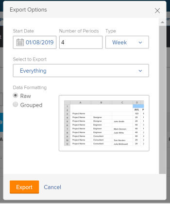
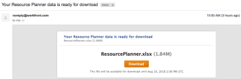

# Exporter des informations du planificateur de ressources

Vous pouvez exporter des informations à partir de n’importe quelle vue du planificateur de ressources vers un fichier Excel (.xlsx) enregistré sur votre ordinateur.

>[!IMPORTANT]
>
>Les informations affichées et celles que vous pouvez exporter à partir du planificateur de ressources sont limitées. Pour plus d’informations sur ces limitations, voir la section [Limitations d’affichage du planificateur de ressources](../../resource-mgmt/resource-planning/resource-planner-display-limitations.md).

## Conditions d’accès

+++ Développez pour afficher les exigences d’accès aux fonctionnalités de cet article.

<table style="table-layout:auto"> 
 <col> 
 <col> 
 <tbody> 
  <tr> 
  <tr> 
   <td>Package Adobe Workfront</td> 
   <td>
Tous
</td>
  </tr> 
  <tr> 
   <td>Licence Adobe Workfront</td> 
   <td>
Léger ou supérieur

       
Révision ou supérieur
</td> 
  </tr> 
  <tr> 
   <td>Configurations des niveaux d’accès</td> 
   <td> 
Afficher l'accès ou supérieur à Projets, Utilisateurs et Gestion des ressources
</td> 
  </tr> 
  <tr> 
   <td>Autorisations d’objet</td> 
   <td> 
Autorisations d’affichage ou supérieures pour les projets
</td> 
  </tr> 
 </tbody> 
</table>

Pour plus d’informations, voir [Conditions d’accès requises dans la documentation Workfront](/help/quicksilver/administration-and-setup/add-users/access-levels-and-object-permissions/access-level-requirements-in-documentation.md).

+++

## Exporter des informations du planificateur de ressources

{{step1-to-resourcing}}

Le **planificateur** s’affiche par défaut.

1. Sélectionnez la vue pour le Planificateur. Vous pouvez sélectionner l’une des options suivantes :

   * Par utilisateur
   * Par projet
   * Par fonction

1. Cliquez sur **Exporter**.

   La boîte de dialogue Options d’export s’affiche.

   

1. Indiquez les informations suivantes :\
   **Date de début** : la date de début de votre export. Le fichier exporté contient des informations sur l’attribution et la disponibilité, en partant du premier jour de la semaine qui contient le jour que vous spécifiez ici.\
   **Nombre de périodes** : le nombre de périodes que vous souhaitez inclure dans votre fichier. La valeur par défaut est de 4 périodes.\
   **Type** : le type de périodes pour lesquelles vous souhaitez afficher les informations dans le fichier exporté (semaines, mois ou trimestres).\
   Les périodes maximales que vous pouvez exporter sont les suivantes :

   * 52 semaines
   * 36 mois
   * 12 trimestres

   **Sélectionner pour exporter** : selon la vue sélectionnée, vous pouvez choisir d&#39;exporter les informations de disponibilité et de budgétisation pour tous les objets répertoriés à l&#39;écran ou pour des objets spécifiques.
Vous pouvez choisir d’exporter les informations suivantes :

   * Dans la vue du projet, sélectionnez pour export :

      * Projets
      * Projets et rôles
      * Tout (option par défaut)

   * Dans la vue de l’utilisateur ou l’utilisatrice, sélectionnez pour export :

      * Utilisateurs et utilisatrices
      * Utilisateurs et projets
      * Tout (option par défaut)

   * Dans la vue Rôle, sélectionnez pour export :

      * Rôles
      * Rôles et projets
      * Tout (option par défaut)

   **Formatage des données** : selon la manière dont vous souhaitez afficher votre fichier Excel, sélectionnez les options suivantes :

   * **Brut** : sélectionnez cette option pour afficher les informations de disponibilité et d’affectation non regroupées par les objets auxquels elles appartiennent dans le fichier Excel. (Il s’agit de l’option par défaut.)
   * **Regroupement** : sélectionnez cette option pour afficher les informations de disponibilité et d’affectation regroupées par les objets auxquelles elles appartiennent. Les informations exportées sont affichées telles qu’elles apparaissent à l’écran.

   Un exemple de l’aspect des informations dans le fichier exporté est présenté dans la boîte de dialogue Options d’export.

1. Cliquez sur **Export** pour exporter les informations du planificateur de ressources.\
   Seules les informations que vous avez enregistrées sont exportées.

1. (Conditionnel) Si la vue Rôle ou Projet contient des heures budgétées non enregistrées, cliquez sur **Enregistrer et continuer.**
Un fichier Excel (.xlsx) est téléchargé sur votre ordinateur.\
   L’export à partir du planificateur de ressources n’est pas disponible pendant que le fichier est préparé pour le téléchargement.\
   (Le cas échéant) Si vous exportez une grande quantité de données, vous recevez un e-mail contenant un lien qui vous permet de télécharger le fichier.\
   

1. (Le cas échéant) Lorsque vous recevez l’e-mail contenant le fichier exporté, cliquez sur **Télécharger** pour télécharger le fichier.\
   Cela vous ramène à Workfront où vous pouvez télécharger le fichier.\
   Vous devez vous connecter à Workfront pour que le téléchargement s’effectue.\
   Si vous ne téléchargez pas le fichier lorsqu’il est livré, le lien de téléchargement reste actif pendant 7 jours après le lancement de l’export.
