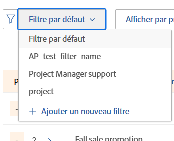
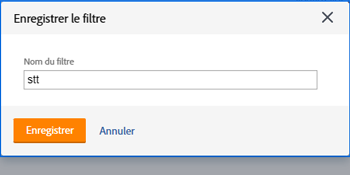

# Filtrer les informations dans le planificateur de ressources

<!--

(AL:*Iterate on this article: filtering by custom data. Other enhancements? Special characters caveat might change - follow the story to know when. It originally came in Beta 3 17.3.)

-->

Les filtres permettent de modifier les informations qui s’affichent dans le planificateur de ressources à partir de toutes les informations stockées dans le système.

## Conditions d’accès

Vous devez disposer des éléments suivants :

<table style="table-layout:auto"> 
 <col> 
 <col> 
 <tbody> 
  <tr> 
   <td role="rowheader">Formule Adobe Workfront*</td> 
   <td> 
Pro et supérieur
 </td> 
  </tr> 
  <tr> 
   <td role="rowheader">Licence Adobe Workfront*</td> 
   <td> 
Révision ou supérieur<!--
      <MadCap:conditionalText data-mc-conditions="QuicksilverOrClassic.Draft mode">
        (this seems to be the case in NWE only, not classic. Waiting on Vazgen's response for this)
      </MadCap:conditionalText>
     -->
 </td> 
  </tr> 
  <tr> 
   <td role="rowheader">Configurations du niveau d’accès*</td> 
   <td> 
Accès Affichage ou supérieur aux projets, aux utilisateurs et utilisatrices, et à la gestion des ressources 
 
<b>NOTE</b>

Si vous n’avez toujours pas accès, demandez à votre administrateur ou administratrice Workfront si votre niveau d’accès est soumis à des restrictions supplémentaires. Pour plus d’informations sur la façon dont l’administration Workfront peut modifier votre niveau d’accès, consultez la section <a href="../../administration-and-setup/add-users/configure-and-grant-access/create-modify-access-levels.md" class="MCXref xref">Créer ou modifier des niveaux d’accès personnalisés</a>.
 </td>
</tr> 
  <tr> 
   <td role="rowheader">Autorisations d’objet</td> 
   <td> 
Autorisations d’affichage ou niveau supérieur pour les projets
 
Pour plus d’informations sur les demandes d’accès supplémentaire, voir <a href="../../workfront-basics/grant-and-request-access-to-objects/request-access.md" class="MCXref xref">Demander l’accès à des objets </a>.
 </td> 
  </tr> 
 </tbody> 
</table>

*Pour connaître la formule, le type de licence ou l’accès dont vous disposez, contactez votre administrateur ou administratrice Workfront.

## Vue d’ensemble des filtres du planificateur de ressources

Pour minimiser la quantité d’informations affichées dans le planificateur de ressources, Adobe Workfront propose un filtre par défaut avec des critères préconfigurés. Pour plus d’informations sur le filtre par défaut, voir la section [Vue d’ensemble du filtre par défaut dans le planificateur de ressources](#overview-of-the-default-filter-in-the-resource-planner) dans cet article.

Vous pouvez également créer des filtres personnalisés. Pour plus d’informations sur la personnalisation des filtres dans le planificateur de ressources, voir la section [Créer des filtres pour le planificateur de ressources](#create-resource-planner-filters) dans cet article.

Tenez compte des éléments suivants lorsque vous utilisez des filtres dans le planificateur de ressources :

* Les filtres que vous créez ne sont visibles que par vous. Vous pouvez partager des filtres pour les mettre à la disposition d’autres personnes.
* En tant qu’administrateur ou administratrice Workfront, vous ne pouvez voir que les filtres que vous créez ou qui sont partagés avec vous.
* Les résultats filtrés ne changent pas lorsque vous sélectionnez une vue différente pour le planificateur de ressources.\
  Pour plus d’informations sur la modification de la vue dans le planificateur de ressources, voir la section « Vue Projet/Rôle/Utilisateur ou utilisatrice » dans [Vue d’ensemble de la navigation dans le planificateur de ressources](../../resource-mgmt/resource-planning/resource-planner-navigation.md).

* L’application d’un filtre ne modifie pas les données d’affectation et de disponibilité dans le planificateur de ressources pour les projets, les rôles ou les utilisateurs et utilisatrices. Un filtre ne modifie que le nombre d’objets affichés dans le planificateur de ressources.
* Le filtrage s’applique à tous les objets qui s’affichent simultanément dans le planificateur de ressources. Par exemple, si vous filtrez pour une personne spécifique, le planificateur de ressources n’affiche que les résultats suivants :

   * Projets pour lesquels la personne fait partie du groupe de ressources (pour les vues Projet et Rôle) ou a une affectation sur le projet (pour la vue Utilisateur ou utilisatrice).
   * Rôles associés à la personne dans ces projets.\
     Les autres rôles ou personnes des projets auxquels la personne est associée ne s’affichent pas.

## Vue d’ensemble du filtre par défaut dans le planificateur de ressources {#overview-of-the-default-filter-in-the-resource-planner}

Lorsque vous ouvrez le planificateur de ressources pour la première fois, Workfront applique le filtre par défaut. Vous pouvez modifier le filtre par défaut pour ne filtrer que les éléments que vous souhaitez afficher. Pour plus d’informations sur la modification d’un filtre, voir la section [Modifier un filtre dans le planificateur de ressources](#edit-a-filter-in-the-resource-planner) de cet article.

Lors de l’utilisation du filtre par défaut, tenez compte des éléments suivants :

* Le filtre par défaut récupère des informations uniquement dans les projets présentant les caractéristiques suivantes :

   * Une date d’achèvement prévue qui se situe après le premier jour du mois en cours.
   * Une date de début prévue qui se situe avant le dernier jour du quatrième mois à partir de la date du jour.
   * Un statut qui est Actif ou Prévu.

  >[!IMPORTANT]
  >
  >Le filtre par défaut récupère les informations dans les projets se déroulant toujours dans un délai de quatre mois à compter du premier jour du mois en cours, quelle que soit la période sélectionnée pour l’affichage dans le planificateur de ressources.

* Dans la vue Utilisateur ou utilisatrice, toutes les personnes du système sont affichées, mais seules celles associées aux projets filtrés affichent des informations d’heures.
* Vous pouvez modifier les informations contenues dans le filtre par défaut sans enregistrer le filtre.
* Vous pouvez dupliquer et modifier une copie du filtre par défaut, modifier les critères souhaités, puis l’enregistrer en tant que nouveau filtre.
* Vous ne pouvez pas supprimer ou partager le filtre par défaut.

  

## Créer des filtres de planificateur de ressources {#create-resource-planner-filters}

<!--

(Alina: **^ This section is somewhat duplicated (format more than content) from the "Filtering Utilization Information" section in "Viewing Utilization Information for Projects, Programs, and Portfolios.")

-->

La création d’un filtre dans le planificateur de ressources est identique pour toutes les vues.

Assurez-vous que les conditions préalables à l’affichage des informations correctes dans le planificateur de ressources sont réunies avant de créer un filtre.\
Pour plus d’informations sur les conditions requises pour travailler avec le planificateur de ressources, voir la section « Conditions requises pour travailler avec le planificateur de ressources » dans l’article [Vue d’ensemble du planificateur de ressources](../../resource-mgmt/resource-planning/get-started-resource-planner.md).

Tenez compte des éléments suivants lorsque vous créez un filtre :

* Il n’y a pas de limite au nombre d’objets que vous pouvez filtrer en même temps.
* Les champs disponibles que vous pouvez ajouter à un filtre changent en fonction de l’objet de la vue que vous appliquez au planificateur de ressources. Par exemple, vous pouvez filtrer les champs Problème ou Tâche uniquement dans la vue Utilisateur ou utilisatrice, car ces objets ne s’affichent que dans cette vue. Si vous créez un filtre pour les problèmes ou les tâches dans la vue Utilisateur ou utilisatrice et que vous l’appliquez ensuite aux vues Projet ou Rôle, il est ignoré parce que les champs n’existent pas dans ces types de vue. Dans ce cas, le filtre apparaît indisponible.

Pour créer un filtre dans le planificateur de ressources, procédez comme suit :

1. Cliquez sur l’icône **Menu principal**  dans le coin supérieur droit d’Adobe Workfront.

1. Cliquez sur **Ressources**.

   Le **Planificateur** s’affiche par défaut.

   De base, la première fois que vous accédez au planificateur de ressources, le <strong>filtre par défaut</strong> est appliqué. Pour plus d’informations sur le filtre par défaut, voir la section <a href="#overview-of-the-default-filter-in-the-resource-planner" class="MCXref xref">Vue d’ensemble du filtre par défaut dans le planificateur de ressources</a> de cet article.

1. Dans le coin supérieur gauche de la fenêtre, cliquez sur l’icône **Filtre**.\
   \
   Ou\
   Développez le menu déroulant **Filtrer** et cliquez sur **Ajouter un filtre**.\
   

1. Pour créer un filtre à l’aide des critères intégrés, spécifiez l’un des champs suivants :

   * **Portfolio** : commencez à entrer le nom du portfolio contenant les informations que vous souhaitez inclure dans le planificateur de ressources, puis cliquez sur le nom lorsqu’il apparaît dans la liste.\
     Répétez ce processus pour inclure des informations provenant de plusieurs portfolios.

   * **Statut du projet** : développez le menu déroulant Statut du projet et sélectionnez un ou plusieurs statuts de projet disponibles dans la liste.
   * **Équipe** : commencez à entrer le nom d’une ou de plusieurs équipes associées aux utilisateurs et utilisatrices affectés aux tâches dans les projets que vous souhaitez consulter.
   * **Fonction** : commencez à entrer le nom d’une ou de plusieurs fonctions associées aux utilisateurs et utilisatrices affectés aux tâches dans les projets que vous souhaitez consulter.
   * **Groupes** : commencez à entrer le nom d’un ou de plusieurs groupes de ressources associés aux projets (pour la vue Projet), aux utilisateurs et utilisatrices (pour la vue Utilisateur ou utilisatrice) ou associés à la fois aux projets et aux utilisateurs et utilisatrices (pour la vue Rôle) que vous souhaitez consulter.
   * **Groupe** : commencez à entrer le nom d’un ou de plusieurs groupes associés aux utilisateurs et utilisatrices (dans la vue Utilisateur ou utilisatrice) ou aux projets (dans les vues Projet et Rôle) que vous souhaitez consulter.

1. Cliquez sur **Ajouter une règle de filtre**, puis commencez à entrer le nom du champ que vous souhaitez filtrer dans la zone **Saisissez pour filtrer des éléments**. Si le champ est disponible, il est renseigné pour chaque objet auquel il peut être associé.

   >[!IMPORTANT]
   >
   >Lorsque vous référencez des champs personnalisés, vous devez saisir le nom du champ et non le libellé du champ. Le libellé du champ s’affiche sur un formulaire personnalisé associé à un objet. Pour plus d’informations sur la différence entre le libellé et le nom d’un champ personnalisé, voir [Concevoir un formulaire avec le concepteur de formulaire](/help/quicksilver/administration-and-setup/customize-workfront/create-manage-custom-forms/form-designer/design-a-form/design-a-form.md).

1. Cliquez sur le nom du champ pour l’ajouter au filtre lorsqu’il apparaît dans la liste.\
   Pour plus d’informations sur les champs affichés de la liste, voir [Glossaire de la terminologie Adobe Workfront](../../workfront-basics/navigate-workfront/workfront-navigation/workfront-terminology-glossary.md).

1. (Facultatif) Sélectionnez le filtre et les modificateurs de condition pour le filtre. Les modificateurs disponibles sont décrits dans [Modificateurs de filtre et de condition](../../reports-and-dashboards/reports/reporting-elements/filter-condition-modifiers.md).

   Vous pouvez utiliser des caractères génériques basés sur l’utilisateur ou l’utilisatrice ou sur la date pour filtrer les informations associées à la personne connectée.\
   Pour plus d’informations sur les caractères génériques pris en charge dans les filtres, voir [Vue d’ensemble des variables de filtre de caractères génériques](../../reports-and-dashboards/reports/reporting-elements/understand-wildcard-filter-variables.md).

1. Cliquez sur **Enregistrer** pour enregistrer la règle de filtre.
1. (Facultatif) Cliquez sur **Ajouter une règle de filtre** pour ajouter une nouvelle règle pour un autre objet ou champ.
1. Cliquez sur **Appliquer** pour appliquer le filtre sans l’enregistrer.

   Ou

   Cliquez sur **Enregistrer le filtre** pour enregistrer le filtre.\
   

1. (Le cas échéant) Après avoir cliqué sur **Enregistrer**, spécifiez un nom pour le filtre dans la zone **Nom de filtre** de la boîte de dialogue **Enregistrer le filtre**. Champ obligatoire.\
   

   >[!NOTE]
   >
   >Si le nom de votre filtre comprend des caractères spéciaux, vous n’utilisez que les caractères suivants :
   >
   >* Virgule
   >* Barre oblique
   >* Trait d’union
   >* Tiret bas

1. Cliquer sur **Enregistrer**.

   Les résultats du planificateur de ressources sont désormais filtrés en fonction des informations que vous avez incluses dans les règles de filtrage.

## Appliquer un filtre existant

Lorsque vous ou une personne ayant accès au planificateur de ressources enregistre un filtre, celui-ci devient accessible à tous les utilisateurs et utilisatrices du planificateur de ressources.

Pour appliquer un filtre existant :

1. Accédez au planificateur de ressources.
1. Dans le coin supérieur gauche, développez le menu déroulant **Filtre**.

   Dans ce menu, vous pouvez voir les filtres que vous avez créés ou que d’autres personnes ont créés et partagés avec vous.\
   

1. Sélectionnez un filtre dans le menu déroulant. Dans ce menu, vous pouvez voir les filtres que vous ou d’autres utilisateurs et utilisatrices avez créés.\
   Lorsque vous sélectionnez un filtre, celui-ci réduit automatiquement la quantité d’informations affichées dans le planificateur de ressources.

## Modifier un filtre dans le planificateur de ressources {#edit-a-filter-in-the-resource-planner}

Vous pouvez modifier un filtre dans le planificateur de ressources en effectuant l’une des opérations suivantes :

* [Renommer un filtre](#rename-a-filter)
* [Modifier les informations d’un filtre](#edit-the-information-in-a-filter)
* [Dupliquer un filtre](#duplicate-a-filter)

Lorsque vous modifiez un filtre, il est mis à jour pour l’ensemble des utilisateurs et utilisatrices du système qui ont accès au planificateur de ressources.

### Renommer un filtre {#rename-a-filter}

Vous pouvez changer le nom d’un filtre sans modifier ses critères. Nous vous recommandons d’informer les autres utilisateurs et utilisatrices du système de cette modification, car les filtres sont visibles par les autres utilisateurs et utilisatrices. Cette modification affecte les listes de filtres pour toutes les personnes qui peuvent voir le planificateur de ressources.

1. Accédez au planificateur de ressources et développez le menu déroulant **Filtre** pour sélectionner un filtre enregistré.
1. Développez le menu déroulant **Filtre**. Localisez le filtre que vous souhaitez renommer et pointez sur son nom.
1. Sélectionnez l’icône **Renommer le filtre** à côté du nom du filtre.

   

1. Spécifiez un nouveau nom pour le filtre dans la zone **Nom du filtre**.
1. Cliquer sur **Enregistrer**.\
   Les informations contenues dans le filtre sont les mêmes et le nom est mis à jour.

### Modifier les informations d’un filtre {#edit-the-information-in-a-filter}

Vous pouvez modifier les informations que vous incluez dans un filtre sans en changer le nom. Nous vous recommandons d’informer les autres utilisateurs et utilisatrices du système de cette modification, car les filtres sont visibles par les autres utilisateurs et utilisatrices. Cette modification affecte les listes de filtres pour toutes les personnes qui peuvent voir le planificateur de ressources.

1. Accédez au planificateur de ressources et développez le menu déroulant **Filtre** dans le coin supérieur gauche.
1. Sélectionnez un filtre existant que vous souhaitez modifier.
1. Cliquez sur l’icône **Filtre**.\
   

1. Ajoutez de nouveaux champs au filtre.\
   Pour plus d’informations sur la création de filtres, voir [Créer des filtres de planificateur de ressources](#create-resource-planner-filters).

1. Pointez sur les champs existants sélectionnés pour le filtre et cliquez sur l’icône **Modifier** pour sélectionner un autre champ ou sur l’icône **Supprimer** pour supprimer le champ.\
   

1. (Facultatif) Cliquez sur **Ajouter une règle de filtre** pour ajouter de nouveaux champs au filtre.\
   Pour plus d’informations sur la définition des critères de filtre, voir [Créer des filtres pour le planificateur de ressources](#create-resource-planner-filters).

1. Cliquez sur **Appliquer** pour appliquer le filtre sans l’enregistrer.

   Ou

   Cliquez sur **Enregistrer** pour enregistrer le filtre.\
   Le filtre est enregistré sous le même nom mais avec de nouveaux critères de filtre.

### Dupliquer un filtre {#duplicate-a-filter}

Vous pouvez dupliquer un filtre existant. Les critères de filtre d’origine restent les mêmes dans le filtre dupliqué et vous pouvez enregistrer le nouveau filtre sous un nouveau nom.

1. Accédez au planificateur de ressources et développez le menu déroulant **Filtre** dans le coin supérieur gauche.
1. Pointez sur le nom d’un filtre enregistré que vous souhaitez dupliquer.
1. Cliquez sur l’icône **Dupliquer**.

   \
   La zone Dupliquer le filtre s’affiche.

1. Dans le champ **Nom du filtre**, donnez un nouveau nom au filtre dupliqué.\
   Le nom par défaut du nouveau filtre est *`<Original Filter Name>`(copie)*.

1. Cliquer sur **Enregistrer**. Un nouveau filtre est créé avec les mêmes critères que le filtre original et sous un nouveau nom.

   >[!NOTE]
   >
   >Bien que vous puissiez avoir deux filtres portant le même nom et avec des critères identiques, nous vous recommandons d’enregistrer des filtres avec des critères de filtre et des noms uniques dans votre planificateur de ressources afin d’éviter toute confusion.

## Supprimer un filtre

Vous pouvez supprimer un filtre lorsqu’il n’est plus nécessaire. Vous ne pouvez pas supprimer le filtre par défaut.

Pour plus d’informations sur le filtre par défaut, consultez la section [Vue d’ensemble du filtre par défaut dans le planificateur de ressources](#overview-of-the-default-filter-in-the-resource-planner) de cet article.

Lorsque vous supprimez un filtre, celui-ci est supprimé pour tous les utilisateurs et utilisatrices Workfront qui ont accès au planificateur de ressources. Avant de le supprimer, assurez-vous que le filtre n’est plus utilisé par d’autres personnes travaillant dans le planificateur de ressources. La suppression d’un filtre est irréversible.

Pour supprimer un filtre, procédez comme suit :

1. Accédez au planificateur de ressources.
1. Développez le menu déroulant **Filtre**.
1. Localisez le filtre que vous souhaitez supprimer et pointez sur son nom.
1. Sélectionnez l’icône **Supprimer le filtre** en regard du nom du filtre.

   

1. Cliquez sur **Supprimer** dans la boîte de dialogue **Supprimer le filtre**.

1. Le filtre est supprimé et retiré du planificateur de ressources.

## Partager un filtre

Vous pouvez partager avec d’autres personnes un filtre que vous avez créé ou pour lequel vous disposez d’autorisations de partage. Vous ne pouvez pas partager le filtre par défaut, mais vous pouvez le dupliquer et partager la copie.

>[!NOTE]
>
>Tous les utilisateurs et utilisatrices du système, y compris les administrateurs et administratrices de Workfront, ne peuvent accéder qu’aux filtres qu’ils ont créés ou qui ont été partagés avec eux. Vous pouvez partager un filtre avec des utilisateurs et utilisatrices spécifiques pour le rendre accessible à toutes les personnes du planificateur de ressources.

Pour plus d’informations sur le filtre par défaut, consultez la section [Vue d’ensemble du filtre par défaut dans le planificateur de ressources](#overview-of-the-default-filter-in-the-resource-planner) de cet article.

Pour plus d’informations sur la duplication des filtres, consultez la section [Dupliquer un filtre](#duplicate-a-filter) de cet article.

1. Accédez au planificateur de ressources.
1. Développez le menu déroulant **Filtre**.
1. Localisez le filtre que vous souhaitez partager et pointez sur son nom.
1. Sélectionnez l’icône **Partager le filtre** en regard du nom du filtre.

   

   La boîte de dialogue Accès au filtre s’affiche.

1. (Facultatif) Pour rendre le filtre accessible à toutes les personnes du planificateur de ressources, cliquez sur l’icône **Paramètres**, puis sélectionnez **Rendre cet élément visible à l’échelle du système**.

   

1. Dans la zone **Accorder l’accès au filtre du planificateur de ressources à :**, commencez à saisir les noms des utilisateurs et des utilisatrices, des équipes, des rôles, des groupes ou des entreprises avec lesquels vous souhaitez partager le filtre.
1. Sélectionnez l’un des niveaux d’autorisation suivants :

   * Afficher
   * Gérer

     Pour plus d’informations sur les autorisations dans Workfront, consultez la section [Vue d’ensemble du partage des autorisations sur les objets](../../workfront-basics/grant-and-request-access-to-objects/sharing-permissions-on-objects-overview.md).

1. (Facultatif) Sélectionnez **Paramètres avancés** pour ajouter des autorisations à chaque niveau en les sélectionnant ou pour supprimer des autorisations à chaque niveau en les désélectionnant.

   

1. Cliquer sur **Enregistrer**.

   Le filtre est partagé avec les entités que vous avez sélectionnées et il apparaît dans la zone **Partagé avec moi**.

   
