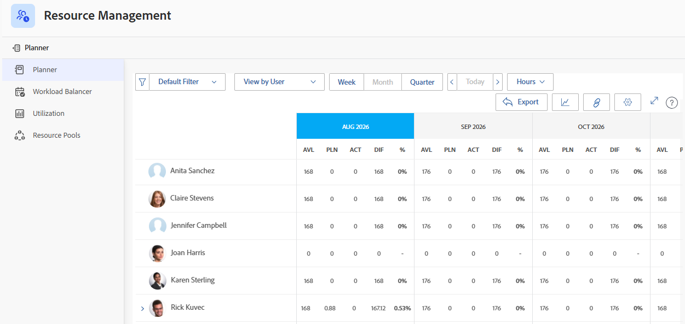
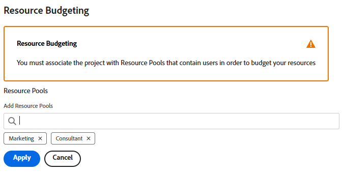

# Rechercher le planificateur de ressources

<!--

(This came off this article: draft that content in the article when this comes live: /Content/Resource Mgmt/Resource Planning/get-started-resource-planner.html)

-->

Vous pouvez utiliser le planificateur de ressources pour gérer l’affectation de vos ressources aux projets. Vous pouvez accéder au planificateur de ressources pour un ou plusieurs projets en même temps à partir de la zone Business Case du projet.

## Conditions d’accès

+++ Développez pour afficher les exigences d’accès aux fonctionnalités de cet article.

<table style="table-layout:auto"> 
 <col> 
 <col> 
 <tbody> 
  <tr> 
   <td>Package Adobe Workfront</td> 
   <td>
Tous
</td>
  </tr> 
  <tr> 
   <td>Licence Adobe Workfront</td> 
   <td>
Léger ou supérieur pour un projet ; standard pour plusieurs projets

       
Réviser ou plus pour un projet ; planifier plusieurs projets
</td>
  </tr> 
  <tr> 
   <td>Configurations des niveaux d’accès</td> 
   <td> 
Accès Afficher ou supérieur à la gestion des ressources
 </td> 
  </tr> 
  <tr> 
   <td>Autorisations d’objet</td> 
   <td> 
Visualiser les autorisations pour les projets et les utilisateurs et utilisatrices 
 </td> 
  </tr> 
 </tbody> 
</table>

Pour plus d’informations, voir [Conditions d’accès requises dans la documentation Workfront](/help/quicksilver/administration-and-setup/add-users/access-levels-and-object-permissions/access-level-requirements-in-documentation.md).

+++

## Conditions préalables

Assurez-vous que toutes les conditions préalables à l’accès et à l’utilisation du planificateur de ressources sont remplies avant de commencer à l’utiliser. Ainsi, vous vous assurez que le planificateur de ressources affiche les informations correctes avant de commencer à établir un budget de vos ressources.

Pour plus d’informations sur les conditions préalables à l’utilisation du planificateur de ressources, consultez l’article [Commencer avec le planificateur de ressources](../../resource-mgmt/resource-planning/get-started-resource-planning.md).

## Rechercher le planificateur de ressources

Vous pouvez localiser le planificateur de ressources dans deux zones de Workfront, selon que vous souhaitez établir le budget de vos ressources pour un ou plusieurs projets.

* [Utiliser le planificateur de ressources pour plusieurs projets](#use-the-resource-planner-for-multiple-projects)
* [Utiliser le planificateur de ressources pour un projet](#use-the-resource-planner-for-one-project)

### Utiliser le planificateur de ressources pour plusieurs projets {#use-the-resource-planner-for-multiple-projects}

Lorsque vous utilisez le planificateur de ressources pour plusieurs projets, les numéros d’attribution de vos ressources représentent les numéros de plusieurs projets.

Pour accéder à la section Planificateur dans la zone Ressources :

{{step1-to-resourcing}}

Le planificateur s’affiche par défaut.  Pour plus d’informations sur l’établissement d’un budget des ressources dans le planificateur de ressources, consultez l’article [Établir un budget des ressources dans le planificateur de ressources à l’aide des vues Projet et Rôle](../../resource-mgmt/resource-planning/budget-resources-project-role-views-resource-planner.md).

1. Cliquez sur **Groupes de ressources** dans le panneau de gauche.
Pour plus d’informations sur la création de groupes de ressources, consultez l’article [Créer des groupes de ressources](../../resource-mgmt/resource-planning/resource-pools/create-resource-pools.md).

### Utiliser le planificateur de ressources pour un projet {#use-the-resource-planner-for-one-project}

Lorsque vous utilisez le planificateur de ressources pour un projet, les numéros d’affectation de vos ressources correspondent aux numéros du projet sélectionné.

1. Accédez à un projet pour lequel vous souhaitez établir un budget des ressources.
1. Cliquez sur **Business Case** dans le panneau de gauche.
1. Faites défiler l’écran jusqu’à la section **Établissement du budget des ressources** de le Business Case.
1. Cliquez sur **Modifier l’établissement du budget des ressources** pour ajouter des groupes de ressources à votre projet et commencer à établir le budget de vos ressources.

   >[!TIP]
   >
   >Vous ne pouvez ajouter un pool de ressources que dans la zone de budgétisation des ressources de l&#39;Analyse de rentabilité lorsque le projet n&#39;est associé à aucun pool de ressources. <!--When the project already has a Resource Pool, the users in the pool and their job roles display in the Resource Budgeting area by default.-->

   

   Pour plus d’informations sur la planification des ressources pour un projet, voir l’article [Budgéter les ressources dans le business case](../../manage-work/projects/define-a-business-case/budget-resources-in-business-case.md).
