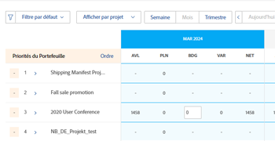

# Définir la priorité des projets dans le planificateur de ressources

Les projets sont répertoriés par ordre de priorité dans le planificateur de ressources ; le projet le plus important apparaît en premier.

## Conditions d’accès

+++ Développez pour afficher les exigences d’accès aux fonctionnalités de cet article.

<table style="table-layout:auto"> 
 <col> 
 <col> 
 <tbody> 
  <tr> 
   <td>Package Adobe Workfront</td> 
   <td>
Tous
</td>
  </tr> 
  <tr> 
   <td>Licence Adobe Workfront</td> 
   <td>
Standard

       
Plan
</td> 
  </tr> 
  <tr> 
   <td>Configurations des niveaux d’accès</td> 
   <td> 
Accès en modification à la gestion des ressources qui inclut l’accès en modification des priorités et des heures du budget dans le planificateur de ressources.
 
Accès en modification aux données financières, aux projets et aux utilisateurs et utilisatrices
</td> 
  </tr> 
  <tr> 
   <td>Autorisations d’objet</td> 
   <td> 
Autorisations de gestion des projets pour lesquels vous souhaitez budgéter les informations avec la possibilité de gérer les finances.
</td>
  </tr> 
 </tbody> 
</table>

Pour plus d’informations, voir [Conditions d’accès requises dans la documentation Workfront](/help/quicksilver/administration-and-setup/add-users/access-levels-and-object-permissions/access-level-requirements-in-documentation.md).

+++

## Ordre par défaut des projets dans le planificateur de ressources

Par défaut, les projets sont répertoriés dans la vue Projet du planificateur de ressources en tenant compte des critères ci-dessous.

>[!IMPORTANT]
>
>Les projets sont répertoriés selon les trois critères ci-dessous uniquement la première fois que vous ouvrez le planificateur de ressources. Cette priorité par défaut devient automatiquement votre priorité personnalisée et ne peut pas être rétablie à la priorité d’origine si vous effectuez l’une des opérations suivantes :
>
>* Cliquer sur Enregistrer.
>* Modifier manuellement la priorité de planification de projet. Pour plus d’informations sur la modification manuelle de la priorité de planification de projet, voir la section [Modifier manuellement la priorité de planification de projet](#manually-change-the-project-planning-priority) dans cet article.
>
>Une fois que la priorité du projet devient votre priorité personnalisée, les modifications apportées aux informations du projet n’affectent plus l’ordre des projets utilisant ces critères. Après cela, vous pourrez uniquement classer les projets par priorité manuellement.

Les critères par défaut d’origine pour la liste des projets dans la vue Projet sont les suivants, dans cet ordre :

1. Par le score d’alignement sur le projet.\
   Pour plus d’informations sur le score d’alignement du projet, voir [Appliquer une carte de performance à un projet et générer un score d’alignement](../../manage-work/projects/define-a-business-case/apply-scorecard-to-project-to-generate-alignment-score.md).

1. Par la date de début prévue du projet (si le champ Alignement est nul ou est le même pour plusieurs projets).
1. Par ordre alphabétique (si le champ Alignement est nul ou est le même, et que la date de début prévue est la même pour plusieurs projets).

Tenez compte des points suivants lorsque vous travaillez avec les priorités de projet dans le planificateur de ressources :

* Vous pouvez personnaliser manuellement la priorité du projet uniquement lorsque vous appliquez la vue Projet. Cela modifie également l’ordre des projets dans le planificateur de ressources.
* Lorsque vous appliquez les vues Rôle ou Utilisateur dans le planificateur de ressources, les projets apparaissent dans le même ordre de priorité que celui défini dans la vue Projet.
* L’ordre des projets dans le planificateur de ressources vous est propre. D’autres utilisateurs et utilisatrices peuvent afficher les mêmes projets dans le planificateur de ressources, mais dans un ordre différent. Vous ne pouvez pas générer de rapports sur le champ Priorité de planification de projet. Cette option est visible uniquement dans le planificateur de ressources et sert d’indicateur pour hiérarchiser vos projets.

Les projets associés à un portfolio peuvent avoir une priorité au niveau du portfolio. Vous pouvez activer l’affichage de la priorité du portfolio d’un projet dans le planificateur de ressources, en plus de la priorité du planificateur de ressources. Vous pouvez également classer les projets en fonction de la priorité de leur portfolio.

## Modifier manuellement la priorité de planification de projet {#manually-change-the-project-planning-priority}

Pour réorganiser les projets dans le planificateur de ressources, vous devez disposer de l’autorisation Modifier de la gestion des ressources et de l’autorisation Gérer pour les projets.

En donnant une nouvelle priorité aux projets, vous pouvez les classer par ordre d’importance.

Pour modifier la priorité de planification de projet :

1. Accédez au **Planificateur de ressources**.

1. Cliquez dans le champ à gauche du nom du projet qui contient un nombre, saisissez un nombre pour modifier la Priorité de planification, puis appuyez sur Entrée.\
   \
   Ou\
   Pointez sur le nom du projet, cliquez sur l’indicateur situé à gauche du nom du projet, puis faites-le glisser et déposez-le à l’endroit approprié pour modifier la priorité.

   

   Lorsque vous sélectionnez des nombres pour classer les projets par priorité, sélectionnez des nombres plus faibles pour les priorités plus élevées (plus importantes) et des nombres plus élevés pour les priorités moins élevées (moins importantes). Lorsque vous définissez le nombre de la priorité d’un projet sur un nombre inférieur (priorité supérieure), tous les autres projets du planificateur de ressources se déplacent vers le bas de la liste (deviennent moins importants).\
   Lorsque vous définissez le nombre de la priorité d’un projet sur un nombre supérieur (priorité inférieure), tous les autres projets du planificateur de ressources sont déplacés vers le haut de la liste (deviennent plus importants).

1. Cliquer sur **Enregistrer**.\
   L’ordre des projets change en fonction de vos sélections et cela devient votre priorité de projet personnalisée dans le planificateur de ressources. Les autres personnes ne peuvent pas voir votre ordre de priorité pour les projets dans le planificateur de ressources, bien qu’elles puissent peut-être afficher les mêmes projets dans leurs planificateurs de ressources.

## Classer les projets en fonction de leur priorité de portfolio dans le planificateur de ressources

>[!IMPORTANT]
>
>Votre société doit disposer d’un package Prime ou d’un package Workfront supérieur pour donner la priorité aux projets dans Portfolio Optimizer.
>
>Pour plus d’informations sur les packages Workfront, voir [Packages Adobe Workfront et tarification](https://business.adobe.com/fr/products/workfront/pricing.html).
>
>Pour plus d’informations sur la hiérarchisation des projets dans l’optimisateur de portfolio, voir [Hiérarchiser des projets dans l’optimisateur de portfolio](../../manage-work/portfolios/portfolio-optimizer/prioritize-projects-in-portfolio-optimizer.md).

1. Ouvrez le **Planificateur de ressources** dans la **vue Projet**.
1. Cliquez sur l’icône **Paramètres**.
1. Activez le paramètre **Afficher les priorités de portfolio** pour afficher les priorités du projet en fonction du portfolio auquel elles sont affectées. La priorité des projets selon leurs portfolios s’affiche en regard de la priorité du planificateur de ressources. Ce paramètre est désactivé par défaut.

   <!--
   
(NOTE: check screen shot to see if this is accurate still - should say Order, and not Sort:)

   -->

   

   Les priorités de portfolio des projets s’affichent uniquement dans la vue Projet du planificateur de ressources.

1. Cliquez sur **Ordre** pour ordonner les projets en fonction des priorités de portfolio.

   Si vous avez des projets qui appartiennent à plusieurs portfolios, vous pouvez voir plusieurs projets ayant la même priorité de portfolio dans le planificateur de ressources. Dans ce cas, les projets ayant la même priorité de portfolio sont répertoriés selon les critères suivants, dans cet ordre :

   1. Score d&#39;alignement
   1. Date de début prévue
   1. Nom du projet

   

1. Cliquer sur **Enregistrer**.

## Effet de la modification de la priorité de la planification de projet sur les heures disponibles pour l’utilisateur ou l’utilisatrice

La priorité de planification de projet affecte les heures disponibles pour les utilisateurs et utilisatrices. Les personnes associées au projet dont la priorité est la plus élevée affichent la disponibilité complète de la colonne Heures disponibles (AVL) pour ce projet, en fonction de leurs plannings.

Les mêmes personnes associées au deuxième projet par ordre de priorité afficheront une valeur Heures disponibles, à savoir la différence entre le nombre total des heures disponibles et ce qui a déjà été budgété pour le premier projet de la colonne Heures budgétées, etc. Pour plus d’informations sur la budgétisation des ressources dans le planificateur de ressources, voir [Ressources de budget dans le planificateur de ressources à l’aide des vues Projet et Fonctions](../../resource-mgmt/resource-planning/budget-resources-project-role-views-resource-planner.md).

Si aucune heure n’a été budgétée pour le premier projet (par ordre de priorité) pour une personne, mais que des heures ont été budgétées pour le deuxième projet pour la même personne, la personne affichera la totalité des heures disponibles pour les deux projets.

Nous vous recommandons de mettre à jour la colonne Heures budgétées pour vos utilisateurs et utilisatrices dans l’ordre des projets dans le planificateur de ressources, afin de vous assurer que vous pouvez afficher précisément les heures disponibles pour l’utilisateur ou l’utilisatrice à tout moment.

>[!NOTE]
>
>Comme la priorité de planification de projet est propre à chaque personne gestionnaire de ressources, votre projet de deuxième priorité peut être un projet prioritaire pour une autre personne qui consulte les mêmes projets dans son planificateur de ressources. Si une autre personne gestionnaire de ressources budgétise une ressource pour son premier projet, les heures disponibles de cette ressource diminueront pour votre premier projet en fonction de cette modification.
>
>La personne qui budgétise des heures alloue d’abord cette ressource et réduit le nombre d’heures disponibles de cette ressource dans l’ensemble du système. Le nombre des heures disponibles doit être mis à jour pour les utilisateurs et utilisatrices dès que les heures budgétées sont enregistrées pour une ressource dans le planificateur de ressources.
>
>Pour plus d’informations sur les heures disponibles, voir [Disponibilité et attribution des ressources](../../resource-mgmt/resource-planning/resource-availability-allocation-resource-planner.md#availability-and-allocation-of-resources).
