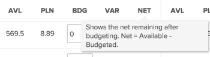

# Vérifiez la disponibilité et l’affectation des ressources à l’aide du planificateur de ressources Adobe Workfront.

Vous pouvez afficher la disponibilité de vos ressources et le volume de travail planifié ou budgété pour vos projets dans le planificateur de ressources. Ces valeurs sont affichées en heures, en ETR (équivalent temps plein) ou en coûts et sont organisées en colonnes.

## Exigences d’accès

Vous devez disposer des accès suivants pour effectuer les étapes de cet article :

<table style="table-layout:auto"> 
 <col> 
 <col> 
 <tbody> 
  <tr> 
   <td role="rowheader">Formule Adobe Workfront*</td> 
   <td> <p>Pro ou version ultérieure</p> </td> 
  </tr> 
  <tr> 
   <td role="rowheader">Licence Adobe Workfront*</td> 
   <td> <p>Révision ou version ultérieure </p> </td> 
  </tr> 
  <tr> 
   <td role="rowheader">Paramétrages du niveau d'accès*</td> 
   <td> <p>Visualisez ou affichez un accès supérieur aux éléments suivants :</p> 
    <ul> 
     <li> <p>Gestion des ressources</p> </li> 
     <li> <p>Données financières</p> </li> 
     <li> <p>Utilisateurs</p> </li> 
     <li> <p>Projets</p> </li> 
    </ul> <p><b>NOTE</b>

Si vous n’avez toujours pas accès à , demandez à votre administrateur Workfront s’il définit des restrictions supplémentaires à votre niveau d’accès. Pour plus d’informations sur la façon dont un administrateur Workfront peut modifier votre niveau d’accès, voir <a href="../../administration-and-setup/add-users/configure-and-grant-access/create-modify-access-levels.md" class="MCXref xref">Création ou modification de niveaux d’accès personnalisés</a>.</p> </td>
</tr> 
  <tr> 
   <td role="rowheader">Autorisations d’objet</td> 
   <td> <p>Affichage ou autorisations supérieures des projets que vous souhaitez afficher dans le planificateur de ressources</p> <p>Pour plus d’informations sur la demande d’accès supplémentaire, voir <a href="../../workfront-basics/grant-and-request-access-to-objects/request-access.md" class="MCXref xref">Demande d’accès aux objets </a>.</p> </td> 
  </tr> 
 </tbody> 
</table>

*Pour connaître le plan, le type de licence ou l’accès dont vous disposez, contactez votre administrateur Workfront.

<!--note from the table about the license: Review or higher: 
      <MadCap:conditionalText data-mc-conditions="QuicksilverOrClassic.Draft mode">
       (waiting on Vazgen to confirm - working differenly in classic)
      </MadCap:conditionalText>
     -->

## Conditions préalables

Vous devez respecter toutes les conditions préalables requises pour utiliser le planificateur de ressources. Pour plus d’informations, voir [Présentation de Resource Planner](../../resource-mgmt/resource-planning/get-started-resource-planner.md).

>[!IMPORTANT]
>
>Si l’une des conditions préalables requises pour la bonne fonctionnalité du planificateur de ressources est manquante, certains nombres peuvent être nuls ou les Heures budgétées peuvent être grisées.

## Disponibilité et allocation des ressources

Les colonnes qui affichent la disponibilité et l’allocation de vos ressources changent en fonction de la vue que vous appliquez au planificateur de ressources. Pour plus d’informations sur l’affichage des informations dans le planificateur de ressources par projet, rôle ou utilisateur, voir [Présentation de la navigation de Resource Planner](../../resource-mgmt/resource-planning/resource-planner-navigation.md).

Tenez compte des points suivants lorsque vous changez votre vue en planificateur de ressources :

* Lorsque vous appliquez la variable **Afficher par projet** ou **Afficher par rôle** vous pouvez voir les colonnes suivantes :

   <!--
  <MadCap:conditionalText data-mc-conditions="QuicksilverOrClassic.Draft mode">
  (NOTE: Alina: (some of the information in this area is also covered in Calculating Costs in the RP - https://workfront.zendesk.com/hc/en-us/articles/115004186433 - update this article also, when changes here occur)
  </MadCap:conditionalText>
  -->


   * Heures, ETR ou coût disponibles
   * Heures planifiées, ETR ou Coût
   * Heures, ETR ou Coût budgétés
   * Heures, ETR ou variance de coût
   * Heures nettes, ETR ou Coût

* Lorsque vous appliquez la variable **Afficher par utilisateur** vous pouvez voir les colonnes suivantes :

   * Heures disponibles ou ETR
   * Heures planifiées ou ETR
   * Différence heure/ETR
   * Pourcentage d’affectation des heures planifiées

>[!TIP]
>
>Les informations ne sont pas disponibles en tant que coût lors de l’application de la variable **Afficher par utilisateur** afficher le planificateur de ressources.
>
>Pour plus d’informations sur l’affichage de chaque colonne, placez le pointeur de la souris sur le nom de la colonne dans laquelle le nombre s’affiche.\
>
>
>Pour plus d&#39;informations sur les données affichées dans chaque colonne, consultez les articles suivants :
>
>* [Vue d’ensemble des heures, de l’éditeur de texte enrichi et des coûts dans les vues Projet et Rôle du planificateur de ressources](../../resource-mgmt/resource-planning/overview-of-planner-hour-fte-cost-information-in-role-project-views.md)
>* [Afficher les heures disponibles, planifiées et réelles ou l’éditeur de texte enrichi dans le planificateur de ressources lors de l’utilisation de la vue utilisateur](../../resource-mgmt/resource-planning/view-hours-fte-user-view-resource-planner.md)
>


## Affichage des informations par heure, ETR ou coût

1. Accédez au planificateur de ressources.

   Par défaut, les informations s’affichent par Heures dans le planificateur de ressources.

1. Développez le menu déroulant.\
   

1. Sélectionnez l’une des options suivantes :

   <table style="table-layout:auto"> 
    <col> 
    <col> 
    <tbody> 
     <tr> 
      <td role="rowheader">Heures</td> 
      <td>Affiche les informations de disponibilité et d’attribution dans les Heures.</td> 
     </tr> 
     <tr> 
      <td role="rowheader">Temps complet</td> 
      <td> <p>Affiche les informations de disponibilité et d’attribution dans l’éditeur de texte enrichi.</p> <p>Pour plus d’informations sur le mode de calcul de l’éditeur de texte enrichi dans le planificateur de ressources, voir <a href="../../resource-mgmt/resource-planning/calculate-hours-fte-for-users-roles-resource-planner.md" class="MCXref xref">Présentation du calcul des heures et de l’éditeur de texte enrichi pour les utilisateurs et les rôles dans le planificateur de ressources</a>. </p> </td> 
     </tr> 
     <tr> 
      <td role="rowheader">Coûts</td> 
      <td> <p>Affiche les informations de disponibilité et d’affectation par coût, si vous affichez le planificateur de ressources dans les vues Projet ou Rôle. Les informations affichent les valeurs dans la devise de votre système. Votre administrateur Workfront définit la devise système. Pour plus d’informations sur la configuration de la devise système dans Workfront, voir <a href="../../administration-and-setup/manage-workfront/exchange-rates/set-up-exchange-rates.md" class="MCXref xref">Configurer les taux de change</a>.</p> <p><b>NOTE</b>

   Vous devez associer les utilisateurs et les rôles de tâche aux taux de coût par heure afin d’afficher les informations de coût dans le planificateur de ressources.<br style="font-style: italic;">Pour plus d’informations sur l’association des taux de coût par heure aux rôles de tâche, voir <a href="../../administration-and-setup/set-up-workfront/organizational-setup/create-manage-job-roles.md" class="MCXref xref">Création et gestion des rôles de tâche</a>.<br style="font-style: italic;">Pour plus d’informations sur l’association des taux de coût par heure avec les utilisateurs, voir <a href="../../administration-and-setup/add-users/create-and-manage-users/edit-a-users-profile.md" class="MCXref xref">Modification du profil d’un utilisateur</a>.<br style="font-style: italic;">Pour plus d’informations sur le mode de calcul du coût dans le planificateur de ressources, voir <a href="../../resource-mgmt/resource-planning/calculate-costs-resource-planner.md" class="MCXref xref">Calcul des coûts dans le planificateur de ressources </a>.</p> </td>
   </tr> 
     <tr> 
      <td role="rowheader">Personnaliser</td> 
      <td>Crée une vue personnalisée des colonnes qui s’affichent dans le planificateur de ressources. Sélectionnez les options à afficher dans le planificateur de ressources, comme décrit dans les étapes ci-dessous. </td> 
     </tr> 
    </tbody> 
   </table>

1. (Conditionnel) Si vous avez sélectionné **Personnaliser**, indiquez les options dans la variable **Personnalisation des mesures affichées** pour configurer votre vue personnalisée.

   

1. Dans le **Type d’affichage** sur la gauche, sélectionnez l’un des affichages suivants :

   * Projet
   * Rôle
   * Utilisateur

1. Dans le **Afficher les éléments sélectionnés** , sélectionnez le type d&#39;information à afficher dans les colonnes de la vue sélectionnée. Le tableau suivant indique les options disponibles dans chaque vue :

   | **Option** | Vue utilisateur | Vue Projet | Vue du rôle |
   |---|---|---|---|
   | Disponible | ✔ | ✔ | ✔ |
   | Prévu | ✔ | ✔ | ✔ |
   | Budgété |   | ✔ | ✔ |
   | Variance |   | ✔ | ✔ |
   | Net |   | ✔ | ✔ |
   | Réel | ✔ |   |   |
   | Différence | ✔ |   |   |
   | Pourcentage | ✔ |   |   |

1. Sélectionner **Utiliser les valeurs PLN (planifiée) dans les calculs NET** pour utiliser les informations Planifié au lieu de Planifié lors du calcul des valeurs nettes dans les vues Projet et Rôle .

   Lorsque vous sélectionnez cette option, Workfront calcule les valeurs nettes à l’aide de la formule suivante :

   ```
   Net = Available - Planned
   ```

   >[!TIP]
   >
   >**Cette option est appliquée uniquement lorsque vous sélectionnez au moins une option pour personnaliser la vue dans la section Afficher les éléments sélectionnés .**

1. Cliquer sur **Enregistrer**.

   La vue personnalisée qui comprend les colonnes sélectionnées s’affiche.

   Le planificateur de ressources répertorie la vue personnalisée comme personnalisée dans le menu déroulant Heures .

   >[!NOTE]
   >
   >Vous ne pouvez avoir qu’une seule vue personnalisée.

   

## Affichage du graphique Affectation des utilisateurs

Vous pouvez afficher l’ Affectation planifiée des utilisateurs en fonction de leur disponibilité dans un graphique.

Pour afficher l’affectation des utilisateurs dans un graphique :

1. Accédez au planificateur de ressources.

   Pour plus d’informations sur l’accès au planificateur de ressources, voir la section [Localisation du planificateur de ressources](../../resource-mgmt/resource-planning/get-started-resource-planner.md#accessing-the-resource-planner) dans l’article [Présentation de Resource Planner](../../resource-mgmt/resource-planning/get-started-resource-planner.md).

1. Sélectionner **Afficher par utilisateur**.

   >[!TIP]
   >
   >Vous ne pouvez afficher le graphique d’affectation des utilisateurs que dans la vue Utilisateur.

1. Cliquez sur le bouton **Graphique d’affectation des utilisateurs** icon  pour afficher les informations suivantes :

   <table style="table-layout:auto"> 
    <col> 
    <col> 
    <tbody> 
     <tr> 
      <td role="rowheader">% de disponibilité sans sur-allocation de tous les utilisateurs</td> 
      <td>Il s’agit de la durée pendant laquelle tous les utilisateurs sont disponibles pour le travail au cours d’une période donnée, exprimée en pourcentage par rapport au temps total disponible. </td> 
     </tr> 
     <tr> 
      <td role="rowheader">% de sur-allocation pour tous les utilisateurs </td> 
      <td> <p>Il s’agit de la durée pendant laquelle les utilisateurs sont surchargés au cours d’une période, exprimée en pourcentage par rapport au temps disponible total.</p> <p><b>NOTE</b>

   Une suraffectation se produit lorsque les heures planifiées sont supérieures aux heures disponibles. </p> </td>
   </tr> 
     <tr> 
      <td role="rowheader">% de sous-utilisation pour tous les utilisateurs</td> 
      <td> <p>Il s’agit de la durée pendant laquelle les utilisateurs sont sous-utilisés au cours d’une période donnée, exprimée en pourcentage par rapport au temps disponible total.</p> <p><b>NOTE</b>

   La sous-utilisation se produit lorsque les heures planifiées sont inférieures aux heures disponibles. </p> </td>
   </tr> 
     <tr> 
      <td role="rowheader">Il existe une surallocation pour au moins un utilisateur durant cette période</td> 
      <td>Cela indique qu’il existe une surallocation d’au moins un utilisateur au cours d’une période donnée, bien que la durée totale de tous les utilisateurs ne soit pas surchargée au cours de cette période.<br>Vous devez faire défiler la liste des utilisateurs et les heures de l’utilisateur surchargé sont indiquées en rouge.</td> 
     </tr> 
    </tbody> 
   </table>

   

1. (Facultatif) Cliquez sur le **% de suraffectation pour tous les utilisateurs** zone du graphique.\
   Tous les utilisateurs surchargés sont surlignés en rouge.
1. (Facultatif) Cliquez sur le **% de sous-utilisation pour tous les utilisateurs** zone du graphique.\
   Tous les utilisateurs sous-utilisés sont surlignés en bleu.

1. (Facultatif) Cliquez sur l’icône d’indicateur  qui indique où au moins un utilisateur est suralloué.\
   Les utilisateurs surchargés sont surlignés en rouge.

1. (Facultatif) Actualisez la page pour réduire le graphique.
