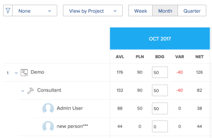
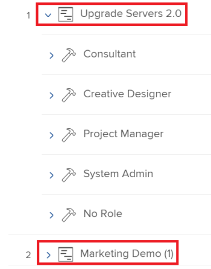

# Présentation de la navigation de Resource Planner

En utilisant le planificateur de ressources Adobe Workfront, vous pouvez facilement comprendre la disponibilité de vos ressources, ainsi que le temps planifié nécessaire pour terminer le travail sur vos projets. Vous pouvez ensuite gérer l’affectation de vos utilisateurs et de leurs rôles de travail sur les projets auxquels ils sont affectés.

>[!TIP]
>
>Vous ne pouvez pas gérer l’affectation des équipes sur les tâches auxquelles elles sont affectées dans le planificateur de ressources.

Vous devez respecter les conditions préalables requises pour utiliser pleinement le planificateur de ressources. Pour plus d’informations sur le planificateur de ressources, voir [Présentation de Resource Planner](../../resource-mgmt/resource-planning/get-started-resource-planner.md).

Les sections suivantes décrivent toutes les zones du planificateur de ressources.

## Chronologie des projets

Utilisez le calendrier en haut du planificateur de ressources pour parcourir la chronologie des projets que vous affichez. Par défaut, la chronologie commence par le mois d’aujourd’hui.\
Pour plus d’informations sur la modification de la période que vous affichez dans le planificateur de ressources, voir la section [Sélection de la période](#timeframe-selection) dans cet article.

## Sélection de la période  {#timeframe-selection}

Par défaut, le planificateur de ressources affiche les informations sur les ressources pendant trois ou quatre mois à la fois, à partir du mois en cours. Le nombre de périodes affichées dépend de la largeur de votre écran.

>[!TIP]
>
>Vous ne pouvez pas afficher plus de quatre périodes à la fois dans le planificateur de ressources.

Pour parcourir la chronologie :

1. Cliquez sur les flèches Précédent et Suivant pour reculer et reculer dans la chronologie.
1. Sélectionnez l’une des options de période suivantes dans le planificateur de ressources en cliquant sur les boutons appropriés :

   <table style="table-layout:auto"> 
    <col> 
    <col> 
    <tbody> 
     <tr> 
      <td role="rowheader">Semaine</td> 
      <td>Affiche des informations par semaine. Le numéro de la semaine s’affiche en regard des dates dans l’en-tête de la colonne. </td> 
     </tr> 
     <tr> 
      <td role="rowheader">Mois</td> 
      <td> Affiche des informations par mois.</td> 
     </tr> 
     <tr> 
      <td role="rowheader">Trimestre</td> 
      <td>Affiche des informations par trimestre. Le nombre de trimestres s’affiche en regard des dates dans l’en-tête de colonne. Les trimestres personnalisés ne s’affichent pas dans le planificateur de ressources. </td> 
     </tr> 
     <tr> 
      <td role="rowheader">Aujourd’hui</td> 
      <td>Renvoie au mois, à la semaine ou au trimestre d’aujourd’hui.</td> 
     </tr> 
    </tbody> 
   </table>

## Sélection de la vue Projet/Rôle/Utilisateur

Vous pouvez modifier la vue dans le planificateur de ressources en fonction de la manière dont vous souhaitez que les informations s’affichent.

Par défaut, le planificateur de ressources s’affiche dans la vue Utilisateur. Vous pouvez modifier la vue en Project ou Role Views. Lorsque vous la modifiez en une autre vue, votre choix devient votre vue par défaut.

Lorsque vous modifiez la vue, les informations suivantes changent également :

* Hiérarchie des objets (informations dans les lignes du planificateur de ressources).
* Informations sur l’attribution des heures (informations dans les colonnes du planificateur de ressources).

   Pour plus d’informations sur l’affichage des colonnes dans le planificateur de ressources en fonction de l’affichage sélectionné, voir [Vérifiez la disponibilité et l’affectation des ressources à l’aide du planificateur de ressources Adobe Workfront.](../../resource-mgmt/resource-planning/resource-availability-allocation-resource-planner.md).

Pour afficher des informations précises dans le planificateur de ressources, vous devez remplir un ensemble de conditions préalables. Pour plus d’informations sur les conditions préalables, voir la section &quot;Conditions préalables requises pour travailler dans le planificateur de ressources&quot; dans la section [Présentation de Resource Planner](../../resource-mgmt/resource-planning/get-started-resource-planner.md) article.  Pour modifier la vue dans le planificateur de ressources :

1. Accédez au **Resource Planner**.\
   Pour plus d’informations sur l’accès au planificateur de ressources, voir la section [Localisation du planificateur de ressources](../../resource-mgmt/resource-planning/get-started-resource-planner.md#accessing-the-resource-planner) dans la section [Présentation de Resource Planner](../../resource-mgmt/resource-planning/get-started-resource-planner.md) article.

1. Dans le **Afficher par** dans le menu déroulant, sélectionnez l’une des vues suivantes :

   * [Afficher par projet](#view-by-project)
   * [Afficher par fonction](#view-by-role)
   * [Afficher par utilisateur](#view-by-user)

### Afficher par projet {#view-by-project}

Tenez compte des points suivants lorsque vous sélectionnez la vue Projet dans le planificateur de ressources :

* Vous pouvez voir les projets que vous êtes autorisé à au moins afficher.
* Lorsque vous accédez au planificateur de ressources pour la première fois, vous pouvez voir les projets filtrés par le filtre par défaut.\
   Pour plus d’informations sur le filtrage des informations dans le planificateur de ressources, voir [Filtrage des informations dans le planificateur de ressources](../../resource-mgmt/resource-planning/filter-resource-planner.md).

* Le nombre d’éléments que vous affichez ou pouvez exporter à partir de la vue Projet est limité afin d’améliorer les performances.\
   Pour plus d’informations sur les limites lors de l’affichage du planificateur de ressources dans la vue Projet, voir la section [Limites de la vue Projet](../../resource-mgmt/resource-planning/resource-planner-display-limitations.md#project-view-limits) dans la section [Limites d’affichage de Resource Planner](../../resource-mgmt/resource-planning/resource-planner-display-limitations.md) article.

* Les projets sont répertoriés par ordre de priorité dans la vue Projet.\
   Pour plus d’informations sur la priorité du projet dans le planificateur de ressources, voir [Priorité de la planification des projets](#project-planning-priority) dans cet article.

* À mesure que vous développez chaque projet, vous pouvez afficher les rôles de tâche qui lui sont associés.\
   À mesure que vous développez chaque rôle, vous pouvez afficher les utilisateurs qui y sont associés.\
   Faites défiler l’écran pour charger d’autres rôles et utilisateurs sous chaque projet.

* Lorsque cet affichage est appliqué, le cumul des heures de rôle, de l’éditeur de texte enrichi ou des coûts s’ajoute aux heures du projet, de l’éditeur de texte enrichi ou du coût.\
   

* Vous pouvez afficher les informations sur l’heure, l’éditeur de texte enrichi ou le coût dans la vue Projet :

   * Disponible
   * Prévu
   * Budgété
   * Variance
   * Net

      Pour plus d’informations, voir [Ressources de budget dans le planificateur de ressources à l’aide des vues Projet et Rôle](../../resource-mgmt/resource-planning/budget-resources-project-role-views-resource-planner.md).

### Afficher par fonction {#view-by-role}

Tenez compte des points suivants lorsque vous sélectionnez la vue Rôle dans le planificateur de ressources :

* Vous devez au moins disposer d’un accès en vue à la gestion des ressources et d’autorisations d’affichage sur les projets pour afficher les rôles associés à ces projets.
* Vous pouvez développer chaque rôle pour afficher une liste de projets et chaque projet pour afficher une liste des utilisateurs pouvant remplir ces rôles sur les projets.
* Le nombre d’éléments que vous affichez ou pouvez exporter à partir de la vue Rôle est limité afin d’améliorer les performances.\
   Pour plus d’informations sur les limites lors de l’affichage du planificateur de ressources dans la vue Rôle, voir la section [Limites de la vue Rôle](../../resource-mgmt/resource-planning/resource-planner-display-limitations.md#role-view-limits) dans [Limites d’affichage de Resource Planner](../../resource-mgmt/resource-planning/resource-planner-display-limitations.md) .

* Les projets sont répertoriés sous le rôle de tâche dans le même ordre de priorité que dans la vue Projet.
* Lorsque cet affichage est appliqué, le cumul des heures de projet, de l’éditeur de texte enrichi ou des coûts s’ajoute aux heures de rôle, à l’éditeur de texte enrichi ou au coût.\
   

* Vous pouvez afficher les informations sur l’heure, l’éditeur de texte enrichi ou le coût dans la vue Rôle :

   * Disponible
   * Prévu
   * Budgété
   * Variance
   * Net

      Pour plus d’informations, voir [Ressources de budget dans le planificateur de ressources à l’aide des vues Projet et Rôle](../../resource-mgmt/resource-planning/budget-resources-project-role-views-resource-planner.md).

### Afficher par utilisateur {#view-by-user}

Vous pouvez afficher le planificateur de ressources dans la vue Utilisateur afin de comprendre la différence entre les heures planifiées et disponibles ou l’éditeur de texte enrichi pour vos utilisateurs ou de voir le nombre d’heures réelles enregistrées.

Vous ne pouvez pas budgéter vos ressources lorsque vous appliquez la vue utilisateur au planificateur de ressources. Vous devez budgéter vos ressources à l’aide des vues Projet ou Rôle, et utiliser la vue Utilisateur pour examiner l’allocation et la disponibilité de vos utilisateurs par rapport au travail planifié.* *

La vue utilisateur est la vue par défaut du planificateur de ressources.

Tenez compte des points suivants lorsque vous sélectionnez Vue utilisateur dans le planificateur de ressources :

* Vous pouvez voir tous les utilisateurs que vous êtes autorisé à afficher, jusqu’à 2 000 utilisateurs, principaux et connectés au Adobe Workfront au moins une fois.\
   Vous pouvez filtrer la liste des utilisateurs par équipe, rôle de tâche ou pool afin de n’afficher que les utilisateurs associés à ces entités.
* Si vous avez filtré la liste des utilisateurs par projet, seuls les utilisateurs associés aux projets filtrés peuvent être développés, ainsi que les informations sur l’heure.\
   Pour plus d’informations sur le filtrage des informations dans le planificateur de ressources, voir [Filtrage des informations dans le planificateur de ressources](../../resource-mgmt/resource-planning/filter-resource-planner.md) .

* Le nombre d’éléments que vous affichez ou pouvez exporter à partir de la vue utilisateur est limité afin d’améliorer les performances.\
   Pour plus d’informations sur les limites lors de l’affichage de la planification des ressources dans la vue utilisateur, voir la section [Limites dans la vue utilisateur](../../resource-mgmt/resource-planning/resource-planner-display-limitations.md#user-view-limits) dans [Limites d’affichage de Resource Planner](../../resource-mgmt/resource-planning/resource-planner-display-limitations.md) .

* Les projets sont répertoriés sous le nom de l’utilisateur dans le même ordre de priorité que dans la vue Projet.\
   Pour plus d’informations sur la priorité du projet dans le planificateur de ressources, voir [Priorité de la planification des projets](#project-planning-priority) dans cet article.

* Si aucun rôle de travail n’est associé aux utilisateurs, les valeurs Heures ou ETR sont répertoriées sous **Aucun rôle** .
* Lorsque cet affichage est appliqué, les heures du projet ou l’éditeur de texte enrichi s’ajoutent aux heures utilisateur ou à l’éditeur de texte enrichi.

   >[!TIP]
   >
   >Vous ne pouvez pas afficher l’allocation et la disponibilité des utilisateurs par coût dans la vue utilisateur.

* Vos autorisations de projets et de tâches déterminent ce qui s’affiche sous les noms des utilisateurs que vous voyez dans la vue utilisateur.\
   Les scénarios suivants existent :

   * Lorsque vous ne disposez pas des autorisations nécessaires pour afficher les projets et les tâches ou problèmes affectés aux utilisateurs affichés dans le planificateur de ressources, ces éléments sont répertoriés sous la **Éléments inaccessibles** sections. Le **Éléments inaccessibles** dans ce cas, les sections Projet ou Tâche remplacent les sections .

   * Lorsque vous ne disposez pas des autorisations nécessaires pour afficher les projets, mais que vous avez accès aux tâches ou problèmes relatifs aux projets, les projets, tâches et problèmes sont répertoriés sous les noms des utilisateurs qui leur sont affectés.
   * Lorsque vous disposez des autorisations nécessaires pour afficher les projets, mais pas les tâches ni les problèmes qui y sont associés, le nom du projet s’affiche et les tâches et problèmes sont répertoriés sous le **Éléments inaccessibles** .\
      Pour plus d’informations sur les autorisations dans Workfront, voir [Présentation des autorisations de partage sur les objets](../../workfront-basics/grant-and-request-access-to-objects/sharing-permissions-on-objects-overview.md).

      
    

* Vous pouvez afficher les informations sur l’heure et l’éditeur de texte enrichi suivantes dans la vue Utilisateur :

   * Disponible
   * Prévu
   * Réel
   * Différence entre les prévisions et les résultats réels
   * Pourcentage d&#39;affectation planifiée

      Pour plus d’informations, voir [Afficher les heures disponibles, planifiées et réelles ou l’éditeur de texte enrichi dans le planificateur de ressources lors de l’utilisation de la vue utilisateur](../../resource-mgmt/resource-planning/view-hours-fte-user-view-resource-planner.md)

## Nom du projet

Vous pouvez voir les projets suivants dans le planificateur de ressources :

* Projets que vous êtes autorisé à au moins afficher.

   Vous devez également avoir accès à au moins Afficher la gestion des ressources dans votre niveau d’accès.

   Pour plus d’informations sur l’accès nécessaire à l’utilisation du planificateur de ressources, voir [Accès aux ressources de budget nécessaires dans Adobe Workfront](../../resource-mgmt/resource-planning/access-needed-to-budget-resources.md).

* Projets limités par le filtre appliqué au planificateur de ressources.

   Pour plus d’informations sur le filtrage des informations dans le planificateur de ressources, voir [Filtrage des informations dans le planificateur de ressources](../../resource-mgmt/resource-planning/filter-resource-planner.md).

   >[!NOTE]
   >
   >Il est recommandé d’utiliser des filtres pour réduire le nombre de projets affichés dans le planificateur de ressources.

## Priorité de la planification des projets {#project-planning-priority}

Les projets sont répertoriés par ordre de priorité dans le planificateur de ressources, le projet le plus important se trouvant en haut. La priorité est indiquée par un numéro devant le nom du projet.

Vous pouvez également activer un paramètre pour afficher les priorités du projet en fonction de leur portfolio, lorsqu’elles sont associées à un portfolio. Pour plus d’informations sur la priorité des projets et l’affichage des priorités de portefeuille dans le planificateur de ressources , voir [Définir la priorité des projets dans le planificateur de ressources](../../resource-mgmt/resource-planning/prioritize-projects-resource-planner.md).

## Nom de la fonction

Les catégories de rôles de tâche suivantes sont répertoriées dans le planificateur de ressources :

* Rôles de tâche affectés aux tâches.
* Les rôles de tâche qui ne sont pas affectés aux tâches, mais qui sont les rôles de tâche Principaux des utilisateurs associés aux pools de ressources des projets.
* Rôles de tâche secondaires des utilisateurs affectés à des tâches dans ces rôles de tâche.
* Les rôles de tâche secondaires des utilisateurs qui disposent d’un **Pourcentage de disponibilité de l’éditeur de texte enrichi** dans leur profil.\
   Pour plus d’informations sur la variable **Pourcentage de disponibilité de l’éditeur de texte enrichi** pour les rôles de tâche, voir [Modification du profil d’un utilisateur](../../administration-and-setup/add-users/create-and-manage-users/edit-a-users-profile.md) .

>[!NOTE]
>
>Les rôles de tâche affectés aux problèmes sont également répertoriés lorsque la variable **Inclure les heures du problème** est activé. Pour plus d’informations sur l’activation des heures de problème dans le planificateur de ressources, voir [Paramètres](#settings) .

## Nom d&#39;utilisateur

Les utilisateurs répertoriés dans les vues Projet et Rôle du planificateur de ressources appartiennent aux pools de ressources associés aux projets.\
Pour plus d’informations sur le remplissage des pools de ressources avec les utilisateurs, voir [Association des pools de ressources aux utilisateurs](../../resource-mgmt/resource-planning/resource-pools/associate-resource-pools-with-users.md).

Tous les utilisateurs que vous avez accès à Afficher et qui se sont connectés à Workfront au moins une fois s’affichent dans la vue Utilisateur.

Dans les vues Projet et Rôle, les utilisateurs peuvent apparaître sous les types de rôles de tâche suivants :

* Leur Principal rôle
* Leur rôle secondaire, dans les scénarios suivants :

   * Si le rôle de tâche secondaire comporte un numéro valide pour la fonction **Pourcentage de disponibilité de l’éditeur de texte enrichi** dans leur profil utilisateur.
   * Si l’utilisateur est affecté à des tâches dans ces rôles.

Pour plus d’informations sur la variable **Pourcentage de disponibilité de l’éditeur de texte enrichi** pour un rôle de tâche, voir [Modification du profil d’un utilisateur](../../administration-and-setup/add-users/create-and-manage-users/edit-a-users-profile.md) .

## Sections &quot;Aucun rôle&quot; et &quot;Aucun utilisateur&quot;

* [Section &quot;Aucun rôle&quot;](#no-role-section)
* [Section &quot;Aucun utilisateur&quot;](#no-user-section)

### Section &quot;Aucun rôle&quot;  {#no-role-section}

Lorsqu’un utilisateur appartient à un pool de ressources associé à un projet, mais qu’il n’est associé à aucun rôle de tâche, il apparaît dans la variable **Aucun rôle** au lieu d’un rôle de tâche spécifique.

Vous ne pouvez pas mettre en budget des heures pour un utilisateur dans une **Aucun rôle** . L’utilisateur doit être associé à au moins un rôle de tâche pour être budgété pour le travail.\

### Section &quot;Aucun utilisateur&quot;  {#no-user-section}

Lorsque vous attribuez une tâche à une équipe ou que vous la laissez non affectée, les Heures planifiées apparaissent sous la **Aucun utilisateur** qui apparaît sous la section **Aucun rôle** dans le planificateur de ressources. Ces tâches n’apparaissent pas dans le planificateur de ressources lors de l’utilisation de la fonction **Afficher par utilisateur** vue.

Vous pouvez voir le nombre d’heures planifiées attribuées aux tâches du projet dans la variable **Aucun utilisateur** dans le planificateur de ressources, mais vous ne pouvez pas établir de budget pour ces affectations.

 

## Filtres

Les filtres permettent de limiter les informations affichées dans le planificateur de ressources.

Pour plus d’informations sur le filtrage dans le planificateur de ressources, voir [Filtrage des informations dans le planificateur de ressources](../../resource-mgmt/resource-planning/filter-resource-planner.md) .

## Paramètres {#settings}

Dans la zone Paramètres , vous pouvez activer ou désactiver des options pour afficher ou masquer des informations dans le planificateur de ressources.

Pour activer les paramètres dans le planificateur de ressources :

1. Ouvrez le planificateur de ressources.
1. Cliquez sur le bouton **Paramètres** icône .

   

   La zone Paramètres du planificateur de ressources s’affiche.

   

1. Activez la variable **Inclure les heures des problèmes** pour afficher les heures planifiées à partir des problèmes du planificateur de ressources. Ce paramètre est désactivé par défaut.

   Tenez compte des points suivants lorsque vous activez ce paramètre :

   * Le nom de l’utilisateur affecté aux problèmes s’affiche sous le rôle de tâche qui lui est associé sur le problème et vous pouvez spécifier les Heures budgétées pour l’utilisateur et le rôle de la tâche dans les vues Projet et Rôle .
   * Les problèmes auxquels les utilisateurs sont affectés sont répertoriés sous les noms des rôles de tâche dans la vue Utilisateur.

      >[!IMPORTANT]
      >
      >**Lorsque les dates de début et de fin planifiées du problème se situent en dehors de la chronologie du projet, les heures planifiées du problème s’affichent en fonction des dates du problème. Si, par exemple, la date du projet est comprise entre janvier et mars, mais que la date du projet est fixée au mois d’août, les heures prévues pour les problèmes apparaissent au cours de la période d’août.**

1. (Conditionnel et facultatif) Si vous avez sélectionné la vue Projet, activez le paramètre Afficher les priorités du Portfolio afin d’afficher les priorités du projet en fonction du Portfolio auquel elles sont affectées. La priorité des projets selon leur portefeuille s’affiche en regard de la priorité du planificateur de ressources. Ce paramètre est désactivé par défaut.

   Pour plus d’informations sur la priorité des projets dans le planificateur de ressources, voir [Définir la priorité des projets dans le planificateur de ressources](../../resource-mgmt/resource-planning/prioritize-projects-resource-planner.md).

## Option Plein écran

Vous pouvez afficher le planificateur de ressources en plein écran pour augmenter la quantité d’informations que vous pouvez afficher à l’écran.

L’option permettant d’afficher les informations en plein écran est disponible pour toutes les vues du planificateur de ressources.

Pour afficher le planificateur de ressources en plein écran :

1. Accédez au **Resource Planner**.
1. Cliquez sur le bouton **Icône Plein écran** pour afficher le planificateur de ressources en plein écran.\
   \
   Le planificateur de ressources s’étend pour occuper toute la fenêtre de votre navigateur et l’icône se transforme en **Fermer le plein écran** l’option d’affichage.

1. (Facultatif) Cliquez sur le **Icône Fermer le plein écran** pour rétablir l’affichage précédent.

## Option d’exportation

Vous pouvez exporter des informations vers un fichier Excel (.xlsx) à partir de n’importe quelle vue du planificateur de ressources.\
Pour plus d’informations sur l’exportation d’informations à partir du planificateur de ressources, voir [Exporter des informations à partir du planificateur de ressources](../../resource-mgmt/resource-planning/export-resource-planner.md).

Vous pouvez gérer la quantité d&#39;informations et l&#39;affichage du fichier exporté.\
Pour plus d’informations sur les informations que vous pouvez exporter à partir du planificateur de ressources et sur la manière de gérer l’aspect du fichier exporté, voir [Limites d’affichage de Resource Planner](../../resource-mgmt/resource-planning/resource-planner-display-limitations.md).
