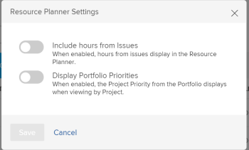

# Vue d’ensemble de la navigation dans le planificateur de ressources

En utilisant le planificateur de ressources d’Adobe Workfront, vous pouvez facilement comprendre la disponibilité de vos ressources, ainsi que le temps prévu nécessaire pour terminer le travail sur vos projets. Vous pouvez ensuite gérer l’affectation de vos utilisateurs et utilisatrices et de leurs fonctions sur les projets qui leur ont été affectés.

>[!TIP]
>
>Vous ne pouvez pas gérer l’affectation des équipes sur les tâches auxquelles elles sont affectées dans le planificateur de ressources.

Vous devez respecter les conditions préalables pour utiliser pleinement le planificateur de ressources. Pour plus d’informations sur le planificateur de ressources, consultez la section [Vue d’ensemble du planificateur de ressources](../../resource-mgmt/resource-planning/get-started-resource-planner.md).

Les sections suivantes décrivent toutes les zones du planificateur de ressources.

## Chronologie des projets

Utilisez le calendrier situé en haut du planificateur de ressources pour parcourir la chronologie des projets que vous visualisez. Par défaut, la chronologie commence par le mois actuel.\
Pour plus d’informations sur la modification du délai de la chronologie que vous affichez dans le planificateur de ressources, consultez dans cet article la section [Sélectionner le délai](#timeframe-selection).

## Sélectionner le délai  {#timeframe-selection}

Par défaut, le planificateur de ressources affiche les informations sur les ressources pendant trois ou quatre mois à la fois, à partir du mois en cours. Le nombre de périodes affichées dépend de la largeur de votre écran.

>[!TIP]
>
>Vous ne pouvez pas afficher plus de quatre périodes à la fois dans le planificateur de ressources.

Pour parcourir la chronologie, procédez comme suit :

1. Cliquez sur les flèches « Précédent » et « Suivant » pour reculer et avancer dans la chronologie.
1. Sélectionnez l’une des options de période suivantes dans le planificateur de ressources en cliquant sur les boutons appropriés :

   <table style="table-layout:auto"> 
    <col> 
    <col> 
    <tbody> 
     <tr> 
      <td role="rowheader">Semaine</td> 
      <td>Affiche des informations par semaine. Le numéro de la semaine s’affiche à côté des dates dans l’en-tête de colonne. </td> 
     </tr> 
     <tr> 
      <td role="rowheader">Mois</td> 
      <td> Affiche des informations par mois.</td> 
     </tr> 
     <tr> 
      <td role="rowheader">Trimestre</td> 
      <td>Affiche des informations par trimestre. Le nombre de trimestres s’affiche à côté des dates dans l’en-tête de colonne. Les trimestres personnalisés ne s’affichent pas dans le planificateur de ressources. </td> 
     </tr> 
     <tr> 
      <td role="rowheader">Aujourd’hui</td> 
      <td>Renvoie au mois, à la semaine ou au trimestre en cours.</td> 
     </tr> 
    </tbody> 
   </table>

## Sélectionner la vue Projet, Rôle ou utilisateur

Vous pouvez ajuster la vue dans le planificateur de ressources selon vos préférences d’affichage des informations.

Par défaut, le planificateur de ressources s’affiche dans la vue utilisateur. Vous pouvez modifier la vue soit en vue Projet, soit en vue Rôle. Lorsque vous modifiez la vue, votre choix devient votre vue par défaut.

Lorsque vous modifiez la vue, les informations suivantes changent également :

* Hiérarchie des objets (informations dans les lignes du planificateur de ressources).
* Informations sur l’affectation des heures (informations dans les colonnes du planificateur de ressources).

  Pour plus d’informations sur l’affichage des colonnes dans le planificateur de ressources en fonction de la vue sélectionnée, consultez la section [Vérifier la disponibilité et l’affectation des ressources à l’aide du planificateur de ressources d’Adobe Workfront](../../resource-mgmt/resource-planning/resource-availability-allocation-resource-planner.md).

Pour afficher des informations précises dans le planificateur de ressources, vous devez remplir un ensemble de conditions préalables. Pour plus d’informations sur les conditions préalables, consultez dans l’article [Vue d’ensemble du planificateur de ressources](../../resource-mgmt/resource-planning/get-started-resource-planner.md), la section « Conditions préalables requises pour travailler dans le planificateur de ressources ».  Pour modifier la vue dans le planificateur de ressources, procédez comme suit :

1. Accédez au **planificateur de ressources**.\
   Pour plus d’informations sur l’accès au planificateur de ressources, consultez dans l’article [Vue d’ensemble du planificateur de ressources](../../resource-mgmt/resource-planning/get-started-resource-planner.md) la section [Accéder au planificateur de ressources](../../resource-mgmt/resource-planning/get-started-resource-planner.md#accessing-the-resource-planner).

1. Dans le menu déroulant **Afficher par**, sélectionnez l’une des vues suivantes :

   * [Par projet](#view-by-project)
   * [Par fonction](#view-by-role)
   * [Par utilisateur](#view-by-user)

### Par projet {#view-by-project}

Tenez compte des points suivants lorsque vous sélectionnez la vue Projet dans le planificateur de ressources :

* Vous pouvez voir les projets que vous avez au minimum le droit d’afficher.
* Lorsque vous accédez au planificateur de ressources pour la première fois, vous pouvez voir les projets filtrés par le filtre par défaut.\
  Pour plus d’informations sur le filtrage des informations dans le planificateur de ressources, consultez la section [Filtrer les informations dans le planificateur de ressources](../../resource-mgmt/resource-planning/filter-resource-planner.md).

* Le nombre d’éléments que vous affichez ou que vous pouvez exporter à partir de la vue Projet est limité afin d’améliorer les performances.\
  Pour plus d’informations sur les limitations lors de l’affichage du planificateur de ressources dans la vue Projet, consultez dans l’article [Limitations d’affichage du planificateur de ressources](../../resource-mgmt/resource-planning/resource-planner-display-limitations.md) la section [Limitations de la vue Projet](../../resource-mgmt/resource-planning/resource-planner-display-limitations.md#project-view-limits).

* Les projets sont répertoriés par ordre de priorité dans la vue Projet.\
  Pour plus d’informations sur les priorités des projets dans le planificateur de ressources, consultez dans cet article la section [Priorités dans la planification des projets](#project-planning-priority).

* À mesure que vous développez chaque projet, vous pouvez afficher les fonctions qui lui sont affectées.\
  À mesure que vous développez chaque rôle, vous pouvez afficher les utilisateurs et utilisatrices qui y sont affectés.\
  Faites défiler l’écran pour charger d’autres rôles et les utilisateurs et utilisatrices sous chaque projet.

* Lorsque cette vue est appliquée, les heures, l’équivalent temps complet ou les coûts du rôle s’ajoutent aux heures, à l’équivalent temps complet ou aux coûts du projet.\
  

* Vous pouvez afficher les informations suivantes sur les heures, l’équivalent temps complet ou les coûts dans la vue Projet :

   * Disponible
   * Prévu
   * Budgété
   * Variance
   * Net

     Pour plus d’informations, consultez la section [Budgéter les ressources dans le planificateur de ressources à l’aide des vues Projet et Rôle](../../resource-mgmt/resource-planning/budget-resources-project-role-views-resource-planner.md).

### Par fonction {#view-by-role}

Tenez compte des points suivants lorsque vous sélectionnez la vue Rôle dans le planificateur de ressources :

* Vous devez au moins disposer d’un accès en affichage dans la gestion des ressources et d’autorisations d’affichage sur les projets pour afficher les rôles affectés à ces projets.
* Vous pouvez développer chaque rôle pour afficher une liste de projets et chaque projet pour afficher une liste des utilisateurs et utilisatrices pouvant remplir ces rôles sur les projets.
* Le nombre d’éléments que vous affichez ou pouvez exporter à partir de la vue Rôle est limité afin d’améliorer les performances.\
  Pour plus d’informations sur les limitations lors de l’affichage du planificateur de ressources dans la vue Rôle, consultez la section [Limitations de la vue Rôle](../../resource-mgmt/resource-planning/resource-planner-display-limitations.md#role-view-limits) dans [Limitations d’affichage du planificateur de ressources](../../resource-mgmt/resource-planning/resource-planner-display-limitations.md).

* Les projets sont répertoriés sous le rôle dans le même ordre de priorité que dans la vue Projet.
* Lorsque cette vue est appliquée, les heures, l’équivalent temps complet ou les coûts du projet s’ajoutent aux heures, à l’équivalent temps complet ou aux coûts du rôle.\
  

* Vous pouvez afficher les informations suivantes sur les heures, l’équivalent temps complet ou les coûts dans la vue Rôle :

   * Disponible
   * Prévu
   * Budgété
   * Variance
   * Net

     Pour plus d’informations, consultez la section [Budgéter les ressources dans le planificateur de ressources à l’aide des vues Projet et Rôle](../../resource-mgmt/resource-planning/budget-resources-project-role-views-resource-planner.md).

### Par utilisateur {#view-by-user}

Vous pouvez afficher le planificateur de ressources dans la vue utilisateur pour comprendre la différence entre le nombre d’heures prévues et les heures disponibles ou l’équivalent temps complet pour vos utilisateurs et utilisatrices ou pour voir le nombre d’heures effectives consignées à ce jour.

Vous ne pouvez pas budgéter vos ressources lorsque vous appliquez la vue utilisateur au planificateur de ressources. Vous devez budgéter vos ressources à l’aide des vues Projet ou Rôle et utiliser la vue utilisateur pour examiner l’affectation et la disponibilité de vos utilisateurs et utilisatrices par rapport au travail prévu.* *

La vue utilisateur est la vue par défaut du planificateur de ressources.

Tenez compte des points suivants lorsque vous sélectionnez la vue utilisateur dans le planificateur de ressources :

* Vous pouvez afficher jusqu’à 2 000 personnes actives qui se sont connectées à Adobe Workfront au moins une fois.\
  Vous pouvez filtrer la liste des utilisateurs et utilisatrices par équipe, fonction ou groupe afin de n’afficher que les personnes affectées à ces entités.
* Si vous avez filtré la liste des utilisateurs et utilisatrices par projet, vous pouvez développer uniquement la liste des personnes affectées aux projets filtrés et afficher les informations relatives aux heures.\
  Pour plus d’informations sur le filtrage des informations dans le planificateur de ressources, consultez la section [Filtrer les informations dans le planificateur de ressources](../../resource-mgmt/resource-planning/filter-resource-planner.md).

* Le nombre d’éléments que vous pouvez afficher ou exporter à partir de la vue utilisateur est limité afin d’améliorer les performances.\
  Pour plus d’informations sur les limites lors de l’affichage du planificateur de ressources dans la vue utilisateur, consultez la section [Limites dans la vue utilisateur](../../resource-mgmt/resource-planning/resource-planner-display-limitations.md#user-view-limits) de l’article [Limites d’affichage du planificateur de ressources](../../resource-mgmt/resource-planning/resource-planner-display-limitations.md).

* Les projets sont répertoriés sous le nom de l’utilisateur ou de l’utilisatrice dans le même ordre de priorité que dans la vue Projet.\
  Pour plus d’informations sur la priorité du projet dans le planificateur de ressources, voir [Priorité de la planification des projets](#project-planning-priority) dans cet article.

* Si aucune fonction n’est associée aux utilisateurs et utilisatrices, les valeurs Heures ou Temps complet sont répertoriées dans la section **Aucun rôle**.
* Lorsque cet affichage est appliqué, les heures du projet ou le temps complet s’ajoutent aux heures ou au temps complet de l’utilisateur ou de l’utilisatrice.

  >[!TIP]
  >
  >Vous ne pouvez pas afficher l’affectation et la disponibilité des utilisateurs et utilisatrices en fonction du coût dans la vue utilisateur.

* Vos autorisations pour les projets et les tâches déterminent ce qui s’affiche sous les noms des utilisateurs et utilisatrices que vous voyez dans la vue utilisateur.\
  Les scénarios suivants sont possibles :

   * Lorsque vous ne disposez pas des autorisations nécessaires pour afficher les projets et les tâches ou problèmes affectés aux utilisateurs et utilisatrices affichés dans le planificateur de ressources, ces éléments sont répertoriés sous les sections **Éléments inaccessibles**. Dans ce cas, les sections **Éléments inaccessibles** remplacent les sections Projet ou Tâche.

   * Lorsque vous ne disposez pas des autorisations nécessaires pour afficher les projets, mais que vous avez accès aux tâches ou problèmes des projets, les projets, tâches et problèmes sont répertoriés sous les noms des utilisateurs et utilisatrices qui leur sont affectés.
   * Lorsque vous disposez des autorisations nécessaires pour afficher les projets, mais pas les tâches ni les problèmes qui y sont associés, le nom du projet s’affiche et les tâches et problèmes sont répertoriés sous la section **Éléments inaccessibles**.\
     Pour plus d’informations sur les autorisations dans Workfront, voir [Vue d’ensemble des autorisations de partage sur les objets](../../workfront-basics/grant-and-request-access-to-objects/sharing-permissions-on-objects-overview.md).

     

   

* Vous pouvez afficher les informations suivantes sur les heures et le temps complet dans la vue utilisateur :

   * Disponible
   * Prévu
   * Réel
   * Différence entre les prévisions et les résultats réels
   * Pourcentage d’affectation prévu

     Pour plus d’informations, voir [Afficher les heures disponibles, prévues et effectives ou le temps complet dans le planificateur de ressources dans la vue utilisateur](../../resource-mgmt/resource-planning/view-hours-fte-user-view-resource-planner.md).

## Nom du projet

Vous pouvez voir les projets suivants dans le planificateur de ressources :

* Projets pour lesquels vous disposez au minimum d’autorisations d’affichage.

  Votre niveau d’accès doit également inclure l’affichage de la gestion des ressources, au minimum.

  Pour plus d’informations sur l’accès nécessaire à l’utilisation du planificateur de ressources, voir [Accès nécessaire pour budgéter les ressources dans Adobe Workfront](../../resource-mgmt/resource-planning/access-needed-to-budget-resources.md).

* Projets limités par le filtre appliqué au planificateur de ressources.

  Pour plus d’informations sur le filtrage des informations dans le planificateur de ressources, voir [Filtrer les informations dans le planificateur de ressources](../../resource-mgmt/resource-planning/filter-resource-planner.md).

  >[!NOTE]
  >
  >Il est recommandé d’utiliser des filtres pour réduire le nombre de projets affichés dans le planificateur de ressources.

## Priorité de la planification des projets {#project-planning-priority}

Les projets sont répertoriés par ordre de priorité dans le planificateur de ressources ; le projet le plus important apparaît en premier. La priorité est indiquée par un numéro devant le nom du projet.

Vous pouvez également activer un paramètre pour afficher les priorités du projet en fonction de leur portfolio, lorsqu’elles sont associées à un portfolio. Pour plus d’informations sur la priorité des projets et l’affichage des priorités de portfolio dans le planificateur de ressources, voir [Définir la priorité des projets dans le planificateur de ressources](../../resource-mgmt/resource-planning/prioritize-projects-resource-planner.md).

## Nom de la fonction

Les catégories de fonctions suivantes sont répertoriées dans le planificateur de ressources :

* Fonctions affectées à des tâches.
* Fonctions qui ne sont pas affectées à des tâches, mais qui constituent les fonctions principales des utilisateurs et utilisatrices associés aux groupes de ressources des projets.
* Fonctions secondaires des utilisateurs et utilisatrices affectés à des tâches relevant de ces fonctions.
* Fonctions secondaires des utilisateurs et utilisatrices qui disposent d’un **Pourcentage de disponibilité temps complet** valide dans leur profil.\
  Pour plus d’informations sur le **Pourcentage de disponibilité temps complet** pour les fonctions, voir [Modifier le profil d’un utilisateur ou d’une utilisatrice](../../administration-and-setup/add-users/create-and-manage-users/edit-a-users-profile.md).

>[!NOTE]
>
>Les fonctions affectées aux problèmes sont également répertoriés lorsque le paramètre **Inclure les heures des problèmes** est activé. Pour plus d’informations sur l’activation des heures de problème dans le planificateur de ressources, consultez la section [Paramètres](#settings).

## Nom d&#39;utilisateur

Les utilisateurs et utilisatrices répertoriés dans les vues Projet et Rôle du planificateur de ressources appartiennent aux groupes de ressources associés aux projets.\
Pour plus d’informations sur l’ajout d’utilisateurs et d’utilisatrices aux groupes de ressources, consultez la section [Associer des groupes de ressources à des utilisateurs et utilisatrices](../../resource-mgmt/resource-planning/resource-pools/associate-resource-pools-with-users.md).

Toutes les personnes pour lesquelles vous disposez d’un accès en affichage et qui se sont connectées à Workfront au moins une fois s’affichent dans la vue utilisateur.

Dans les vues Projet et Rôle, les utilisateurs et utilisatrices peuvent présenter les types de fonctions suivants :

* Leur fonction principale
* Leur fonction secondaire, dans les scénarios suivants :

   * Si la fonction secondaire a un numéro valide pour le **Pourcentage de disponibilité temps complet** dans leur profil d’utilisateur ou d’utilisatrice.
   * Si des tâches sont affectées à l’utilisateur ou l’utilisatrice dans ces fonctions.

Pour plus d’informations sur le **Pourcentage de disponibilité temps complet** pour une fonction, consultez la section [Modifier le profil d’un utilisateur ou d’une utilisatrice](../../administration-and-setup/add-users/create-and-manage-users/edit-a-users-profile.md).

## Sections « Aucun rôle » et « Aucun utilisateur ni aucune utilisatrice »

* [Section « Aucun rôle »](#no-role-section)
* [Section « Aucun utilisateur ni aucune utilisatrice »](#no-user-section)

### Section « Aucun rôle »  {#no-role-section}

Si un utilisateur ou une utilisatrice appartient à un groupe de ressources associé à un projet, mais qu’aucune fonction ne lui a été affectée, cet utilisateur ou cette utilisatrice apparaît dans la section **Aucun rôle** au lieu de figurer sous une fonction spécifique.

Vous ne pouvez pas budgéter les heures d’un utilisateur ou d’une utilisatrice dans une section **Aucun rôle**. Pour qu’un travail soit budgété, au moins une fonction doit être affectée à l’utilisateur ou à l’utilisatrice.\

### Section « Aucun utilisateur ni aucune utilisatrice »  {#no-user-section}

Lorsque vous affectez une tâche à une équipe ou que vous la laissez non affectée, le nombre d’heures prévues apparait sous la section **Aucun utilisateur ni aucune utilisatrice** qui elle-même apparaît sous la section **Aucun rôle** dans le planificateur de ressources. Ces tâches n’apparaissent pas dans le planificateur de ressources lors de l’utilisation de la vue **Afficher par utilisateur ou par utilisatrice**.

Vous pouvez voir le nombre d’heures prévues affecté aux tâches du projet dans la section **Aucun utilisateur ni aucune utilisatrice** dans le planificateur de ressources, mais vous ne pouvez pas établir de budget pour ces affectations.

 

## Filtres

Les filtres vous permettent de limiter les informations affichées dans le planificateur de ressources.

Pour plus d’informations sur le filtrage dans le planificateur de ressources, consultez la section [Filtrer les informations dans le planificateur de ressources](../../resource-mgmt/resource-planning/filter-resource-planner.md).

## Paramètres {#settings}

Dans la zone des paramètres, vous pouvez activer ou désactiver des options pour afficher ou masquer des informations dans le planificateur de ressources.

Pour activer les paramètres dans le planificateur de ressources :

1. Ouvrez le planificateur de ressources.
1. Cliquez sur l’icône **Paramètres**.

   

   La zone des paramètres du planificateur de ressources s’affiche.

   

1. Activez le paramètre **Inclure les heures des problèmes** pour afficher le nombre d’heures prévues dans le planificateur de ressources. Ce paramètre est désactivé par défaut.

   Tenez compte des points suivants lorsque vous activez ce paramètre :

   * Le nom de l’utilisateur ou de l’utilisatrice à qui les problèmes ont été affectés s’affiche sous la fonction qui lui est affectée pour le problème et vous pouvez spécifier le nombre d’heures prévues et la fonction pour l’utilisateur ou l’utilisatrice dans les vues Projet et Rôle.
   * Les problèmes affectés aux utilisateurs et utilisatrices sont répertoriés sous les noms des fonctions dans la vue utilisateur.

     >[!IMPORTANT]
     >
     >**Lorsque les dates de début et de fin prévues du problème se situent en dehors de la chronologie du projet, le nombre d’heures prévues du problème s’affiche en fonction des dates du problème. Si, par exemple, la date du projet est comprise entre janvier et mars, mais que la date du projet est fixée au mois d’août, le nombre d’heures prévues pour les problèmes apparaissent au cours de la période d’août.**

1. (Le cas échéant et facultatif) Si vous avez sélectionné la vue Projet, activez le paramètre d’affichage des priorités du portfolio afin d’afficher les priorités du projet en fonction du portfolio auquel elles sont affectées. La priorité des projets selon leurs portfolios s’affiche en regard de la priorité du planificateur de ressources. Ce paramètre est désactivé par défaut.

   Pour plus d’informations sur la définition de la priorité des projets dans le planificateur de ressources, consultez la section [Définir la priorité des projets dans le planificateur de ressources](../../resource-mgmt/resource-planning/prioritize-projects-resource-planner.md).

## Option de plein écran

Vous pouvez afficher le planificateur de ressources en plein écran pour augmenter la quantité d’informations que vous pouvez afficher à l’écran.

L’option permettant d’afficher les informations en plein écran est disponible pour toutes les vues du planificateur de ressources.

Pour afficher le planificateur de ressources en plein écran, procédez comme suit :

1. Accédez au **planificateur de ressources**.
1. Cliquez sur l’**icône Plein écran** pour afficher le planificateur de ressources en plein écran.\
   \
   Le planificateur de ressources s’étend pour occuper toute la fenêtre de votre navigateur et l’icône devient l’option d’affichage **Fermer le plein écran**.

1. (Facultatif) Cliquez sur l’**icône Fermer le plein écran** pour rétablir l’affichage précédent.

## Option d’export

Vous pouvez exporter des informations vers un fichier Excel (.xlsx) à partir de n’importe quelle vue du planificateur de ressources.\
Pour plus d’informations sur l’export d’informations à partir du planificateur de ressources, voir [Exporter des informations à partir du planificateur de ressources](../../resource-mgmt/resource-planning/export-resource-planner.md).

Vous pouvez gérer la quantité d’informations et l’affichage du fichier exporté.\
Pour plus d’informations sur les informations que vous pouvez exporter à partir du planificateur de ressources et sur la gestion de l’aspect du fichier exporté, voir [Limites d’affichage du planificateur de ressources](../../resource-mgmt/resource-planning/resource-planner-display-limitations.md).
