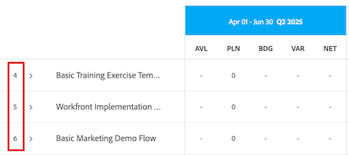
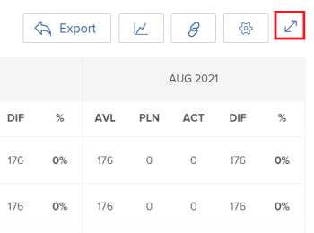

# Vue d’ensemble de la navigation dans le planificateur de ressources

<!-- Audited: 5/2025 -->

Le Planificateur de ressources d’Adobe Workfront vous permet de connaître facilement la disponibilité de vos ressources et le temps planifié nécessaire pour terminer le travail sur vos projets. Vous pouvez ensuite gérer l’affectation de vos utilisateurs et leurs fonctions dans les projets qui leur sont affectés.

>[!TIP]
>
>Vous ne pouvez pas gérer l’affectation des équipes aux tâches qui leur sont affectées dans le Planificateur de ressources.

Vous devez respecter les conditions préalables pour utiliser pleinement le planificateur de ressources. Pour plus d’informations sur le planificateur de ressources, consultez la section [Vue d’ensemble du planificateur de ressources](../../resource-mgmt/resource-planning/get-started-resource-planner.md).

Les sections suivantes décrivent toutes les zones du planificateur de ressources.

## Chronologie des projets

Utilisez le calendrier situé en haut du planificateur de ressources pour parcourir la chronologie des projets que vous visualisez. Par défaut, la chronologie commence par le mois actuel.

Pour plus d’informations sur la modification du délai de la chronologie que vous affichez dans le planificateur de ressources, consultez dans cet article la section [Sélectionner le délai](#timeframe-selection).

## Sélectionner le délai  {#timeframe-selection}

Par défaut, le Planificateur de ressources affiche des informations sur les ressources pendant 3 ou 4 mois à la fois, à partir du mois en cours. Le nombre de périodes affichées dépend de la largeur de votre écran.

>[!TIP]
>
>Vous ne pouvez pas afficher plus de 4 périodes à la fois dans le Planificateur de ressources.

Pour naviguer dans la chronologie, cliquez sur les flèches Précédent et Suivant afin de vous déplacer vers l’arrière et vers l’avant dans la chronologie. Vous pouvez ensuite sélectionner l’une des options de période suivantes dans le Planificateur de ressources en cliquant sur les boutons appropriés :

<table style="table-layout:auto"> 
    <col> 
    <col> 
    <tbody> 
     <tr> 
      <td role="rowheader">Semaine</td> 
      <td>Affiche des informations par semaine. Le numéro de la semaine s’affiche à côté des dates dans l’en-tête de colonne. </td> 
     </tr> 
     <tr> 
      <td role="rowheader">Mois</td> 
      <td> Affiche des informations par mois.</td> 
     </tr> 
     <tr> 
      <td role="rowheader">Trimestre</td> 
      <td>Affiche des informations par trimestre. Le nombre de trimestres s’affiche à côté des dates dans l’en-tête de colonne. Les trimestres personnalisés ne s’affichent pas dans le planificateur de ressources. </td> 
     </tr> 
     <tr> 
      <td role="rowheader">Aujourd’hui</td> 
      <td>Renvoie au mois, à la semaine ou au trimestre en cours.</td> 
     </tr> 
    </tbody> 
   </table>

## Sélectionner la vue Projet, Rôle ou utilisateur

Vous pouvez ajuster la vue dans le planificateur de ressources selon vos préférences d’affichage des informations.

Par défaut, le planificateur de ressources s’affiche dans la vue utilisateur. Vous pouvez modifier la vue soit en vue Projet, soit en vue Rôle. Lorsque vous modifiez la vue, votre choix devient votre vue par défaut.

Lorsque vous modifiez la vue, les informations suivantes changent également :

* Hiérarchie des objets (informations dans les lignes du planificateur de ressources).
* Informations sur l’affectation des heures (informations dans les colonnes du planificateur de ressources).

  Pour plus d’informations sur l’affichage des colonnes dans le planificateur de ressources en fonction de la vue sélectionnée, consultez la section [Vérifier la disponibilité et l’affectation des ressources à l’aide du planificateur de ressources d’Adobe Workfront](../../resource-mgmt/resource-planning/resource-availability-allocation-resource-planner.md).

Pour afficher des informations précises dans le planificateur de ressources, vous devez remplir un ensemble de conditions préalables. Pour plus d’informations sur les conditions préalables requises, reportez-vous à la section Conditions préalables pour travailler dans la planification des ressources de l’article [présentation de la planification des ressources](../../resource-mgmt/resource-planning/get-started-resource-planner.md).

Pour modifier l&#39;affichage dans le Planificateur de ressources, sélectionnez l&#39;un des affichages suivants dans le menu déroulant Afficher par :

* [Par projet](#view-by-project)
* [Par fonction](#view-by-role)
* [Par utilisateur](#view-by-user)

### Par projet {#view-by-project}

Tenez compte des points suivants lorsque vous sélectionnez la vue Projet dans le planificateur de ressources :

* Vous pouvez afficher les projets que vous êtes autorisé à afficher.
* Lorsque vous accédez au planificateur de ressources pour la première fois, vous pouvez voir les projets filtrés par le filtre par défaut.\
  Pour plus d’informations, voir [Filtrer les informations dans le Planificateur de ressources](../../resource-mgmt/resource-planning/filter-resource-planner.md).

* Le nombre d’éléments que vous affichez ou pouvez exporter à partir de la vue Projet est limité pour améliorer les performances.\
  Pour plus d’informations, consultez la section Limites dans la vue Projet de l’article [Limites d’affichage du planificateur de ressources](../../resource-mgmt/resource-planning/resource-planner-display-limitations.md).

* Les projets sont répertoriés par ordre de priorité dans la vue Projet.\
  Pour plus d&#39;informations, consultez la section [Priorité de planification de projet](#project-planning-priority) de cet article.

* À mesure que vous développez chaque projet, vous pouvez afficher les fonctions qui lui sont affectées.

* Au fur et à mesure que vous développez chaque rôle, vous pouvez afficher les utilisateurs qui lui sont associés. Faites défiler l’écran pour charger d’autres rôles et les utilisateurs et utilisatrices sous chaque projet.

* Lorsque cette vue est appliquée, les heures, l’équivalent temps complet ou les coûts du rôle s’ajoutent aux heures, à l’équivalent temps complet ou aux coûts du projet.

* Vous pouvez afficher les informations suivantes sur les heures, l’équivalent temps complet ou les coûts dans la vue Projet :

   * Disponible
   * Prévu
   * Budgété
   * Variance
   * Net

     Pour plus d’informations, consultez la section [Budgéter les ressources dans le planificateur de ressources à l’aide des vues Projet et Rôle](../../resource-mgmt/resource-planning/budget-resources-project-role-views-resource-planner.md).

### Par fonction {#view-by-role}

Tenez compte des points suivants lorsque vous sélectionnez la vue Rôle dans le planificateur de ressources :

* Vous devez au moins disposer d’un accès en affichage dans la gestion des ressources et d’autorisations d’affichage sur les projets pour afficher les rôles affectés à ces projets.
* Vous pouvez développer chaque rôle pour afficher une liste de projets et chaque projet pour afficher une liste des utilisateurs et utilisatrices pouvant remplir ces rôles sur les projets.
* Le nombre d’éléments que vous affichez ou pouvez exporter à partir de la vue Rôle est limité afin d’améliorer les performances.\
  Pour plus d&#39;informations, consultez la section Limites dans la vue Rôle dans [Limites d&#39;affichage du planificateur de ressources](../../resource-mgmt/resource-planning/resource-planner-display-limitations.md).

* Les projets sont répertoriés sous le rôle dans le même ordre de priorité que dans la vue Projet.
* Lorsque cette vue est appliquée, les heures, l’équivalent temps complet ou les coûts du projet s’ajoutent aux heures, à l’équivalent temps complet ou aux coûts du rôle.
* Vous pouvez afficher les informations suivantes sur les heures, l’équivalent temps complet ou les coûts dans la vue Rôle :

   * Disponible
   * Prévu
   * Budgété
   * Variance
   * Net

     Pour plus d’informations, consultez la section [Budgéter les ressources dans le planificateur de ressources à l’aide des vues Projet et Rôle](../../resource-mgmt/resource-planning/budget-resources-project-role-views-resource-planner.md).

### Par utilisateur {#view-by-user}

Vous pouvez afficher le planificateur de ressources dans la vue utilisateur pour comprendre la différence entre le nombre d’heures prévues et les heures disponibles ou l’équivalent temps complet pour vos utilisateurs et utilisatrices ou pour voir le nombre d’heures effectives consignées à ce jour.

Vous ne pouvez pas budgéter vos ressources lors de l&#39;application de la vue utilisateur au planificateur de ressources. Vous devez budgéter vos ressources à l’aide des vues Projet ou Rôle et utiliser la vue utilisateur pour examiner l’affectation et la disponibilité de vos utilisateurs et utilisatrices par rapport au travail prévu.

La vue utilisateur est la vue par défaut du planificateur de ressources.

Tenez compte des points suivants lorsque vous sélectionnez la vue utilisateur dans le planificateur de ressources :

* Vous pouvez voir tous les utilisateurs que vous êtes autorisé à afficher (jusqu’à 2 000 utilisateurs) qui sont actifs et qui se sont connectés à Adobe Workfront au moins une fois. Vous pouvez filtrer la liste des utilisateurs et utilisatrices par équipe, fonction ou groupe afin de n’afficher que les personnes affectées à ces entités.
* Si vous avez filtré la liste des utilisateurs par projets, seuls les utilisateurs associés aux projets filtrés peuvent être développés et afficher les informations relatives aux heures.\
  Pour plus d’informations, voir [Filtrer les informations dans le Planificateur de ressources](../../resource-mgmt/resource-planning/filter-resource-planner.md).

* Le nombre d’éléments que vous affichez ou pouvez exporter à partir de la vue Utilisateur est limité pour améliorer les performances.\
  Pour plus d’informations, consultez la section Limites dans la vue Utilisateur dans [Limites d’affichage du Planificateur de ressources](../../resource-mgmt/resource-planning/resource-planner-display-limitations.md) .

* Les projets sont répertoriés sous le nom de l’utilisateur dans le même ordre de priorité que dans la vue Projet.\
  Pour plus d&#39;informations, consultez la section [Priorité de planification de projet](#project-planning-priority) de cet article.

* Si aucun rôle de tâche n&#39;est associé aux utilisateurs, les valeurs des heures ou des équivalents temps plein sont répertoriées sous la section Aucun rôle.
* Lorsque cet affichage est appliqué, les heures du projet ou le temps complet s’ajoutent aux heures ou au temps complet de l’utilisateur ou de l’utilisatrice.

  >[!TIP]
  >
  >Vous ne pouvez pas afficher l&#39;allocation et la disponibilité des utilisateurs par coût dans la vue Utilisateur.

* Les autorisations de votre projet et de vos tâches déterminent ce qui s&#39;affiche sous les noms des utilisateurs que vous voyez dans la vue Utilisateur.

  Les scénarios suivants sont possibles :

   * Lorsque vous ne disposez pas des autorisations nécessaires pour afficher les projets et les tâches ou événements affectés aux utilisateurs dans le Planificateur de ressources, ces éléments sont répertoriés sous les sections Éléments inaccessibles . Dans ce cas, ces sections remplacent les sections Projet ou Tâche.

   * Lorsque vous ne disposez pas des autorisations nécessaires pour afficher les projets, mais que vous avez accès à l’affichage des tâches ou des événements dans les projets, les projets, tâches et événements sont répertoriés sous les noms des utilisateurs qui leur sont affectés.
   * Lorsque vous disposez des autorisations pour afficher les projets, mais pas les tâches ou les événements des projets, le nom du projet s’affiche et les tâches et événements sont répertoriés sous la section Éléments inaccessibles .

     Pour plus d’informations, voir [Vue d’ensemble des autorisations de partage sur les objets](../../workfront-basics/grant-and-request-access-to-objects/sharing-permissions-on-objects-overview.md).

* Vous pouvez afficher les informations suivantes sur les heures et le temps complet dans la vue utilisateur :

   * Disponible
   * Prévu
   * Réel
   * Différence entre les prévisions et les résultats réels
   * Pourcentage d’affectation prévu

     Pour plus d’informations, voir [Afficher les heures disponibles, prévues et effectives ou le temps complet dans le planificateur de ressources dans la vue utilisateur](../../resource-mgmt/resource-planning/view-hours-fte-user-view-resource-planner.md).

## Nom du projet

Vous pouvez voir les projets suivants dans le planificateur de ressources :

* Projets que vous êtes autorisé à afficher. Vous devez également avoir accès à Afficher la gestion des ressources dans votre niveau d&#39;accès.

  Pour plus d’informations, voir [Accès nécessaire pour budgéter les ressources dans Adobe Workfront](../../resource-mgmt/resource-planning/access-needed-to-budget-resources.md).

* Projets limités par le filtre appliqué au planificateur de ressources.

  Pour plus d’informations, voir [Filtrer les informations dans le Planificateur de ressources](../../resource-mgmt/resource-planning/filter-resource-planner.md).

  >[!NOTE]
  >
  >Il est recommandé d’utiliser des filtres pour réduire le nombre de projets affichés dans le planificateur de ressources.

## Priorité de la planification des projets {#project-planning-priority}

Les projets sont répertoriés par ordre de priorité dans le planificateur de ressources ; le projet le plus important apparaît en premier. La priorité est indiquée par un numéro devant le nom du projet.

Vous pouvez également activer un paramètre pour afficher les priorités des projets en fonction de leurs portefeuilles lorsqu&#39;elles sont associées à un portefeuille. Pour plus d’informations, voir [Hiérarchiser les projets dans le planificateur de ressources](../../resource-mgmt/resource-planning/prioritize-projects-resource-planner.md).

## Nom de la fonction

Les catégories de fonctions suivantes sont répertoriées dans le planificateur de ressources :

* Fonctions affectées à des tâches.
* Fonctions qui ne sont pas affectées à des tâches, mais qui constituent les fonctions principales des utilisateurs et utilisatrices associés aux groupes de ressources des projets.
* Fonctions secondaires des utilisateurs et utilisatrices affectés à des tâches relevant de ces fonctions.
* Fonctions secondaires des utilisateurs qui ont un pourcentage valide de disponibilité d’équivalent temps complet dans leur profil.\
  Pour plus d’informations sur le pourcentage de disponibilité d’équivalent temps complet pour les fonctions, voir [Modifier le profil d’un utilisateur](../../administration-and-setup/add-users/create-and-manage-users/edit-a-users-profile.md).

>[!NOTE]
>
>Les fonctions affectées à des événements sont également répertoriées lorsque le paramètre Inclure les heures de l&#39;événement est activé. Pour plus d’informations sur l’activation des heures de problème dans le planificateur de ressources, consultez la section [Paramètres](#settings).

## Nom d&#39;utilisateur

Les utilisateurs et utilisatrices répertoriés dans les vues Projet et Rôle du planificateur de ressources appartiennent aux groupes de ressources associés aux projets.\
Pour plus d’informations, voir [Associer des pools de ressources à des utilisateurs](../../resource-mgmt/resource-planning/resource-pools/associate-resource-pools-with-users.md).

Toutes les personnes pour lesquelles vous disposez d’un accès en affichage et qui se sont connectées à Workfront au moins une fois s’affichent dans la vue utilisateur.

Dans les vues Projet et Rôle, les utilisateurs et utilisatrices peuvent présenter les types de fonctions suivants :

* Leur fonction principale
* Leur fonction secondaire, dans les scénarios suivants :

   * Si la fonction secondaire comporte un nombre valide pour le pourcentage de disponibilité d’équivalent temps complet dans son profil utilisateur.
   * Si des tâches sont affectées à l’utilisateur ou l’utilisatrice dans ces fonctions.

Pour plus d’informations sur le pourcentage de disponibilité d’équivalent temps complet pour une fonction, voir [Modifier le profil d’un utilisateur](../../administration-and-setup/add-users/create-and-manage-users/edit-a-users-profile.md) .

## Sections Aucun rôle et Aucun utilisateur

### Section Aucun rôle  {#no-role-section}

Lorsque l’utilisateur appartient à un pool de ressources associé à un projet, mais qu’aucune fonction ne lui est associée, il apparaît dans la section Aucun rôle au lieu de sous une fonction spécifique.

Vous ne pouvez pas budgéter les heures d&#39;un utilisateur dans une section Aucun rôle. Pour qu’un travail soit budgété, au moins une fonction doit être affectée à l’utilisateur ou à l’utilisatrice.

### Pas de section Utilisateur  {#no-user-section}

Lorsque vous affectez une tâche à une équipe ou que vous ne l&#39;affectez pas, les heures prévues apparaissent sous la section Aucun utilisateur qui apparaît sous la section Aucun rôle dans le Planificateur de ressources. Ces tâches n&#39;apparaissent pas dans le Planificateur de ressources lorsque vous utilisez la vue Afficher par utilisateur.

Le nombre d&#39;heures prévues affectées aux tâches du projet est visible dans la section Aucun utilisateur du Planificateur de ressources, mais vous ne pouvez pas budgéter ces allocations.

## Filtres

Les filtres vous permettent de limiter les informations affichées dans le planificateur de ressources.

Pour plus d’informations sur le filtrage dans le planificateur de ressources, consultez la section [Filtrer les informations dans le planificateur de ressources](../../resource-mgmt/resource-planning/filter-resource-planner.md).

## Paramètres {#settings}

Dans la zone Paramètres , vous pouvez activer ou désactiver les options d’affichage ou de masquage des informations dans le Planificateur de ressources. Pour ouvrir la boîte de dialogue Paramètres du Planificateur de ressources, cliquez sur l&#39;icône Paramètres dans le coin supérieur droit de la page.

À partir de là, vous pouvez activer l’un des paramètres suivants, ou les deux :

* **Inclure les heures des événements** : affiche les heures prévues des événements.

  Tenez compte des points suivants lorsque vous activez ce paramètre :

   * Le nom de l’utilisateur affecté aux événements est affiché sous la fonction qui lui est associée dans l’événement. Vous pouvez spécifier les heures budgétées pour l’utilisateur et la fonction dans les vues Projet et Rôle.
   * Les problèmes affectés aux utilisateurs et utilisatrices sont répertoriés sous les noms des fonctions dans la vue utilisateur.

     >[!IMPORTANT]
     >
     >Lorsque les dates de début et d&#39;achèvement prévues pour l&#39;événement ne sont pas comprises dans la chronologie du projet, les heures prévues pour l&#39;événement s&#39;affichent en fonction des dates de l&#39;événement. Par exemple, si la chronologie du projet se situe entre janvier et mars, mais que la chronologie des événements se situe en août, les heures planifiées pour les événements apparaissent dans la période d’août.

* **Afficher les priorités du Portfolio** : affiche les priorités du projet en fonction du Portfolio qui leur est affecté.

  Pour plus d’informations sur la définition de la priorité des projets dans le planificateur de ressources, consultez la section [Définir la priorité des projets dans le planificateur de ressources](../../resource-mgmt/resource-planning/prioritize-projects-resource-planner.md).

  

## Option de plein écran

Vous pouvez afficher le Planificateur de ressources en plein écran pour agrandir la quantité d’informations que vous pouvez afficher à l’écran. Cette option est disponible pour toutes les vues.

Pour afficher le Planificateur de ressources en plein écran, cliquez sur l’icône Plein écran dans le coin supérieur droit de la page.

Une fois l’écran développé, vous pouvez cliquer sur l’icône Fermer le plein écran pour revenir à l’affichage précédent.

## Option d’export

Vous pouvez exporter des informations vers un fichier Excel (.xlsx) à partir de n’importe quelle vue du planificateur de ressources.

Pour plus d’informations sur l’export d’informations à partir du planificateur de ressources, voir [Exporter des informations à partir du planificateur de ressources](../../resource-mgmt/resource-planning/export-resource-planner.md).

Vous pouvez gérer la quantité d’informations et l’affichage du fichier exporté.

Pour plus d’informations sur les informations que vous pouvez exporter à partir du planificateur de ressources et sur la gestion de l’aspect du fichier exporté, voir [Limites d’affichage du planificateur de ressources](../../resource-mgmt/resource-planning/resource-planner-display-limitations.md).
