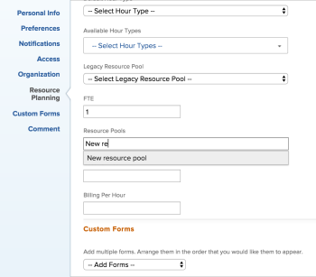

# Associer des groupes de ressources à des utilisateurs et utilisatrices

<!--

(NOTE: The info about how to add resource pools to users, are duplicated from the articles listed in those sections (Creating Users, etc). I decided to keep the steps here because those articles are too long to rummage through for updating just this one field.)

-->

Les groupes de ressources sont des groupes d’utilisateurs et d’utilisatrices qui vous aident à gérer les ressources dans Adobe Workfront.

Vous devez créer un groupe de ressources avant de pouvoir l’associer à des utilisateurs et des utilisatrices.

Vous pouvez associer des utilisateurs et utilisatrices à des groupes de ressources lorsque vous créez vos groupes de ressources.

Si vous créez des groupes de ressources sans ajouter d’utilisateurs et d’utilisatrices, vous pouvez les associer ultérieurement à des personnes lors de la modification ou de la création de nouveaux utilisateurs et utilisatrices.

Pour plus d’informations sur les groupes de ressources, voir [Vue d’ensemble des groupes de ressources](../../../resource-mgmt/resource-planning/resource-pools/work-with-resource-pools.md).

Pour plus d’informations sur la création de groupes de ressources, voir [Créer des groupes de ressources](../../../resource-mgmt/resource-planning/resource-pools/create-resource-pools.md).

## Conditions d’accès

+++ Développez pour afficher les exigences d’accès aux fonctionnalités de cet article.

<table style="table-layout:auto"> 
 <col> 
 <col> 
 <tbody> 
  <tr> 
   <td>Package Adobe Workfront</td> 
   <td>
Tous
</td> 
  </tr> 
  <tr> 
   <td>Licence Adobe Workfront</td> 
   <td>
Standard

   
Plan
</td>
  </tr> 
  <tr> 
   <td>Configurations des niveaux d’accès</td> 
   <td> 
Modifier l’accès à la gestion des ressources qui inclut l’accès à la gestion des pools de ressources
 
Modifier l’accès aux projets, aux modèles et aux utilisateurs et utilisatrices
</td> 
  </tr> 
  <tr> 
   <td>Autorisations d’objet</td> 
   <td>Gérez les autorisations des projets, modèles et utilisateurs auxquels vous souhaitez associer les pools de ressources</td> 
  </tr> 
 </tbody> 
</table>

Pour plus d’informations, voir [Conditions d’accès requises dans la documentation Workfront](/help/quicksilver/administration-and-setup/add-users/access-levels-and-object-permissions/access-level-requirements-in-documentation.md).

+++

## Associer des groupes de ressources à un utilisateur ou une utilisatrice

{{step-1-to-users}}

1. Cochez la case en regard du nom d’un utilisateur ou d’une utilisatrice de la liste, puis cliquez sur **Modifier**.
1. Cliquez sur **Planification des ressources**.
1. Commencez à saisir le nom d’un groupe de ressources que vous souhaitez associer à l’utilisateur ou à l’utilisatrice dans le champ **Groupes de ressources**, puis sélectionnez-le dans la liste lorsqu’il s’affiche.\
   Vous pouvez associer plusieurs groupes de ressources à une même personne.\
   

1. Cliquez sur **Enregistrer les modifications**.

Pour plus d’informations sur la modification des utilisateurs et utilisatrices, voir [Modifier le profil d’un utilisateur ou d’une utilisatrice](../../../administration-and-setup/add-users/create-and-manage-users/edit-a-users-profile.md).

Pour plus d’informations sur la création d’utilisateurs et d’utilisatrices, voir [Ajouter des utilisateurs et utilisatrices](../../../administration-and-setup/add-users/create-and-manage-users/add-users.md).

## Associer des groupes de ressources à des utilisateurs et utilisatrices en masse

Vous pouvez modifier plusieurs utilisateurs et utilisatrices en masse et associer les mêmes groupes de ressources à chaque personne en même temps.

Pour associer des groupes de ressources à plusieurs utilisateurs et utilisatrices en masse, procédez comme suit :

{{step-1-to-users}}

1. Sélectionnez plusieurs utilisateurs et utilisatrices dans la liste et cliquez sur **Modifier**.
1. Cliquez sur **Planification des ressources**.
1. Commencez à saisir le nom d’un groupe de ressources que vous souhaitez associer aux utilisateurs et utilisatrices dans le champ **Groupes de ressources**, puis sélectionnez-le dans la liste lorsqu’il s’affiche.\
   Vous pouvez associer plusieurs groupes de ressources à plusieurs utilisateurs et utilisatrices.

   >[!NOTE]
   >
   >Seuls les groupes de ressources communs à tous les utilisateurs et utilisatrices sélectionnés apparaissent dans ce champ. Si les utilisateurs et utilisatrices sélectionnés n’ont pas de groupes de ressources partagés, ce champ est vide. Si ce champ est vide, les groupes de ressources que vous spécifiez ici remplaceront leurs groupes de ressources individuels.

1. Cliquez sur **Enregistrer les modifications**.

Pour plus d’informations sur la manière de modifier en masse des utilisateurs et utilisatrices, voir [Modifier en masse des profils d’utilisateurs et d’utilisatrices](../../../administration-and-setup/add-users/create-and-manage-users/edit-user-profiles-in-bulk.md).
