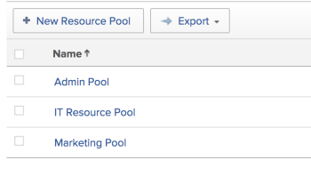

# Créer des pools de ressources

Les pools de ressources sont des ensembles d’utilisateurs qui vous aident à gérer plus facilement les ressources dans Adobe Workfront. Pour plus d’informations sur les pools de ressources, consultez la [présentation des pools de ressources](../../../resource-mgmt/resource-planning/resource-pools/work-with-resource-pools.md).

## Conditions d’accès

Vous devez disposer des éléments suivants :

<table style="table-layout:auto"> 
 <col> 
 <col> 
 <tbody> 
  <tr> 
   <td role="rowheader">Forfait Adobe Workfront*</td> 
   <td> 
Pro ou version ultérieure
 </td> 
  </tr> 
  <tr> 
   <td role="rowheader">Licence Adobe Workfront*</td> 
   <td> 
Plan 
 </td> 
  </tr> 
  <tr> 
   <td role="rowheader">Configurations des niveau d’accès*</td> 
   <td> 
Modifier l’accès à la gestion des ressources qui inclut l’accès à Gérer les groupes de ressources
 
Modifier l’accès aux utilisateurs, aux projets et aux modèles
 
Remarque : si vous n’avez toujours pas d’accès, demandez à votre équipe d’administration Workfront s’il existe des restrictions supplémentaires à votre niveau d’accès. Pour plus d’informations sur la façon dont un administrateur ou une administratrice de Workfront peut modifier votre niveau d’accès, voir <a href="../../../administration-and-setup/add-users/configure-and-grant-access/create-modify-access-levels.md" class="MCXref xref">Créer ou modifier les niveaux d’accès personnalisés</a>.
 </td> 
  </tr> 
  <tr data-mc-conditions=""> 
   <td role="rowheader">Autorisations d’objet</td> 
   <td> 
Gérez les autorisations des projets et modèles auxquels vous souhaitez associer les groupes de ressources.
 
Pour plus d’informations sur la demande d’accès supplémentaire, voir <a href="../../../workfront-basics/grant-and-request-access-to-objects/request-access.md" class="MCXref xref">Demander l’accès aux objets</a>.
 </td> 
  </tr> 
 </tbody> 
</table>

&#42;Pour connaître le forfait, le type de licence ou l’accès dont vous disposez, contactez votre administrateur ou administratrice Workfront.

## Création d’un pool de ressources {#create-a-resource-pool}

1. Connectez-vous en tant qu’utilisateur ayant accès à la modification des pools de ressources.\
   Pour plus d’informations, voir [Création d’un pool de ressources](#create-a-resource-pool).

1. Cliquez sur l’icône **Menu principal**  dans le coin supérieur droit d’Adobe Workfront.

1. Cliquez sur **Ressource**.
1. Cliquez sur **Pools de ressources** dans le panneau de gauche.\
   

1. Cliquez sur **Nouveau pool de ressources**.
1. Indiquez les informations suivantes :

   <table style="table-layout:auto">
    <col>
    <col>
    <tbody>
     <tr>
      <td role="rowheader"><strong>Nom</strong></td>
      <td>Il s’agit du nom du pool de ressources.</td>
     </tr>
     <tr>
      <td role="rowheader"><strong>Description</strong></td>
      <td>Voici une brève description de ce pool de ressources. Par exemple, vous pouvez spécifier l’objectif à utiliser.</td>
     </tr>
     <tr>
      <td role="rowheader"><strong>Membres du pool</strong></td>
      <td>
 Ajoutez des utilisateurs au pool de ressources individuellement. Ou  Pour ajouter un grand nombre d’utilisateurs à la fois au pool de ressources. Vous pouvez ajouter l’une des entités suivantes associées à des utilisateurs ou à une collection d’utilisateurs :
        <ul>
         <li><strong>Équipes</strong> : tous les membres de l’équipe sont ajoutés au pool de ressources.</li>
         <li><strong>Groups</strong> : tous les membres du groupe sont ajoutés au pool de ressources.</li>
         <li><strong>Rôles</strong> : tous les utilisateurs associés à ce rôle sont ajoutés au pool de ressources.</li>
         <li><strong>Entreprises</strong> : tous les utilisateurs de l’entreprise sont ajoutés au pool de ressources.</li>
        </ul>
Conseil : Vous pouvez uniquement ajouter des utilisateurs actifs, des équipes, des rôles, ou des entreprises.

Remarque : Si un utilisateur devient membre d’un groupe, d’une équipe, d’une entreprise ou est associé à un rôle de tâche une fois que le groupe, l’équipe, la société ou le rôle de tâche ont été ajoutés au pool de ressources, le nouveau membre n’est pas automatiquement ajouté au pool de ressources.  Si un utilisateur appartient à l’équipe, au groupe, à la société et au rôle de travail que vous ajoutez, en même temps, l’utilisateur n’est ajouté qu’une seule fois au pool de ressources.  Les utilisateurs qui sont désactivés après avoir été ajoutés au pool de ressources apparaissent grisés dans la liste des utilisateurs et sont marqués comme étant désactivés.

</td>
     </tr>
    </tbody>
   </table>

1. (Facultatif) Utilisez le lien **Annuler** pour supprimer les utilisateurs ajoutés par le biais d’un groupe, d’une équipe, d’une entreprise ou d’un rôle de tâche.

   >[!NOTE]
   >
   >Le nombre d’utilisateurs pouvant être inclus dans un pool de ressources n’est pas limité. Cependant, nous vous recommandons de ne pas ajouter trop d’utilisateurs à un pool de ressources, car la gestion des ressources pourrait devenir un défi dans le cas contraire. La liste des utilisateurs n’affiche que les 2 000 premiers utilisateurs du pool de ressources, et ils sont répertoriés par ordre alphabétique.

   

1. (Facultatif) Cliquez sur l’icône X située à droite du nom d’un utilisateur pour le supprimer. Pour plus d’informations sur la suppression des utilisateurs d’un pool de ressources, voir [Suppression des utilisateurs des pools de ressources](../../../resource-mgmt/resource-planning/resource-pools/remove-users-from-resource-pool.md).
1. (Facultatif) Utilisez l’option **Rechercher** pour trouver un utilisateur dans le pool de ressources.
1. Cliquez sur **Créer**.
