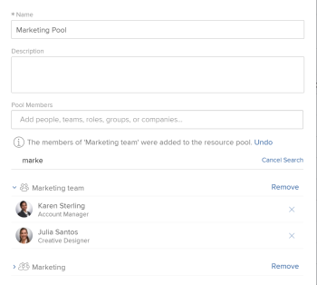

# Supprimer des utilisateurs et des utilisatrices de pools de ressources

{{highlighted-preview}}

Bien qu’il n’existe aucune limite au nombre d’utilisateurs pouvant appartenir à un pool de ressources, la liste des utilisateurs n’affiche que les 2 000 premiers utilisateurs, classés par ordre alphabétique.

Nous vous recommandons de supprimer les utilisateurs qui ont été désactivés ou qui ont déplacé des rôles ou des services, afin de vous assurer que vous disposez toujours d’une liste précise d’utilisateurs dans tous les pools de ressources.

Pour plus d’informations sur les pools de ressources, consultez la [présentation des pools de ressources](../../../resource-mgmt/resource-planning/resource-pools/work-with-resource-pools.md).

## Conditions d’accès

+++ Développez pour afficher les exigences d’accès aux fonctionnalités de cet article.

Vous devez disposer des éléments suivants :

<table style="table-layout:auto"> 
 <col> 
 <col> 
 <tbody> 
  <tr> 
   <td role="rowheader">Forfait Adobe Workfront*</td> 
   <td> 
Pro ou version ultérieure
 </td> 
  </tr> 
  <tr> 
   <td role="rowheader">Licence Adobe Workfront*</td> 
   <td> 
Plan 
 </td> 
  </tr> 
  <tr> 
   <td role="rowheader">Configurations des niveau d’accès*</td> 
   <td> 
Modifier l’accès à la gestion des ressources qui inclut l’accès à Gérer les groupes de ressources
 
Affichage ou accès supérieur aux utilisateurs
 
Remarque : si vous n’avez toujours pas d’accès, demandez à votre équipe d’administration Workfront s’il existe des restrictions supplémentaires à votre niveau d’accès. Pour plus d’informations sur la façon dont un administrateur ou une administratrice de Workfront peut modifier votre niveau d’accès, voir <a href="../../../administration-and-setup/add-users/configure-and-grant-access/create-modify-access-levels.md" class="MCXref xref">Créer ou modifier les niveaux d’accès personnalisés</a>.
 </td> 
  </tr> <!--
   <tr data-mc-conditions="QuicksilverOrClassic.Draft mode"> 
    <td role="rowheader">Object permissions</td> 
    <td> 
(NOTE:&nbsp;I don't think this is needed for removing users from the pool)
 
Manage permissions for the projects, templates, and users you associate the Resource Pools with
 
For information on requesting additional access, see <a href="../../../workfront-basics/grant-and-request-access-to-objects/request-access.md" class="MCXref xref">Request access to objects </a>.
 </td> 
   </tr>
  --> 
 </tbody> 
</table>

&#42;Pour connaître le forfait, le type de licence ou l’accès dont vous disposez, contactez votre administrateur ou administratrice Workfront.

+++

## Suppression d’utilisateurs d’un pool de ressources

Vous pouvez supprimer des utilisateurs d’un pool de ressources lorsque ces utilisateurs ne sont plus nécessaires dans ce pool.

Pour supprimer un utilisateur d’un pool de ressources :

{{step1-to-resourcing}}

1. Cliquez sur **Pools de ressources** dans le panneau de gauche.
1. Sélectionnez un pool de ressources et cliquez sur **Modifier**.
Ou\
   Cliquez sur le nom d’un pool de ressources.

1. Commencez à saisir le nom d’un utilisateur que vous souhaitez supprimer dans le champ **Rechercher dans ce pool de ressources**.\
   Ou\
   Commencez à saisir le nom d’une entreprise, d’un rôle de tâche, d’une équipe ou d’un groupe si vous souhaitez supprimer tous les utilisateurs associés à ces entités.

   Exemple d’image dans l’environnement de prévisualisation :
   

   Exemple d’image dans l’environnement de production :
   

1. Cliquez sur l’icône &quot;x&quot; au niveau de l’utilisateur pour supprimer un utilisateur du pool de ressources. Ils sont supprimés de toutes les listes dans lesquelles ils apparaissent.\
   Ou\
   Pour supprimer tous les utilisateurs associés à un rôle de tâche, un groupe, une équipe ou une entreprise, cliquez sur **Supprimer** au niveau du rôle de tâche, du groupe, de l’équipe ou de la société. Cela supprime tous les utilisateurs associés à ce rôle de tâche, ce groupe, cette équipe ou cette société du pool de ressources.

1. Cliquer sur **Enregistrer**.
