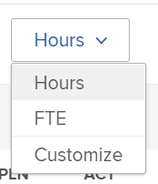

# Partager la vue utilisateur ou utilisatrice du planificateur de ressources à l’aide d’un lien

Adobe Workfront peut générer une URL unique pour la vue Utilisateur ou utilisatrice du planificateur de ressources que vous pouvez incorporer dans un tableau de bord en tant que page externe, ou ouvrir séparément dans un nouvel onglet du navigateur. Cela s’avère utile lors du partage des informations du planificateur de ressources avec les personnes qui ne disposent pas d’un accès direct à la zone Ressources.

## Conditions d’accès

+++ Développez pour afficher les exigences d’accès aux fonctionnalités de cet article.

Vous devez disposer des accès suivants pour effectuer les étapes décrites dans cet article :

<table style="table-layout:auto"> 
 <col> 
 <col> 
 <tbody> 
  <tr> 
   <td role="rowheader">Formule Adobe Workfront</td> 
    <td>
Nouveau : Tous

       
ou

       
Actuel : Pro ou supérieur
 </td> 
  </tr> 
  <tr> 
   <td role="rowheader">Licence Adobe Workfront</td> 
   <td>
Nouveau : Standard

       
ou

       
Actuel : formule
</td> 
  </tr> 
  <tr> 
   <td role="rowheader">Configurations des niveaux d’accès</td> 
   <td> 
Accès Afficher ou supérieur à la gestion des ressources, aux projets et aux personnes
 
Accès Afficher aux données financières pour afficher les informations sur les coûts
</td> 
  </tr> 
  <tr> 
   <td role="rowheader">Autorisations d’objet</td> 
   <td> 
Autorisations d’affichage ou supérieures sur les projets que vous souhaitez afficher dans le planificateur de ressources.
</td> 
  </tr> 
 </tbody> 
</table>

Pour plus de détails sur les informations contenues dans ce tableau, consultez [Conditions d’accès préalables dans la documentation Workfront](/help/quicksilver/administration-and-setup/add-users/access-levels-and-object-permissions/access-level-requirements-in-documentation.md).

+++

Tenez compte de ce qui suit lors de la génération de l’URL unique pour la vue Utilisateur ou utilisatrice du planificateur de ressources :

* Vous pouvez obtenir une URL unique uniquement pour la vue Utilisateur ou utilisatrice. L’option de génération de l’URL n’existe pas dans les vues Projet ou Rôle.
* Vous pouvez partager l’URL avec d’autres personnes, y compris les personnes disposant de licences Travail et Révision.\
  Elles doivent avoir accès à l’affichage d’autres personnes afin d’afficher les informations du planificateur de ressources à partir de l’URL que vous partagez avec elles.
* Les informations suivantes sont enregistrées lorsque vous partagez l’URL avec d’autres personnes :

   * Type de période (semaine, mois, trimestre).
   * Filtres que vous appliquez.
   * Type d’affichage (heures ou équivalent temps complet).

Pour obtenir une URL unique dans la vue Utilisateur ou utilisatrice du planificateur de ressources et la partager avec d’autres personnes, procédez comme suit :

{{step1-to-resourcing}}

1. Sélectionnez **Par utilisateur ou utilisatrice**.
1. (Facultatif) Sélectionnez la période d’affichage des informations dans le planificateur de ressources. Sélectionnez l’une des options suivantes :

   * Semaine
   * Mois
   * Trimestre

1. (Facultatif) Indiquez si vous souhaitez afficher les informations en **équivalent temps complet** ou en **heures**.\
   

1. (Facultatif) Appliquez des filtres au planificateur de ressources.\
   Pour plus d’informations sur l’application de filtres, voir [Filtrer des informations dans le planificateur de ressources](../../resource-mgmt/resource-planning/filter-resource-planner.md).

1. Cliquez sur l’icône **lien hypertexte**.\
   

1. Cliquez sur **Copier l’URL**.\
   Cela copie l’URL unique du planificateur de ressources de la vue Utilisateur ou utilisatrice vers le presse-papiers.

1. (Facultatif) Effectuez l’une des opérations suivantes :

   * Collez l’URL dans une autre application pour l’envoyer à une autre personne.\
     La personne doit être connectée à Workfront pour afficher le planificateur de ressources dans la vue Utilisateur ou utilisatrice.
   * Ouvrez un nouvel onglet ou une nouvelle fenêtre du navigateur et collez le lien que vous avez copié, puis cliquez sur Entrée sur votre clavier pour ouvrir le planificateur de ressources dans un nouvel onglet ou une nouvelle fenêtre.
   * Procédez comme suit :

     <!--   
     <MadCap:conditionalText data-mc-conditions="QuicksilverOrClassic.Draft mode">   
     (NOTE:&nbsp;turn this into a numbered list)   
     </MadCap:conditionalText>   
     -->

      1. Accédez à **Rapports** > **Tableaux de bord** > **Nouveau tableau de bord** > **Ajouter une page externe**.

      1. Collez le lien que vous avez copié dans le presse-papiers dans le champ **URL**.
      1. Cliquez sur **Enregistrer**, puis sur **Enregistrer et fermer**.\
         L’URL est alors incorporée dans le tableau de bord. La vue Utilisateur ou utilisatrice du planificateur de ressources s’affiche dans un tableau de bord distinct.

1. (Facultatif) Si vous avez incorporé l’URL dans un tableau de bord, pensez à l’ajouter à un modèle de mise en page ou à la partager avec d’autres utilisateurs et utilisatrices qui n’ont peut-être pas accès à la zone de gestion des ressources.\
   Pour plus d’informations sur l’ajout de tableaux de bord à un modèle de mise en page, consultez [Créer et gérer des modèles de mise en page](../../administration-and-setup/customize-workfront/use-layout-templates/create-and-manage-layout-templates.md).\
   Pour plus d’informations sur le partage des tableaux de bord, consultez [Partager un tableau de bord](../../reports-and-dashboards/dashboards/creating-and-managing-dashboards/share-dashboard.md).\
   Lors de l’affichage de l’URL partagée, les utilisateurs et utilisatrices peuvent voir les informations avec les paramètres que vous avez initialement appliqués au planificateur de ressources. Ils doivent être connectés à Workfront pour afficher l’URL partagée.\
   
