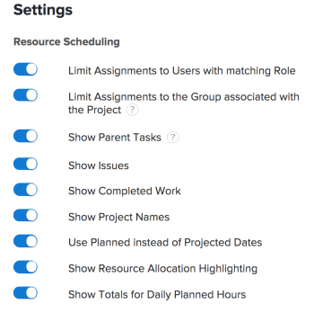
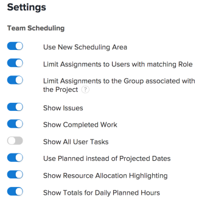

# Configuration des paramètres dans les zones Planification

>[!IMPORTANT]
>  
>La fonctionnalité de planification décrite dans cet article a été abandonnée et supprimée d’Adobe Workfront à compter de la version 23.1 de janvier 2023.   
>  
>  Cet article sera également supprimé peu de temps après la version 23.1, début 2023. Pour l’instant, nous vous recommandons de mettre à jour les signets en conséquence. 
> 
> Vous pouvez désormais utiliser l’équilibreur de charge de travail pour planifier le travail de vos ressources. 
>  
> Pour plus d’informations sur la planification des ressources à l’aide de l’équilibreur de charge de travail, voir la section [L’équilibreur de charge de travail](../../resource-mgmt/workload-balancer/workload-balancer.md). 

<!--  

>[!CAUTION] 
> 
> 
> The information in this article refers to the Adobe Workfront's Scheduling tools. The Scheduling areas have been removed from the Preview environment and will be removed from the Production environment in **January 2023**. 
>  Instead, you can schedule resources in the Workload Balancer.  
> 
>*  For information about scheduling resources using the Workload Balancer, see the section [The Workload Balancer](../../resource-mgmt/workload-balancer/workload-balancer.md). 
> 
>*  For more information about the deprecation and removal of the Scheduling tools, see [Deprecation of Resource Scheduling tools in Adobe Workfront](../../resource-mgmt/resource-mgmt-overview/deprecate-resource-scheduling.md). 
-->

Vous pouvez configurer différents paramètres afin de personnaliser le mode et les informations qui s’affichent dans la chronologie de planification.

## Exigences d’accès

Vous devez disposer des accès suivants pour effectuer les étapes de cet article :

<table style="table-layout:auto"> 
 <col> 
 <col> 
 <tbody> 
  <tr> 
   <td role="rowheader">Formule Adobe Workfront*</td> 
   <td> 
Tous
 </td> 
  </tr> 
  <tr> 
   <td role="rowheader">Licence Adobe Workfront*</td> 
   <td> 
Travail ou plus élevé
 </td> 
  </tr> 
  <tr> 
   <td role="rowheader">Niveau d’accès*</td> 
   <td> 
Afficher l’accès ou une version ultérieure à Projets, tâches et problèmes
 
<b>NOTE</b>

Si vous n’avez toujours pas accès à , demandez à votre administrateur Workfront s’il définit des restrictions supplémentaires à votre niveau d’accès. Pour plus d’informations sur la façon dont un administrateur Workfront peut modifier votre niveau d’accès, voir <a href="../../administration-and-setup/add-users/configure-and-grant-access/create-modify-access-levels.md" class="MCXref xref">Création ou modification de niveaux d’accès personnalisés</a>.
 </td>
</tr> 
  <tr> 
   <td role="rowheader">Autorisations d’objet</td> 
   <td> 
Attribuer des autorisations ou des autorisations supérieures à des projets, tâches et problèmes
 
Pour plus d’informations sur la demande d’accès supplémentaire, voir <a href="../../workfront-basics/grant-and-request-access-to-objects/request-access.md" class="MCXref xref">Demande d’accès aux objets </a>.
 </td> 
  </tr> 
 </tbody> 
</table>

*Pour connaître le plan, le type de licence ou l’accès dont vous disposez, contactez votre administrateur Workfront.

## Configuration des problèmes à afficher dans la chronologie de planification

<!--

(NOTE: ALL THE SECTIONS BELOW ARE LINKED TO PRODUCT. DO NOT CHANGE TITLES) 

-->

Vous pouvez configurer les problèmes à afficher en plus des tâches de la chronologie de planification.\
Lors de la planification des ressources dans la section Planification d’une équipe , les problèmes s’affichent par défaut en plus des tâches. Lors de la planification des ressources pour les projets, seules les tâches sont affichées par défaut.

1. Accédez à la chronologie de planification pour plusieurs projets, pour un projet individuel ou pour une équipe :

   * **Pour plusieurs projets**:  Cliquez sur le bouton **Menu Principal** icon  dans le coin supérieur droit de Workfront, cliquez sur **Ressource > Équilibreur de charge de travail**, puis sélectionnez **Planification** dans le menu déroulant supérieur gauche.
   * **Pour un projet individuel**: Accédez à un projet, cliquez sur le bouton **Équilibreur de charge de travail** dans le panneau de gauche, puis sélectionnez **Planification** dans le menu déroulant supérieur gauche.
   * **Pour une équipe**: Cliquez sur le bouton **Menu Principal** icon  dans le coin supérieur droit de Workfront, puis cliquez sur **Équipes**, sélectionnez une équipe, puis cliquez sur **Équilibreur de charge de travail** dans le panneau de gauche, puis sélectionnez **Planification** dans le menu déroulant supérieur gauche.

1. Cliquez sur le bouton **Paramètres** sur la chronologie de la planification.

1. Dans la boîte de dialogue Paramètres de planification des ressources, activez l’option **Afficher les problèmes** .\
   

1. Cliquez sur **Revenir à la planification**. 

## Configuration des tâches terminées à afficher dans la chronologie de planification

Vous pouvez configurer la chronologie de planification pour afficher le travail déjà marqué comme terminé. Par défaut, les tâches terminées ne s’affichent pas dans la chronologie de la planification. 

1. Accédez à la chronologie de planification pour plusieurs projets, pour un projet individuel ou pour une équipe :

   * **Pour plusieurs projets**:  Cliquez sur le bouton **Menu Principal** icon  dans le coin supérieur droit de Workfront, cliquez sur **Ressource > Équilibreur de charge de travail**, puis sélectionnez **Planification** dans le menu déroulant supérieur gauche.
   * **Pour un projet individuel**: Accédez à un projet, cliquez sur le bouton **Équilibreur de charge de travail** dans le panneau de gauche, puis sélectionnez **Planification** dans le menu déroulant supérieur gauche.
   * **Pour une équipe**: Cliquez sur le bouton **Menu Principal** icon  dans le coin supérieur droit de Workfront, puis cliquez sur **Équipes**, sélectionnez une équipe, puis cliquez sur **Équilibreur de charge de travail** dans le panneau de gauche, puis sélectionnez **Planification** dans le menu déroulant supérieur gauche.

1. Cliquez sur le bouton **Paramètres** sur la chronologie de la planification.

1. Dans la boîte de dialogue Paramètres de planification des ressources, activez l’option **Afficher le travail terminé** .\
   

1. Cliquez sur **Revenir à la planification**.\
   Une coche s’affiche pour les tâches terminées dans le coin supérieur droit de l’élément de travail.

## Configuration des noms de projet à afficher dans la chronologie de planification 

Vous pouvez configurer le nom du projet à afficher pour chaque tâche et chaque problème dans la chronologie de la planification. Cela permet aux utilisateurs qui visualisent la chronologie de la planification de voir rapidement le nom du projet dans lequel réside la tâche ou le problème.

Lorsque vous activez l’affichage des noms de projet, chaque tâche et chaque problème consomme plus d’espace vertical sur la chronologie de planification, ce qui entraîne moins de tâches et de problèmes d’affichage dans une seule vue.

Par défaut, les noms des projets ne s’affichent pas sur les tâches et les problèmes de la chronologie de la planification.

Pour afficher les noms de projet sur les tâches et les problèmes de la chronologie de planification :

1. Accédez à la chronologie de planification pour plusieurs projets ou pour une équipe :

   * **Pour plusieurs projets**:  Cliquez sur le bouton **Menu Principal** icon  dans le coin supérieur droit de Workfront, cliquez sur **Ressource > Équilibreur de charge de travail**, puis sélectionnez **Planification** dans le menu déroulant supérieur gauche.
   * **Pour une équipe**: Cliquez sur le bouton **Menu Principal** icon  dans le coin supérieur droit de Workfront, puis cliquez sur **Équipes**, sélectionnez une équipe, puis cliquez sur **Équilibreur de charge de travail** dans le panneau de gauche, puis sélectionnez **Planification** dans le menu déroulant supérieur gauche.

1. Cliquez sur le bouton **Paramètres** sur la chronologie de la planification.

1. Dans la boîte de dialogue Paramètres de planification des ressources, activez l’option , **Afficher les noms de projet**.\
   

1. Cliquez sur **Revenir à la planification**.\
   Chaque tâche et problème de la frise chronologique de la planification affiche le nom du projet dans lequel réside la tâche ou le problème.\
   

## Configuration des dates prévues à afficher dans la chronologie de planification

Par défaut, les dates planifiées sont utilisées dans la chronologie de planification. Vous pouvez également configurer la chronologie de planification afin d’utiliser les dates prévues.

Tenez compte des informations suivantes sur les dates prévues et prévues :

* Les dates planifiées des tâches peuvent être définies manuellement ou automatiquement, selon la contrainte de tâche et le type de durée. Pour plus d’informations, voir les articles [Présentation de la contrainte de tâche](../../manage-work/tasks/task-constraints/task-constraint-overview.md) et  [Présentation de la durée et du type de durée de la tâche](../../manage-work/tasks/taskdurtn/task-duration-and-duration-type.md) .

   Les dates prévues pour les problèmes sont définies manuellement par les utilisateurs sur les problèmes. Cependant, l’administrateur système peut empêcher les utilisateurs d’ajuster les dates planifiées en cas de problème.

* Les dates prévues pour les tâches et les problèmes sont automatiquement définies. Pour plus d’informations sur les dates prévues, consultez les articles [Présentation de la date d’achèvement prévue pour les projets, tâches et problèmes](../../manage-work/projects/planning-a-project/project-projected-completion-date.md).

>[!NOTE]
>
>Lors de l’utilisation de dates de projection dans la chronologie de planification, les informations d’affectation des utilisateurs ne peuvent pas s’afficher. Pour plus d’informations sur les affectations d’utilisateurs, voir l’article [Affectez manuellement des tâches et des problèmes non attribués dans les zones Planification .](../../resource-mgmt/resource-scheduling/manually-assign-items-scheduling-areas.md).

Pour configurer la chronologie de planification afin d’afficher les tâches et les problèmes en fonction des dates prévues : 

1. Accédez à la chronologie de planification pour plusieurs projets, pour un projet individuel ou pour une équipe :

   * **Pour plusieurs projets**:  Cliquez sur le bouton **Menu Principal** icon  dans le coin supérieur droit de Workfront, cliquez sur **Ressource > Équilibreur de charge de travail**, puis sélectionnez **Planification** dans le menu déroulant supérieur gauche.
   * **Pour un projet individuel**: Accédez à un projet, cliquez sur le bouton **Équilibreur de charge de travail** dans le panneau de gauche, puis sélectionnez **Planification** dans le menu déroulant supérieur gauche.
   * **Pour une équipe**: Cliquez sur le bouton **Menu Principal** icon  dans le coin supérieur droit de Workfront, puis cliquez sur **Équipes**, sélectionnez une équipe, puis cliquez sur **Équilibreur de charge de travail** dans le panneau de gauche, puis sélectionnez **Planification** dans le menu déroulant supérieur gauche.

1. Cliquez sur le bouton **Paramètres** sur la chronologie de la planification.

1. Dans la boîte de dialogue Paramètres de planification des ressources, désactivez la variable **Utiliser les dates prévues au lieu des dates prévues** .
1. Cliquez sur **Revenir à la planification**.

## Configuration de l’affichage des utilisateurs dans la chronologie de planification

>[!NOTE]
>
>Cette section s’applique uniquement lors de la planification des ressources pour les équipes (dans la section Planification d’une équipe ). Lors de la planification de ressources pour plusieurs projets (depuis l’onglet Planification ) ou pour un seul projet (depuis l’onglet Personnel ), les utilisateurs ne peuvent pas s’afficher par ordre alphabétique ; ils sont toujours organisés par rôle.

Lors de la planification des ressources d’une équipe, vous pouvez configurer les utilisateurs pour qu’ils s’affichent dans la chronologie de planification par ordre alphabétique ou par rôle. Par défaut, les utilisateurs sont affichés par ordre alphabétique (les rôles ne sont pas affichés).

1. Cliquez sur le bouton **Menu Principal** icon  dans le coin supérieur droit de Workfront, puis cliquez sur Équipes. Une équipe est sélectionnée par défaut.

1. Cliquez sur le bouton **Paramètres** sur la chronologie de la planification.

1. Dans la boîte de dialogue Paramètres, indiquez si l’option **Groupe par rôle** .\
   Lorsque cette option est désactivée, les utilisateurs s’affichent par ordre alphabétique, et les rôles ne s’affichent pas dans la chronologie de la planification.\
   Lorsque cette option est activée, les rôles s’affichent dans la chronologie de planification et les utilisateurs sont regroupés dans leur rôle respectif. Si un utilisateur donné dispose de plusieurs rôles définis dans le système, il apparaît plusieurs fois dans la chronologie de planification, sous chaque rôle approprié.\
   

1. Cliquez sur **Revenir à la planification**.

## Configurer l’affichage des tâches parentes dans la chronologie de planification

<!--

(NOTE: This section is linked to the UI in a tooltip inside the Settings of the scheduler. do not rename/ remove/ edit the tag!! - Resource Scheduling (People> Scheduling>Settings>Show Parent Tasks tooltip)

-->

Les tâches parentes s’affichent différemment selon la chronologie de planification à laquelle vous accédez. 

* [Affichage des tâches parentes pour plusieurs projets](#display-parent-tasks-for-multiple-projects)
* [Afficher les tâches parentes d’un projet ou d’une équipe](#display-parent-tasks-for-a-project-or-a-team)

### Affichage des tâches parentes pour plusieurs projets {#display-parent-tasks-for-multiple-projects}

Lors de la planification de ressources pour plusieurs projets dans la section Planification , l’affichage ou non des tâches parentes dépend des paramètres suivants :

* Mode d’exécution du projet.
* Mode d’achèvement du résumé du projet.
* Le paramètre Afficher les tâches parentes de l’onglet Planification .

Le tableau suivant indique quand les tâches parentes s’affichent dans l’onglet Planification et quand seules les sous-tâches s’affichent. 

| **Afficher le paramètre des tâches parentes** | **Mode d’exécution du projet** | **Mode d’achèvement du résumé du projet** | **Type des tâches affichées dans la chronologie de planification** |
|---|---|---|---|
| Désactivé | Manuel | Automatique | Sous-tâches uniquement |
| Désactivé | Manuel | Manuel | Sous-tâches uniquement |
| Désactivé | Automatique | Automatique | Sous-tâches uniquement |
| Désactivé | Automatique | Manuel | Sous-tâches uniquement |
| Activé | Automatique | Manuel | Tâches secondaires et tâches parentes |
| Activé | Automatique | Automatique | Sous-tâches uniquement |
| Activé | Manuel | Manuel | Tâches secondaires et tâches parentes |
| Activé | Manuel | Automatique | Sous-tâches uniquement |

Pour plus d’informations sur la configuration de la variable **Mode d’achèvement** et le **Mode d’achèvement du résumé** pour chaque projet, voir la section &quot;Paramètres&quot; de l’article [Modification de projets](../../manage-work/projects/manage-projects/edit-projects.md).

Vous pouvez configurer manuellement le paramètre Afficher les tâches parentes dans la section Planification de plusieurs projets. 

Pour configurer le paramètre Afficher les tâches parentes : 

1. Cliquez sur le bouton **Menu Principal** icon  dans le coin supérieur droit de Workfront, cliquez sur **Ressource > Équilibreur de charge de travail**, puis sélectionnez **Planification** dans le menu déroulant supérieur gauche.
1. Cliquez sur le bouton **Paramètres** sur la chronologie de la planification.

1. Dans la boîte de dialogue Paramètres de planification des ressources, choisissez d’activer ou non l’option, **Afficher les tâches parentes.**
Lorsque cette option est activée, les tâches parentes de tous les projets sont affichées en fonction des paramètres Mode d’achèvement du résumé et Mode d’achèvement des projets, comme indiqué dans le tableau ci-dessus. Cette option est activée par défaut.
\
   

1. Cliquez sur **Revenir à la planification** dans le coin inférieur gauche.

### Afficher les tâches parentes d’un projet ou d’une équipe {#display-parent-tasks-for-a-project-or-a-team}

Lors de la planification de ressources dans la section Personnel d’un projet ou dans la section Planning , l’affichage ou non des tâches parentes dépend des paramètres suivants :

* Mode d’exécution du projet.
* Mode d’achèvement du résumé du projet.

Pour plus d’informations sur la configuration de la variable **Mode d’achèvement** et le **Mode d’achèvement du résumé** pour chaque projet, voir la section &quot;Paramètres&quot; de l’article [Modification de projets](../../manage-work/projects/manage-projects/edit-projects.md).

Le tableau suivant indique quand les tâches parents s’affichent dans la section Personnel d’un projet ou dans la section Planning , et quand seules les sous-tâches s’affichent. 

| Mode d’exécution du projet | Mode d’achèvement du résumé du projet | Type des tâches affichées dans la section Planification | Type des tâches affichées dans la section Planification des équipes |
|---|---|---|---|
| Manuel | Automatique | Sous-tâches uniquement | Sous-tâches uniquement |
| Manuel | Manuel | Tâches secondaires et tâches parentes | Sous-tâches uniquement |
| Automatique | Automatique | Sous-tâches uniquement | Sous-tâches uniquement |
| Automatique | Manuel | Tâches secondaires et tâches parentes | Sous-tâches uniquement |
| Automatique | Manuel | Tâches secondaires et tâches parentes | Sous-tâches uniquement |
| Automatique | Automatique | Sous-tâches uniquement | Sous-tâches uniquement |
| Manuel | Manuel | Tâches secondaires et tâches parentes | Sous-tâches uniquement |
| Manuel | Automatique | Sous-tâches uniquement | Sous-tâches uniquement |

## Permet de configurer l’affichage des heures planifiées quotidiennes dans la chronologie de planification.

Pour configurer la chronologie de la planification afin d’afficher les totaux quotidiens des Heures planifiées pour chaque utilisateur : 

1. Accédez à la chronologie de planification pour plusieurs projets, pour un projet individuel ou pour une équipe :

   * **Pour plusieurs projets**:  Cliquez sur le bouton **Menu Principal** icon  dans le coin supérieur droit de Workfront, cliquez sur **Ressource > Équilibreur de charge de travail**, puis sélectionnez **Planification** dans le menu déroulant supérieur gauche.
   * **Pour un projet individuel**: Accédez à un projet, cliquez sur le bouton **Équilibreur de charge de travail** dans le panneau de gauche, puis sélectionnez **Planification** dans le menu déroulant supérieur gauche.
   * **Pour une équipe**: Cliquez sur le bouton **Menu Principal** icon  dans le coin supérieur droit de Workfront, puis cliquez sur **Équipes**, sélectionnez une équipe, puis cliquez sur **Équilibreur de charge de travail** dans le panneau de gauche, puis sélectionnez **Planification** dans le menu déroulant supérieur gauche.

1. Cliquez sur le bouton **Paramètres** sur la chronologie de la planification.

1. Dans la boîte de dialogue Paramètres , activez les options suivantes :

   *  **Afficher les totaux pour les heures planifiées quotidiennes**: Affiche le total des heures planifiées quotidiennes pour chaque utilisateur.
   * **Afficher la mise en surbrillance de l’affectation des ressources**: Met en évidence l’affectation de l’utilisateur pour les tâches et les problèmes, ainsi que les jours où les utilisateurs sont surchargés.\
      Ces options sont désactivées par défaut.\
      

1. Cliquez sur **Revenir à la planification**.\
   Le total des heures planifiées allouées à l’utilisateur s’affiche pour chaque jour.\
   Les heures planifiées des jours où l’utilisateur est surchargé sont surlignées en rouge.\
   Pour plus d’informations sur les affectations d’utilisateurs, voir l’article [Affectez manuellement des tâches et des problèmes non attribués dans les zones Planification .](../../resource-mgmt/resource-scheduling/manually-assign-items-scheduling-areas.md).

## Configurer l’affichage de toutes les tâches utilisateur dans la chronologie de planification

>[!NOTE]
>
>Cette option s’applique uniquement lors de la planification des ressources pour des projets individuels (dans la section Planification du projet ). Cette option n’est pas disponible lors de la planification de ressources pour plusieurs projets (dans la section Planification ) ou pour des équipes (dans la section Planification d’une équipe ).

Pour configurer l’affichage de toutes les tâches affectées à chaque utilisateur (et pas seulement des tâches associées au projet que vous affichez) dans la chronologie de planification :

1. Accédez au projet dans lequel vous souhaitez configurer la chronologie de planification afin d’afficher toutes les tâches affectées à chaque utilisateur.
1. Cliquez sur le bouton **Équilibreur de charge de travail** dans le panneau de gauche (elle peut se trouver sous **Afficher plus**), puis sélectionnez **Planification** dans le menu déroulant supérieur gauche.
1. Cliquez sur le bouton **Paramètres** sur la chronologie de la planification.

1. Dans la zone Paramètres , choisissez d’activer ou non l’option, **Afficher toutes les tâches de l’utilisateur**.\
   Lorsque cette option est activée, toutes les tâches affectées à chaque utilisateur sont affichées dans la chronologie de planification, quel que soit le projet où se trouvent les tâches.\
   Cette option est désactivée par défaut.\
   

1. Cliquez sur **Revenir à la planification**.
