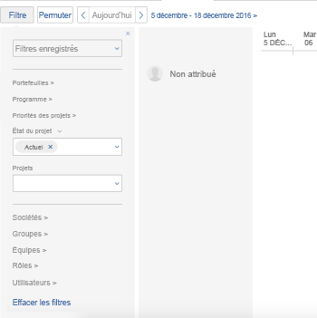

# Filtrage des informations dans la zone Planification

>[!IMPORTANT]
>  
>La fonctionnalité de planification décrite dans cet article a été abandonnée et supprimée d’Adobe Workfront à compter de la version 23.1 de janvier 2023.   
>  
>  Cet article sera également supprimé peu de temps après la version 23.1, début 2023. Pour l’instant, nous vous recommandons de mettre à jour les signets en conséquence. 
> 
> Vous pouvez désormais utiliser l’équilibreur de charge de travail pour planifier le travail de vos ressources. 
>  
> Pour plus d’informations sur la planification des ressources à l’aide de l’équilibreur de charge de travail, voir la section [L’équilibreur de charge de travail](../../resource-mgmt/workload-balancer/workload-balancer.md). 

<!-- 

>[!CAUTION] 
> 
> 
> The information in this article refers to the Adobe Workfront's Scheduling tools. The Scheduling areas have been removed from the Preview environment and will be removed from the Production environment in **January 2023**.   
>  Instead, you can schedule resources in the Workload Balancer.  
> 
>*  For information about scheduling resources using the Workload Balancer, see the section [The Workload Balancer](../../resource-mgmt/workload-balancer/workload-balancer.md). 
> 
>*  For more information about the deprecation and removal of the Scheduling tools, see [Deprecation of Resource Scheduling tools in Adobe Workfront](../../resource-mgmt/resource-mgmt-overview/deprecate-resource-scheduling.md). 
-->

<!--

(SEVERAL SECTIONS BELOW LINKED TO THE PRODUCT. SEE NOTES

-->

L’utilisation d’un filtre dans la zone Planification des ressources vous permet de déterminer les tâches qui s’affichent dans la chronologie de la planification. Cela inclut les tâches et problèmes affichés dans la zone Non affecté, ainsi que les utilisateurs affichés.

Avant de commencer à filtrer le contenu comme décrit dans cette section, familiarisez-vous avec le fonctionnement de la planification des ressources dans Adobe Workfront.\
Pour plus d’informations sur la planification des ressources dans Workfront, reportez-vous à l’article . [Prise en main de la planification des ressources](../../resource-mgmt/resource-scheduling/get-started-resource-scheduling.md).\
Pour plus d’informations sur la planification de la chronologie, consultez l’article [Prise en main de la planification des ressources](../../resource-mgmt/resource-scheduling/get-started-resource-scheduling.md).

Vous pouvez planifier des ressources ou une équipe individuelle dont vous êtes membre ou pour tout projet pour lequel vous êtes le gestionnaire de ressources.

## Exigences d’accès

Vous devez disposer des éléments suivants :

<table style="table-layout:auto"> 
 <col> 
 <col> 
 <tbody> 
  <tr> 
   <td role="rowheader">Formule Adobe Workfront*</td> 
   <td> 
Tous
 </td> 
  </tr> 
  <tr> 
   <td role="rowheader">Licence Adobe Workfront*</td> 
   <td> 
Travail ou plus élevé
 </td> 
  </tr> 
  <tr> 
   <td role="rowheader">Niveau d’accès*</td> 
   <td> 
Afficher l’accès ou une version ultérieure à Projets, tâches et problèmes
 
<b>NOTE</b>

Si vous n’avez toujours pas accès à , demandez à votre administrateur Workfront s’il définit des restrictions supplémentaires à votre niveau d’accès. Pour plus d’informations sur la façon dont un administrateur Workfront peut modifier votre niveau d’accès, voir <a href="../../administration-and-setup/add-users/configure-and-grant-access/create-modify-access-levels.md" class="MCXref xref">Création ou modification de niveaux d’accès personnalisés</a>.
 </td>
</tr> 
  <tr> 
   <td role="rowheader">Autorisations d’objet</td> 
   <td> 
Affichage des autorisations ou des autorisations supérieures pour les projets, les tâches et les problèmes
 
Pour plus d’informations sur la demande d’accès supplémentaire, voir <a href="../../workfront-basics/grant-and-request-access-to-objects/request-access.md" class="MCXref xref">Demande d’accès aux objets </a>.
 </td> 
  </tr> 
 </tbody> 
</table>

*Pour connaître le plan, le type de licence ou l’accès dont vous disposez, contactez votre administrateur Workfront.

<!--

(NOTE: sections below - LINKED TO THE ui. DO NOT RENAME/ DELETE)

-->

## Créez un filtre dans la section Planification (pour les équipes).

Les tâches et les problèmes provenant des projets, des utilisateurs et des rôles que vous définissez dans le filtre s’affichent dans la chronologie de la planification sur l’onglet Travail . Utilisez les options du filtre pour déterminer les projets, les utilisateurs et les rôles représentés dans la chronologie de la planification.

>[!NOTE]
>
>Vous ne pouvez pas enregistrer de filtre dans l’onglet Travail sur (pour une équipe). Lorsque vous actualisez la page ou que vous la quittez, le filtre revient aux paramètres par défaut.

Pour créer un filtre pour la chronologie de la planification sur l’onglet Travail sur pour les équipes :

1. Cliquez sur le bouton **Menu Principal** icon  dans le coin supérieur droit de Workfront, puis cliquez sur **Équipes**, sélectionnez une équipe, puis cliquez sur **Équilibreur de charge de travail** dans le panneau de gauche, puis sélectionnez **Planification** dans le menu déroulant supérieur gauche.
1. Cliquez sur **Filtrer**.
1. Déterminez les projets qui sont représentés dans la zone Non affecté en spécifiant les informations suivantes :

   <!--
   
(NOTE: Alina: there was a note that [This step is linked to from the context-sensitive help] but I could not find from where in the UI it is linked.)&nbsp;

   -->

   * **Priorités du projet :** Sélectionnez la priorité des projets que vous souhaitez représenter dans la chronologie de la planification. Les tâches et les problèmes des projets dont les priorités sont sélectionnées s’affichent dans la chronologie de la planification.\
      Seules les priorités des projets qui incluent des tâches ou des problèmes affectés à l’équipe peuvent être sélectionnées dans ce menu.
   * **Statuts du projet :** Sélectionnez l’état des projets que vous souhaitez représenter dans la chronologie de la planification. Les tâches et les problèmes des projets dont vous sélectionnez l’état s’affichent dans la chronologie de la planification.\
      Seuls les états des projets qui incluent des tâches ou des problèmes affectés à l’équipe peuvent être sélectionnés dans ce menu.
   * **Projets :** Sélectionnez les projets que vous souhaitez représenter dans la chronologie de planification. Les tâches et les problèmes des projets que vous sélectionnez s’affichent dans la chronologie de la planification.\
      Vos sélections dans les champs précédents déterminent les projets qui peuvent être sélectionnés.\
      Seuls les projets qui incluent des tâches ou des problèmes affectés à l’équipe peuvent être sélectionnés dans ce menu.

1. Déterminez les utilisateurs qui s’affichent dans la chronologie de planification en spécifiant les informations suivantes. Par défaut, tous les membres de l’équipe s’affichent.

   <!--
   
(NOTE: this step is linked in the UI.)

   -->

   * **Rôles :** Sélectionnez les rôles que vous souhaitez représenter dans la chronologie de la planification.\
      Seules les tâches affectées à ce rôle s’affichent dans la zone Non affecté . Seuls les utilisateurs disposant des rôles que vous sélectionnez et pouvant être affectés à ces tâches s’affichent.\
      Les utilisateurs sont affichés dans la chronologie de la planification, organisés par rôle de tâche.
   * **Utilisateurs :** Sélectionnez les utilisateurs individuels que vous souhaitez représenter dans la chronologie de planification.\
      Seuls les utilisateurs que vous sélectionnez s’affichent, qu’ils aient ou non une affectation de rôle correspondant à l’affectation de rôles des tâches dans la zone Non affecté .\
      Cette option n’a aucune incidence sur les tâches et les problèmes affichés dans la zone Non affecté .

      <!--   
     
(NOTE: Alina: [! Users with Plan, Work, or Review licenses are available. Users with Request licenses are not available. - This is what it used to say. I think now instead you select specific users, not license types.])
   
     -->

1. (Facultatif) Pour apporter d’autres modifications à la chronologie de la planification (comme modifier la période) et pour apporter des modifications aux affectations d’utilisateurs, reportez-vous à l’article . [Affectez manuellement des tâches et des problèmes non attribués dans les zones Planification .](../../resource-mgmt/resource-scheduling/manually-assign-items-scheduling-areas.md).

<!--

(NOTE: below - LINKED TO THE UI, DO NOT RENAME/ DELETE/ CHANGE)

-->

## Création et modification de filtres dans la section Planification (pour plusieurs projets)

Vous pouvez créer un nouveau filtre, appliquer un filtre précédemment créé, modifier un filtre précédemment créé ou supprimer un filtre. Vous ne pouvez pas partager les filtres que vous créez avec d’autres utilisateurs.

* [Création d’un filtre dans la section Planification (pour les projets)](#create-a-filter-in-the-scheduling-section-for-projects)
* [Appliquer un filtre enregistré](#apply-a-saved-filter)
* [Modification d’un filtre enregistré](#modify-a-saved-filter)
* [Supprimer un filtre enregistré](#delete-a-saved-filter)

### Création d’un filtre dans la section Planification (pour les projets) {#create-a-filter-in-the-scheduling-section-for-projects}

<!--

(NOTE: *****LINKED TO THE PRODUCT FROM THE GLOBAL SCHEDULER >> BOTH THE FIRST AND THE SECOND AREAS) 

-->

Les tâches et les problèmes provenant des projets, utilisateurs et rôles que vous définissez dans le filtre s’affichent dans la chronologie de la planification, dans l’onglet Planification . Utilisez les options du filtre pour déterminer les projets, les utilisateurs et les rôles représentés dans la chronologie de la planification.

Pour créer un filtre pour la chronologie de la planification dans l’onglet Planification de plusieurs projets :

1. Cliquez sur le bouton **Menu Principal** icon  dans le coin supérieur droit de Workfront, cliquez sur **Ressource > Équilibreur de charge de travail**, puis sélectionnez **Planification** dans le menu déroulant supérieur gauche.
1. Cliquez sur **Filtrer**.\
   

1. Laissez le champ **Filtres enregistrés** champ vide.
1. Déterminez les projets qui sont représentés dans la zone Non affecté en spécifiant les informations suivantes :

   <!--
   
(NOTE: Alina: this step is linked in the UI.) 

   -->

   * **Portfolios :** Sélectionnez les portfolios qui incluent les programmes et les projets que vous souhaitez représenter dans la chronologie de la planification.

      Seuls les programmes des portefeuilles que vous sélectionnez peuvent être sélectionnés dans la **Programme** champ .

   * **Programmes :** Sélectionnez les programmes qui incluent des projets que vous souhaitez représenter dans la chronologie de la planification.\
      Vos sélections dans le **Portfolio** détermine les programmes qui peuvent être sélectionnés.\
      Seuls les projets des programmes que vous sélectionnez peuvent être sélectionnés dans la **Projets** champ .

   * **Priorités du projet :** Sélectionnez la priorité des projets que vous souhaitez représenter dans la chronologie de la planification.\
      Seuls les projets avec les priorités que vous sélectionnez sont représentés.

   * **Statuts du projet :** Sélectionnez l’état des projets que vous souhaitez représenter dans la chronologie de la planification.\
      Seuls les projets dont les états sont sélectionnés sont représentés.

   * **Entreprises de projet :** Les tâches et les problèmes ne s’affichent sur la chronologie de la planification que lorsqu’ils appartiennent à un projet correspondant à une société que vous avez sélectionnée.

   * **Groupes de projets :** Les tâches et les problèmes ne s’affichent sur la chronologie de la planification que lorsqu’ils appartiennent à un projet qui correspond à un groupe que vous avez sélectionné.

   * **Projets :** Sélectionnez les projets que vous souhaitez représenter dans la chronologie de planification. Les tâches et les problèmes des projets que vous sélectionnez s’affichent dans la chronologie de la planification.\
      Vos sélections dans les champs précédents déterminent les projets qui peuvent être sélectionnés.\
      Les tâches et les problèmes des projets que vous sélectionnez s’affichent dans la chronologie de la planification. Seuls les projets qui incluent des tâches ou des problèmes affectés à l’équipe peuvent être sélectionnés dans ce menu.

1. Déterminez les utilisateurs qui s’affichent dans la chronologie de planification en spécifiant les informations suivantes : (Par défaut, seuls les utilisateurs qui peuvent se voir attribuer une tâche ou un problème dans la zone Non affecté s’affichent. Lorsque vous sélectionnez des utilisateurs individuels, les utilisateurs s’affichent dans la chronologie de la planification, qu’ils aient ou non le droit d’être affectés à une tâche ou à un problème dans la zone Non affecté.) 

   <!--
   
(NOTE: Alina: this step had a note that it is linked in the UI but I could not find from where.) 

   -->

   * **Sociétés d’utilisateurs :** Ce champ permet de restreindre l&#39;affichage des utilisateurs d&#39;autres sociétés dans la chronologie de la planification.\
      Laissez ce champ vide si vous souhaitez que des utilisateurs de n’importe quelle société soient ajoutés. Si vous spécifiez des sociétés individuelles, seuls les utilisateurs de ces sociétés peuvent être ajoutés au planning de planification. La spécification d’une société n’ajoute pas automatiquement les utilisateurs de cette société au planning de planification. Utilisez plutôt les champs ci-dessous pour ajouter des utilisateurs spécifiques.\
      Cette option n’a aucune incidence sur les tâches et les problèmes affichés dans la zone Non affecté .****

   * **Groupes d’utilisateurs :** Tous les utilisateurs de n’importe quel groupe d’utilisateurs spécifié s’affichent dans la chronologie de la planification.

   * **Équipes :** Tous les utilisateurs de n’importe quelle équipe spécifiée s’affichent dans la chronologie de planification.\
      Cette option n’a aucune incidence sur les tâches et les problèmes affichés dans la zone Non affecté .

   * **Rôles :** Sélectionnez les rôles que vous souhaitez représenter dans la chronologie de la planification.\
      Seules les tâches affectées à ce rôle s’affichent dans la zone Non affecté . Seuls les utilisateurs disposant des rôles que vous sélectionnez et pouvant être affectés à ces tâches s’affichent.\
      Les utilisateurs sont affichés dans la chronologie de la planification, organisés par rôle de tâche.

   * **Utilisateurs :** Sélectionnez les utilisateurs individuels que vous souhaitez représenter dans la chronologie de planification.\
      Seuls les utilisateurs que vous sélectionnez s’affichent, qu’ils aient ou non une affectation de rôle correspondant à l’affectation de rôles des tâches dans la zone Non affecté .\
      Cette option n’a aucune incidence sur les tâches et les problèmes affichés dans la zone Non affecté .
   <!--
   
NOTE: [! Users with Plan, Work, or Review licenses are available. Users with Request licenses are not available. - This is what it used to say. I think now instead you select specific users, not license types.]) 

   -->

1. Cliquez sur **Enregistrer un nouveau filtre**.\
   Vos données s’affichent dans la chronologie de la planification.

1. (Facultatif) Pour apporter d’autres modifications à la chronologie de la planification (comme modifier la période) et pour apporter des modifications aux affectations d’utilisateurs, reportez-vous à l’article . [Affectez manuellement des tâches et des problèmes non attribués dans les zones Planification .](../../resource-mgmt/resource-scheduling/manually-assign-items-scheduling-areas.md).

### Appliquer un filtre enregistré {#apply-a-saved-filter}

>[!NOTE]
>
>Cette option s’applique uniquement lors de la planification de ressources pour plusieurs projets (depuis l’onglet Planification ). vous ne pouvez pas appliquer un filtre enregistré lors de la planification de ressources pour une équipe (à partir de l’onglet Travail sur ) ou lors de la planification de ressources pour un seul projet (à partir de l’onglet Personnel ).

Vous pouvez appliquer un filtre que vous avez précédemment créé.

Pour appliquer un filtre enregistré pour plusieurs projets :

1. Cliquez sur le bouton **Menu Principal** icon  dans le coin supérieur droit de Workfront, cliquez sur **Ressource > Équilibreur de charge de travail**, puis sélectionnez **Planification** dans le menu déroulant supérieur gauche.
1. Cliquez sur **Filtrer**.
1. Dans le **Filtres enregistrés** , sélectionnez le filtre à appliquer.\
   Vos données s’affichent dans la chronologie de la planification.

1. (Facultatif) Pour apporter d’autres modifications à la chronologie de la planification (comme modifier la période) et pour apporter des modifications aux affectations d’utilisateurs, reportez-vous à l’article . [Affectez manuellement des tâches et des problèmes non attribués dans les zones Planification .](../../resource-mgmt/resource-scheduling/manually-assign-items-scheduling-areas.md).

### Modification d’un filtre enregistré {#modify-a-saved-filter}

>[!NOTE]
>
>Cette option s’applique uniquement lors de la planification de ressources pour plusieurs projets (depuis l’onglet Planification ). vous ne pouvez pas modifier un filtre enregistré lors de la planification des ressources pour une équipe (à partir de l’onglet Travail ) ou lors de la planification des ressources pour un seul projet (à partir de l’onglet Personnel ).

Vous pouvez modifier un filtre que vous avez précédemment créé.

Pour modifier un filtre enregistré pour plusieurs projets :

1. Cliquez sur le bouton **Menu Principal** icon  dans le coin supérieur droit de Workfront, cliquez sur **Ressource > Équilibreur de charge de travail**, puis sélectionnez **Planification** dans le menu déroulant supérieur gauche.
1. Cliquez sur **Filtrer**.
1. Dans le **Filtres enregistrés** , sélectionnez le filtre à modifier dans la liste déroulante.
1. Spécifiez les données à afficher dans la chronologie de planification.
1. Cliquer sur **Enregistrer**.\
   Vos données s’affichent dans la chronologie de la planification.

1. (Facultatif) Pour apporter d’autres modifications à la chronologie de la planification (comme modifier la période) et pour apporter des modifications aux affectations d’utilisateurs, reportez-vous à l’article . [Affectez manuellement des tâches et des problèmes non attribués dans les zones Planification .](../../resource-mgmt/resource-scheduling/manually-assign-items-scheduling-areas.md).

### Supprimer un filtre enregistré {#delete-a-saved-filter}

>[!NOTE]
Cette option s’applique uniquement lors de la planification de ressources pour plusieurs projets (depuis l’onglet Planification ). vous ne pouvez pas supprimer un filtre enregistré lors de la planification de ressources pour une équipe (dans l’onglet Travail sur ) ou lors de la planification de ressources pour un seul projet (dans l’onglet Personnel ).

Vous pouvez supprimer un filtre que vous avez précédemment créé.

1. Cliquez sur le bouton **Menu Principal** icon  dans le coin supérieur droit de Workfront, cliquez sur **Ressource > Équilibreur de charge de travail**, puis sélectionnez **Planification** dans le menu déroulant supérieur gauche.
1. Cliquez sur **Filtrer**.
1. Dans le **Filtres enregistrés** , dans la liste déroulante, cliquez sur (x) en regard du filtre à supprimer. 

## Création et modification de filtres dans la section Planification (pour un seul projet)

<!--

(NOTE: **** LINKED FROM THE PRODUCT FROM THE PROJECT> STAFFING> SCHEDULING AREA) 

-->

Les tâches et les problèmes des utilisateurs, des équipes et des rôles que vous définissez dans le filtre s’affichent dans la chronologie de la planification sur l’onglet Personnel . Utilisez les options du filtre pour déterminer les utilisateurs, les équipes et les rôles représentés sur la chronologie de la planification.

>[!NOTE]
Vous ne pouvez pas enregistrer de filtre dans l’onglet Personnel (pour un seul projet). Lorsque vous actualisez la page ou que vous la quittez, le filtre revient aux paramètres par défaut.

Pour créer un filtre pour la chronologie de la planification dans l’onglet Personnel pour un projet unique :

1. Accédez à un projet, cliquez sur le bouton **Équilibreur de charge de travail** dans le panneau de gauche, puis sélectionnez **Planification** dans le menu déroulant supérieur gauche.
1. Déterminez les utilisateurs qui s’affichent dans la chronologie de planification en spécifiant les informations suivantes : (Par défaut, seuls les utilisateurs qui peuvent se voir attribuer une tâche ou un problème dans la zone Non affecté s’affichent. Lorsque vous sélectionnez des utilisateurs individuels, les utilisateurs s’affichent dans la chronologie de la planification, qu’ils aient ou non le droit d’être affectés à une tâche ou à un problème dans la zone Non affecté.) 

   <!--
   
(NOTE: Alina: [This step is linked to from the context-sensitive help])  

   -->

   * **Sociétés d’utilisateurs :** Ce champ permet de restreindre l&#39;affichage des utilisateurs d&#39;autres sociétés dans la chronologie de la planification.\
      Laissez ce champ vide si vous souhaitez que des utilisateurs de n’importe quelle société soient ajoutés. Si vous spécifiez des sociétés individuelles, seuls les utilisateurs de ces sociétés peuvent être ajoutés au planning de planification. La spécification d’une société n’ajoute pas automatiquement les utilisateurs de cette société au planning de planification. Utilisez plutôt les champs ci-dessous pour ajouter des utilisateurs spécifiques.\
      Cette option n’a aucune incidence sur les tâches et les problèmes affichés dans la zone Non affecté .

   * **Groupes d’utilisateurs :** Tous les utilisateurs de n’importe quel groupe d’utilisateurs spécifié s’affichent dans la chronologie de la planification.

   * **Équipes :** Tous les utilisateurs de n’importe quelle équipe spécifiée s’affichent dans la chronologie de planification.\
      Cette option n’a aucune incidence sur les tâches et les problèmes affichés dans la zone Non affecté .

   * **Rôles :** Sélectionnez les rôles que vous souhaitez représenter dans la chronologie de la planification.\
      Seules les tâches affectées à ce rôle s’affichent dans la zone Non affecté . Seuls les utilisateurs disposant des rôles que vous sélectionnez et pouvant être affectés à ces tâches s’affichent.\
      Les utilisateurs sont affichés dans la chronologie de la planification, organisés par rôle de tâche.

   * **Utilisateurs :** Sélectionnez les utilisateurs individuels que vous souhaitez représenter dans la chronologie de planification.\
      Seuls les utilisateurs que vous sélectionnez s’affichent, qu’ils aient ou non une affectation de rôle correspondant à l’affectation de rôles des tâches dans la zone Non affecté .\
      Cette option n’a aucune incidence sur les tâches et les problèmes affichés dans la zone Non affecté .
   <!--
   
(NOTE: [! Users with Plan, Work, or Review licenses are available. Users with Request licenses are not available. - This is what it used to say. I think now instead you select specific users, not license types.]) 

   -->
