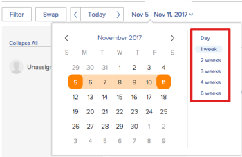

# Prise en main de la planification des ressources

>[!IMPORTANT]
>  
>La fonctionnalité de planification décrite dans cet article a été abandonnée et supprimée d’Adobe Workfront à compter de la version 23.1 de janvier 2023.   
>  
>  Cet article sera également supprimé peu de temps après la version 23.1, début 2023. Pour l’instant, nous vous recommandons de mettre à jour les signets en conséquence. 
> 
> Vous pouvez désormais utiliser l’équilibreur de charge de travail pour planifier le travail de vos ressources. 
>  
> Pour plus d’informations sur la planification des ressources à l’aide de l’équilibreur de charge de travail, voir la section [L’équilibreur de charge de travail](../../resource-mgmt/workload-balancer/workload-balancer.md). 

<!--  

>[!CAUTION] 
> 
> 
> The information in this article refers to the Adobe Workfront's Scheduling tools. The Scheduling areas have been removed from the Preview environment and will be removed from the Production environment in **January 2023**.   
>  Instead, you can schedule resources in the Workload Balancer.  
> 
>*  For information about scheduling resources using the Workload Balancer, see the section [The Workload Balancer](../../resource-mgmt/workload-balancer/workload-balancer.md). 
> 
>*  For more information about the deprecation and removal of the Scheduling tools, see [Deprecation of Resource Scheduling tools in Adobe Workfront](../../resource-mgmt/resource-mgmt-overview/deprecate-resource-scheduling.md). 
-->

<!--

(NOTE: LINKED TO THE PRODUCT FROM: ALL SCHEDULING TOOLS: GLOBAL, TEAM, PROJECT STAFFING *** LINKED TO LOTS OF ARTICLES, AS WELL!) 

(NOTE: Alina: this article should be divided in multiple articles, but CAREFULLY because some sections are linked to the UI)

-->

Lorsque vous utilisez la fonctionnalité de planification des ressources dans Adobe Workfront, vous pouvez plus facilement affecter des tâches et des problèmes aux utilisateurs appropriés. Vous pouvez déterminer quels utilisateurs sont capables d’exécuter la tâche ou le problème, en tenant compte du rôle de tâche et de la disponibilité de l’utilisateur.

Les sections suivantes apportent des informations supplémentaires sur l’utilisation des zones de planification dans Workfront.

## Conditions préalables à l’utilisation des outils de planification dans Workfront

>[!IMPORTANT]
>
>Les conditions préalables décrites dans cet article s&#39;appliquent uniquement aux zones Planification de Workfront. Pour plus d’informations sur les bonnes pratiques relatives à l’utilisation de l’équilibreur de charge de travail, voir [Présentation de l’équilibreur de charge de travail](../../resource-mgmt/workload-balancer/overview-workload-balancer.md).

Pour utiliser correctement la fonctionnalité de planification des ressources dans Workfront, vous devez d’abord vous assurer que vous, vos projets et vos tâches et problèmes remplissez les conditions préalables suivantes :

* [Conditions préalables requises pour les utilisateurs](#user-prerequisites)
* [Conditions préalables du projet](#project-prerequisites)
* [Tâche et problèmes préalables](#task-and-issue-prerequisites)

### Conditions préalables requises pour les utilisateurs {#user-prerequisites}

Vous pouvez utiliser les outils de planification des ressources disponibles dans l&#39;onglet Planification , dans l&#39;onglet Personnel ou dans l&#39;onglet Travail sur lorsque chacune des conditions suivantes est remplie :

**Lors de la planification des ressources en tant que gestionnaire des ressources (depuis l’onglet Planification ) :**

* Vous êtes désigné comme gestionnaire de ressources pour les projets pour lesquels vous souhaitez gérer les ressources.

   Pour plus d’informations sur la désignation des gestionnaires de ressources pour un projet, consultez l’article . [Désignation des gestionnaires de ressources pour un projet ou un modèle](../../manage-work/projects/planning-a-project/designate-resource-managers-for-projects-and-templates.md).

* Vous êtes un utilisateur disposant d’une licence Plan.

Par défaut, les utilisateurs ne s’affichent sur la chronologie de la planification que lorsqu’un rôle de tâche est défini dans le système (rôle de tâche Principal ou rôle de tâche secondaire), et que ce rôle correspond au rôle de tâche affecté à une tâche ou à un problème actuellement visible dans la fonction **Non attribué** sur la chronologie de la planification. Vous pouvez désactiver cette fonctionnalité afin de permettre l’affectation de tâches et de problèmes à un utilisateur, que ce dernier ait ou non un rôle défini dans son profil utilisateur correspondant à l’attribution du rôle de la tâche ou au problème qui lui est assigné. Pour plus d’informations, voir l’article [Autorisation des affectations d’utilisateurs, quel que soit le rôle et l’appartenance à un groupe dans les zones de planification](../../resource-mgmt/resource-scheduling/assignments-regardless-of-role-or-group-scheduling-areas.md).

Par défaut, les affectations ne peuvent être effectuées que pour les utilisateurs dont le rôle est défini dans leur profil utilisateur et qui correspond à l’attribution du rôle de la tâche ou du problème qui leur est assigné.

**Lors de la planification des ressources en tant que membre de l’équipe de projet (dans l’onglet Personnel d’un projet) :**

* Vous êtes autorisé à afficher, contribuer ou gérer le projet.
* Vous disposez d’une licence Plan ou Work

<!--
<note type="note">  If Workfront has not removed the Use New Scheduling Area option from your Scheduling settings, users must have a Plan license and Manage permissions to the project to view the Scheduling timeline. For more information about the removal of the Use New Scheduling Area option, see the article
<a href="../../product-announcements/announcements/announcement-archive/replace-flash-tools.md" class="MCXref xref">Replacement of Flash-based tools in Adobe Workfront</a>.
</note>
-->

**Lors de la planification de ressources en tant que membre de l’équipe (dans l’onglet Travail ) :**

* Vous êtes membre de l’équipe.\
   Tous les membres de l’équipe s’affichent dans la chronologie de la planification. Les tâches et les problèmes affectés à l’équipe et non affectés à un utilisateur s’affichent dans la zone Non affecté . La tâche et les problèmes affectés à l’équipe et à un utilisateur de l’équipe s’affichent dans la ligne de l’utilisateur auquel ils sont affectés.

### Conditions préalables du projet {#project-prerequisites}

Les conditions préalables au projet décrites dans cette section s’appliquent uniquement lors de la planification de ressources en tant que gestionnaire de ressources dans la chronologie de la planification.

Les projets que vous gérez doivent se trouver dans l’un des états suivants (ou un état qui correspond à l’un de ces états) pour que les tâches de ces projets s’affichent dans la chronologie de planification : Planification, Actuelle ou Approuvée. Par défaut, seuls les projets dont l’état est En cours s’affichent.

Pour plus d’informations sur l’état d’un projet, reportez-vous à l’article . [Création ou modification d’un état](../../administration-and-setup/customize-workfront/creating-custom-status-and-priority-labels/create-or-edit-a-status.md).

<!--

(NOTE: [! I assume this doesn't apply when using the Staffing tab on a single project? The project can be in whatever status?]) 

-->

### Tâche et problèmes préalables {#task-and-issue-prerequisites}

Pour être plus efficace lors de l’utilisation des outils de planification des ressources dans Workfront, assurez-vous que les critères suivants sont définis pour les tâches et les problèmes de votre système :

* Durée
* Dates de début planifiées
* Heures prévues\
   Les heures planifiées sont requises pour modifier les affectations utilisateur, comme décrit dans l’article . [Gestion des affectations d’utilisateurs dans les zones de planification](../../resource-mgmt/resource-scheduling/manage-allocations-scheduling-areas.md).

   >[!NOTE]
   >
   >Le champ Heures planifiées de la carte Planification des ressources affiche en fait la somme de toutes les valeurs workPerDay, et non les Heures planifiées de la tâche. Les valeurs workPerDay sont calculées en divisant la valeur des heures planifiées par la durée de la tâche. Pour les durées non nulles, les valeurs correspondent généralement aux heures planifiées de la tâche, bien que de légères incohérences dues à l’arrondi puissent se produire. Lorsqu’une durée est de 0 jour, la valeur Heures planifiées affiche 0 heure.

* Affectations de rôles

## Affichage des informations dans les zones Planification

* [Localisation et affichage des informations dans les zones Planification](#locate-and-view-information-in-the-scheduling-areas)
* [Affichage des affectations et des détails des ressources](#view-resource-assignments-and-details)
* [Minimisation des tâches et des problèmes dans les zones de planification.](#minimize-tasks-and-issues-on-the-scheduling-areas)
* [Ajuster la plage de dates des zones de planification](#adjust-the-date-range-of-the-scheduling-areas)

### Localisation et affichage des informations dans les zones Planification {#locate-and-view-information-in-the-scheduling-areas}

Selon l’emplacement où vous souhaitez planifier des ressources, vous pouvez accéder à la chronologie de planification dans les zones suivantes de Workfront :

* Pour plusieurs projets, dans la zone Planification
* Pour un projet dans la section Planification
* Pour une équipe, dans la section Planning

1. Accédez à la chronologie de planification pour plusieurs projets, pour un projet individuel ou pour une équipe :

   * **Pour plusieurs projets**:  Cliquez sur le bouton **Menu Principal** icon  dans le coin supérieur droit de Workfront, cliquez sur **Ressource > Équilibreur de charge de travail**, puis sélectionnez **Planification** dans le menu déroulant supérieur gauche.
   * **Pour un projet individuel**: Accédez à un projet, cliquez sur le bouton **Équilibreur de charge de travail** dans le panneau de gauche, puis sélectionnez **Planification** dans le menu déroulant supérieur gauche.
   * **Pour une équipe**: Cliquez sur le bouton **Menu Principal** icon  dans le coin supérieur droit de Workfront, puis cliquez sur **Équipes**, sélectionnez une équipe, puis cliquez sur **Équilibreur de charge de travail** dans le panneau de gauche, puis sélectionnez **Planification** dans le menu déroulant supérieur gauche.

1. (Facultatif) Cliquez sur le **Plein écran** , située dans le coin supérieur droit de la chronologie de planification.\
   \
   La chronologie de planification s’affiche en mode plein écran. Lorsque vous affichez la chronologie de planification en mode plein écran, elle occupe tout l’écran ; toutes les autres informations sont masquées (y compris les informations sur l’équipe ou le projet, la barre de navigation globale et les informations sur le navigateur).

1. (Facultatif) Pour quitter le mode Plein écran, effectuez l’une des opérations suivantes :

   * Cliquez sur le bouton **Plein écran** icône .
   * Appuyez sur la touche Échap.

### Affichage des affectations et des détails des ressources {#view-resource-assignments-and-details}

Vous pouvez afficher les affectations de ressources actuelles et d’autres détails sur les tâches individuelles et les problèmes dans la chronologie de la planification.

1. Accédez à la chronologie de planification pour plusieurs projets, pour un projet individuel ou pour une équipe :

   * **Pour plusieurs projets**:  Cliquez sur le bouton **Menu Principal** icon  dans le coin supérieur droit de Workfront, cliquez sur **Ressource > Équilibreur de charge de travail**, puis sélectionnez **Planification** dans le menu déroulant supérieur gauche.
   * **Pour un projet individuel**: Accédez à un projet, cliquez sur le bouton **Équilibreur de charge de travail** dans le panneau de gauche, puis sélectionnez **Planification** dans le menu déroulant supérieur gauche.
   * **Pour une équipe**: Cliquez sur le bouton **Menu Principal** icon  dans le coin supérieur droit de Workfront, puis cliquez sur **Équipes**, sélectionnez une équipe, puis cliquez sur **Équilibreur de charge de travail** dans le panneau de gauche, puis sélectionnez **Planification** dans le menu déroulant supérieur gauche.

1. (Facultatif) Pour personnaliser le contenu qui s’affiche dans la chronologie de planification, créez un filtre, comme décrit dans la section [Filtrage des informations dans la zone Planification](../../resource-mgmt/resource-scheduling/filter-scheduling-area.md).
1. Développez une tâche ou un problème pour afficher les informations suivantes :

   * **Projet :** Nom et lien du projet dans lequel réside la tâche.

   * **Dates :** Les dates de début et d’échéance associées à la tâche.

   * **Heures planifiées :** Nombre d’heures planifiées associées à la tâche.\
      Les heures planifiées ne s’affichent que si la tâche est affectée à un rôle d’utilisateur ou de tâche.

   * **Icône du prédécesseur :** Tous les prédécesseurs associés à la tâche. L’icône de prédécesseur s’affiche uniquement si des prédécesseurs sont associés à la tâche. L’icône du prédécesseur est verte lorsque le prédécesseur est terminé et que la tâche est prête à être travaillée.

   * **Affectations :** Affectations de rôles d’utilisateur ou de tâche associées à la tâche. Les affectations de rôle de tâche s’affichent entre parenthèses en regard de l’affectation de l’utilisateur.\
      Les affectations d’équipe ne s’affichent pas.\
      Si vous disposez d’un accès Contribution à la tâche ou au problème, vous pouvez modifier les heures pendant lesquelles les utilisateurs sont affectés chaque jour au cours de la tâche ou de la durée de la publication. Pour plus d’informations sur la modification des affectations utilisateur, consultez l’article . [Gestion des affectations d’utilisateurs dans les zones de planification](../../resource-mgmt/resource-scheduling/manage-allocations-scheduling-areas.md).

### Minimisation des tâches et des problèmes dans les zones de planification. {#minimize-tasks-and-issues-on-the-scheduling-areas}

La réduction des tâches et des problèmes vous permet d’afficher les affectations d’utilisateurs pour un grand nombre d’utilisateurs sur un seul écran.\
Toutes les tâches et tous les problèmes de la chronologie de la planification sont minimisés par défaut.

Lorsque les tâches et les problèmes sont réduits, vous pouvez :

* Afficher la durée de la tâche
* Afficher la couleur du projet
* Affectez des tâches de la zone Non affecté aux utilisateurs de la chronologie de planification.

Lorsque les tâches et les problèmes sont réduits, vous ne pouvez pas :

* Affichage des noms des tâches
* Faire glisser les tâches déjà affectées à un utilisateur et les réaffecter
* Développer les tâches pour afficher les détails

Si vous activez le paramètre Afficher les totaux pour les heures planifiées quotidiennes , lorsque les tâches et les problèmes sont réduits, vous ne pouvez que :

* Afficher le total des heures planifiées quotidiennes pour chaque utilisateur.

Lorsque vous réduisez les tâches et les problèmes comme décrit dans cette section, ces modifications s’affichent uniquement pour vous. Les tâches et les problèmes restent minimisés jusqu’à ce que vous les développiez ou que vous mettiez fin à la session de votre navigateur. (L’actualisation de la page ne rétablit pas l’état des tâches et des problèmes minimisés sur un état développé.)

Dans la frise chronologique de la planification, vous pouvez minimiser les tâches et les problèmes qui s’affichent pour des utilisateurs individuels, pour des rôles de tâche ou pour tous les utilisateurs.

* [Réduction des tâches et des problèmes pour les utilisateurs individuels](#minimize-tasks-and-issues-for-individual-users)
* [Minimisation des tâches et des problèmes pour un rôle de tâche](#minimize-tasks-and-issues-for-a-job-role)
* [Réduction des tâches et des problèmes pour tous les utilisateurs](#minimize-tasks-and-issues-for-all-users)

#### Réduction des tâches et des problèmes pour les utilisateurs individuels {#minimize-tasks-and-issues-for-individual-users}

1. Cliquez sur le signe d’insertion en regard de l’utilisateur dans la chronologie de planification dont vous souhaitez réduire les tâches et les problèmes.\
   \
   L’affichage des tâches et des problèmes dépend des paramètres suivants :

   * Si vous activez la variable **Afficher les totaux pour les heures planifiées quotidiennes** les conditions suivantes s&#39;appliquent :

      * Heures planifiées uniquement pour l’affichage utilisateur
      * Tâches et problèmes masqués
   * Si vous activez la variable **Afficher les totaux pour les heures planifiées quotidiennes** les tâches et les problèmes de l’utilisateur sont minimisés.\
      

#### Minimisation des tâches et des problèmes pour un rôle de tâche {#minimize-tasks-and-issues-for-a-job-role}

Vous pouvez minimiser les tâches et les problèmes pour tous les utilisateurs associés à un rôle de tâche spécifique.

1. Cliquez sur le signe d’insertion en regard du rôle de tâche dans la chronologie de planification qui contient les utilisateurs dont vous souhaitez réduire les tâches et les problèmes.\
   \
   Les tâches et les problèmes pour tous les utilisateurs associés à ce rôle sont réduits si vous désactivez la fonction **Afficher les totaux pour les heures planifiées quotidiennes** .\
   Les tâches et les problèmes sont masqués et seules les heures planifiées des utilisateurs s’affichent si vous activez ce paramètre.\
   

#### Réduction des tâches et des problèmes pour tous les utilisateurs {#minimize-tasks-and-issues-for-all-users}

1. Cliquez sur **Réduire tout** en haut de la zone Utilisateurs et rôles .\
   \
   Ou\
   Cliquez sur le signe d’insertion en regard d’un rôle d’utilisateur ou de tâche dans la chronologie de planification tout en maintenant la touche Maj enfoncée.\
   \
   Les tâches et les problèmes pour tous les utilisateurs et rôles sont réduits si vous désactivez la fonction **Afficher les totaux pour les heures planifiées quotidiennes** et les tâches et problèmes sont masqués si vous l’activez.\
   Si la variable **Afficher les totaux pour les heures planifiées quotidiennes** n’est activée que les heures planifiées pour les utilisateurs. Les tâches et les problèmes restent minimisés pour la zone Non affecté.\
   

### Ajuster la plage de dates des zones de planification {#adjust-the-date-range-of-the-scheduling-areas}

Par défaut, 14 jours consécutifs (week-ends compris) s’affichent dans la chronologie de la planification, en commençant par le jour en cours.

Utilisez l’une des options suivantes pour modifier la période pour laquelle les données s’affichent dans la chronologie de planification :

* **Options de période :** Cliquez sur la période actuelle, puis sélectionnez le nombre de semaines à afficher dans la chronologie. Vous pouvez afficher Jour (un seul jour), 1 semaine (7 jours), 2 semaines (14 jours), 3 semaines (21 jours), 4 semaines (28 jours) ou 6 semaines (42 jours).\
   Tenez compte des points suivants lors de l’ajustement de la période de la planification :

   * Les options de période que vous sélectionnez sont conservées la prochaine fois que vous visitez la chronologie de planification.

      <!--   
     
(NOTE: [! Not sure if this is going to apply to all 3 scheduling areas...]) 
   
     -->

   * Lors de l’affichage de la chronologie de planification dans la vue Jour, les affectations utilisateur ne s’affichent pas.\
      

* **Calendrier :** Cliquez sur la période actuelle, puis sur le jour précédant ou suivant le jour en cours. L’heure entre le jour en cours et le jour sélectionné est la nouvelle période.\
   

* **Aujourd&#39;hui :** Cliquez sur cette option pour afficher le jour en cours. Le jour en cours s’affiche alors à l’extrémité gauche de la période.\
   Cliquez sur les flèches gauche et droite pour afficher les dates antérieures ou futures.

   >[!NOTE]
   >
   >La période sélectionnée est conservée lors de l’actualisation de la page.

   

* **Effectuez un glisser-déposer de la période :** Faites glisser la plage de dates en haut de la chronologie de planification.\
   

## Configuration des paramètres dans les zones Planification

Certaines informations s’affichent par défaut dans la chronologie de planification. Vous pouvez également configurer vos paramètres pour afficher des informations supplémentaires.

Pour plus d’informations sur la configuration de vos paramètres dans la chronologie de planification, consultez les articles suivants :

[Configuration des paramètres dans les zones Planification](../../resource-mgmt/resource-scheduling/configure-settings-scheduling-areas.md)

[Autorisation des affectations d’utilisateurs, quel que soit le rôle et l’appartenance à un groupe dans les zones de planification](../../resource-mgmt/resource-scheduling/assignments-regardless-of-role-or-group-scheduling-areas.md)

[Affecter automatiquement des tâches et des problèmes non attribués dans les zones Planification](../../resource-mgmt/resource-scheduling/automatically-assign-items-scheduling-areas.md)

## Filtrage des informations dans les zones Planification

Vous pouvez définir ce qui s’affiche dans la chronologie de la planification en créant un filtre.

Pour plus d’informations, voir l’article [Filtrage des informations dans la zone Planification](../../resource-mgmt/resource-scheduling/filter-scheduling-area.md).

## Modification des affectations et des affectations d’utilisateurs

* [Modification des affectations d’utilisateurs](#modify-user-assignments)
* [Modification des attributions d’utilisateurs](#modify-user-allocations)

### Modification des affectations d’utilisateurs {#modify-user-assignments}

Vous pouvez modifier les affectations d’utilisateurs à partir de l’onglet Planification (lors de la planification des ressources pour les projets) en utilisant l’outil d’échange ou en modifiant les tâches et les problèmes directement à partir de la chronologie de planification. Vous pouvez modifier les affectations d’utilisateurs à partir de l’onglet Travail sur (lors de la planification des ressources pour les équipes) en modifiant les tâches et les problèmes directement à partir de la chronologie de la planification.

Pour plus d’informations, voir l’article [Affectez manuellement des tâches et des problèmes non attribués dans les zones Planification .](../../resource-mgmt/resource-scheduling/manually-assign-items-scheduling-areas.md).

### Modification des attributions d’utilisateurs {#modify-user-allocations}

Vous pouvez déterminer comment les heures planifiées d’une tâche ou d’un problème sont attribuées aux utilisateurs. Les heures planifiées peuvent être divisées comme suit :

* Parmi les utilisateurs affectés à la tâche ou au problème.
* Pendant la durée de la tâche ou du problème.

Pour plus d’informations, voir l’article [Gestion des affectations d’utilisateurs dans les zones de planification](../../resource-mgmt/resource-scheduling/manage-allocations-scheduling-areas.md).
