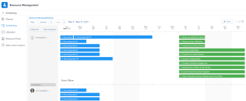

# Gestion des affectations d’utilisateurs dans les zones de planification

>[!IMPORTANT]
>  
>La fonctionnalité de planification décrite dans cet article a été abandonnée et supprimée d’Adobe Workfront à compter de la version 23.1 de janvier 2023.   
>  
>  Cet article sera également supprimé peu de temps après la version 23.1, début 2023. Pour l’instant, nous vous recommandons de mettre à jour les signets en conséquence. 
> 
> Vous pouvez désormais utiliser l’équilibreur de charge de travail pour planifier le travail de vos ressources. 
>  
> Pour plus d’informations sur la planification des ressources à l’aide de l’équilibreur de charge de travail, voir la section [L’équilibreur de charge de travail](../../resource-mgmt/workload-balancer/workload-balancer.md). 

<!--  

>[!CAUTION] 
> 
> 
> The information in this article refers to the Adobe Workfront's Scheduling tools. The Scheduling areas have been removed from the Preview environment and will be removed from the Production environment in **January 2023**.   
>  Instead, you can schedule resources in the Workload Balancer.  
> 
>*  For information about scheduling resources using the Workload Balancer, see the section [The Workload Balancer](../../resource-mgmt/workload-balancer/workload-balancer.md). 
> 
>*  For more information about the deprecation and removal of the Scheduling tools, see [Deprecation of Resource Scheduling tools in Adobe Workfront](../../resource-mgmt/resource-mgmt-overview/deprecate-resource-scheduling.md). 

-->

Les affectations d’utilisateurs sont des quantités d’heures qui indiquent le temps qu’un utilisateur doit consacrer au cours d’un jour donné pour terminer un élément de travail. Elles sont incluses dans les heures planifiées de l’élément de travail.

Cet article décrit comment mettre à jour les allocations horaires quotidiennes pour les utilisateurs affectés à des tâches ou des problèmes à l’aide de la zone Planification des ressources . Pour plus d’informations sur la gestion des affectations globales pour les utilisateurs et les rôles de tâche pour les tâches, voir [Gestion des heures d’affectation des utilisateurs et des rôles pour les tâches](../../manage-work/tasks/assign-tasks/manage-allocation-hours-on-tasks.md). Vous ne pouvez pas mettre à jour les affectations globales pour les utilisateurs et les rôles de tâche pour les problèmes.

Vous pouvez afficher les affectations utilisateur dans les zones suivantes d’Adobe Workfront :

* Dans la section Planification de la zone Ressource .
* Dans la section Planification d’un projet (lors de la planification de ressources pour un seul projet).
* Dans la section Planning d’une équipe (lors de la planification des ressources pour une équipe).

## Exigences d’accès

Vous devez disposer des éléments suivants :

<table style="table-layout:auto"> 
 <col> 
 <col> 
 <tbody> 
  <tr> 
   <td role="rowheader">Formule Adobe Workfront*</td> 
   <td> 
Tous
 </td> 
  </tr> 
  <tr> 
   <td role="rowheader">Licence Adobe Workfront*</td> 
   <td> 
Travail ou plus élevé
 </td> 
  </tr> 
  <tr> 
   <td role="rowheader">Niveau d’accès*</td> 
   <td> 
Affichage ou accès supérieur à Projets, tâches et problèmes
 
<b>NOTE</b>

Si vous n’avez toujours pas accès à , demandez à votre administrateur Workfront s’il définit des restrictions supplémentaires à votre niveau d’accès. Pour plus d’informations sur la façon dont un administrateur Workfront peut modifier votre niveau d’accès, voir <a href="../../administration-and-setup/add-users/configure-and-grant-access/create-modify-access-levels.md" class="MCXref xref">Création ou modification de niveaux d’accès personnalisés</a>.
 </td>
</tr> 
  <tr> 
   <td role="rowheader">Autorisations d’objet</td> 
   <td> 
Contribution des autorisations aux projets, tâches et problèmes
 
Pour plus d’informations sur la demande d’accès supplémentaire, voir <a href="../../workfront-basics/grant-and-request-access-to-objects/request-access.md" class="MCXref xref">Demande d’accès aux objets </a>.
 </td> 
  </tr> 
 </tbody> 
</table>

*Pour connaître le plan, le type de licence ou l’accès dont vous disposez, contactez votre administrateur Workfront.

## Allocation des utilisateurs dans les zones de planification

Avant de commencer à allouer du temps aux utilisateurs, comme décrit dans cet article, familiarisez-vous avec le fonctionnement de la planification des ressources dans Workfront, comme décrit dans la section [Prise en main de la planification des ressources](../../resource-mgmt/resource-scheduling/get-started-resource-scheduling.md).

Vous pouvez planifier l’utilisation des ressources pour les tâches et les problèmes d’une équipe dont vous êtes membre, d’un projet particulier dont vous faites partie ou de plusieurs projets pour lesquels vous êtes le responsable de ressources.

Les sections suivantes décrivent comment activer et gérer les affectations d’utilisateurs dans Workfront :

* [Utilisation des zones de planification pour affecter le travail](#use-the-scheduling-areas-to-assign-work)
* [Allocations définies dans les zones Modifier la tâche ou Modifier le problème par rapport aux zones Planifier .](#allocations-set-on-the-edit-task-or-the-edit-issue-boxes-vs-in-the-scheduling-areas)
* [Indicateurs d’affectation](#allocation-indicators)
* [Allocation par défaut pour les heures planifiées](#default-allocation-for-planned-hours)
* [Qui peut afficher et modifier les affectations ?](#who-can-view-and-modify-allocations)
* [Considérations relatives aux fuseaux horaires dans les zones de planification](#time-zone-considerations-in-the-scheduling-areas)

### Utilisation des zones de planification pour affecter le travail {#use-the-scheduling-areas-to-assign-work}

Lorsque vous attribuez de nouvelles tâches aux utilisateurs dans la chronologie de planification, vous pouvez déterminer comment les heures planifiées d’une tâche ou d’un problème sont attribuées aux utilisateurs.\
Pour plus d’informations sur les heures planifiées, voir [Présentation des heures planifiées](../../manage-work/tasks/task-information/planned-hours.md).

Les heures planifiées peuvent être divisées comme suit :

* Parmi les utilisateurs affectés à la tâche ou au problème
* Pendant la durée de la tâche ou du problème\
   Par exemple, une tâche liée aux ventes peut nécessiter davantage de travail vers la fin de la durée de la tâche. Vous pouvez planifier cette répartition inégale des heures dans votre tâche.

>[!TIP]
>
>Lors de la planification de ressources pour plusieurs projets à partir des zones Planification , tous les utilisateurs et les tâches ne s’affichent pas dans la chronologie de planification. Pour plus d’informations sur les informations affichées dans la chronologie de planification, voir [Prise en main de la planification des ressources](../../resource-mgmt/resource-scheduling/get-started-resource-scheduling.md).

### Allocations définies dans les zones Modifier la tâche ou Modifier le problème par rapport aux zones Planifier . {#allocations-set-on-the-edit-task-or-the-edit-issue-boxes-vs-in-the-scheduling-areas}

Vous pouvez modifier les affectations utilisateur pour une tâche ou un problème à partir des emplacements suivants dans Workfront :

* Planning\
   La chronologie de la planification se trouve dans les zones suivantes :

   * Dans la section Planification de la zone Ressource .
   * Dans la section Planification d’un projet (lors de la planification de ressources pour un seul projet).
   * Dans la section Planning d’une équipe (lors de la planification des ressources pour une équipe).

   Lorsque vous modifiez les affectations utilisateur à partir de la chronologie de planification (comme décrit dans la section [Modification des attributions d’utilisateurs](#modify-user-allocations) dans cet article), vous pouvez définir des affectations pour chaque utilisateur de la tâche ou du problème, ainsi que pour chaque jour de la tâche ou de la durée du problème.\
   

* Boîte de dialogue Modifier la tâche ou Modifier le problème .\
   Lorsque vous modifiez les affectations utilisateur à partir d’une boîte de dialogue Modifier une tâche ou un problème (comme décrit dans [Gérer le pourcentage d’affectation des utilisateurs ou des rôles pour les tâches](../../manage-work/tasks/assign-tasks/manage-allocation-percentage-on-tasks.md)), vous pouvez définir des attributions pour la tâche ou l’émission uniquement dans son ensemble pour chaque utilisateur. Si vous souhaitez gérer ces affectations quotidiennement, vous devez les modifier dans la chronologie de planification, comme décrit dans la section [Modification des attributions d’utilisateurs](#modify-user-allocations) dans cet article.

   >[!IMPORTANT]
   >
   >Lors de la modification des allocations utilisateur à partir d’une boîte de dialogue Modifier la tâche ou Problème, les allocations que vous avez précédemment configurées dans la chronologie de planification sont écrasées. De plus, les modifications apportées aux affectations dans la chronologie de planification ne sont pas répercutées dans une boîte de dialogue Modifier la tâche ou le problème.

Nous vous recommandons de gérer les allocations d’utilisateurs à partir de la chronologie de planification plutôt que de la tâche de modification ou du problème afin de bénéficier des avantages suivants :

* Vous pouvez clairement savoir quand les utilisateurs sont surchargés à l’aide des indicateurs d’attribution, comme décrit dans la section [Indicateurs d’affectation](#allocation-indicators) .
* Vous pouvez allouer plus de temps à un utilisateur qu’à un autre.\
   Les indicateurs d’affectation fournissent une représentation visuelle de l’allocation d’un utilisateur par rapport à d’autres utilisateurs, comme décrit dans la section [Indicateurs d’affectation](#allocation-indicators) .

* Vous pouvez allouer plus de temps pour le travail un jour sur un autre.\
   Les indicateurs d’affectation fournissent une représentation visuelle de la façon dont les utilisateurs sont affectés un jour donné, comme décrit dans la section [Indicateurs d’affectation](#allocation-indicators).

* Vous pouvez exécuter toutes les responsabilités de ressources à un seul endroit, dans la chronologie de planification.

### Indicateurs d’affectation {#allocation-indicators}

Différents indicateurs visuels sont proposés pour fournir des informations rapides sur le niveau d’affectation d’un utilisateur à un jour donné.

Votre administrateur système détermine la manière dont Workfront calcule la disponibilité des utilisateurs au niveau du système (en tenant compte des heures ainsi que de la disponibilité de l’éditeur de texte enrichi). Selon ce paramètre à l’échelle du système, la disponibilité de l’utilisateur est calculée en utilisant le planning par défaut ou le planning de l’utilisateur. Pour plus d’informations, voir [Configuration de la manière dont Workfront calcule l’heure de la ressource et la disponibilité de l’éditeur de texte enrichi pour la zone de planification](../../resource-mgmt/resource-scheduling/calculate-hours-fte-scheduling-area.md).

* **Ombrage de l’affectation**
L’affectation s’affiche visuellement sur les tâches affectées aux utilisateurs sous la forme d’un ombrage. L’ombrage plus foncé indique les heures allouées sous forme de pourcentage de l’équivalent temps plein (équivalent temps plein) de l’utilisateur affecté un jour donné. (Pour plus d’informations sur la configuration de l’éditeur de texte enrichi dans Workfront, voir [Configuration de la manière dont Workfront calcule l’heure de la ressource et la disponibilité de l’éditeur de texte enrichi pour la zone de planification](../../resource-mgmt/resource-scheduling/calculate-hours-fte-scheduling-area.md).)\
   Par exemple, un utilisateur unique est affecté à une tâche qui a un montant de 4 heures planifiées et une durée de 1 jour. L’éditeur de texte enrichi de l’utilisateur est défini sur 1 dans le système (ce qui signifie que l’utilisateur doit travailler à temps plein, ou plutôt 40 heures par semaine, ou 8 heures par jour). L’ombrage de la tâche un jour donné occupe la moitié de l’espace vertical de la tâche, ce qui indique que l’utilisateur se voit attribuer la moitié de son EPT (4 heures) ce jour-là.\
   \
   La tâche ou le problème affiche l’allocation cumulée pour tous les utilisateurs affectés à l’élément de travail. Vous pouvez développer une tâche pour afficher plus de détails, notamment qui est affecté à l’élément de travail et combien d’heures chaque utilisateur est affecté.\
   L’ombrage n’est pas affiché pour les tâches dans la variable **Non attribué** dans la chronologie de planification.\
   

* **Totaux quotidiens pour chaque jour pour chaque utilisateur :** Vous pouvez afficher le total des heures planifiées allouées à un utilisateur donné chaque jour. Ces informations s’affichent en haut de la ligne de chaque utilisateur dans la chronologie de planification. Ces informations ne sont pas affichées par défaut. Vous pouvez l’activer comme décrit dans la section [Activation des affectations utilisateur](#enable-user-allocations). Les tâches des projets dont l’un des états est le suivant sont incluses lors de la détermination des totaux quotidiens : Actuel, Planification ou Approuvé.\
   

* **Indicateurs de surrépartition**
Lorsque le nombre total d’heures planifiées affectées à un utilisateur au cours d’un jour donné dépasse le nombre d’heures travaillées par l’utilisateur au cours d’une journée (pour toutes les tâches), cet utilisateur est considéré comme suralloué ce jour-là.\
   Lorsqu’un utilisateur est surchargé, une barre rouge s’affiche, décrivant chaque tâche le jour.\
   Les tâches des projets dont l’un des états est le suivant sont incluses lors de la détermination de la surallocation d’un utilisateur : Actuel, Planification ou Approuvé.\
   Le nombre d’heures de travail d’un utilisateur par jour est défini via le champ d’éditeur de texte enrichi du profil de chaque utilisateur, comme décrit dans la section [Configuration de la manière dont Workfront calcule l’heure de la ressource et la disponibilité de l’éditeur de texte enrichi pour la zone de planification](../../resource-mgmt/resource-scheduling/calculate-hours-fte-scheduling-area.md).\
   \
   Lorsque vous activez la variable **Afficher les totaux pour les heures planifiées quotidiennes** et le **Afficher la mise en surbrillance de l’affectation des ressources** dans vos paramètres, le nombre total journalier d’heures planifiées s’affiche en rouge lorsque l’utilisateur est surchargé. Par défaut, les heures s’affichent au dixième le plus proche (par exemple, 1.3).\
   

### Allocation par défaut pour les heures planifiées {#default-allocation-for-planned-hours}

Workfront tente de répartir les heures planifiées parmi les utilisateurs et les jours attribués de la manière suivante :

* Lorsque plusieurs utilisateurs sont affectés à une tâche ou à un problème, les heures sont divisées uniformément entre les utilisateurs.\
   La distribution reflète toutes les affectations avancées qui ont déjà été effectuées sur la tâche.\
   Pour plus d’informations sur les affectations avancées, voir [Création d’affectations avancées](../../manage-work/tasks/assign-tasks/create-advanced-assignments.md).

* Lorsque la Durée de la tâche ou du problème s’étend sur plusieurs jours, les Heures planifiées sont réparties à parts égales entre les jours et entre tous les utilisateurs affectés à la tâche, selon le planning de l’utilisateur.
* Lorsque les Heures planifiées d’une tâche s’étendent sur plusieurs jours, un utilisateur qui visualise la tâche à partir d’un autre fuseau horaire peut constater une différence entre la durée de la tâche ou la date de début planifiée ou la date de fin planifiée.

Par défaut, les heures s’affichent au centième le plus proche (par exemple, 1.33). Vous pouvez faire défiler vers la droite pour afficher plus d’informations.\

### Qui peut afficher et modifier les affectations ? {#who-can-view-and-modify-allocations}

Les types d’utilisateurs suivants peuvent afficher ou modifier les affectations d’utilisateurs dans Workfront :

* **Chargés de ressources :** Vous pouvez afficher et modifier les affectations d’utilisateurs pour les tâches et les problèmes de tous les projets pour lesquels vous êtes le gestionnaire de ressources. Vous pouvez le faire dans la zone Planning dans la zone Personnes ou dans l’onglet Personnel d’un projet.\
   Pour plus d’informations sur la façon dont les gestionnaires de ressources peuvent apporter des modifications aux tâches et aux problèmes dans les projets, voir [Affectez manuellement des tâches et des problèmes non attribués dans les zones Planification .](../../resource-mgmt/resource-scheduling/manually-assign-items-scheduling-areas.md).

* **Planification et utilisation :** Vous pouvez afficher les affectations pour toutes les tâches et problèmes auxquels vous êtes affecté en utilisant le nouveau calendrier de travail My Work Calendar ou le calendrier Working On d’une équipe dont vous êtes membre.\
   Outre l’affichage des allocations, vous pouvez modifier vos allocations si vous disposez d’un accès Contribution aux tâches et aux problèmes.

   <!--
  <MadCap:conditionalText data-mc-conditions="QuicksilverOrClassic.Draft mode">
  (NOTE: Article is conditioned to classic.)
  </MadCap:conditionalText>
  -->

### Considérations relatives aux fuseaux horaires dans les zones de planification  {#time-zone-considerations-in-the-scheduling-areas}

Dans de rares cas, les utilisateurs qui visualisent la chronologie de planification peuvent voir des incohérences lorsque les heures planifiées d’une tâche ne correspondent pas au nombre total d’heures allouées de chaque jour. Cela peut se produire lorsque le paramètre de fuseau horaire du système d’exploitation d’un utilisateur est tel que la Date de début planifiée ou la Date de fin planifiée diffère de celui d’un autre utilisateur.

Par exemple, si la date d’achèvement planifiée d’une tâche est définie sur 11h00 le 11/3/18, heure d’été, un utilisateur en Australie qui consulte la tâche verrait la date d’achèvement planifiée comme 01h00 le 11/4/18, le jour suivant. Si l’utilisateur situé en Australie alloue des heures le 11/4/18, ces heures allouées ne sont pas visibles par l’utilisateur sur MST. Toutefois, ces heures sont toujours prises en compte dans les heures prévues du projet.

## Activation des affectations utilisateur {#enable-user-allocations}

La fonctionnalité d’affectation des utilisateurs est désactivée par défaut sur la chronologie de planification. Avant de pouvoir utiliser la fonctionnalité d’affectation des utilisateurs décrite dans cette section, vous devez d’abord l’activer.

>[!NOTE]
>
>Les affectations d’utilisateurs ne peuvent être activées que lorsque la chronologie de planification est configurée pour utiliser les dates planifiées. Si la Chronologie de planification est configurée pour utiliser les Dates prévues, les allocations utilisateur ne peuvent pas être affichées. Pour plus d’informations sur la configuration de la chronologie de planification afin d’utiliser les dates prévues ou prévues, voir &quot;Configuration des dates prévues à afficher dans la chronologie de planification&quot; dans [Configuration des paramètres dans les zones Planification](../../resource-mgmt/resource-scheduling/configure-settings-scheduling-areas.md).

Pour activer les affectations d’utilisateurs dans la chronologie de planification :

1. Accédez à la chronologie de planification pour plusieurs projets, pour un projet individuel ou pour une équipe :

   * **Pour plusieurs projets**:  Cliquez sur le bouton **Menu Principal** icon  dans le coin supérieur droit de Workfront, cliquez sur **Ressource > Équilibreur de charge de travail**, puis sélectionnez **Planification** dans le menu déroulant supérieur gauche.
   * **Pour un projet individuel**: Accédez à un projet, cliquez sur le bouton **Équilibreur de charge de travail** dans le panneau de gauche, puis sélectionnez **Planification** dans le menu déroulant supérieur gauche.
   * **Pour une équipe**: Cliquez sur le bouton **Menu Principal** icon  dans le coin supérieur droit de Workfront, puis cliquez sur **Équipes**, sélectionnez une équipe, puis cliquez sur **Équilibreur de charge de travail** dans le panneau de gauche, puis sélectionnez **Planification** dans le menu déroulant supérieur gauche.

   

1. Cliquez sur le bouton **Paramètres** dans la frise chronologique.\
   \
   La boîte de dialogue Paramètres de planification des ressources s’affiche.\
   

1. Activez l’une des options suivantes ou les deux pour afficher les affectations utilisateur sur la chronologie de planification :

   <table style="table-layout:auto"> 
    <col> 
    <col> 
    <tbody> 
     <tr> 
      <td role="rowheader">Afficher le surlignage de l'allocation des ressources</td> 
      <td> 
Afficher l’ombrage de l’affectation des utilisateurs sur les tâches et les problèmes de la chronologie de planification. 
 
Cette option est désactivée par défaut.
 </td> 
     </tr> 
     <tr> 
      <td role="rowheader">Afficher les totaux pour les heures quotidiennes prévues</td> 
      <td>Affiche le nombre total d’heures planifiées allouées à chaque utilisateur pour chaque jour dans la chronologie de planification. Les heures planifiées s’affichent au dixième le plus proche (par exemple, 1.3). Cette option est désactivée par défaut.</td> 
     </tr> 
    </tbody> 
   </table>

1. (Facultatif) Dans le **Problèmes d’inclusion** , indiquez si vous souhaitez que les problèmes s’affichent dans la chronologie de planification.\
   Cette option est désactivée par défaut.

1. Cliquez sur **Revenir à la planification**.\
   Les affectations d’utilisateurs s’affichent désormais dans la chronologie de planification.\
   

## Modification des attributions d’utilisateurs {#modify-user-allocations}

Vous pouvez modifier les affectations utilisateur pour une tâche ou un problème à partir de la chronologie de planification (comme décrit dans cette section) ou dans la boîte de dialogue Modifier la tâche ou le problème . Pour plus d’informations, voir [Allocations définies dans les zones Modifier la tâche ou Modifier le problème par rapport aux zones Planifier .](#allocations-set-on-the-edit-task-or-the-edit-issue-boxes-vs-in-the-scheduling-areas).

Par défaut, les utilisateurs sont affectés à une tâche ou à un problème de manière égale entre les personnes désignées et entre les jours de la durée, comme décrit dans la section [Allocation par défaut pour les heures planifiées](#default-allocation-for-planned-hours).

Pour modifier les affectations d’utilisateurs pour une tâche ou un problème dans la chronologie de planification :

1. Accédez à la chronologie de planification pour plusieurs projets, pour un projet individuel ou pour une équipe :

   * **Pour plusieurs projets**:  Cliquez sur le bouton **Menu Principal** icon  dans le coin supérieur droit de Workfront, cliquez sur **Ressource > Équilibreur de charge de travail**, puis sélectionnez **Planification** dans le menu déroulant supérieur gauche.
   * **Pour un projet individuel**: Accédez à un projet, cliquez sur le bouton **Équilibreur de charge de travail** dans le panneau de gauche, puis sélectionnez **Planification** dans le menu déroulant supérieur gauche.
   * **Pour une équipe**: Cliquez sur le bouton **Menu Principal** icon  dans le coin supérieur droit de Workfront, puis cliquez sur **Équipes**, sélectionnez une équipe, puis cliquez sur **Équilibreur de charge de travail** dans le panneau de gauche, puis sélectionnez **Planification** dans le menu déroulant supérieur gauche.

   

1. Assurez-vous que les affectations d’utilisateurs sont activées dans la chronologie de planification, comme décrit dans la section [Activation des affectations utilisateur](#enable-user-allocations) dans cet article.
1. Développez la tâche pour laquelle vous souhaitez gérer les affectations utilisateur.\
   Par défaut, les heures planifiées sont divisées uniformément entre les utilisateurs affectés et les jours de la durée de la tâche. Les heures ne sont pas ajoutées le week-end (samedi et dimanche). Pour plus d’informations, voir [Allocation par défaut pour les heures planifiées](#default-allocation-for-planned-hours) dans cet article.

1. Cliquez sur le champ correspondant à l’utilisateur pour lequel vous souhaitez ajuster les heures un jour donné.

   >[!NOTE]
   >
   >Pour conserver la distribution d’origine après modification des heures, cliquez sur **Annuler**.

1. Spécifiez le nombre ajusté d’heures.
1. Cliquer sur **Enregistrer**.\
   Vous ne pouvez enregistrer vos modifications que lorsque le nombre total d’heures pour la tâche est égal au nombre d’heures planifiées originales. Ce nombre est indiqué dans la variable **Heures planifiées** sur la tâche. Le nombre s’affiche en rouge lorsque le total n’est pas égal au nombre total d’heures planifiées.\
   

## Critères qui réinitialisent les attributions d’utilisateurs

Workfront réinitialise les affectations utilisateur que vous modifiez manuellement dans la chronologie de planification lorsque plusieurs actions se produisent sur les tâches ou le projet. En règle générale, Workfront réinitialise les affectations utilisateur chaque fois que la chronologie du projet est recalculée si le nombre d’heures planifiées sur les tâches et problèmes a changé dans ce processus.\
Pour plus d’informations sur le nouveau calcul de la chronologie des projets, voir [Recalculer les calendriers du projet](../../manage-work/projects/manage-projects/recalculate-project-timeline.md).

Voici quelques-uns des critères les plus courants pouvant réinitialiser les affectations utilisateur dans la chronologie de planification :

* Ajouter une tâche à une itération.\
   Les itérations ayant des dates fixes, les dates des tâches et les affectations sont recalculées.\
   Pour plus d’informations sur la façon dont les itérations peuvent affecter les dates des tâches, voir [Ajouter des articles à une itération existante](../../agile/use-scrum-in-an-agile-team/iterations/add-stories-to-existing-iteration.md).

* Remplacez le type de durée d’une tâche par Effort Driven.
* Remplacez le Type de durée d’une tâche par Attribution calculée lorsque plus d’une personne est affectée.\
   Pour plus d’informations sur la durée de la tâche, voir [Présentation de la durée et du type de durée de la tâche](../../manage-work/tasks/taskdurtn/task-duration-and-duration-type.md).

* Modification des dates de début planifié et de fin planifiée du projet.\
   Pour plus d’informations sur les dates planifiées du projet, voir [Présentation du projet Date de début prévue](../../manage-work/projects/planning-a-project/project-planned-start-date.md) et [Définition de la date d’achèvement prévue du projet](../../manage-work/projects/planning-a-project/project-planned-completion-date.md).

   Pour plus d’informations sur la date d’achèvement prévue de la tâche, voir [Présentation de la date d’achèvement planifiée de la tâche](../../manage-work/tasks/task-information/task-planned-completion-date.md).

* Modifier les dates d’une tâche précédente si la contrainte de tâche est une contrainte flexible.\
   Par exemple, dès que possible ou aussi tard que possible.\
   Pour plus d’informations sur la contrainte de tâche, voir [Présentation de la contrainte de tâche](../../manage-work/tasks/task-constraints/task-constraint-overview.md).

* Modification du nombre d’heures planifiées de tâches ou de problèmes.

   Pour plus d’informations sur les heures planifiées dans Workfront, voir [Présentation des heures planifiées](../../manage-work/tasks/task-information/planned-hours.md).
