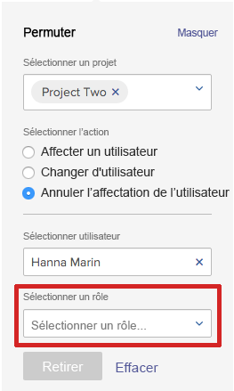

# Modification de plusieurs affectations d’utilisateurs à des tâches dans les zones Planification

>[!IMPORTANT]
>  
>La fonctionnalité de planification décrite dans cet article a été abandonnée et supprimée d’Adobe Workfront à compter de la version 23.1 de janvier 2023.   
>  
>  Cet article sera également supprimé peu de temps après la version 23.1, début 2023. Pour l’instant, nous vous recommandons de mettre à jour les signets en conséquence. 
> 
> Vous pouvez désormais utiliser l’équilibreur de charge de travail pour planifier le travail de vos ressources. 
>  
> Pour plus d’informations sur la planification des ressources à l’aide de l’équilibreur de charge de travail, voir la section [L’équilibreur de charge de travail](../../resource-mgmt/workload-balancer/workload-balancer.md). 

<!--   

>[!CAUTION] 
> 
> 
> The information in this article refers to the Adobe Workfront's Scheduling tools. The Scheduling areas have been removed from the Preview environment and will be removed from the Production environment in **January 2023**.  
>  Instead, you can schedule resources in the Workload Balancer.  
> 
>*  For information about scheduling resources using the Workload Balancer, see the section [The Workload Balancer](../../resource-mgmt/workload-balancer/workload-balancer.md). 
> 
>*  For more information about the deprecation and removal of the Scheduling tools, see [Deprecation of Resource Scheduling tools in Adobe Workfront](../../resource-mgmt/resource-mgmt-overview/deprecate-resource-scheduling.md). 

This article refers to modifying user assignments for multiple tasks using the Scheduling area of Adobe Workfront. Also see the following articles for modifying assignments on multiple tasks in other areas:

* For information about modifying assignments on multiple tasks in a task list, see [Modify multiple user assignments in a task list](../../manage-work/tasks/assign-tasks/modify-multiple-assignments-in-task-list.md). 
* For information about scheduling resources using the new Workload Balancer, see the section [The Workload Balancer](../../resource-mgmt/workload-balancer/workload-balancer.md).
-->
Vous pouvez affecter des utilisateurs à plusieurs tâches en même temps lors de l’utilisation du planificateur de ressources.

>[!NOTE]
>
>Cet article s’applique uniquement lors de la planification de ressources pour plusieurs projets (à partir de la section Planification ) ou pour un seul projet (à partir de la section Planification ). vous ne pouvez pas gérer les affectations d’utilisateurs pour plusieurs tâches, comme décrit dans cette section lors de la planification des ressources pour une équipe (dans la section Planification ).

## Exigences d’accès

Vous devez disposer des éléments suivants :

<table style="table-layout:auto"> 
 <col> 
 <col> 
 <tbody> 
  <tr> 
   <td role="rowheader">Formule Adobe Workfront*</td> 
   <td> 
Tous
 </td> 
  </tr> 
  <tr> 
   <td role="rowheader">Présentation des licences Adobe Workfront*</td> 
   <td> 
Travail ou plus élevé
 </td> 
  </tr> 
  <tr> 
   <td role="rowheader">Niveau d’accès*</td> 
   <td> 
Affichage ou accès supérieur à Projets, tâches et problèmes
 
<b>REMARQUE</b> Si vous n’avez toujours pas accès à , demandez à votre administrateur Workfront s’il définit des restrictions supplémentaires à votre niveau d’accès. Pour plus d’informations sur la façon dont un administrateur Workfront peut modifier votre niveau d’accès, voir <a href="../../administration-and-setup/add-users/configure-and-grant-access/create-modify-access-levels.md" class="MCXref xref">Création ou modification de niveaux d’accès personnalisés</a>.
 </td> 
  </tr> 
  <tr> 
   <td role="rowheader">Autorisations d’objet</td> 
   <td> 
Attribuez des autorisations ou des autorisations supérieures aux projets, tâches et problèmes pour lesquels vous mettez à jour les affectations.
 
Pour plus d’informations sur la demande d’accès supplémentaire, voir <a href="../../workfront-basics/grant-and-request-access-to-objects/request-access.md" class="MCXref xref">Demande d’accès aux objets </a>.
 </td> 
  </tr> 
 </tbody> 
</table>

*Pour connaître le plan, le type de licence ou l’accès dont vous disposez, contactez votre administrateur Workfront.

## Observations relatives à l’attribution de plusieurs affectations dans les zones de planification

Vous pouvez rapidement gérer les affectations d’utilisateurs pour plusieurs tâches et problèmes sur un ou plusieurs projets (les modifications sont ensuite répercutées dans la chronologie de la planification).

Vous pouvez affecter un utilisateur à toutes les tâches actuellement affectées à un rôle de tâche, échanger des affectations d’utilisateur entre les utilisateurs ou annuler l’affectation d’un utilisateur à toutes les tâches.

Par exemple :

* Un gestionnaire de ressources est chargé d’effectuer des affectations d’utilisateurs sur un nouveau projet. Le projet a été créé à l’origine en tant que modèle et les rôles de tâche sont déjà affectés aux différentes tâches du projet. Le gestionnaire de ressources souhaite affecter un utilisateur spécifique à toutes les tâches actuellement affectées à un rôle de tâche.
* 45 tâches sur 3 projets différents sont affectées à Jackie Simms. Jackie quitte l’organisation et le gestionnaire de ressources doit désormais réaffecter ses tâches à un autre utilisateur.

>[!NOTE]
>
>Tenez compte des restrictions suivantes lors de la gestion des affectations d’utilisateurs pour plusieurs tâches :
>
>* Lorsque vous planifiez des ressources pour plusieurs projets, les projets que vous gérez doivent se trouver dans l’un des états suivants (ou un état correspondant à l’un de ces états) : Planification, Actuelle ou Approuvée. Pour plus d’informations sur les états d’un projet, voir [Création ou modification d’un état](../../administration-and-setup/customize-workfront/creating-custom-status-and-priority-labels/create-or-edit-a-status.md).
>* Lors de la planification de ressources pour un seul projet, l’état du projet n’a aucune incidence sur la disponibilité de cette fonctionnalité.
>* Vous pouvez apporter des modifications à la ressource aux utilisateurs disposant des licences suivantes : Planification, travail et révision. Vous ne pouvez pas apporter de modifications de ressources aux utilisateurs disposant d’une licence de demande.
>

## Gestion des affectations d’utilisateur pour un ou plusieurs projets

1. Accédez à la chronologie de planification pour plusieurs projets ou pour un projet individuel :

   * **Pour plusieurs projets**:  Cliquez sur le bouton **Menu Principal** icon  dans le coin supérieur droit de Workfront, cliquez sur **Ressource > Équilibreur de charge de travail**, puis sélectionnez **Planification** dans le menu déroulant supérieur gauche.
   * **Pour un projet individuel**: Accédez à un projet, cliquez sur le bouton **Équilibreur de charge de travail** dans le panneau de gauche, puis sélectionnez **Planification** dans le menu déroulant supérieur gauche.

1. Cliquez sur **Actions**.\
   

1. Dans le **Sélectionner un projet** selon que vous visualisez la chronologie de la planification pour plusieurs projets (depuis l’onglet Planification ) ou pour un projet (depuis l’onglet Personnel ), effectuez l’une des opérations suivantes :

   * **Pour plusieurs projets :** Commencez à saisir le nom du projet pour lequel vous souhaitez apporter des modifications à l’affectation, puis cliquez sur le nom qui s’affiche dans la liste déroulante. Vous pouvez également cliquer sur la flèche de liste déroulante pour effectuer un choix dans une liste de projets. Répétez cette procédure pour apporter des modifications d’affectation à plusieurs projets.\
      Laissez ce champ vide pour apporter des modifications d’affectation à tous les projets pour lesquels vous êtes le responsable des ressources.

      >[!NOTE]
      >
      >Les projets ne peuvent être sélectionnés que si :
      >
      >   
      >   
      >   * Vous êtes désigné comme gestionnaire de ressources sur le projet.\
         >     Pour plus d’informations, voir [Désignation des gestionnaires de ressources pour un projet ou un modèle](../../manage-work/projects/planning-a-project/designate-resource-managers-for-projects-and-templates.md).
      >   
      >   * Le projet se trouve dans l’un des états suivants (ou un état qui correspond à l’un de ces états) : Planification, actuelle ou approuvée\
         >     Pour plus d’informations sur les états d’un projet, voir [Création ou modification d’un état](../../administration-and-setup/customize-workfront/creating-custom-status-and-priority-labels/create-or-edit-a-status.md).
      >   
      >   * Vous êtes un utilisateur disposant d’une licence Plan.

   * **Pour un projet individuel :** Le **Sélectionner un projet** ne peut pas être modifié. Le **Sélectionner un projet** contient toujours le nom du projet que vous affichez.

1. (Facultatif) Cliquez sur **Spécification des tâches** pour modifier les modifications d’affectation sur des tâches individuelles. Lorsque vous spécifiez des tâches individuelles, tous les projets que vous avez sélectionnés dans le **Sélectionner un projet** sont ignorées.\
   Dans le **Sélectionner les tâches** , commencez à saisir le nom de la tâche pour laquelle vous souhaitez apporter des modifications d’affectation. Répétez cette étape pour apporter des modifications d’affectation à d’autres tâches.\
   Si vous laissez ce champ vide, toutes les tâches des projets sélectionnés à l’étape 3 sont affectées.\
   Lorsque vous apportez des modifications d’affectation sur des tâches individuelles, les modifications sont appliquées à toutes les sous-tâches pour les tâches que vous spécifiez. Des modifications sont également appliquées à tous les problèmes associés aux tâches si des problèmes sont configurés pour s’afficher dans la chronologie de la planification, comme décrit dans la section [Vous pouvez configurer différents paramètres afin de personnaliser le mode et les informations qui s’affichent dans la chronologie de planification.](../../resource-mgmt/resource-scheduling/configure-settings-scheduling-areas.md#configuring-issues-to-display-on-the-scheduling-timeline) in [Configuration des paramètres dans les zones Planification](../../resource-mgmt/resource-scheduling/configure-settings-scheduling-areas.md).

1. Passez à l’une des sections suivantes :

   * [Attribution d’un utilisateur](#assign-a-user)
   * [Permutation d’un utilisateur](#swap-a-user)
   * [Annulation de l’affectation d’un utilisateur](#unassign-a-user)

### Attribution d’un utilisateur {#assign-a-user}

Vous pouvez affecter un utilisateur à toutes les tâches affectées actuellement à un rôle spécifique au sein des projets sélectionnés.

Lorsque vous attribuez un utilisateur de cette manière, il n’est pas affecté aux types de tâches suivants :

* Affectations à des tâches déjà affectées à un utilisateur
* Tâches terminées

Pour affecter un utilisateur à des tâches dans les projets ou tâches sélectionnés :

1. Sélectionner **Attribuer un utilisateur** dans le **Sélectionner une action** .\
   

1. Dans le **Sélectionner un rôle** , cliquez sur la flèche de liste déroulante pour effectuer un choix dans une liste de rôles. Seuls les rôles affectés actuellement aux tâches dans les projets spécifiés s’affichent.\
   Lorsque vous affectez un utilisateur, celui-ci remplace les rôles que vous sélectionnez ici.

1. Dans le **Sélectionner l’utilisateur à affecter** , cliquez sur la flèche de liste déroulante pour effectuer un choix dans la liste des utilisateurs.\
   Si la variable **Limiter les affectations aux utilisateurs ayant un rôle correspondant** est activée dans la zone Paramètres . Les utilisateurs ne peuvent sélectionner que s’ils ont le rôle sélectionné qui leur est affecté dans leurs paramètres utilisateur (rôle Principal ou autre rôle). Si cette option est désactivée, vous pouvez commencer à saisir le nom d’un autre utilisateur que vous souhaitez affecter, même si cet utilisateur ne dispose pas d’un rôle correspondant défini dans le système. L’option est activée par défaut.\
   Pour plus d’informations sur cette option, voir [Autorisation des affectations d’utilisateurs, quel que soit le rôle et l’appartenance à un groupe dans les zones de planification](../../resource-mgmt/resource-scheduling/assignments-regardless-of-role-or-group-scheduling-areas.md). Par défaut, les affectations ne peuvent être effectuées que pour les utilisateurs dont le rôle est défini dans leur profil utilisateur et qui correspond à l’attribution du rôle de la tâche ou du problème qui leur est assigné.

1. Cliquez sur **Attribuer**.\
   Vous pouvez effectuer un maximum de 1 000 affectations dans une seule action. Si les sélections que vous effectuez apportent plus de 1 000 modifications d’affectation, vous devez réajuster vos sélections et réessayer.

### Permutation d’un utilisateur {#swap-a-user}

Vous pouvez permuter les affectations de tâche d’un utilisateur avec les affectations de tâche d’un autre utilisateur dans les projets sélectionnés ou pour les tâches sélectionnées.

Lorsque vous permutez les affectations de tâche d’un utilisateur comme décrit dans cette section, les affectations déjà marquées Terminé ne sont pas permutées.

Pour permuter les affectations de tâche d’un utilisateur avec les affectations de tâche d’un autre utilisateur :

1. Sélectionner **Swap User** dans le **Sélectionner une action** .\
   

1. Dans le **Sélectionner un utilisateur** , cliquez sur la flèche de liste déroulante pour choisir parmi une liste d’utilisateurs (ou commencez à saisir le nom de l’utilisateur à permuter, puis cliquez sur le nom lorsqu’il apparaît dans la liste déroulante).\
   Les utilisateurs s’affichent uniquement lorsqu’ils sont affectés à une ou plusieurs tâches incomplètes au sein des projets spécifiés.

1. (Conditionnel) La variable **Sélection d’un rôle** s’affiche uniquement lorsque l’utilisateur que vous avez sélectionné est affecté à plusieurs tâches avec des rôles différents. (Pour afficher le jeu de rôles de tâche sur la tâche pour un utilisateur, reportez-vous à la section **Le rôle du cessionnaire** dans la boîte de dialogue Attribution avancée de la tâche, comme décrit dans la section [Création d’affectations avancées](../../manage-work/tasks/assign-tasks/create-advanced-assignments.md)).\
   Dans le **Sélection d’un rôle** , sélectionnez le rôle pour déterminer le type de tâches à échanger. Seules les tâches pour lesquelles l’utilisateur est affecté avec ce rôle seront affectées au nouvel utilisateur.\
   Par exemple, Hanna Marin est affectée à 5 tâches sur le projet. Sur 2 des tâches, son rôle de tâche est défini comme &quot;ingénieur&quot;. Sur les 3 tâches restantes, son rôle de tâche est défini comme &quot;Designer&quot;. Si vous sélectionnez Designer dans le champ Sélectionner un rôle , cela signifie que vous souhaitez modifier les affectations sur les trois tâches de Hanna où son rôle de tâche est défini comme &quot;Designer&quot;. Les 2 tâches pour lesquelles son rôle de &quot;ingénieur&quot; est défini restent inchangées.\
   

1. Dans le **Sélectionner l’utilisateur à affecter** , cliquez sur la flèche de liste déroulante pour effectuer un choix dans la liste des utilisateurs. Les utilisateurs peuvent uniquement attribuer si leurs rôles (tels que définis dans leurs paramètres utilisateur) correspondent aux rôles du travail affecté à l’utilisateur que vous remplacez.\
   Si la variable **Limiter les affectations aux utilisateurs ayant un rôle correspondant** est activée dans la zone Paramètres , les utilisateurs peuvent uniquement attribuer si leurs rôles (tels que définis dans leurs paramètres utilisateur) correspondent aux rôles du travail affecté à l’utilisateur que vous remplacez. Si cette option est désactivée, vous pouvez commencer à saisir le nom d’un autre utilisateur que vous souhaitez affecter, même si cet utilisateur ne dispose pas d’un rôle correspondant défini dans le système. L’option est activée par défaut.\
   Pour plus d’informations sur cette option, voir [Autorisation des affectations d’utilisateurs, quel que soit le rôle et l’appartenance à un groupe dans les zones de planification](../../resource-mgmt/resource-scheduling/assignments-regardless-of-role-or-group-scheduling-areas.md). Par défaut, les affectations ne peuvent être effectuées que pour les utilisateurs dont le rôle est défini dans leur profil utilisateur et qui correspond à l’attribution du rôle de la tâche ou du problème qui leur est assigné.\
   Si l’utilisateur que vous remplacez est affecté à plusieurs rôles sur les tâches des projets sélectionnés, et que vous sélectionnez plusieurs rôles dans la variable **Sélection d’un rôle** , le champ **Sélectionner l’utilisateur à affecter** affiche uniquement les utilisateurs qui disposent de tous les rôles spécifiés.

1. Cliquez sur **Permutation**.\
   Vous pouvez effectuer un maximum de 1 000 affectations dans une seule action. Si les sélections que vous effectuez apportent plus de 1 000 modifications d’affectation, vous devez réajuster vos sélections et réessayer.

### Annulation de l’affectation d’un utilisateur {#unassign-a-user}

Vous pouvez annuler l’affectation d’un utilisateur à toutes les tâches auxquelles il est affecté dans les projets sélectionnés ou pour les tâches sélectionnées. Lorsque vous annulez l’affectation d’un utilisateur, toutes les tâches qui lui ont été affectées sont réaffectées à l’état d’affectation avant que l’utilisateur ne soit affecté.

Si un utilisateur dispose d’un rôle Principal défini dans le système et que vous annulez l’affectation de l’utilisateur, la tâche est automatiquement affectée au rôle Principal de l’utilisateur lorsque vous annulez l’affectation de l’utilisateur. Ou il est affecté au rôle auquel il a été affecté avant l’affectation de l’utilisateur.

Si un utilisateur n’a pas de rôle Principal défini dans le système et que vous annulez l’affectation de l’utilisateur, la tâche passe à l’état non assigné lorsque vous annulez l’affectation de l’utilisateur.

Les tâches marquées Terminé ne peuvent pas être annulées.

Pour annuler l’affectation d’un utilisateur à des tâches dans les projets sélectionnés ou pour les tâches sélectionnées :

1. Sélectionner **Annuler l’affectation d’un utilisateur** dans le **Sélectionner une action** .\
   

1. Dans le **Sélectionner un utilisateur** , cliquez sur la flèche de liste déroulante pour effectuer une sélection dans une liste d’utilisateurs (ou commencez à saisir le nom de l’utilisateur que vous souhaitez annuler l’affectation, puis cliquez sur le nom lorsqu’il apparaît dans la liste déroulante). Vous pouvez annuler l’affectation d’un seul utilisateur à la fois.
1. (Conditionnel) La variable **Sélection d’un rôle** s’affiche uniquement lorsque l’utilisateur que vous avez sélectionné est affecté à plusieurs tâches avec des rôles différents. (Pour savoir quel rôle de tâche est défini sur la tâche pour un utilisateur, reportez-vous à la section **Le rôle du cessionnaire** dans la boîte de dialogue Attribution avancée de la tâche, comme décrit dans la section [Création d’affectations avancées](../../manage-work/tasks/assign-tasks/create-advanced-assignments.md)).\
   Dans le **Sélection d’un rôle** , sélectionnez le rôle pour déterminer le type de tâches à annuler. Seules les tâches auxquelles l’utilisateur est affecté avec ce rôle seront non affectées.\
   Par exemple, Hanna Marin est affectée à 5 tâches sur un projet. Sur 2 tâches, son rôle de tâche est défini comme ingénieur. Sur les 3 tâches restantes, son rôle de tâche est défini comme Designer. Si vous sélectionnez Designer dans le champ Sélectionner un rôle , cela signifie que vous souhaitez annuler l’affectation de Hanna sur les trois tâches pour lesquelles son rôle de tâche est défini comme Designer. Les deux tâches pour lesquelles son rôle de tâche est défini comme ingénieur resteront inchangées.\
   

1. Cliquez sur **Annuler**.\
   Vous pouvez effectuer un maximum de 1 000 affectations dans une seule action. Si les sélections que vous effectuez apportent plus de 1 000 modifications d’affectation, vous devez réajuster vos sélections et réessayer.
