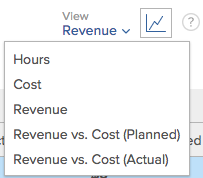
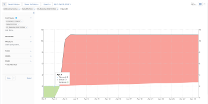

# Affichage des informations sur l’utilisation des ressources

{{highlighted-preview}}

<!--

(NOTE:&nbsp;this is linked to the UI from the Utilization report. ALWAYS keep this information. DO NOT DELETE!!)

-->

Vous pouvez afficher l’utilisation de vos ressources à l’aide du rapport Utilisation .

<!--

(NOTE: Vazgen's response about these hours ie below and he asked us to NOT document them:

It queries Assignments first to get the tasks, issues, projects to display in the view. And then from those gets the hours.

In some cases, like for Planned Hours, it takes them from Assignments

But Budgeted Hours come from projects.

And Actual Hours are their own object - Hour)

-->

<!--

This report displays information about the assignments on work items for projects in your environment, like Planned, Actual, and Budgeted Hours, FTE, or Cost.&nbsp;These are hours,&nbsp;FTE, or costs associated with the assignments and not with the tasks and issues themselves.(PRIVATE NOTE:&nbsp;Vazgen's response about these hours: It queries Assignments first to get the tasks, issues, projects to display in the view. And then from those gets the hours. In some cases, like for Planned Hours, it takes them from Assignments; But Budgeted Hours come from projects. And Actual Hours are their own object - Hour.)

-->

## Exigences d’accès

Pour accéder au rapport Utilisation , vous devez disposer des éléments suivants :

<table style="table-layout:auto"> 
 <col> 
 <col> 
 <tbody> 
  <tr> 
   <td role="rowheader">Formule Adobe Workfront*</td> 
   <td> 
Pro ou version ultérieure
 </td> 
  </tr> 
  <tr> 
   <td role="rowheader">Licence Adobe Workfront*</td> 
   <td> 
Plan 
 </td> 
  </tr> 
  <tr> 
   <td role="rowheader">Paramétrages du niveau d'accès*</td> 
   <td> 
Visualisez ou affichez un accès supérieur aux éléments suivants :
 
    <ul> 
     <li> 
Gestion des ressources 
 </li> 
     <li> 
Projets
 </li> 
     <li> 
Portefeuilles
 </li> 
     <li> 
Programmes
 </li> 
     <li> 
Données financières si vous souhaitez afficher les informations par coût
 </li> 
    </ul> 
<b>NOTE</b>

Si vous n’avez toujours pas accès à , demandez à votre administrateur Workfront s’il définit des restrictions supplémentaires à votre niveau d’accès. Pour plus d’informations sur la façon dont un administrateur Workfront peut modifier votre niveau d’accès, voir <a href="../../administration-and-setup/add-users/configure-and-grant-access/create-modify-access-levels.md" class="MCXref xref">Création ou modification de niveaux d’accès personnalisés</a>.
 </td>
</tr> 
  <tr> 
   <td role="rowheader">Autorisations d’objet</td> 
   <td> 
Afficher l’accès aux projets, portefeuilles et programmes pour accéder à la section Utilisation de la zone Ressource
 
  
 
Gérer l’accès au projet pour accéder à la section Utilisation d’un projet
 
  
 
Pour plus d’informations sur la demande d’accès supplémentaire, voir <a href="../../workfront-basics/grant-and-request-access-to-objects/request-access.md" class="MCXref xref">Demande d’accès aux objets </a>.
 </td> 
  </tr> 
 </tbody> 
</table>

*Pour connaître le plan, le type de licence ou l’accès dont vous disposez, contactez votre administrateur Workfront.

<!--

You must have View access to the projects you want to view utilization information for as described in this section. If you are still unable to access this information, contact your Workfront administrator. (NOTE:&nbsp;replaced with above table)

-->

Les sections suivantes décrivent comment afficher et utiliser les informations d’utilisation.

<!--

<h2>Prerequisites for accessing utilization information</h2>

(NOTE: drafted, replaced with above table)

To access utilization information as described in this section, ensure that the following conditions are met:

<ul>
<li>You have at least&nbsp;View access to the project, program, or portfolio for which you want to view the utilization information.</li>
<li>Your Workfront administrator must grant you at least View access to&nbsp;Financial&nbsp;Data in your Access Level to be able to view cost and revenue information in the Utilization report. The Workfront administrator must enable both View Role Billing & Cost Rates as well as View User Billing &&nbsp;Cost Rates when they grant you the View access to Financial Data. For information about granting access to&nbsp;Financial&nbsp;Data, see <a href="../../administration-and-setup/add-users/configure-and-grant-access/grant-access-financial.md" class="MCXref xref">Grant access to financial data</a>. </li>
<li>

(NOTE:&nbsp;drafted. No longer the case.) 

The Utilization tab is included on any layout template that is assigned to you and that is applied to either the projects you view or to the Reporting area. 

The Utilization section is included on any layout template that is assigned to you and that is applied to either the projects you view or to the Resourcing area. 

</li>
<li>

The Utilization tab is available by default in the Reporting area if the system administrator has not assigned a custom layout template to you. 

The Utilization section is available by default in the Resourcing area if the system administrator has not assigned a custom layout template to you. 

</li>
</ul>

-->

## Présentation du rapport Utilisation {#overview-of-the-utilization-report}

Le rapport Utilisation vous permet de visualiser l’état d’avancement, le coût ou les recettes d’un projet, d’un programme ou d’un portefeuille dans un seul rapport. Vous pouvez également comparer les recettes aux coûts.

Vous pouvez afficher le rapport Utilisation dans la zone Ressource afin d’afficher l’utilisation sur plusieurs projets ou au niveau d’un projet, afin d’afficher l’utilisation pour les ressources individuelles (rôles de tâche et utilisateurs) associées à ce projet.

Pour plus d’informations sur l’accès et l’utilisation du rapport Utilisation, voir [Effectuez le suivi de la progression, du coût et des recettes à l’aide du rapport Utilisation .](#track-progress-cost-and-revenue-with-the-utilization-report) dans cet article.

* [Suivi des heures (progression)](#track-hours-progress)
* [Suivi du coût](#track-cost)
* [Suivi des recettes](#track-revenue)
* [Comparaison des recettes et des coûts prévus et réels](#compare-revenue-against-planned-and-actual-costs)

### Suivi des heures (progression) {#track-hours-progress}

Vous pouvez suivre la progression en comparant les heures prévues et prévues aux heures réelles.

Lors du suivi de la progression d’un projet, d’un programme ou d’un portefeuille, la progression par rapport aux tâches et aux problèmes est incluse dans le rapport Utilisation .

Les informations suivantes sont disponibles dans le rapport Utilisation lors du suivi des heures :

<table style="table-layout:auto"> 
 <col> 
 <col> 
 <thead> 
  <tr> 
   <th><strong>Titre de colonne lors de l’affichage des heures</strong> </th> 
   <th><strong>Fonction</strong> </th> 
  </tr> 
 </thead> 
 <tbody> 
  <tr> 
   <td scope="col"><strong>Heures budgétées</strong> </td> 
   <td scope="col"> 
Le total des heures budgétisées sur les projets inclus. Vous pouvez afficher le total des heures budgétisées pour la durée totale des projets inclus ou afficher le total des heures budgétisées uniquement pour la période spécifiée (vous pouvez spécifier une semaine ou un mois spécifique). 
 
Les heures budgétisées sont renseignées à partir des informations disponibles dans la nouvelle zone Budget des ressources de l’Analyse de cas ou du planificateur de ressources.<em>.</em>
 
Les Heures budgétisées apparaissent dans le rapport Utilisation dans l’une des lignes suivantes :
 
    <ul> 
     <li> Les heures planifiées sont résumées par rôle de tâche et par utilisateur individuel dans le rapport Utilisation , comme suit : <strong>Utilisateur individuel :</strong> Les heures budgétées sont résumées pour chaque utilisateur dans le rapport d’utilisation. Ces heures budgétées sont associées aux tâches et problèmes auxquels l’utilisateur est affecté sur les projets inclus. (Vous pouvez développer la ligne du rôle de tâche correspondant pour afficher la liste des utilisateurs disposant de ce rôle de tâche.) <strong>Rôle de la tâche :</strong> Les heures budgétisées sont résumées par rôle de tâche dans le rapport d’utilisation. Les heures budgétisées apparaissent dans un rôle de tâche particulier en raison de l’un des scénarios suivants : 
     <li>Le rôle de la tâche est défini comme le rôle Principal de la tâche de l’utilisateur affecté à la tâche ou au problème auquel est associé l’option Hours budgétés. </li> 
       <li>Lorsque vous affichez des informations d’utilisation pour un seul projet, le rôle de tâche de l’utilisateur affecté aux heures est utilisé, qu’il n’y ait aucune affectation sur la tâche ou le problème, un autre utilisateur est affecté sans affectation de rôle de tâche, un autre utilisateur est affecté avec un rôle de tâche différent ou une autre équipe est affectée.</li> 
       <li>Lorsque vous affichez des informations d’utilisation pour plusieurs projets, programmes ou portfolios, le rôle de tâche de l’utilisateur affecté aux heures n’est utilisé que lorsque le rôle est affecté à une tâche ou à un problème dans un projet. </li> 
       <li>Le rôle de tâche est attribué à la tâche ou au problème auquel est associé le paramètre "Heures budgétées", et l’utilisateur affecté à la tâche ou au problème n’a pas de rôle de tâche défini dans le système.</li> 
      </ul></li> 
    </ul> 
    <ul> 
     <li> 
<strong>Heures non allouées</strong>: Les heures budgétées s’affichent dans le rapport d’utilisation de la section Heures non allouées lorsque les heures planifiées sont associées à une tâche ou à un problème et qu’aucun utilisateur ou rôle n’est affecté à la tâche ou au problème. Cette section s’affiche uniquement lorsqu’il y a des heures sur le projet qui correspondent à cette description et lors de l’affichage du rapport Utilisation par ou depuis un projet. 
 
Cette section s’affiche uniquement lorsqu’il y a des heures sur le projet qui correspondent à cette description et lors de l’affichage du rapport Utilisation par ou depuis un projet. 
 </li> 
    </ul> 
Pour plus d’informations sur les heures budgétisées, voir la section "Localisation des heures budgétisées d’un projet" dans la section <a href="../../manage-work/projects/project-finances/budgeted-labor-cost.md" class="MCXref xref">Présentation de l’option Coût de la main-d’oeuvre budgétisé et heures budgétisées pour les projets</a> article.
 </td> 
  </tr> 
  <tr> 
   <td scope="col"><strong>Heures prévues</strong> </td> 
   <td scope="col"> <!-- Yay, no errors, warnings, or alerts! -->

Les Heures planifiées sur les projets inclus associés aux affectations pour chaque tâche et chaque problème. Vous pouvez afficher le nombre total d’heures planifiées de toutes les affectations sur le projet pour la durée totale des projets inclus ou afficher le nombre total d’heures planifiées uniquement pour la période spécifiée (vous pouvez spécifier une semaine ou un mois spécifique). 

<strong>CONSEIL </strong>

Les heures planifiées des éléments dont la durée est de 0 ne sont pas prises en compte. 

Les heures planifiées dans le rapport Utilisation tiennent compte du fait que les heures planifiées ont été réaffectées pendant toute la durée d’une tâche ou d’un problème. 

Lorsque l’affectation quotidienne de l’utilisateur pour les heures a été modifiée à l’aide de l’équilibreur de charge de travail, les données du rapport Utilisation peuvent être affectées si les dates sélectionnées dans le rapport Utilisation contiennent seulement une partie de la durée d’une tâche ou d’un problème. 

Pour plus d’informations sur la modification des attributions pour les utilisateurs, voir <a href="../workload-balancer/manage-user-allocations-workload-balancer.md">Gestion des affectations utilisateur dans l’équilibreur de charge de travail</a>.

Les Heures planifiées sont répertoriées dans le rapport Utilisation de l’une des lignes suivantes :

<ul>

<li>Les heures planifiées sont résumées par rôle de tâche et par utilisateur individuel dans le rapport d’utilisation, comme suit : 
<ul>

<li><strong>Utilisateur individuel</strong>: Les heures planifiées sont résumées pour chaque utilisateur dans le rapport d’utilisation. Ces heures planifiées sont associées aux tâches et aux problèmes auxquels l’utilisateur est affecté sur les projets inclus. (Vous pouvez développer la ligne du rôle de tâche correspondant pour afficher la liste des utilisateurs disposant de ce rôle de tâche.)

<li><strong>Rôle de tâche</strong>: Les heures planifiées sont résumées par rôle de tâche dans le rapport d’utilisation d’un seul projet. Les heures planifiées apparaissent dans un rôle de tâche particulier en raison de l’un des scénarios suivants :  
<ul>

<li>Le rôle de tâche est défini comme le rôle de tâche Principal de l’utilisateur affecté à la tâche ou au problème auquel les heures planifiées sont associées.

<li>Lorsque vous affichez les informations d’utilisation d’un seul projet, les heures associées à un rôle de tâche ne s’affichent pas pour le rôle de tâche dans les scénarios suivants :   
<ul>

<li>Il n’y a pas d’affectation sur la tâche ou le problème

<li>Un utilisateur est affecté sans affectation de rôle de tâche

<li>Un utilisateur se voit attribuer un rôle de tâche différent.

<li>Une équipe est affectée à la tâche ou au problème.
</li>   
</ul>

<li>Lorsque vous affichez des informations d’utilisation pour plusieurs projets, programmes ou portfolios, le rôle de tâche de l’utilisateur affecté aux heures n’est utilisé que lorsque le rôle est affecté à une tâche ou à un problème dans un projet. Les heures de rôle de tâche ne s’affichent pas séparément lors de l’affichage du rapport Utilisation de plusieurs projets.

<li>Le rôle de tâche est attribué à la tâche ou au problème associé à Heures planifiées, et l’utilisateur affecté à la tâche ou au problème n’a pas de rôle de tâche défini dans le système.
</li>  
</ul>

<li><strong>Heures non allouées</strong>: Les heures planifiées sont affichées dans le rapport d’utilisation de la section Heures non allouées lorsque les heures planifiées sont associées à une tâche ou à un problème et qu’aucun utilisateur ou rôle n’est affecté à la tâche ou au problème. Cette section s’affiche uniquement lorsqu’il y a des heures sur le projet qui correspondent à cette description et lors de l’affichage du rapport Utilisation d’un seul projet.  Pour plus d’informations sur les heures planifiées, voir <a href="../../manage-work/tasks/task-information/planned-hours.md">Présentation des heures planifiées</a>.
</li> 
</ul>
</li> 
</ul> </td> 
  </tr> 
  <tr> 
   <td><strong>Heures effectives</strong> </td> 
   <td> 
 le nombre total d’heures de connexion aux tâches, problèmes, et sur le projet pour les projets inclus. Vous pouvez afficher le nombre total d’heures réelles pour la durée totale des projets inclus ou afficher le nombre total d’heures réelles uniquement pour la période spécifiée (vous pouvez spécifier une semaine ou un mois spécifique). 
 
Avertissement : Le rapport d’utilisation comprend les heures consignées dans le projet, les tâches enfants, les problèmes et les tâches parentes ayant au moins une affectation. Elle n’inclut pas les heures consignées dans les tâches parents sans affectation. Nous vous recommandons de ne pas utiliser de tâches parents comme tâches de travail et d’affecter uniquement des tâches enfants à vos ressources. 
 
Les heures réelles apparaissent sur le rapport d’utilisation dans l’une des lignes suivantes :
 
    <ul> 
     <li> Les heures réelles sont résumées par rôle de tâche et par utilisateur individuel dans le rapport d’utilisation d’un projet, comme suit : <strong>Utilisateur individuel :</strong> Les heures réelles s’affichent dans le rapport d’utilisation de la ligne de l’utilisateur qui a consigné les heures. (Vous pouvez développer la ligne du rôle de tâche correspondant pour afficher la liste des utilisateurs disposant de ce rôle de tâche ayant des heures enregistrées.) <strong>Rôle de la tâche :</strong> Les heures réelles consignées par les utilisateurs associés à ces rôles sont résumées dans le rapport d’utilisation de la ligne du rôle de tâche correspondant. Les heures réelles apparaissent dans un rôle de tâche particulier en raison de l’un des scénarios suivants : 
      <ul> 
       <li>Le rôle de tâche est défini comme le rôle de tâche Principal de l’utilisateur qui a consigné les heures.</li> 
       <li>Il n’y a pas d’affectation sur la tâche ou le problème</li> 
       <li>Un autre utilisateur est affecté sans affectation de rôle de tâche</li> 
       <li>Un autre utilisateur se voit attribuer un rôle de tâche différent.</li> 
       <li> 
Une équipe est affectée.
 </li> 
      </ul></li>  
     
Si l’utilisateur qui consigne les heures n’a pas de rôle de tâche associé à son profil, le rôle de tâche utilisé pour le rapport Utilisation est le rôle de tâche affecté à la tâche ou au problème où les heures sont enregistrées ou le rôle de tâche associé au propriétaire Principal de la tâche ou du problème. 
 
     <li><strong>Autres heures :</strong> Les heures réelles s’affichent dans le rapport d’utilisation de la section Autres heures , dans la ligne de l’utilisateur qui s’est connecté aux heures. Les heures apparaissent dans cette section lorsque l’utilisateur qui a consigné les heures n’a pas de rôle de tâche défini dans le système. Cette section s’affiche uniquement lorsqu’il y a des heures sur le projet qui correspondent à cette description. </li> 
    </ul> </td> 
  </tr> 
  <tr> 
   <td><strong>Écart budgétaire (pour les heures)</strong> </td> 
   <td> 
Le total des heures budgétées moins le total des heures réelles sur les projets inclus. Vous pouvez afficher la variance budgétaire totale pour la durée totale des projets inclus ou vous pouvez afficher la variance budgétaire totale uniquement pour la période spécifiée (vous pouvez spécifier une semaine ou un mois spécifique). 
 
Si la valeur est positive, elle s’affiche en vert. Cela indique que le total des heures budgétisées est supérieur aux heures réelles.
 
Si la valeur est négative, elle est affichée en rouge. Cela indique que le total des heures budgétisées est inférieur aux heures réelles.
 
  
 </td> 
  </tr> 
  <tr> 
   <td><strong>Variance planifiée (pour les heures)</strong> </td> 
   <td> 
Le total des heures planifiées moins le total des heures réelles sur les projets inclus. Vous pouvez afficher la variance totale planifiée pour la durée totale des projets inclus ou vous pouvez afficher la variance totale planifiée uniquement pour la période spécifiée (vous pouvez spécifier une semaine ou un mois spécifique).
 
Si la valeur est positive, elle s’affiche en vert. Cela indique que le total des heures planifiées est supérieur aux heures réelles.
 
Si la valeur est négative, elle est affichée en rouge. Cela indique que le total des heures planifiées est inférieur aux heures réelles.
 </td> 
  </tr> 
 </tbody> 
</table>

### Suivi du coût {#track-cost}

Vous pouvez effectuer un suivi des coûts en comparant le coût budgété et le coût planifié aux coûts réels.

Lors du suivi du coût d’un projet, d’un programme ou d’un portefeuille, les informations du rapport d’utilisation proviennent des tâches. Les informations de coût des tâches sont toujours disponibles dans le rapport Utilisation . Le coût des tâches est calculé en fonction du type de coût de la tâche. Pour plus d’informations sur le type de coût des tâches, voir &quot;Modifier les types de coûts pour des tâches individuelles&quot; dans [Suivi des coûts](../../manage-work/projects/project-finances/track-costs.md).

Vous pouvez afficher les informations de coût dans le rapport Utilisation de la façon suivante :

* Pour une semaine ou un mois donné, ou pour l’ensemble du projet, du programme ou du portefeuille.
* Par rôle ou par individu, pour les projets.

La devise utilisée sur le rapport d’utilisation est déterminée par la devise définie sur le projet. Pour plus d’informations sur l’ajustement de la devise d’un projet, voir [Modification de la devise du projet](../../manage-work/projects/project-finances/change-project-currency.md).

Les informations suivantes sont disponibles dans le rapport Utilisation lors du suivi des coûts :

<table style="table-layout:auto"> 
 <col> 
 <col> 
 <thead> 
  <tr> 
   <th><strong>Titre de colonne lors de l’affichage du coût</strong> </th> 
   <th> 
<strong>Fonction</strong> 
 </th> 
  </tr> 
 </thead> 
 <tbody> 
  <tr> 
   <td scope="col"><strong>Coût budgété</strong> </td> 
   <td scope="col"> 
Coût budgété des projets inclus. Vous pouvez afficher le coût total budgété pour la durée totale des projets inclus ou afficher le coût total budgété uniquement pour la période spécifiée (vous pouvez spécifier une semaine ou un mois spécifique).
 
Comme le rapport Coût budgétaire dans l’utilisation est axé sur le coût par rôle, le calcul est le même que le coût de la main-d’oeuvre budgété dans d’autres zones de Workfront. Pour plus d’informations sur le mode de calcul du coût de la main-d’oeuvre budgétisée, voir <a href="../../manage-work/projects/project-finances/budgeted-labor-cost.md" class="MCXref xref">Présentation de l’option Coût de la main-d’oeuvre budgétisé et heures budgétisées pour les projets</a>.
 </td> 
  </tr> 
  <tr> 
   <td scope="col"><strong>Coûts prévus</strong> </td> 
   <td scope="col"> 
Coût planifié total sur les projets inclus. Vous pouvez afficher le coût planifié total pour la durée totale des projets inclus ou afficher le coût planifié total uniquement pour la période spécifiée (vous pouvez spécifier une semaine ou un mois spécifique).
 
Notez que pour les vues hebdomadaires, mensuelles et trimestrielles, les coûts prévus sont calculés en moyenne par rapport à la période choisie lorsque les taux de coût des rôles de travail ou des utilisateurs sont à la date d'entrée en vigueur.

Pour plus d’informations sur le mode de calcul du coût planifié du projet, voir la section "Comment Workfront calcule les coûts planifiés, budgétaires et réels" de l’article. <a href="../../manage-work/projects/project-finances/track-costs.md" class="MCXref xref">Suivi des coûts</a>.
 </td> 
  </tr> 
  <tr> 
   <td scope="col"><strong>Coûts réels</strong> </td> 
   <td scope="col"> 
Coût réel total sur les projets inclus. Vous pouvez afficher le coût réel total pour la durée totale des projets inclus ou afficher le coût réel total uniquement pour la période spécifiée (vous pouvez spécifier une semaine ou un mois spécifique).
 
Pour plus d’informations sur le mode de calcul du coût réel du projet, voir la section "Comment Workfront calcule les coûts planifiés, budgétaires et réels" de l’article. <a href="../../manage-work/projects/project-finances/track-costs.md" class="MCXref xref">Suivi des coûts</a>.
 </td> 
  </tr> 
  <tr> 
   <td><strong>Écart budgétaire (pour le coût)</strong> </td> 
   <td scope="col"> 
Le coût total budgété moins le coût réel total sur les projets inclus. Vous pouvez afficher la variance budgétaire totale pour la durée totale des projets inclus ou vous pouvez afficher la variance budgétaire totale uniquement pour la période spécifiée (vous pouvez spécifier une semaine ou un mois spécifique).
 
Si la valeur est positive, elle s’affiche en vert. Cela indique que le coût total budgété est supérieur au coût réel.
 
Si la valeur est négative, elle est affichée en rouge. Cela indique que le coût budgétaire total est inférieur au coût réel.
 </td> 
  </tr> 
  <tr> 
   <td><strong>Variance planifiée (pour le coût)</strong> </td> 
   <td> 
Coût planifié total moins le coût réel total sur les projets inclus. Vous pouvez afficher la variance totale planifiée pour la durée totale des projets inclus ou vous pouvez afficher la variance totale planifiée uniquement pour la période spécifiée (vous pouvez spécifier une semaine ou un mois spécifique). 
 
Si la valeur est positive, elle s’affiche en vert. Cela indique que le coût prévisionnel total est supérieur au coût réel.
 
Si la valeur est négative, elle est affichée en rouge. Cela indique que le coût prévisionnel total est inférieur au coût réel.
 </td> 
  </tr> 
 </tbody> 
</table>

### Suivi des recettes {#track-revenue}

Vous pouvez effectuer un suivi sur les recettes en comparant les recettes prévues et prévues aux recettes réelles.

Lors du suivi des recettes d’un projet, d’un programme ou d’un portefeuille, seules les recettes provenant de tâches sont incluses dans le rapport Utilisation .

Les informations contenues dans le tableau suivant sont disponibles dans le rapport Utilisation lors du suivi des recettes.

Pour plus d’informations sur les champs spécifiques et sur la façon dont Workfront les calcule, reportez-vous également aux articles suivants :

* [Suivi des coûts](../../manage-work/projects/project-finances/track-costs.md)
* [Présentation de la facturation et des recettes](../../manage-work/projects/project-finances/billing-and-revenue-overview.md)

<table style="table-layout:auto"> 
 <col> 
 <col> 
 <thead> 
  <tr> 
   <th><strong>Titre de colonne lors de l’affichage des recettes</strong> </th> 
   <th> <strong>Fonction</strong></th> 
  </tr> 
 </thead> 
 <tbody> 
  <tr> 
   <td scope="col"><strong>Revenu budgété</strong> </td> 
   <td scope="col"> 
Nombre total d’heures budgétisées multiplié par le Taux de facturation des rôles sur les projets inclus. Vous pouvez afficher le total des recettes budgétisées pour la durée totale des projets inclus ou afficher le total des recettes budgétisées uniquement pour la période spécifiée (vous pouvez spécifier une semaine ou un mois spécifique).
 </td> 
  </tr> 
  <tr> 
   <td scope="col"><strong>Revenus prévus</strong> </td> 
   <td scope="col"> 
Recettes planifiées dans le rapport Utilisation est le chiffre d’affaires associé aux Heures planifiées allouées aux ressources affectées aux tâches du projet.
 
Workfront calcule le projet Recettes prévues pour le rapport Utilisation à l’aide de la formule suivante :
 
<code>Project Planned Revenue = SUM&nbsp;(All Tasks Planned Revenue)</code> 
 
   
<b>NOTE</b>
   
Le chiffre d’affaires prévu du projet qui s’affiche dans le rapport Utilisation diffère du chiffre d’affaires prévu qui s’affiche dans la zone Détails du projet et les rapports sur le projet. 
 
La zone Recettes planifiées dans les détails du projet reflète les recettes de la tâche ainsi que les recettes fixes du projet. Le rapport Recettes planifiées du rapport Utilisation affiche les recettes planifiées associées uniquement aux tâches du projet. 
 
     
Example: </b>">  
      
Si le projet comporte une tâche de 10 heures, affectée à un consultant avec un taux horaire de 20 $ et que le projet a un chiffre d’affaires fixe de 100 $, le rapport Utilisation affiche 200 $ pour les recettes planifiées (le chiffre d’affaires planifié associé aux heures de la tâche). La section Détails du projet affiche 300 $ (les recettes planifiées de la tâche et les recettes fixes du projet). 
 
     
 
Pour plus d’informations sur la tâche et le projet Recettes prévues en dehors du rapport Utilisation, voir <a href="../../manage-work/projects/project-finances/billing-and-revenue-overview.md" class="MCXref xref">Présentation de la facturation et des recettes</a>.
 
 
Le mode de calcul et d’affichage du rapport Utilisation des recettes pour les projets inclus prend en compte le type de recettes défini sur la tâche. 
 
Selon le type de recette de chaque tâche du projet, les scénarios suivants existent : 
 
<strong>Recettes fixes :</strong> Quelles que soient les affectations de tâche, les recettes de la tâche sont toujours calculées à l’aide du montant fixe spécifié pour la tâche.
 
<b>IMPORTANT</b>

Contrairement à d’autres zones de Workfront, le rapport Utilisation calcule les recettes planifiées pour les tâches de recettes fixes en divisant les recettes fixes de manière égale par le nombre d’heures planifiées de la tâche. 
 
Par exemple, une tâche a une recette de 200 $. Si la tâche comporte 4 heures planifiées, chaque heure correspond à 50 $. Il est distribué au niveau de l’utilisateur et au niveau du rôle. Cette distribution est propre au rapport Utilisation .
 
<b>NOTE</b>

Si vous avez une tâche Recettes fixes et qu’il n’y a pas d’Heures planifiées pour la tâche, le chiffre d’affaires ne s’affiche pas dans le rapport d’utilisation, car il n’existe aucun moyen de la répartir sur les heures. Si vous avez planifié des heures sur des tâches avec des recettes fixes et pas d’affectations, les recettes s’affichent sous la forme de recettes non affectées. 
 
<strong>Horaire du rôle :</strong> Le chiffre d’affaires de la tâche est calculé à l’aide du taux de facturation défini pour un rôle spécifique, multiplié par le nombre d’ Heures planifiées associées à ce rôle. Workfront utilise la formule suivante :
 
<code>Rôle Heure Recettes prévues = SUM(Heures planifiées à partir du rôle sur toutes les tâches) * Taux de facturation des rôles</code>

<b>REMARQUE :</b> Le taux de facturation horaire dans la formule prend en compte toute modification du taux en vigueur à la date.
   
<strong>Heure de l’utilisateur :</strong> Les recettes de la tâche sont calculées à l’aide du taux de facturation défini pour un utilisateur spécifique, multiplié par le nombre d’heures planifiées associées à cet utilisateur. Workfront utilise la formule suivante :
 
<code>Heure de l’utilisateur Recettes prévues = SUM(Heures planifiées des utilisateurs pour toutes les tâches) * Taux de facturation des utilisateurs</code> 
 
<b>REMARQUE :</b> Le taux de facturation horaire dans la formule prend en compte toute modification du taux en vigueur à la date.
 
<b>Heure du rôle ou Heure de l’utilisateur plus fixe</b> 
 
<b>IMPORTANT</b>

Contrairement à d’autres zones de Workfront, le rapport Utilisation calcule les Recettes planifiées en divisant les Recettes fixes uniformément par le nombre d’Heures planifiées de la tâche. 
 
Les cas suivants existent : 

<ul>
<li> 
<strong>Rôle Horaire Plus Corrigé :</strong> Le chiffre d’affaires de la tâche est calculé à l’aide du taux de facturation défini pour un rôle spécifique, multiplié par le nombre d’ Heures planifiées associées au rôle. En outre, un montant fixe spécifié sur la tâche est ajouté au taux de rôle. Workfront utilise la formule suivante :
 
<code>Rôle Horaire Plus Recettes Planifiées Fixes = [SUM(Heures planifiées à partir du rôle sur toutes les tâches) * Taux de facturation des rôles] + SUM(limitation ou montant fixe de la tâche/Heures planifiées de la tâche)</code> 
 </li>
</ul>
<ul>
<li> 
<strong>L’Utilisateur Par Heure Plus Fixe :</strong> Taux de facturation défini pour un utilisateur spécifique, multiplié par le nombre d’heures planifiées de la tâche par cet utilisateur. En outre, un montant fixe spécifié dans la tâche est ajouté au taux d’utilisation. Workfront utilise la formule suivante :
 
<code>Heure de l’utilisateur plus recettes planifiées fixes = [SUM(Heures planifiées de l’utilisateur pour toutes les tâches) * Taux de facturation des utilisateurs] + SUM(limitation ou montant fixe de la tâche/Heures planifiées de la tâche)</code> 
 </li>
</ul> 
<b>Rôle ou heure de l’utilisateur avec limite</b> 
 
<b>IMPORTANT</b>

Contrairement à d’autres zones de Workfront, si les recettes prévues dépassent le plafond, le montant sur le montant du plafond est considéré comme des recettes fixes. Les recettes planifiées sont calculées en divisant les recettes fixes uniformément par le nombre d’heures planifiées sur la tâche, puis en y ajoutant le montant du plafond et les recettes horaires du rôle ou de l’utilisateur.  
 
Les cas suivants existent : 

<ul>
<li> 
<strong>Horaire du rôle avec limitation :</strong> Les tâches sont facturées toutes les heures comme dans l’option Heure du rôle, mais vous pouvez spécifier un montant de limite maximal. Workfront utilise la formule suivante :
 
<code>Heure du rôle avec recettes prévues plafonnées = [SUM(Heures planifiées à partir du rôle sur toutes les tâches et tous les problèmes) * Taux de facturation des rôles] + Montant maximum de la tâche + SUM(Montant sur le montant maximum / Heures planifiées de la tâche)</code> 
 </li>
</ul>
<ul>
<li> 
<strong>Heure de l’utilisateur avec cascade :</strong> Les tâches sont facturées toutes les heures comme dans l’option Heure de l’utilisateur, mais vous pouvez spécifier un montant de limite maximal. Workfront utilise la formule suivante : 
 
<code>Heure de l’utilisateur avec recettes prévues plafonnées = [SUM(Heures planifiées de l’utilisateur pour toutes les tâches) * Taux de facturation des utilisateurs] + Montant maximum de la tâche + SUM(Montant sur le montant maximum / Heures planifiées de la tâche)</code> 
 </li>
</ul> 
Pour plus d’informations sur le rôle ou l’utilisateur pris en compte lors du calcul des recettes planifiées, voir <a href="../../manage-work/projects/project-finances/billing-and-revenue-overview.md" class="MCXref xref">Présentation de la facturation et des recettes</a>.
 </td>
</tr> 
  <tr> 
   <td><strong>Revenu réel</strong> </td> 
   <td> 
Recettes réelles est le chiffre d’affaires associé aux Heures réelles des tâches. et du projet. Pour plus d’informations sur les recettes réelles, reportez-vous à la section "Suivi des montants de recettes" dans l’article . <a href="../../manage-work/projects/project-finances/billing-and-revenue-overview.md" class="MCXref xref">Présentation de la facturation et des recettes</a>.

La manière dont le rapport Utilisation calcule les recettes réelles pour les projets inclus varie en fonction du type de recettes défini sur la tâche, comme suit :
 
<strong>Recettes fixes :</strong> Quelles que soient les affectations de tâche, les recettes de la tâche sont toujours calculées à l’aide du montant fixe spécifié pour la tâche.
 
<b>IMPORTANT</b>

Contrairement à d’autres zones de Workfront, le rapport Utilisation calcule les Recettes réelles en divisant les Recettes fixes uniformément par le nombre d’heures consignées dans la tâche. 
 
 
 
Par exemple, une tâche a une recette réelle de 200 $. Si la tâche comporte 4 heures réelles, chaque heure est de 50 $. Il est distribué au niveau de l’utilisateur et au niveau du rôle. Cette distribution est propre au rapport Utilisation .
 
<b>NOTE</b>

Si vous avez une tâche Recettes fixes et qu’il n’y a pas d’Heures réelles sur la tâche, le chiffre d’affaires réel ne s’affiche pas dans le rapport Utilisation, car il n’existe aucun moyen de répartir les heures. 
 
<strong>Horaire du rôle :</strong> Les recettes de la tâche sont calculées à l’aide du taux de facturation défini pour un rôle spécifique, multiplié par le nombre d’Heures réelles.
 
Workfront utilise la formule suivante :
 
<code>Rôle Heure Recettes réelles = SUM(Heures réelles à partir du rôle sur toutes les tâches) * Taux de facturation des rôles</code> 
 
<b>REMARQUE :</b> Le taux de facturation horaire dans la formule prend en compte toute modification du taux en vigueur à la date.
 
<strong>Heure de l’utilisateur :</strong> Les recettes de la tâche sont calculées à l’aide du taux de facturation défini pour un utilisateur spécifique, multiplié par le nombre d’heures enregistrées par rapport à la tâche de cet utilisateur. Workfront utilise la formule suivante :
 
<code>Heure de l’utilisateur Recettes réelles = SUM(Heures réelles de l’utilisateur pour toutes les tâches) * Taux de facturation utilisateur</code>
 
<b>REMARQUE :</b> Le taux de facturation horaire dans la formule prend en compte toute modification du taux en vigueur à la date.
 
<b>Rôle ou heure de l’utilisateur plus fixe</b> 
 
<b>IMPORTANT</b>

Contrairement à d’autres zones de Workfront, le rapport Utilisation calcule les Recettes réelles en divisant les Recettes fixes uniformément par le nombre d’heures consignées dans la tâche. 
 
Les cas suivants existent : 

<ul>
<li> 
<strong>Rôle Horaire Plus Corrigé :</strong> Taux de facturation défini pour un rôle spécifique, multiplié par le nombre d’heures enregistrées par rapport à la tâche par un utilisateur disposant de ce rôle. En outre, un montant fixe spécifié sur la tâche est ajouté au taux de rôle. 
 
Workfront utilise la formule suivante :
 
<code>Rôle Horaire Plus Recettes Réelles Fixes = [SUM(Heures réelles à partir du rôle sur toutes les tâches) * Taux de facturation des rôles] + SUM(limitation ou montant fixe de la tâche/Heures réelles de la tâche)</code> 
 </li>
</ul>
<ul>
<li> 
<strong>L’Utilisateur Par Heure Plus Fixe :</strong> Taux de facturation défini pour un utilisateur spécifique, multiplié par le nombre d’heures enregistrées par rapport à la tâche de cet utilisateur. En outre, un montant fixe spécifié dans la tâche est ajouté au taux d’utilisation. 
 
Workfront utilise la formule suivante :
 
<code>Heure de l’utilisateur plus Recettes réelles fixes = [SUM(Heures réelles à partir du rôle sur toutes les tâches) * Taux de facturation utilisateur] + SUM(limitation ou montant fixe de la tâche/heures utilisateur de la tâche)</code> 
 </li>
</ul> 
<b>Rôle ou heure de l’utilisateur avec limite</b> 
 
<b>IMPORTANT</b>

Contrairement à d’autres zones de Workfront, si les recettes prévues dépassent le plafond, le montant sur le montant du plafond est considéré comme des recettes fixes. Les recettes planifiées sont calculées en divisant les recettes fixes uniformément par le nombre d’heures planifiées sur la tâche, puis en y ajoutant le montant du plafond et les recettes horaires du rôle ou de l’utilisateur.  
 
Les scénarios suivants existent :

<ul>
<li> 
<strong>Horaire du rôle avec limitation :</strong> Les tâches sont facturées toutes les heures comme dans l’option Heure du rôle, mais vous pouvez spécifier un montant de limite maximal. Workfront utilise la formule suivante :
 
<code>Heure du rôle avec recettes réelles max. = [SUM(Heures réelles à partir du rôle sur toutes les tâches et tous les problèmes) * Taux de facturation des rôles] + Montant maximum de la tâche + SUM(Montant sur le montant maximum / Heures réelles de la tâche)</code>
 </li>
</ul>
<ul>
<li> 
<strong>Heure de l’utilisateur avec cascade :</strong> Les tâches sont facturées toutes les heures comme dans l’option Heure de l’utilisateur, mais vous pouvez spécifier un montant de limite maximal.
 
 Workfront utilise la formule suivante :
 
<code>Heure de l’utilisateur avec recettes réelles max = [SUM(Heures réelles à partir du rôle sur toutes les tâches et tous les problèmes) * Taux de facturation utilisateur] + Montant maximum de la tâche + SUM(Montant sur le montant maximum / Heures réelles de la tâche)</code> 
 </li>
</ul>

<strong>Recettes du projet</strong>: Le chiffre d’affaires associé aux heures enregistrées dans le projet est calculé en tenant compte du montant Facturation par heure du rôle de tâche Principal de l’utilisateur qui consigne l’heure. Nous vous déconseillons de vous connecter au projet. 

<b>NOTE</b>

Si l’utilisateur n’est pas associé à un rôle de tâche ou si la Facturation par heure du rôle Principal est égale à zéro, Workfront calcule les Recettes réelles à l’aide du montant de la Facturation par heure pour l’utilisateur. Si le profil de l’utilisateur ne comporte pas de montant Facturation par heure, le chiffre d’affaires réel est nul. 

 </td>
</tr> 
  <tr> 
   <td><strong>Écart budgétaire (pour les recettes)</strong> </td> 
   <td> 
Total des recettes réelles moins les recettes budgétaires sur les projets inclus. Vous pouvez afficher la variance budgétaire totale pour la durée totale des projets inclus ou vous pouvez afficher la variance budgétaire totale uniquement pour la période spécifiée (vous pouvez spécifier une semaine ou un mois spécifique).
 
Si la valeur est positive, elle s’affiche en vert. Cela indique que le total des recettes budgétaires est supérieur aux recettes réelles.
 
Si la valeur est négative, elle est affichée en rouge. Cela indique que le total des recettes budgétaires est inférieur aux recettes réelles.
 </td> 
  </tr> 
  <tr> 
   <td><strong>Variance planifiée (pour les recettes)</strong> </td> 
   <td> 
Total des recettes réelles moins le total des recettes prévues sur les projets inclus. Vous pouvez afficher la variance totale planifiée pour la durée totale des projets inclus ou vous pouvez afficher la variance totale planifiée uniquement pour la période spécifiée (vous pouvez spécifier une semaine ou un mois spécifique). 
 
Si la valeur est positive, elle s’affiche en vert. Cela indique que le total des recettes planifiées est supérieur aux recettes réelles.
 
Si la valeur est négative, elle est affichée en rouge. Cela indique que le total des recettes planifiées est inférieur aux recettes réelles.
 </td> 
  </tr> 
 </tbody> 
</table>

<!--Note from the table about Actual revenue: 
     
Actual Revenue is displayed in the Utilization report only after the task is marked as Complete or Done (or a status that equates with Complete).

    -->

<!--More notes from the table: 
     
(NOTE:&nbsp;the note below is duplicated in this article: /Content/Manage work/Projects/Project Finances/billing-and-revenue-overview.html and in the glossary)

   -->

### Comparaison des recettes et des coûts prévus et réels {#compare-revenue-against-planned-and-actual-costs}

Vous pouvez afficher le Coût planifié ou réel à côté du Chiffre d&#39;affaires planifié. La marge (%) est également affichée (la marge est calculée en tant que Recettes - Coût / Recettes).

Les informations suivantes sont disponibles dans le rapport Utilisation lors de la comparaison des recettes par rapport aux coûts prévus et réels :

<table style="table-layout:auto"> 
 <col> 
 <col> 
 <thead> 
  <tr> 
   <th><strong>Titre de colonne lors de l’affichage des recettes par rapport au coût (planifié)</strong> </th> 
   <th> <strong>Fonction</strong></th> 
  </tr> 
 </thead> 
 <tbody> 
  <tr> 
   <td scope="col"><strong>Coûts prévus</strong> </td> 
   <td scope="col"> Coût planifié total sur les projets inclus. Vous pouvez afficher le coût planifié total pour la durée totale des projets inclus ou afficher le coût planifié total uniquement pour la période spécifiée (vous pouvez spécifier une semaine ou un mois spécifique). </td> 
  </tr> 
  <tr> 
   <td scope="col"><strong>Revenus prévus</strong> </td> 
   <td scope="col"> 
Recettes planifiées correspond aux recettes associées aux Heures planifiées des tâches. 
 
Le mode de calcul et d’affichage du rapport d’utilisation des recettes pour les projets inclus varie en fonction du type de recettes défini sur la tâche, comme décrit dans la section <a href="#track-revenue" class="MCXref xref">Suivi des recettes</a> dans cet article.
 </td> 
  </tr> 
  <tr> 
   <td scope="col"><strong>Marge</strong> </td> 
   <td scope="col"> 
Le pourcentage de marge est calculé comme suit :
 
<code>Planned Revenue - Planned Cost / Planned Revenue * 100. </code>
 
<b>NOTE</b>

Si le chiffre d’affaires planifié est égal à 0, la marge s’affiche comme 0. 
 </td>
</tr> 
  <tr> 
   <td scope="col"> 
<strong>Titre de colonne lors de l’affichage des recettes par rapport au coût (réel)</strong> 
  </td> 
   <td scope="col">
<strong>Fonction</strong>
</td> 
  </tr> 
  <tr> 
   <td scope="col"><strong>Coûts réels</strong> </td> 
   <td scope="col"> 
Coût réel total sur les projets inclus. Vous pouvez afficher le coût réel total pour la durée totale des projets inclus ou afficher le coût réel total uniquement pour la période spécifiée (vous pouvez spécifier une semaine ou un mois spécifique).
 </td> 
  </tr> 
  <tr> 
   <td scope="col"><strong>Revenu réel</strong> </td> 
   <td> 
Recettes réelles est le chiffre d’affaires associé aux Heures réelles des tâches.
 
Les Recettes réelles ne s’affichent dans le rapport Utilisation qu’une fois la tâche marquée comme Terminée ou Terminée (ou dont l’état est Terminé).
 
La manière dont le rapport Utilisation calcule les recettes réelles pour les projets inclus varie en fonction du type de recettes défini sur la tâche, comme décrit dans la section <a href="#track-revenue" class="MCXref xref">Suivi des recettes</a> dans cet article. 
 </td> 
  </tr> 
  <tr> 
   <td scope="col"><strong>Marge</strong> </td> 
   <td> 
Le pourcentage de marge est calculé comme suit :
 
Recettes réelles - Coût réel / Recettes réelles * 100. 
 
<b>NOTE</b>

Si Recettes réelles est égal à 0, Marge s’affiche comme 0. 
 </td>
</tr> 
 </tbody> 
</table>

<!--Note from the table from above "Function" header in the middle of the table; right after the "Planned Revenue"/"Margin" definition: 
     
(NOTE: This needs to be either split in two tables of formatted differently)

    -->

## Effectuez le suivi de la progression, du coût et des recettes à l’aide du rapport Utilisation . {#track-progress-cost-and-revenue-with-the-utilization-report}

Vous pouvez suivre l’avancement ou le coût d’un projet, d’un programme ou d’un portfolio.

Vous pouvez afficher des informations sur le rapport Utilisation pour une semaine ou un mois spécifique, ou sur la durée de vie globale des projets.

Pour suivre l’avancement ou le coût d’un ou plusieurs projets avec un rapport d’utilisation :

1. Effectuez l’une des opérations suivantes, selon que vous consultez les informations d’utilisation d’un projet individuel, de plusieurs projets, d’un programme ou d’un portfolio :

   * Pour afficher les informations d’utilisation d’un seul projet :

      1. Accédez à un projet pour lequel vous souhaitez afficher les informations d’utilisation, puis cliquez sur **Afficher plus> Utilisation**.
      1. Les informations d’utilisation s’affichent automatiquement lors de l’affichage d’un projet individuel et l’application d’un filtre n’est pas obligatoire.\
         Si vous souhaitez filtrer le rapport Utilisation , vous pouvez appliquer un filtre, puis cliquer sur **Exécuter**.\
         Pour plus d’informations sur le filtrage du rapport Utilisation, voir la section [Informations sur l’utilisation des filtres](#filter-utilization-information) dans cet article.\
         Les informations d’utilisation s’affichent pour les utilisateurs et les rôles individuels (les utilisateurs sont regroupés au sein de leur rôle associé).

   * Pour afficher les informations d’utilisation de plusieurs projets :

      1. Cliquez sur le bouton **Menu Principal** icon  dans le coin supérieur droit de Workfront, puis cliquez sur **Ressource**, puis **Utilisation** dans le panneau de gauche.
      1. Appliquez un filtre sur le rapport Utilisation, puis cliquez sur **Exécuter**.\
         Vous devez spécifier un ou plusieurs projets dans le filtre avant d’exécuter le rapport Utilisation . Pour plus d’informations sur le filtrage du rapport Utilisation, voir la section [Informations sur l’utilisation des filtres](#filter-utilization-information) dans cet article.\
         Les informations d’utilisation s’affichent pour les rôles et les projets individuels (les rôles sont regroupés dans leur projet associé).

   * Pour afficher les informations d’utilisation d’un programme :

      1. Cliquez sur le bouton **Menu Principal** icon  dans le coin supérieur droit de Workfront, puis cliquez sur **Ressource**, puis **Utilisation** dans le panneau de gauche, puis cliquez sur l’icône **Afficher**>**Programmes**.
      1. Appliquez un filtre sur le rapport Utilisation, puis cliquez sur **Exécuter**.\
         Vous devez spécifier un ou plusieurs programmes dans le filtre avant d’exécuter le rapport Utilisation . Pour plus d’informations sur le filtrage du rapport Utilisation, voir la section [Informations sur l’utilisation des filtres](#filter-utilization-information) dans cet article.\
         Les informations d’utilisation s’affichent pour les projets et programmes individuels (les projets sont regroupés dans le programme associé).

   * Pour afficher les informations d’utilisation d’un portfolio :

      1. Cliquez sur le bouton **Menu Principal** icon  dans le coin supérieur droit de Workfront, puis cliquez sur **Ressource**, puis **Utilisation** dans le panneau de gauche, puis cliquez sur **Afficher**>**Portfolios**.
      1. Appliquez un filtre sur le rapport Utilisation, puis cliquez sur **Exécuter**.\
         Vous devez spécifier un ou plusieurs portfolios dans le filtre avant d’exécuter le rapport d’utilisation. Pour plus d’informations sur le filtrage du rapport Utilisation, voir la section [Informations sur l’utilisation des filtres](#filter-utilization-information) dans cet article.\
         Les informations d’utilisation s’affichent pour les projets, programmes et portfolios individuels (les projets sont regroupés au sein de leur programme associé et les programmes sont regroupés au sein de leur portefeuille associé).

1. Dans le coin supérieur droit du rapport Utilisation, cliquez sur le bouton **Affichage** , puis sélectionnez l’une des options suivantes :

   * **Coûts**
   * **Heures**
   * **Revenus**
   * **Comparatif revenus/coûts (prévus)**
   * **Recettes par rapport au coût (réel)**.

   L’option sélectionnée détermine les colonnes et les informations disponibles dans le rapport. Pour plus d’informations sur les informations disponibles dans chaque colonne, consultez le tableau de l’étape 5.\
   

1. (Facultatif) Sélectionnez la période pour laquelle les informations d’utilisation s’affichent. Vous pouvez afficher les informations d’une semaine ou d’un mois spécifique à gauche de la **Général** colonne . Les informations relatives au projet, au programme ou au portfolio global sont toujours affichées dans la variable **Général** colonne .\
   Pour plus d’informations, voir la section [Ajuster la période pour laquelle les informations sont affichées](#adjust-the-date-range-for-which-information-is-displayed) dans cet article.

1. (Facultatif) Cliquez sur le titre d’une colonne pour trier le rapport d’utilisation en fonction des informations qu’elle contient. Le tri ne fonctionne que lorsque vous incluez plusieurs éléments dans votre rapport. Vous pouvez, par exemple, trier les résultats de votre rapport lorsque vous observez plusieurs projets (ou portefeuilles ou programmes). Vous ne pouvez pas trier les résultats lorsque vous ne vous intéressez qu’à un seul projet (ou à un seul portfolio ou programme) à la fois.
1. Utiliser les informations de la section [Présentation du rapport Utilisation](#overview-of-the-utilization-report) dans cet article pour en savoir plus sur chaque colonne du rapport Utilisation .

## Informations sur l’utilisation des filtres {#filter-utilization-information}

Vous pouvez filtrer le contenu affiché dans un rapport d’utilisation sur un projet. Vous pouvez filtrer les tâches, les problèmes, les rôles et les données personnalisées. Lorsque vous appliquez un filtre sur le rapport Utilisation , ce dernier contient des informations en fonction des critères que vous sélectionnez.

Vous pouvez créer un filtre ou en appliquer un que vous avez déjà créé.

* [Créer ou modifier un filtre](#create-or-modify-a-filter)
* [Appliquer un filtre enregistré](#apply-a-saved-filter)
* [Dupliquer un filtre](#duplicate-a-filter)
* [Renommer un filtre](#rename-a-filter)
* [Supprimer un filtre](#delete-a-filter)

### Créer ou modifier un filtre {#create-or-modify-a-filter}

Lorsque vous créez un filtre, tous les utilisateurs de Workfront ayant accès au rapport Utilisation ont également accès au filtre que vous créez. De même, lorsque vous modifiez un filtre existant, celui-ci est modifié pour tous les utilisateurs ayant accès au rapport Utilisation .

Pour créer ou modifier un filtre :

1. Pour filtrer les informations d’utilisation d’un seul projet, accédez au projet pour lequel vous souhaitez filtrer les informations d’utilisation, puis cliquez sur **Afficher plus > Utilisation** dans le panneau de gauche.

   Ou

   Pour filtrer les informations d’utilisation de plusieurs projets, d’un programme ou d’un portfolio, cliquez sur l’icône du menu principal  dans le coin supérieur droit de Workfront, **Ressource**, **Utilisation** dans le panneau de gauche, puis **Afficher**>**Programmes** ou **Portfolios** ou **Projets**.

1. Cliquez sur le bouton **Filtrer** pour afficher les options de filtrage.

1. (Conditionnel) Pour modifier un filtre existant, cliquez sur le bouton **Filtrer** , puis sélectionnez le filtre à modifier.
1. Indiquez les informations suivantes pour créer ou modifier le filtre :

   * **Portfolios :** Commencez à saisir le nom du portfolio qui contient les informations à inclure dans le rapport Utilisation , puis cliquez sur le nom lorsqu’il apparaît dans le menu déroulant.\
     Répétez cette procédure pour inclure des informations provenant de plusieurs portefeuilles dans le rapport Utilisation .\
     Pour inclure tous les portefeuilles de votre système dans votre filtre, cliquez sur **Tout ajouter**. (Cette option est disponible uniquement si votre système contient moins de 10 portefeuilles.)

   * **Programmes :** Commencez à saisir le nom du programme contenant les informations à inclure dans le rapport Utilisation , puis cliquez sur le nom lorsqu’il apparaît dans le menu déroulant.\
     Répétez cette procédure pour inclure des informations provenant de plusieurs tâches dans le rapport Utilisation .\
     Si vous avez déjà désigné des portefeuilles dans le filtre, le programme que vous spécifiez doit provenir des portefeuilles déjà inclus dans le filtre. Dans le cas contraire, les données du programme ne sont pas incluses dans le rapport Utilisation .\
     Pour inclure tous les programmes de votre système dans votre filtre, cliquez sur **Tout ajouter**. (Cette option est disponible uniquement si votre système comporte moins de 20 programmes.)

   * **Projets :** Commencez à saisir le nom du projet contenant les informations à inclure dans le rapport Utilisation , puis cliquez sur le nom lorsqu’il apparaît dans le menu déroulant.\
     Répétez cette procédure pour inclure des informations de plusieurs projets dans le rapport Utilisation .\
     Si vous avez déjà désigné des portefeuilles ou des programmes dans le filtre, le projet que vous spécifiez doit provenir de l’un des portefeuilles ou programmes déjà inclus dans le filtre. Dans le cas contraire, les données du projet ne sont pas incluses dans le rapport Utilisation .\
     Pour inclure tous les projets de votre système dans votre filtre, cliquez sur **Tout ajouter**. (Cette option est disponible uniquement si votre système contient moins de 250 projets.)

   * **Tâches :** Commencez à saisir le nom de la tâche qui contient les informations à inclure dans le rapport Utilisation , puis cliquez sur le nom lorsqu’il apparaît dans le menu déroulant.\
     Répétez cette procédure pour inclure des informations provenant de plusieurs tâches dans le rapport Utilisation .\
     Si vous avez déjà désigné des portefeuilles, programmes ou projets dans le filtre, la tâche que vous spécifiez doit provenir de l’un des portefeuilles, programmes ou projets déjà inclus dans le filtre. Dans le cas contraire, les données de la tâche ne sont pas incluses dans le rapport Utilisation .

   * **Problèmes :** Commencez à saisir le nom du problème qui contient les informations que vous souhaitez inclure dans le rapport Utilisation, puis cliquez sur le nom lorsqu’il apparaît dans le menu déroulant.\
     Répétez cette procédure pour inclure des informations provenant de plusieurs problèmes dans le rapport Utilisation .\
     Si vous avez déjà désigné des portefeuilles, programmes ou projets dans le filtre, le problème que vous spécifiez doit provenir de l’un des portefeuilles, programmes ou projets déjà inclus dans le filtre. Dans le cas contraire, les données du problème ne sont pas incluses dans le rapport Utilisation .\
     Les informations sur les coûts pour les problèmes ne sont pas toujours incluses dans le rapport Utilisation . Pour plus d’informations sur le moment où les informations de coût pour les problèmes sont incluses dans le rapport Utilisation, reportez-vous à la section [Effectuez le suivi de la progression, du coût et des recettes à l’aide du rapport Utilisation .](#track-progress-cost-and-revenue-with-the-utilization-report) dans cet article.

   * **Rôles :** Commencez à saisir le nom du rôle que vous souhaitez représenter dans le rapport d’utilisation, puis cliquez sur celui-ci dans le menu déroulant. Répétez cette procédure pour inclure des rôles supplémentaires.\
     Le rapport Utilisation contient des informations uniquement sur les rôles que vous spécifiez. Par exemple, une tâche contient 10 heures réelles. 6 de ces heures proviennent d’un rôle Designer et 4 d’un rôle Développeur. Si vous filtrez le rapport d’utilisation par rôle pour Designer, les 4 heures provenant du rôle Développeur sont exclues du rapport.

   * **Ajouter une règle de filtre :** Cliquez sur **Ajouter une règle de filtre**, cliquez sur dans le premier champ, puis commencez à saisir le nom du champ sur lequel vous souhaitez filtrer les données. Si le champ est disponible, il est renseigné pour chaque objet auquel il peut être associé. Cliquez sur le nom du champ à ajouter au filtre.

     >[!IMPORTANT]
     >
     >Vous devez saisir le nom du champ et non le libellé du champ. Le libellé du champ s’affiche sur un formulaire personnalisé associé à un objet. Pour plus d’informations sur la différence entre le libellé et le nom d’un champ personnalisé, voir  [Création ou modification d’un formulaire personnalisé](../../administration-and-setup/customize-workfront/create-manage-custom-forms/create-or-edit-a-custom-form.md).

     Pour plus d’informations sur les champs affichés dans les colonnes, voir [Glossaire de la terminologie Adobe Workfront](../../workfront-basics/navigate-workfront/workfront-navigation/workfront-terminology-glossary.md).\
     Sélectionnez les modificateurs de condition et de filtre pour le filtre. Les modificateurs disponibles sont décrits dans la section [Modificateurs de filtre et de condition](../../reports-and-dashboards/reports/reporting-elements/filter-condition-modifiers.md).

1. Pour créer un nouveau filtre, cliquez sur **Enregistrer le filtre**.\
   Ou\
   Pour modifier un filtre existant, cliquez sur la flèche de liste déroulante en regard de l’option **Enregistrer le filtre** , puis cliquez sur **Enregistrer un nouveau filtre**.\
   Dans le **Nom du filtre** , indiquez un nom pour le filtre, puis cliquez sur **Enregistrer**.\
   La zone Utilisation est filtrée avec les informations que vous avez incluses dans le filtre.

### Appliquer un filtre enregistré {#apply-a-saved-filter}

1. Pour appliquer un filtre sur le rapport d’utilisation pour un seul projet, accédez au projet pour lequel vous souhaitez le filtrer, puis cliquez sur **Afficher plus > Utilisation** dans le panneau de gauche.

   Ou

   Pour appliquer un filtre sur le rapport d’utilisation pour plusieurs projets, pour un programme ou pour un portfolio, cliquez sur le bouton **Menu Principal** icon  dans le coin supérieur droit de Workfront, **Ressource**, **Utilisation** dans le panneau de gauche, puis **Afficher**>**Programmes** ou **Portfolios** ou **Projets**.

1. Cliquez sur **Filtres enregistrés**, puis sélectionnez le filtre à appliquer dans le menu déroulant.

### Dupliquer un filtre {#duplicate-a-filter}

1. Pour dupliquer un filtre du rapport d’utilisation pour un seul projet, accédez au projet pour lequel vous souhaitez dupliquer le filtre, puis cliquez sur **Afficher plus > Utilisation** dans le panneau de gauche.

   Ou

   Pour dupliquer un filtre sur le rapport d’utilisation pour plusieurs projets, pour un programme ou pour un portfolio, cliquez sur le bouton **Menu Principal** icon  dans le coin supérieur droit de Workfront, puis cliquez sur **Ressource**, puis **Utilisation** dans le panneau de gauche.

1. Cliquez sur **Filtres enregistrés**, placez le pointeur de la souris sur le filtre que vous souhaitez dupliquer dans le menu déroulant, puis cliquez sur l’icône **Dupliquer** icône .

   \
   La boîte de dialogue Dupliquer le filtre s’affiche.

1. Dans le **Nom du filtre** , indiquez un nom pour le nouveau filtre, puis cliquez sur **Enregistrer**.

### Renommer un filtre {#rename-a-filter}

Lorsque vous renommez un filtre, tous les utilisateurs de Workfront ayant accès au rapport Utilisation voient le nouveau nom que vous choisissez.

Pour renommer un filtre :

1. Pour renommer un filtre du rapport d’utilisation pour un seul projet, accédez au projet pour lequel vous souhaitez renommer le filtre, puis cliquez sur **Afficher plus > Utilisation** dans le panneau de gauche.

   Ou

   Pour renommer un filtre du rapport d’utilisation pour plusieurs projets, pour un programme ou pour un portfolio, cliquez sur le bouton **Menu Principal** icon  dans le coin supérieur droit de Workfront, puis cliquez sur **Ressource**, puis **Utilisation** dans le panneau de gauche.

1. Cliquez sur **Filtres enregistrés**, placez le pointeur de la souris sur le filtre que vous souhaitez dupliquer dans le menu déroulant, puis cliquez sur l’icône **Renommer** icône .\
   \
   La boîte de dialogue Renommer le filtre s’affiche.

1. Dans le **Nom du filtre** , indiquez un nom pour le nouveau filtre, puis cliquez sur **Enregistrer**.

### Supprimer un filtre {#delete-a-filter}

Lorsque vous supprimez un filtre, celui-ci est supprimé pour tous les utilisateurs de Workfront ayant accès au rapport Utilisation .

Pour supprimer un filtre :

1. Pour supprimer un filtre du rapport d’utilisation pour un seul projet, accédez au projet pour lequel vous souhaitez supprimer le filtre, puis cliquez sur **Afficher plus > Utilisation** dans le panneau de gauche.

   Ou

   Pour supprimer un filtre du rapport d’utilisation pour plusieurs projets, pour un programme ou pour un portfolio, cliquez sur le bouton **Menu Principal** icon  dans le coin supérieur droit de Workfront, puis cliquez sur **Ressource**, puis **Utilisation** dans le panneau de gauche.

1. Cliquez sur **Filtres enregistrés**, placez le pointeur de la souris sur le filtre que vous souhaitez dupliquer dans le menu déroulant, puis cliquez sur l’icône **Supprimer** icône .

   

1. Cliquez sur **Supprimer** lorsque vous êtes invité à supprimer le filtre.

## Ajuster la période pour laquelle les informations sont affichées {#adjust-the-date-range-for-which-information-is-displayed}

Vous pouvez ajuster la période pour laquelle les informations d’utilisation s’affichent. Vous pouvez sélectionner une date passée ou ultérieure. Les modifications que vous apportez ne sont visibles que par vous.

1. Pour ajuster la période du rapport d’utilisation d’un seul projet, accédez au projet pour lequel vous souhaitez ajuster la période, puis cliquez sur **Afficher plus > Utilisation** dans le panneau de gauche.

   Ou

   Pour ajuster la période du rapport Utilisation pour plusieurs projets, pour un programme ou pour un portfolio, cliquez sur le bouton **Menu Principal** icon  dans le coin supérieur droit de Workfront, puis cliquez sur **Ressource**, puis **Utilisation** dans le panneau de gauche.

1. Cliquez sur la période en regard de la variable **Exporter** bouton .

   La semaine en cours est sélectionnée par défaut.

1. Sélectionnez l’une des options suivantes :

   * **Semaine :** Sélectionnez cette option pour sélectionner une semaine donnée (du dimanche au samedi).
   * **Mois :** Sélectionnez cette option pour sélectionner un mois donné.

   La période que vous sélectionnez s’affiche dans le rapport d’utilisation, à gauche du **Général** colonne .\
   Workfront se souvient si vous souhaitez afficher une semaine ou un mois. La prochaine fois que vous accéderez au rapport d’utilisation, la semaine en cours ou le mois en cours s’affichera, selon l’option sélectionnée.

## Exportation des informations sur l’utilisation

Vous pouvez exporter des informations d’utilisation pour un projet, un programme ou un portefeuille à partir de Workfront. Les informations ne peuvent être exportées que dans des formats XLSX, TSV et PDF.

Lorsqu’elles sont affichées dans Microsoft Excel, les nombres négatifs sont affichés entre parenthèses.

Pour exporter les informations d’utilisation :

1. Pour exporter des informations d’utilisation pour un seul projet, accédez au projet pour lequel vous souhaitez exporter des informations d’utilisation, puis cliquez sur le bouton **Utilisation** (selon vos paramètres de mise en page, il se peut que vous vous trouviez sous l’onglet **Plus** ).

   Ou

   Pour exporter des informations sur l’utilisation de plusieurs projets, d’un programme ou d’un portfolio, cliquez sur le bouton **Menu Principal** icon  dans le coin supérieur droit de Workfront, puis cliquez sur **Ressource**, puis **Utilisation** dans le panneau de gauche.

1. Cliquez sur **Exporter**, situé dans le coin supérieur gauche de la **Utilisation** .

1. Sélectionnez l’une des options suivantes :

   * **PDF :** Exporte le rapport au format PDF. Il s’agit du format recommandé si vous envisagez d’imprimer le rapport.\
     Sélectionnez **Lettre - Portrait**, **Lettre - Paysage** ou **Autres tailles** (propose des options pour l’exportation dans les formats Légal (8,5 x 14 pouces), Livre (11 x 17 pouces) et A4).\
     Selon le système d’exploitation que vous utilisez, vous avez la possibilité d’ouvrir ou d’enregistrer le fichier. Ouvrez le fichier avec l’application associée ou enregistrez-le sur votre disque dur.

   * **Excel :** Exporte le rapport au format XLSX. Il s’agit du format recommandé si vous envisagez d’analyser davantage les données dans Excel.\
     Selon le système d’exploitation que vous utilisez, vous avez la possibilité d’ouvrir ou d’enregistrer le fichier. Ouvrez le fichier avec l’application associée ou enregistrez-le sur votre disque dur.

   * **Délimité par des onglets :** Exporte le rapport au format TSV. Il s’agit du format recommandé si vous envisagez d’importer les données dans un logiciel tiers en vue d’une analyse plus approfondie.\
     Selon le système d’exploitation que vous utilisez, vous avez la possibilité d’ouvrir ou d’enregistrer le fichier. Ouvrez le fichier avec l’application associée ou enregistrez-le sur votre disque dur.

1. Lisez les informations de l’article [Exporter des données](../../reports-and-dashboards/reports/creating-and-managing-reports/export-data.md) pour comprendre comment utiliser le fichier exporté.

## Affichage des informations d’utilisation dans un graphique

Vous pouvez visualiser les données du rapport d’utilisation sous forme de graphique.

1. Pour afficher un rapport d’utilisation d’un seul projet sous forme de graphique, accédez au projet à afficher, puis cliquez sur **Afficher plus> Utilisation** dans le panneau de gauche.

   Ou

   Pour afficher un rapport d’utilisation sous forme de graphique pour plusieurs projets, pour un programme ou pour un portfolio, cliquez sur **Reporting** Dans la barre de navigation globale, accédez à la zone de création de rapports, puis cliquez sur le bouton **Utilisation** .

1. Dans le coin supérieur droit du rapport Utilisation, cliquez sur le bouton **Graphique** icône .\
   \
   Le rapport Utilisation s&#39;affiche dans une vue graphique.

1. (Facultatif) Pour afficher Projets, programmes ou Portfolios, sélectionnez l’option appropriée dans la **Afficher** menu déroulant.
1. (Facultatif) Passez la souris sur un point spécifique du rapport pour afficher les données correspondant à ce point dans le temps.

   

1. (Facultatif) Ajustez les filtres pour choisir les informations affichées dans le graphique. Pour plus d’informations sur l’ajustement des filtres, voir la section [Informations sur l’utilisation des filtres](#filter-utilization-information) dans cet article.
1. (Facultatif) Configurez la période du rapport graphique, comme décrit dans la section . [Ajuster la période pour laquelle les informations sont affichées](#adjust-the-date-range-for-which-information-is-displayed) dans cet article.
