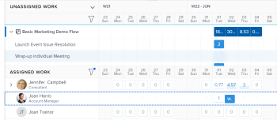

# Affecter du travail dans l’équilibreur de charge de travail par glisser-déposer

Vous pouvez affecter des éléments de travail à l’aide de l’équilibreur de charge de travail Adobe Workfront en faisant glisser les éléments de travail vers les utilisateurs et utilisatrices appropriés.

Pour des informations générales sur l’attribution de travail aux utilisateurs et utilisatrices à l’aide de l’équilibreur de charge de travail, voir [Vue d’ensemble de l’attribution de travail dans l’équilibreur de charge de travail](../../resource-mgmt/workload-balancer/assign-work-in-workload-balancer.md).

## Conditions d’accès

+++ Développez pour afficher les exigences d’accès aux fonctionnalités de cet article.

Vous devez disposer des accès suivants pour effectuer les étapes décrites dans cet article :

<table style="table-layout:auto"> 
 <col> 
 <col> 
 <tbody> 
  <tr> 
   <td role="rowheader">Formule Adobe Workfront</td> 
   <td> 
Tous 
 </td> 
  </tr> 
  <tr> 
   <td role="rowheader">Licence Adobe Workfront</td> 
   <td>
Nouveau : Standard

       
ou

       
Actuel : planifiez l’affectation du travail dans l’équilibreur de charge de travail dans la zone Ressource ; 
       Travail, pour affecter du travail dans l’équilibreur de charge de travail d’une équipe ou d’un projet
</td>
  </tr>
  <tr> 
   <td role="rowheader">Configurations des niveaux d’accès</td> 
   <td> 
Modifiez l’accès aux éléments suivants :
 
    <ul> 
     <li>Gestion des ressources</li> 
     <li>Projets</li> 
     <li>Tâches</li> 
     <li>Problèmes</li> 
    </ul>
   </td> 
  </tr> 
  <tr> 
   <td role="rowheader">Autorisations d’objet</td> 
   <td>Autorisations Contribuer ou supérieures aux projets, tâches et problèmes qui incluent la création d’affectations.</td> 
  </tr> 
 </tbody> 
</table>

Pour plus de détails sur les informations contenues dans ce tableau, consultez [Conditions d’accès préalables dans la documentation Workfront](/help/quicksilver/administration-and-setup/add-users/access-levels-and-object-permissions/access-level-requirements-in-documentation.md).

+++

## Affecter un élément par glisser-déposer

Vous pouvez affecter un élément depuis la zone Travail non affecté à un utilisateur ou une utilisatrice, ou réaffecter un élément déjà affecté à un autre utilisateur ou à une autre utilisatrice dans la zone Travail affecté.

1. Accédez à l’équilibreur de charge de travail auquel vous souhaitez attribuer du travail.

   Vous pouvez attribuer du travail aux utilisateurs et utilisatrices à l’aide de l’équilibreur de charge de travail dans la zone Ressources, au niveau du projet ou de l’équipe. Pour plus d’informations sur l’emplacement de l’équilibreur de charge de travail dans Workfront, voir [Localiser l’équilibreur de charge de travail](../../resource-mgmt/workload-balancer/locate-workload-balancer.md).

1. (Facultatif) Accédez à la zone **Travail non affecté** et appliquez un filtre pour afficher les tâches et les problèmes qui ne sont pas affectés à des utilisateurs et utilisatrices.

   Ou

   Accédez à la zone **Travail affecté** et développez le nom d’un utilisateur ou d’une utilisatrice pour afficher les éléments de travail qui lui ont été affectés, si vous souhaitez réaffecter ses éléments.

1. (Le cas échéant) Dans l’équilibreur de charge de travail d’un projet, cliquez sur l’icône **Afficher tous les utilisateurs et utilisatrices**  pour afficher tous les utilisateurs et utilisatrices de Workfront.

   Ceci affiche tous les utilisateurs et utilisatrices pour lesquels vous disposez d’un accès en affichage.

   Dans la zone Travail affecté, l’icône du projet s’affiche à droite du nom des utilisateurs et utilisatrices qui font également partie de l’équipe de projet et qui sont déjà affectés à des éléments du projet.

   

   >[!TIP]
   >
   >* L’option Afficher tous les utilisateurs et utilisatrices n’est disponible que dans l’équilibreur de charge de travail d’un projet.
   >* Utilisez des filtres pour afficher uniquement les utilisateurs et utilisatrices qui sont importants pour vous. Par exemple, utilisez un filtre pour afficher uniquement les utilisateurs et utilisatrices de vos équipes ou groupes.

1. Cliquez sur la barre d’un élément de travail qui indique la chronologie prévue ou prévisionnelle et faites-la glisser sur le nom d’un utilisateur ou d’une utilisatrice dans la zone **Affecté**.

   L’utilisateur ou l’utilisatrice que vous survolez pour déposer l’élément de travail est mis en surbrillance.

   >[!TIP]
   >
   >Le nombre d’heures prévues de l’utilisateur ou de l’utilisatrice que vous survolez est mis à jour en temps réel avec le nombre d’heures prévues quotidiennes de l’élément de travail, afin de montrer l’impact de l’ajout d’un nouvel élément sur son affectation globale.

   

1. Lorsque tout est prêt, déposez l’élément de travail sélectionné sur la même ligne que le nom de l’utilisateur ou de l’utilisatrice dans la zone Affecté. L’élément est affecté et le nombre d’heures prévues allouées est mis à jour pour l’utilisateur ou l’utilisatrice avec les nouvelles heures de l’élément de travail.

   Si l’élément a été affecté à un rôle que l’utilisateur ou l’utilisatrice ne peut pas remplir, l’élément s’affiche sous son nom dans la zone Travail affecté et reste également dans la zone Travail non affecté pour indiquer que la fonction qui lui est associée n’a pas encore été remplacée par un utilisateur ou une utilisatrice.

   >[!TIP]
   >
   >* Si vous avez activé l’option Regrouper par projet dans la zone Paramètres, la tâche attribuée s’affiche sous le projet correspondant. Si le paramètre est désactivé, la tâche attribuée s’affiche dans la zone Utilisateur ou utilisatrice.
   >
   >
   >     L’élément s’affiche en fonction des critères de tri des éléments de travail de l’équilibreur de charge de travail. Pour plus d’informations, voir [Parcourir l’équilibreur de charge de travail](../../resource-mgmt/workload-balancer/navigate-the-workload-balancer.md).
   >
   >
   >* Si vous avez activé l’option Afficher tous les utilisateurs et utilisatrices dans l’équilibreur de charge de travail d’un projet et que vous avez attribué des éléments à des personnes qui n’étaient pas auparavant affectées à des éléments sur le projet, elles sont ajoutées à l’équipe de projet. Pour plus d’informations, consultez [Gérer l’équipe de projet](../../manage-work/projects/planning-a-project/manage-project-team.md).

1. (Facultatif) Cliquez sur la barre d’un élément de travail sous le nom d’un utilisateur ou d’une utilisatrice dans la zone Travail affecté et faites-la glisser puis déposez-la dans la zone Travail non affecté pour annuler l’affectation. L’élément n’est plus affecté à l’utilisateur ou à l’utilisatrice, mais il peut encore être affecté à une fonction, auquel cas il s’affiche dans la zone Travail non affecté. Si l’élément est affecté à un autre utilisateur ou une autre utilisatrice, il reste dans la zone Travail affecté sous le nom de la personne qui est toujours affectée.
1. (Facultatif) Cliquez sur l’**icône Afficher les allocations** , puis cliquez sur le **menu Plus**  > **Modifier les allocations**.

   <!--
   (make sure these are still called this, and that the icon has not changed)
   -->
   Ou

   Double-cliquez sur une allocation quotidienne ou hebdomadaire pour modifier le temps alloué à l’utilisateur ou à l’utilisatrice pour cet élément de travail.

   Pour plus d’informations sur la modification des affectations d’utilisateurs ou d’utilisatrices dans l’équilibreur de charge de travail, consultez la section « Modifier les affectations d’utilisateurs ou d’utilisatrices » dans l’article [Gérer les affectations d’utilisateurs ou d’utilisatrices dans l’équilibreur de charge de travail](../../resource-mgmt/workload-balancer/manage-user-allocations-workload-balancer.md).

   Pour plus d’informations sur la suppression des affectations d’un élément de travail à l’aide de l’équilibreur de charge de travail, consultez [Annuler l’affectation du travail dans l’équilibreur de charge de travail](../../resource-mgmt/workload-balancer/unassign-work-in-workload-balancer.md).

