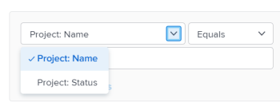
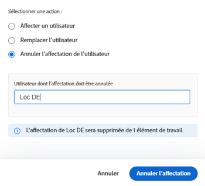

# Affecter du travail en bloc dans l’équilibreur de charge de travail

<!--Audited: 07/2024-->

<!--drafted
The highlighted information on this page refers to functionality not yet generally available. It is available only in the Preview environment. 
-->

Vous pouvez affecter des ressources à plusieurs tâches et problèmes en bloc à l’aide de l’équilibreur de charge de travail Adobe Workfront.

Pour des informations générales sur l’affectation de travail aux utilisateurs à l’aide de l’équilibreur de charge de travail, voir [Présentation de l’affectation de travail dans l’équilibreur de charge de travail](../../resource-mgmt/workload-balancer/assign-work-in-workload-balancer.md).

## Conditions d’accès

+++ Développez pour afficher les exigences d’accès aux fonctionnalités de cet article.

<table style="table-layout:auto"> 
 <col> 
 <col> 
 <tbody> 
  <tr> 
   <td role="rowheader">Forfait Adobe Workfront</td> 
   <td> 
N’importe quelle 
 </td> 
  </tr> 
  <tr> 
   <td role="rowheader">Licence Adobe Workfront*</td> 
   <td> 
   
Nouvelle : standard

   
Actuel :

   <ul>
   <li>
Planifiez l’utilisation de l’équilibreur de charge de travail dans la zone Ressource .
</li>
   <li>
Fonctionnement lors de l’utilisation de l’équilibreur de charge de travail d’une équipe ou d’un projet
</li></ul>

</td> 
  </tr> 
  <tr> 
   <td role="rowheader">Niveau d’accès</td> 
   <td> 
Accès en modification aux éléments suivants :
 
    <ul> 
     <li> 
Gestion des ressources
 </li> 
     <li> 
Projets
 </li> 
     <li> 
Tâches
 </li> 
     <li> 
Problèmes
 </li> 
    </ul>

</td> 
  </tr> 
  <tr> 
   <td role="rowheader">Autorisations d’objet</td> 
   <td> 
Autorisations Contribute ou supérieures aux projets, tâches et problèmes qui incluent l’attribution des tâches
 </td> 
  </tr> 
 </tbody> 
</table>

*Pour plus d’informations, voir [Exigences d’accès dans la documentation Workfront](/help/quicksilver/administration-and-setup/add-users/access-levels-and-object-permissions/access-level-requirements-in-documentation.md).

+++

## Considérations pour effectuer des affectations en bloc dans l’équilibreur de charge de travail

* Vous pouvez rapidement gérer les affectations d’utilisateurs pour plusieurs tâches et problèmes sur un ou plusieurs projets. Les modifications d’affectations sont immédiatement visibles dans l’équilibreur de charge de travail.
* Vous ne pouvez pas affecter de ressources aux éléments de travail terminés ou aux éléments qui se trouvent sur un projet terminé.
* Vous pouvez effectuer les opérations suivantes lorsque vous affectez des utilisateurs en bloc :

   * Affectez un utilisateur à toutes les tâches actuellement affectées à un rôle de tâche.
   * Remplacer les affectations d’utilisateurs entre les utilisateurs.
   * Annulez l’affectation d’un utilisateur à toutes ses tâches.

**EXEMPLES**

* Il vous incombe d’effectuer des affectations d’utilisateurs sur plusieurs nouveaux projets. Les projets ont été créés à l’origine à partir de modèles et les rôles de tâche sont déjà affectés aux différentes tâches des projets. Vous souhaitez affecter un utilisateur spécifique, Jackie Simms, à toutes les tâches actuellement affectées à un rôle de tâche. Vous pouvez utiliser la fonction Assign pour affecter ces tâches à Jackie Simms.
* 45 tâches sur 3 projets différents sont affectées à Jackie Simms. Jackie quitte l’entreprise et vous devez maintenant réaffecter ses tâches à un autre utilisateur. Vous pouvez utiliser la fonction Remplacer pour affecter ces tâches à la nouvelle personne.
* 10 tâches sur 2 projets différents sont affectées à un autre utilisateur, Rick Kuvec. Vous vous rendez compte que Rick a été affecté à ces tâches par erreur, mais vous ne savez pas à qui elles doivent être affectées pour le moment. Vous devez annuler l’affectation simultanée de Rick à toutes les tâches. Vous pouvez utiliser la fonction Annuler l’affectation pour supprimer Rick de ces tâches.

## Affectation du travail en masse dans l’équilibreur de charge de travail

1. Accédez à l’équilibreur de charge de travail où vous souhaitez affecter le travail.

   Vous pouvez affecter du travail aux utilisateurs à l’aide de l’équilibreur de charge de travail dans la zone Ressource, au niveau du projet ou au niveau de l’équipe. Pour plus d’informations sur l’emplacement de l’équilibreur de charge de travail dans Workfront, voir [Localisation de l’équilibreur de charge de travail](../../resource-mgmt/workload-balancer/locate-workload-balancer.md).

1. Cliquez sur **Affectations en bloc**  en haut de l’équilibreur de charge de travail.

   Le panneau Affectations en bloc s’ouvre à droite de l’équilibreur de charge de travail.

1. (Conditionnel) Si vous accédez à l’équilibreur de charge de travail à partir de la zone Ressource ou pour une équipe, développez le menu déroulant **Projet : nom** et utilisez les modificateurs de filtre pour sélectionner le ou les projets pour lesquels vous souhaitez effectuer des affectations. Vous pouvez sélectionner les projets par Nom (il s’agit de l’option par défaut) ou par État.

Pour plus d’informations sur les modificateurs de filtre Workfront, voir [Filtres et modificateurs de condition](../../reports-and-dashboards/reports/reporting-elements/filter-condition-modifiers.md).

>[!NOTE]
>
>Le nom du projet est sélectionné par défaut lorsque vous accédez à l’équilibreur de charge de travail pour un projet.

1. (Facultatif) Cliquez sur **Sélectionner les tâches de projet** pour sélectionner la ou les tâches pour lesquelles vous souhaitez effectuer des affectations, puis, dans le menu déroulant **Tâche : nom**, sélectionnez les tâches par nom (c’est l’option par défaut) ou État et utilisez les modificateurs de filtre pour rechercher des tâches spécifiques.

Pour plus d’informations sur les modificateurs de filtre Workfront, voir [Filtres et modificateurs de condition](../../reports-and-dashboards/reports/reporting-elements/filter-condition-modifiers.md).

>[!NOTE]
>
>Vous ne pouvez pas sélectionner de tâches avec l’état Terminé .

>[!TIP]
>
>Laissez cette sélection vide si vous souhaitez effectuer des affectations en bloc pour les problèmes ainsi que pour les tâches.

1. (Facultatif) Cliquez sur l’icône **Supprimer**  en regard de l’un des critères sélectionnés.

   Ou

   Cliquez sur **Effacer tout** dans le coin supérieur droit du panneau Affectations en bloc pour supprimer toutes les sélections.

1. Sélectionnez l’une des options suivantes et procédez comme suit :

   * [Attribuer un utilisateur](#assign-user)
   * [Remplacer l’utilisateur](#replace-user)
   * [Annuler l’affectation de l’utilisateur](#unassign-user)

   >[!TIP]
   >
   >Si aucun élément ne correspond aux filtres sélectionnés, ces options sont grisées.

### Affecter un utilisateur {#assign-user}

Lorsque vous affectez un utilisateur à l’aide d’affectations en bloc dans l’équilibreur de charge de travail, les événements suivants se produisent :

* Un utilisateur est affecté à toutes les tâches actuellement affectées à un rôle spécifié dans les projets sélectionnés.
* L’utilisateur n’est pas affecté aux types de tâches suivants :

   * Éléments déjà affectés à un utilisateur.
   * Éléments terminés.

* Si l’utilisateur que vous avez sélectionné n’est pas associé au rôle spécifié, le rôle est remplacé par l’utilisateur dans son rôle de Principal.

Pour affecter un utilisateur aux tâches précédemment affectées à des rôles de tâche :

1. Commencez à attribuer des tâches à l’aide des affectations en bloc dans l’équilibreur de charge de travail comme décrit ci-dessus et sélectionnez **Attribuer**.

1. Dans le champ **Affectation de rôle** , cliquez sur la flèche déroulante pour effectuer un choix dans une liste de rôles. Seuls les rôles affectés actuellement dans les projets spécifiés s’affichent. Il s’agit d’un champ obligatoire.

   

1. Dans le champ **Utilisateur à affecter** , cliquez sur la flèche de liste déroulante pour choisir parmi une liste d’utilisateurs suggérés ou pour saisir le nom d’un autre utilisateur.

   Sélectionnez des utilisateurs dans les zones suivantes :

   * **Assignations proposées** : utilisateurs pouvant remplir le rôle sélectionné et qui correspondent aux critères des affectations intelligentes. Consultez [Vue d’ensemble des affectations intelligentes](../../manage-work/tasks/assign-tasks/smart-assignments.md) pour en savoir plus.
   * **Autres affectations** : tous les utilisateurs du système qui peuvent remplir le rôle sélectionné.

     >[!TIP]
     >
     >Seuls les 50 premiers utilisateurs sont répertoriés dans la zone Autres affectations .

   Après avoir sélectionné un utilisateur, Workfront affiche une note indiquant le nombre d’éléments auxquels l’utilisateur que vous avez spécifié sera affecté et le rôle de tâche qu’il remplacera.

   >[!TIP]
   >
   >Tous les rôles de l’utilisateur s’affichent dans la liste, sous son nom.

1. Cliquez sur **Attribuer**.

   Les rôles spécifiés sont remplacés par les utilisateurs que vous avez sélectionnés.

   Vous recevez une confirmation indiquant le nombre de tâches pour lesquelles le rôle sélectionné a été remplacé par l’utilisateur sélectionné.

   

### Remplacer l’utilisateur {#replace-user}

Vous pouvez remplacer un utilisateur déjà affecté à des tâches par un autre utilisateur dans les projets sélectionnés.

Lorsque vous remplacez un utilisateur par un autre en utilisant les affectations en bloc dans l’équilibreur de charge de travail, les événements suivants se produisent :

* L’utilisateur de remplacement est affecté à toutes les tâches actuellement affectées à un utilisateur d’origine dans les projets sélectionnés.

* Le nouvel utilisateur n’est affecté à aucune tâche déjà marquée comme terminée.
* Si le rôle associé au premier utilisateur ne correspond à aucun des rôles du deuxième utilisateur, le second utilisateur est affecté à son rôle de Principal.

Pour remplacer un utilisateur par un autre utilisateur :

1. Commencez à attribuer des tâches dans l’équilibreur de charge de travail comme décrit ci-dessus et sélectionnez **Remplacer**.
1. Dans le champ **Utilisateur actuellement affecté** , cliquez sur la flèche de liste déroulante pour effectuer un choix dans une liste d’utilisateurs. Seuls les utilisateurs affectés actuellement à des tâches incomplètes dans les projets spécifiés s’affichent. Il s’agit d’un champ obligatoire.

   

1. Dans le champ **Utilisateur à affecter** , cliquez sur la flèche de liste déroulante pour choisir parmi une liste d’utilisateurs suggérés ou pour saisir un autre nom d’utilisateur. Les utilisateurs répertoriés dans la liste correspondent par défaut aux critères des affectations intelligentes. Consultez [Vue d’ensemble des affectations intelligentes](../../manage-work/tasks/assign-tasks/smart-assignments.md) pour en savoir plus.

   Workfront affiche une note sur le nombre d’éléments dans lesquels l’utilisateur affecté remplacera le second utilisateur et les rôles qu’il remplacera.

   

1. Cliquez sur **Remplacer**.

   Le premier utilisateur sélectionné est remplacé par le second utilisateur de toutes les tâches du projet sélectionné.

   Vous recevez une confirmation indiquant le nombre de tâches pour lesquelles l’affectation d’origine de l’utilisateur a été remplacée par le second utilisateur sélectionné.

### Annuler l’affectation de l’utilisateur {#unassign-user}

Vous pouvez annuler l’affectation d’un utilisateur à toutes les tâches auxquelles il est affecté dans les projets sélectionnés.

Lorsque vous annulez l’affectation d’un utilisateur de toutes ses affectations à l’aide des affectations en bloc dans l’équilibreur de charge de travail, les événements suivants se produisent :

* L’utilisateur spécifié est supprimé de toutes les tâches auxquelles il est affecté.
* Si l’utilisateur non affecté est associé à des rôles de tâche, les rôles de tâche restent attribués aux tâches lorsque l’utilisateur est supprimé.

* Si l’utilisateur spécifié est affecté aux tâches terminées, il reste affecté à ces tâches.

Pour plus d’informations sur les affectations d’utilisateurs et de rôles de tâche, voir [Présentation de l’affectation de travail dans l’équilibreur de charge de travail](../../resource-mgmt/workload-balancer/assign-work-in-workload-balancer.md).

Pour annuler l’affectation d’un utilisateur aux tâches des projets sélectionnés ou aux tâches ou problèmes sélectionnés auxquels il est affecté :

1. Commencez à attribuer des tâches dans l’équilibreur de charge de travail comme décrit ci-dessus et sélectionnez **Annuler l’affectation**.

1. Dans le champ **Utilisateur à annuler l’affectation**, cliquez sur la flèche de liste déroulante pour effectuer un choix dans une liste d’utilisateurs. Seuls les utilisateurs affectés actuellement à des tâches incomplètes dans les projets spécifiés s’affichent. Il s’agit d’un champ obligatoire.

   

   Workfront affiche une note sur le nombre d’éléments pour lesquels l’utilisateur affecté actuellement ne sera pas affecté.

   

1. Cliquez sur **Annuler l’affectation**.\
   Vous recevez une confirmation sur le nombre de tâches pour lesquelles l’utilisateur spécifié a été supprimé.

